**1.** Go to `https://github.com/austingrice/digibank` within Firefox

**2.** Then click on `Fork` button in the top right. Then log into your
GitHub or create a Github account to then fork this repository

**3.** Once you have the forked repository in your GitHub account, then
you can do a `Git Clone`. To do this find the `Clone or download` button
on the right and then click on the copy button to the right of the URL

**4.** Then go to your terminal and navigate to your `Desktop` folder.
Once you are there, enter the command below :

    tecadmin@ubuntubase:~/Desktop$ cd ~
    tecadmin@ubuntubase:~/Desktop$ git clone https://github.com/austingrice/digibank.git
    Cloning into 'digibank'...
    remote: Enumerating objects: 56, done.
    remote: Counting objects: 100% (56/56), done.
    remote: Compressing objects: 100% (43/43), done.
    remote: Total 56 (delta 6), reused 53 (delta 6), pack-reused 0
    Unpacking objects: 100% (56/56), done.

**5.** While you are in the terminal, navigate to the folder where you
downloaded your `connection profile` from Part 2, Section 8 and step 2.
:

    For example:

    tecadmin@ubuntubase:~/Desktop$ cd ../Downloads
    tecadmin@ubuntubase:~/Downloads$ ls -l 
    *
    drwxr-xr-x  5 tecadmin  tecadmin  160 Jun 11 12:53 <Your_Connection_Profile>
    *

**6.** When you are there, enter this command to copy our connection
profile to our new digibank folder :

    tecadmin@ubuntubase:~/Downloads$ cp connectionprofile.json /home/tecadmin/Desktop/digibank/

**7.** From here, go into VSCode and add the `digibank` folder to the
workplace. To do this, go to the Editor perspective and then right
click on the empty black space and select `Add Folder to Workspace`.
From there, go to your `digibank` folder and click on `select` to open
up the file.

**8.** Once you have the `digibank` folder open, right click on your
connection profile file and select `Rename`. Then rename your connection
profile to `networkConnection.json`.

**9.** Then toggle on the `Identity` folder within the `digibank`
folder. Within there, you will see 3 files: `config.json`, `enroll.js`
and then `package.json`. Within the `config.json` file, we have a few
places wanting some information. The **only** things we have to change
is our CA port number as well as our MSP name. Other than that, keep
everything the same! You can find your CA port by opening your
`networkConnection.json` file and looking for the IP address under the
`certificateAuthorities` section. It should have a `192.168.22.81:3xxx`
IP address. :

    {
      "connection_file": "/home/tecadmin/Desktop/digibank/networkConnection.json",
      "appAdmin": "app-admin",
      "appAdminSecret": "app-adminpw",
      "orgMSPID": "teamXXorg1msp",
      "caName": "https://192.168.22.81:<Put_Your_CA_Port_Here>",
      "userName": "app-admin",
      "gatewayDiscovery": {
        "enabled": true,
        "asLocalhost": false
      }
    }

    --- CHANGES TO ---

    {
      "connection_file": "/home/tecadmin/Desktop/digibank/networkConnection.json",
      "appAdmin": "app-admin",
      "appAdminSecret": "app-adminpw",
      "orgMSPID": "team19org1msp",
      "caName": "https://192.168.22.81:31142",
      "userName": "app-admin",
      "gatewayDiscovery": {
        "enabled": true,
        "asLocalhost": false
      }
    }

**Save this File!**

**10.** Within the `digibank` folder there is a `src` folder. Within the
`src` there will be a `blockchainClient.ts` file. You can click on the
file to open it up and then navigate to `line 38`. Go ahead and rename
the channel to match the channel name in your IBM Blockchain for
Multicloud console. :

    const network = await gateway.getNetwork('teamXX-channel1');

    --- CHANGES TO ---

    const network = await gateway.getNetwork('team19-channel1');

**Save this File!**

**11.** From the CLI application, navigate to the `digibank/Identity`
folder and then run the command below :

    tecadmin@ubuntubase:~/Downloads$ cd /home/tecadmin/Desktop/digibank/Identity
    tecadmin@ubuntubase:~/Desktop/digibank/Identity$ npm install
    *
    *

**12.** Once npm has completed some installations, run the command below
to enroll our user :

    tecadmin@ubuntubase:~/Desktop/digibank/Identity$ node enroll.js
    Wallet path: /home/tecadmin/Desktop/digibank/IBP
    msg: Successfully enrolled admin user app-admin and imported it into the wallet

**13.** The previous step created a certificate and public/private key
pair for us. We can check that by entering the command below :

    tecadmin@ubuntubase:~/Desktop/digibank/Identity$ ls -l ../IBP
    total 4
    drwxr-xr-x 2 tecadmin tecadmin 4096 Jun 27 00:39 app-admin
    tecadmin@ubuntubase:~/Desktop/digibank/Identity$ ls -l ../IBP/app-admin
    total 12
    -rw-r--r-- 1 tecadmin tecadmin  246 Jun 27 00:39 5b17e99aa4da28c2dad4d834409e01c543f19965840b3ba4482049111893897e-priv
    -rw-r--r-- 1 tecadmin tecadmin  182 Jun 27 00:39 5b17e99aa4da28c2dad4d834409e01c543f19965840b3ba4482049111893897e-pub
    -rw-r--r-- 1 tecadmin tecadmin 1104 Jun 27 00:39 app-admin

**14.** Then change the Jenkinsfile to match your team :

**15.** Once npm has completed some installations, enter the next
command below to push our changes to our GitHub account :

    tecadmin@ubuntubase:~/Desktop/digibank$ git add *
    tecadmin@ubuntubase:~/Desktop/digibank$ git commit -m 'blockchain is awesome' 
    *
    * Your file changes and other output messages
    *
    tecadmin@ubuntubase:~/Desktop/digibank$ git push
    Counting objects: 53, done.
    Delta compression using up to 8 threads.
    Compressing objects: 100% (48/48), done.
    Writing objects: 100% (53/53), 13.95 KiB | 0 bytes/s, done.
    Total 53 (delta 6), reused 0 (delta 0)
    remote: Resolving deltas: 100% (6/6), done.
    To github.com:austingrice/digibank.git
       140abdf..0666159  master -> master

**16.** Go back to your GitHub repository of `digibank` and then hit the
`refresh` button to confirm your changes took.

**JENKINS THEN GOES TO WORK FOR K8S LOOPBACKAPI**

Jenkins will enable us to automatically build a docker image from our code and deploy it into a IBM Cloud Private via Kubernetes. We are using the Kubernetes plugin for Jenkins to enable this functionality. Jenkins has functionality added through plugins to add new capabilities and features from a variety of different contributors. 

One of these plugins enables us to connect to Jenkins via a Github webhook so that when new code is pushed it will automatically trigger your Jenkins jobs (in our case we will be using a pipeline).

**i**. Go to the github fork where you just pushed new code. Then, go to the `settings` for the repository

**ii** Choose the `Webhooks` section

**iii** Click to add your webhook.
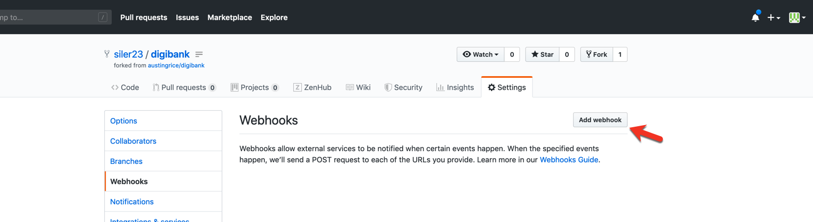

**iv** Configure your webhook.

    
    1. smee url: The smee url will be provided to you for the lab as it is auto-generated for each lab.
    2. `application/json` content type
    3. Leave the rest as defaults as shown and click `Add Webhook`

You may be wondering why we are providing a smee url here and not a jenkins url. Our Jenkins service is not accessible from the public internet. Thus, we can use smee, which is a service that serves as a proxy for webhooks. It acts as a local sidecar container to the Jenkins master (running in the same Kubernetes pod) on it's network. While the services such as GitHub on the public internet can't initaite connections with it, it can initiate connections with them. Using this method, smee forwards Jenkins webhooks when it hears of them via a connection to a public smee service (addressable from the internet) which is in turn listening for github webhooks from your github repositories. 

**v** See successful Webhook creation message.

**vi** Time to go to Jenkins. Navigate to `https://192.168.22.81:8443/jenkins` in your browser.

**vii** Upon seeing the welcome page please enter you team and password for the lab which will be given to you. In this case I am `team19`. 

**viii** After successfully logging in click on `My View` to see just the folder you have access to.

**ix** Click on your folder (the only one listed) to enter it. 
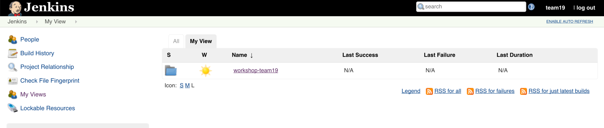 

**x** Create a new job. You could also have created a `New item` instead  which is why that is circled as well.

**xi** Make a pipeline for your digibank project using the options shown below 
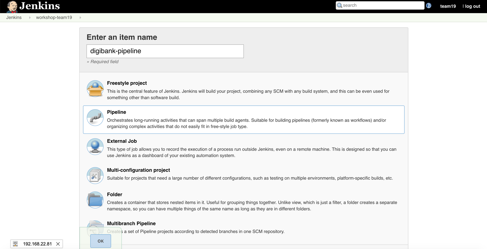

**xii** Get your repo url from your github fork.

**xiii** Use the url you got from the previous step for the github repository in the configuration below in both places it appears. The other values keep the same as mine. Click save when you are done entering these.
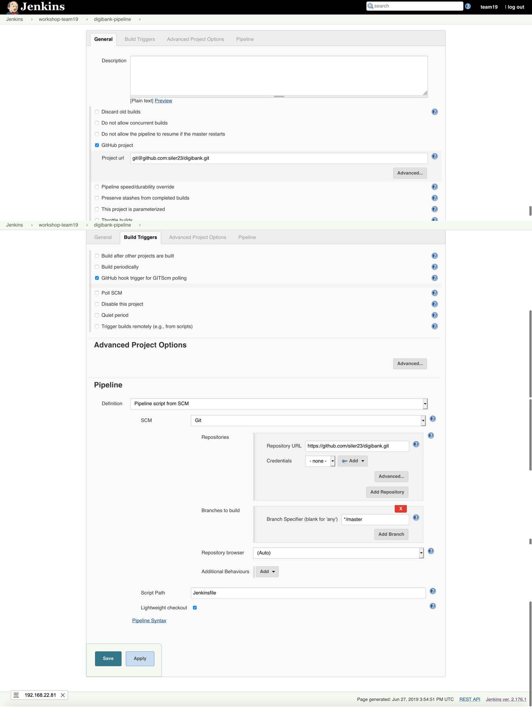

**xiv** Set up authorization for your project in your personal folder by clicking on authorization.

**xv**  Choose `Run as specific user` and put in your team name for the user. This will enable your github to run with your blessing.
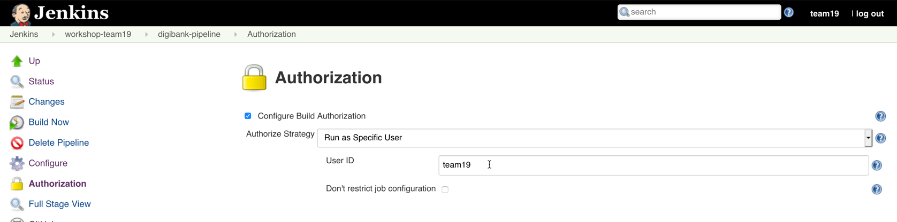

**xvi** Click the arrow next to your team name in the upper right hand corner to the left of log out and then select `Credentials`
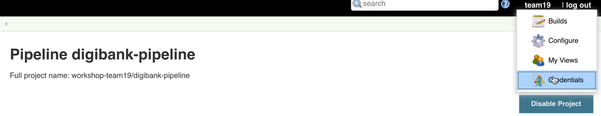

**xvii** Click either the `Add Credentials` or `Adding some credentials?` link. 

**xviii** Make a credential id in Jenkins to securely access your icp creds by making an entry with your team name and password and an id of `teamname-icp` and click ok.

**xix** Go to `My View` by clicking the arrow to the left of Jenkins in the upper left hand corner and selecting `My View`.

**xx** Go on the time clock to build your project now to the right of your pipeline. This will run the Jenkinsfile in your cloned version of the github you adjusted to use your team with the one line change. 

**xxi** View the output of your job in the console by clicking the arrow to the right of `Build View` and Selecting the console output.
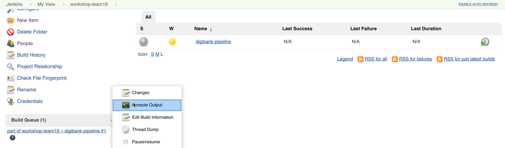

**xxii** The job should complete successfully and give you a url you can right click to visit in a new tab.
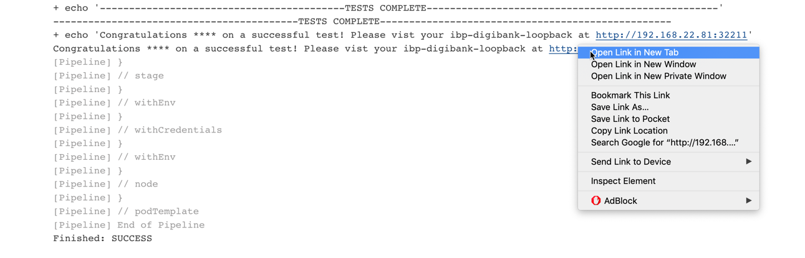

Proceed with Step 17.

**17.** Once we have our loopback application deployed in our IBM Cloud
Private cluster, go ahead and open it. Once you get to the homepage for
loopback, click on the `Explorer` link to view our controllers (which
will submit transactions for us).

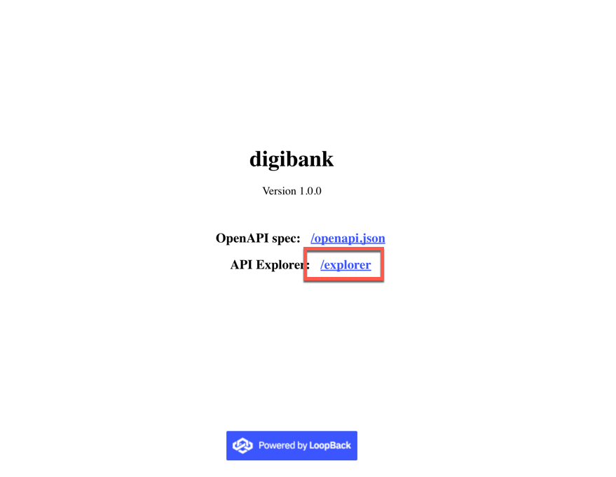

**18.** Go ahead and toggle on the `IssueController` and then click on
`Try it Out` in the top right. Go ahead and enter the text below to
issue a new paper :

    {
      "issuer": "Digibank",
      "paperNumber": "0032",
      "issueDateTime": "2020-05-31",
      "maturityDateTime": "2020-11-30",
      "faceValue": "500",
      "paperRate": "0.02"
    }

**19.** Then click on the `Execute` button below. Then, let it spin
around for a moment, but it should come back with some type of response
in the response body. Sometimes, it might continuously spin. It will
eventually time out, but actually submit the paper and have it be
recorded in the IBM Blockchain Platform. You can confirm this by going
to your console and clicking on your channel and viewing the block
height and transactions. For the loopback, you can just let it time out
and then try to issue the same paper with a new `paperNumber` and it
should come back.

**20.** Do a similar transaction for `Buy` once you click on
`Try it Out` in the top right :

    {
      "issuer": "Digibank",
      "paperNumber": "0032",
      "currentOwner": "Digibank",
      "newOwner": "MagnetoCorp",
      "price": "400",
      "purchaseDateTime": "2020-06-10"
    }

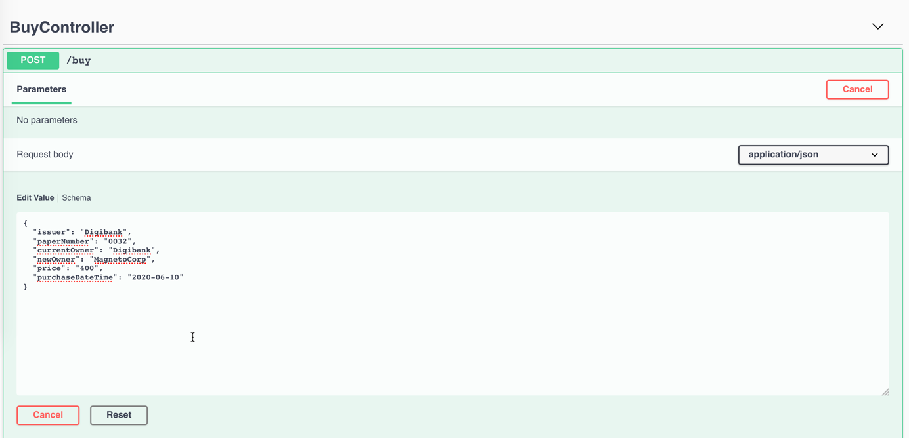

**21.** Do the same for the `Redeem` transaction once you click on
`Try it Out` in the top right :

    {
      "issuer": "Digibank",
      "paperNumber": "0032",
      "redeemingOwner": "MagnetoCorp",
      "redeemDateTime": "2020-11-30"
    }

**22.** All of these transactions are being recorded on the IBM
Blockchain Platform by going to your channel list and then viewing the
block height and list of transactions.

**UPDATE OUR GITHUB TO ADD GETPAPER AND LET JENKINS GO BACK TO WORK**

**xxiii**  See the successful job in Jenkins is github triggered. To get back to the project you can click `Back to project`. When the build is finished you can also reload the same page you were on before and see that is was updated as a new docker image was created and deployed to Kubernetes.
![jenkinsimages/successful_build_github_triggered.png]

**1.** Let's take advantage of our CI/CD pipeline, by adding our
`getAllPapersFromIssuer` query. **Important:** For this section, the
`getAllPapersFromIssuer` transaction is going to be referred as
`getPapers`. It's the same logic, but we had to rename it due to some
loopback issues.

**2.** To add our `getPaper` transaction we need to add a model,
repository and controller. Make sure your are in the
**Desktop/digibank** folder. Also, it is very important that what you
see below is what you enter. Make sure you don't see dashes (`-`) in any
of the prompts. :

    --- Make the Getpapers Model ---

    tecadmin@ubuntubase:~/Desktop/digibank$ cd /home/tecadmin/Desktop/digibank/ 
    *
    * I realize, that I'm cd-ing into a folder I'm already in, but it is to make sure everyone in the lab is in the right folder!
    *
    tecadmin@ubuntubase:~/Desktop/digibank$ lb4 model
    ? Model class name: Getpapers
    ? Please select the model base class Entity (A persisted model with an ID)
    ? Allow additional (free-form) properties? No
    Model Getpapers will be created in src/models/getpapers.model.ts

    Let's add a property to Getpapers
    Enter an empty property name when done

    ? Enter the property name: issuer
    ? Property type: string
    ? Is issuer the ID property? Yes
    ? Is it required?: No
    ? Default value [leave blank for none]:

    Let's add another property to Getpapers
    Enter an empty property name when done

    ? Enter the property name:
       create src/models/getpapers.model.ts
       update src/models/index.ts

    Model Getpapers was created in src/models/

    -- Create the Getpapers Repository ---

    tecadmin@ubuntubase:~/Desktop/digibank$ lb4 repository
    ? Please select the datasource DbDatasource
    ? Select the model(s) you want to generate a repository Getpapers
    ? Please select the repository base class DefaultCrudRepository (Legacy juggler bridge)
       create src/repositories/getpapers.repository.ts
       update src/repositories/index.ts

    Repository GetpapersRepository was created in src/repositories/

    --- Create the Getpapers Controller ---

    tecadmin@ubuntubase:~/Desktop/digibank$ lb4 controller
    ? Controller class name: Getpapers
    Controller Getpapers will be created in src/controllers/getpapers.controller.ts

    ? What kind of controller would you like to generate? REST Controller with CRUD functions
    ? What is the name of the model to use with this CRUD repository? Getpapers
    ? What is the name of your CRUD repository? GetpapersRepository
    ? What is the type of your ID? string
    ? What is the base HTTP path name of the CRUD operations? /getpapers
       create src/controllers/getpapers.controller.ts
       update src/controllers/index.ts

    Controller Getpapers was created in src/controllers/

**3.** Within VSCode, navigate to the `digibank/src/repository` folder.
You will see 6 files, with 4 of them being our repositories. Open the
`getpaper.repository.ts` file and make a change that I lay out below on
line 8 :

    typeof Getpapers.prototype.,

    --- Change To ---

    // typeof Getpapers.prototype.,

Save this file!

**4.** Within our `digibank/src/controllers` folder, open the
`getpapers.controller.ts` file and delete all of the code within that
controller. Next, paste in the code below :

    // Copyright IBM Corp. 2017,2018. All Rights Reserved.
    // Node module: @loopback/example-todo
    // This file is licensed under the MIT License.
    // License text available at https://opensource.org/licenses/MIT

    import {
      del,
      get,
      getFilterSchemaFor,
      param,
      patch,
      post,
      put,
      requestBody,
    } from '@loopback/rest';
    import { Getpapers } from '../models';

    import { BlockChainModule } from '../blockchainClient';

    let blockchainClient = new BlockChainModule.BlockchainClient();

    export class GetpapersController {
      constructor() { }

     @post('/getpapers', {
       responses: {
          '200': {
            description: 'Todo model instance',
            content: { 'application/json': { schema: { 'x-ts-type': Getpapers } } },
          },
        },
      })
      async createGetpapers(@requestBody() requestBody: Getpapers): Promise<Getpapers> {
        console.log('Buy, requestBody: ')
        console.log(requestBody)

        let networkObj = await blockchainClient.connectToNetwork();
        if (!networkObj) {
          let errString = 'Error connecting to network';
          let getpapers = new Getpapers({ issuer: errString });
          return getpapers;
        }
        console.log('newtork obj: ')
        console.log(networkObj)

        let dataForGetpapers = {
          function: 'getAllPapersFromIssuer',
          issuer: requestBody.issuer,
          contract: networkObj.contract
        };

        var resultString = await blockchainClient.getpapers(dataForGetpapers);

        console.log('result from blockchainClient.submitTransaction in controller: ')
        console.log(resultString);
        let result = JSON.parse(resultString);
        return result;
      }

    }

Save this file!

**5.** Now, that we have made some further changes to our digibank
folder, let's push it back up to GitHub :

    tecadmin@ubuntubase:~/Desktop/digibank$ cd /home/tecadmin/Desktop/digibank
    *
    * I realize, that I'm cd-ing into a folder I'm already in, but it is to make sure everyone in the lab is in the right folder!
    *
    tecadmin@ubuntubase:~/Desktop/digibank$ git add *
    tecadmin@ubuntubase:~/Desktop/digibank$ git commit -m 'blockchain is awesome' 
    *
    * Your file changes and other output messages
    *
    tecadmin@ubuntubase:~/Desktop/digibank$ git push
    Counting objects: 53, done.
    Delta compression using up to 8 threads.
    Compressing objects: 100% (48/48), done.
    Writing objects: 100% (53/53), 13.95 KiB | 0 bytes/s, done.
    Total 53 (delta 6), reused 0 (delta 0)
    remote: Resolving deltas: 100% (6/6), done.
    To github.com:austingrice/digibank.git
       140abdf..0666159  master -> master

**LET JENKINS GO TO WORK BY MAKING A K8S DEPLOYMENT**

**xxiv** You can again click back to main project and see successfully running job.

**xxv** We can also see how Jenkins keeps track of the jobs triggered by Github.

**xxvi** We can also see our console output again selecting the screen from the picture in step `xxv` above this one. This console should show another successful job and we can now again visit the updated loopback.
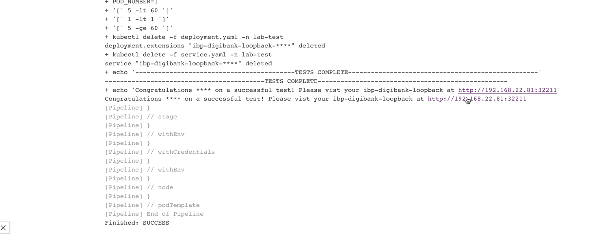

**6.** Once you have your kubernetes deployment of our loopback
application, go ahead and open it. Then go to the `GetpapersController`
and then paste in the text below once you click on `Try it Out` :

    {
      "issuer": "Digibank"
    }

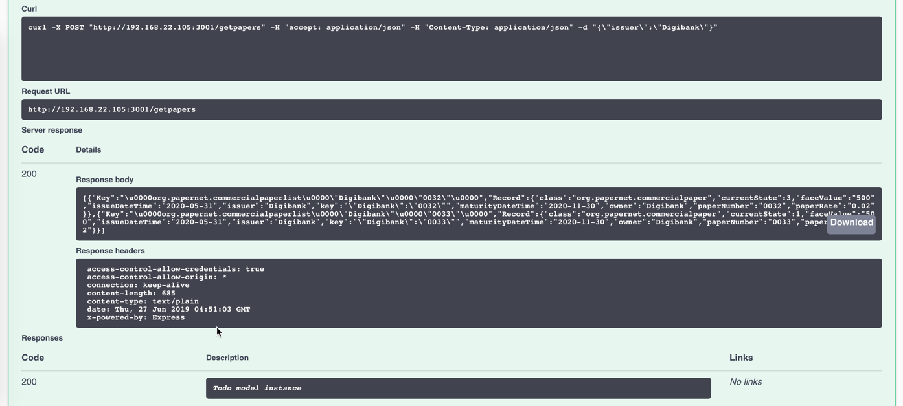

**xxvii** It's time to cleanup the Github webhook since you are done with it. Go back to your fork of Github repository for this lab. Go to the settings page for the repository and then Webhooks. Click delete to clean up the Webhook.

**xxvii** Finally, get a message confirming your deletion and pat yourself on the back for a job well done, but of course don't forget our now familiar friend Jenkins.

