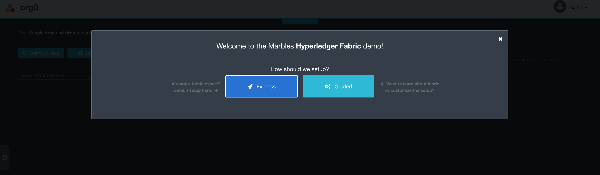
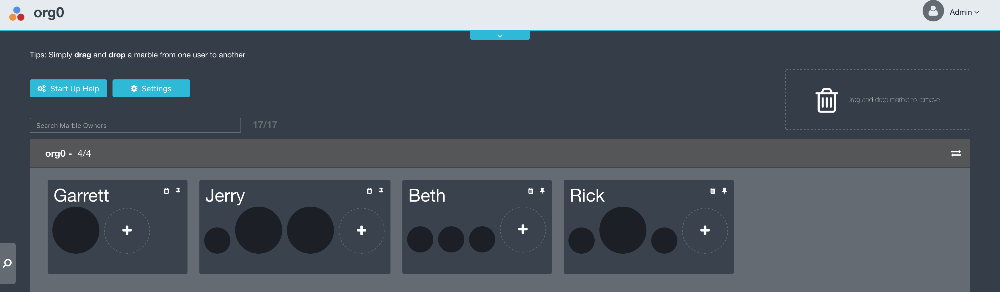

## Overview

The goal of this part of the lab is to go through the process of using your peer with the fabric command line interface (cli) tools and connecting it with marbles. 

In this part of the lab, you will:

1. Connect to your peer
2. Log in to our Kubernetes cluster
3. Take a look at your peer setup environment variables
4. Check the chaincode on the peer and the channel
5. Submit transactions with your peer to create yourself as a marbles owner with a marble
6. Configure the marbles application to connect to your peer
7. Connect the marbles application to your peer

## Connect to your peer
An IBM Blockchain Platform network has been set up with an organization for each member of the lab in our IBM Cloud Private Kubernetes Cluster. The necessary certificate material and environment variables to operate your peer as well as the marbles project have been packaged into a container for your use during the lab.

This container is labeled based on your team.

Please open a terminal window on your computer and set your given ip address and ssh into that z machine

`IP_ADDRESS=givenip`

`ssh bcuser@$IP_ADDRESS`

Sample Output:
```
Welcome to Ubuntu 16.04.5 LTS (GNU/Linux 4.4.0-139-generic s390x)

 * Documentation:  https://help.ubuntu.com
 * Management:     https://landscape.canonical.com
 * Support:        https://ubuntu.com/advantage
Last login: Mon Jan 21 21:43:38 2019 from 192.168.22.64
bcuser@ubuntu16045:~
```

Then, add the cluster to your /etc/hosts and add the self-signed certificate to your ca-certificates

```
echo "192.168.22.81   wsc-ibp-icp-cluster.icp" | sudo tee --append /etc/hosts && sudo mkdir /usr/local/share/ca-certificates/wsc-ibp-icp-cluster.icp && sudo openssl s_client -showcerts -servername wsc-ibp-icp-cluster.icp -connect wsc-ibp-icp-cluster.icp:8443 </dev/null 2>/dev/null | sudo openssl x509 | sudo tee /usr/local/share/ca-certificates/wsc-ibp-icp-cluster.icp/ca.crt && sudo update-ca-certificates
```

Sample Output:
```
192.168.22.81   wsc-ibp-icp-cluster.icp
-----BEGIN CERTIFICATE-----
MIIFfjCCA2agAwIBAgIQbJlENedx5PvDbGD7XLDnITANBgkqhkiG9w0BAQsFADBj
MQswCQYDVQQGEwJVUzERMA8GA1UECAwITmV3IFlvcmsxDzANBgNVBAcMBkFybW9u
azEaMBgGA1UECgwRSUJNIENsb3VkIFByaXZhdGUxFDASBgNVBAMMC3d3dy5pYm0u
Y29tMCAXDTE4MTIxMjE5NTQ1MVoYDzIxMTgxMTE4MTk1NDUxWjBgMQswCQYDVQQG
EwJDTjEQMA4GA1UECAwHU2hhYW54aTEOMAwGA1UEBwwFWGknYW4xGjAYBgNVBAoM
EUlCTSBDbG91ZCBQcml2YXRlMRMwEQYDVQQDDAppY3Atcm91dGVyMIIBIjANBgkq
hkiG9w0BAQEFAAOCAQ8AMIIBCgKCAQEArsBisMJEyMGHZ+93mcFsXX0AQc+QXSVW
o53f3JEd2Kn+tZLx57vOzRWmMop7B1pSe06c1GwFKofOWSTgHCHv8DO8+h9TIm3x
+9IUaLx65mxrTMToUjIxjNyt2JjElHJskxrbpwJsofG59gxhGal8ed89SveXYIL/
PkXvkm5jsoPaRFjgQq0KJoy9UO26aD/FMJu9HzV+7P6Tu8Q+OJHgWSvIgKfX9vOg
qyMxv8vGYEGh4jLgQFRMMfXdH01y2diZ259771wHjsTdMRUnxRC36RTDgIXp+0CR
143p1+dmucYD5G45rOwzPuDi67VNho8mtXs5ohTQfovj4FdcDVtFgQIDAQABo4IB
LTCCASkwCQYDVR0TBAIwADAdBgNVHQ4EFgQUIMoa55D0BPmJ5FYOEiIa6mw+qtYw
gZUGA1UdIwSBjTCBioAUZ9zE9CrhJ2Lm/tLiDLDK5H3asjqhZ6RlMGMxCzAJBgNV
BAYTAlVTMREwDwYDVQQIDAhOZXcgWW9yazEPMA0GA1UEBwwGQXJtb25rMRowGAYD
VQQKDBFJQk0gQ2xvdWQgUHJpdmF0ZTEUMBIGA1UEAwwLd3d3LmlibS5jb22CCQCV
Y/GaGOxNzTAdBgNVHSUEFjAUBggrBgEFBQcDAQYIKwYBBQUHAwIwCwYDVR0PBAQD
AgWgMDkGA1UdEQQyMDCHBH8AAAGCCWxvY2FsaG9zdIcEwKgWUYIXd3NjLWlicC1p
Y3AtY2x1c3Rlci5pY3AwDQYJKoZIhvcNAQELBQADggIBABCkUfS8TTO2sPJlJjAn
ZiatcrliKZ2KJqdNNouF68E+xHfthfXxhl93TP5oUEw7lFN8yRb+z0o16wZksliw
h8FpunHZAuQ+M2qI3afIiRU2H58drGHkBmbZwoMYAQaFrU+A9VEzgibtjBHCkL4p
g+3kzQySCJq+A9lmVq/gwrd3cqfPxsFckqq1eGvP8BfcwxvkUIPnOp/Vh9f2jgK7
UNfmPd4hZSzTr2jOfdBAGaltc4C+MAougCAppz7cVQXvb9A2b7ffF3JmYbr626Bk
Pp7c0rZAzLRsoZy8ngT9zS+9CucY8MolpPDQmBL48asaMYCRgTx6wAgD6bDzJnpt
F0c+FFf7k4782vJELs4gwXkkWRVmaHBlHn4yfYObsiS23snhu2Fvuu2bBWmFMXEr
PCK9d1JO1czb672fd18aOj6pmNLZMiIfwIxOxkDpASa4urOhA4sV/61cTpxCSuGs
MFhrLN9rKvPlQCh+z/gLPvcf/DVuKoRO+JIVLKl7oSp4GQY7HjdpzggUvCxayp3J
EUe4eqOnN50oogTFw8FA4/mNrMzt4wXfk/1yPgWS9ey0EBuFg8fTi2GjLuR00Xsb
pjbmU0n0RUpzWdZBHZwb2SpvA6D5M7Ii+aFM0eH5YK5gCU9U9x3hI1MjAtVsINsF
cTiYtc/9hu704vR7CQ3uFvOk
-----END CERTIFICATE-----
Updating certificates in /etc/ssl/certs...
1 added, 0 removed; done.
Running hooks in /etc/ca-certificates/update.d...
done.
```
Take particular note that 1 certificate was added and 0 removed in your output like in the sample output above.

Next, set your team name and login to the private docker repository

`TEAM=teamxx`

`credential=p@ssw0rd`

```
echo $credential | docker login wsc-ibp-icp-cluster.icp:8500 -u $TEAM --password-stdin
```

Sample Output:
```
Login Succeeded
```

Now, start your unique image which will return a command prompt:

```
docker run --rm -it -v /var/run/docker.sock:/var/run/docker.sock --name $TEAM -p 3000:3001 wsc-ibp-icp-cluster.icp:8500/lab-test/connectathon-s390x-$TEAM:1.0 bash
```

This command is using Docker to run your team's container in an interactive bash shell and connect it to your machine's docker socket so you can create sibling containers from your container image. Additionally, you are giving it the name of your team and forwarding traffic on port 3000 of the host to port 3001 on your container to access your marbles application during the lab.

## Login to our Kubernetes cluster 
Run the following command to connect to the running IBM Cloud Private Kubernetes cluster.

`cloudctl login -a https://192.168.22.81:8443 -u $team -p $credential -n lab-test`

Sample Output:
```
Targeted account wsc-ibp-icp-cluster Account (id-wsc-ibp-icp-cluster-account)

Targeted namespace lab-test

Configuring kubectl ...
Property "clusters.wsc-ibp-icp-cluster" unset.
Property "users.wsc-ibp-icp-cluster-user" unset.
Property "contexts.wsc-ibp-icp-cluster-context" unset.
Cluster "wsc-ibp-icp-cluster" set.
User "wsc-ibp-icp-cluster-user" set.
Context "wsc-ibp-icp-cluster-context" created.
Switched to context "wsc-ibp-icp-cluster-context".
OK

Configuring helm: /root/.helm
OK
```
## Take a look at your peer setup environment variables
In order to operate your peer a number of environment variables need to be set. Let's take a look at some of the environment variables set for the Hyperledger Fabric cli to work with your peer:

`env | grep CORE`

Sample Output:
```
CORE_PEER_LOCALMSPID=org0
CORE_PEER_TLS_ENABLED=true
CORE_PEER_MSPCONFIGPATH=/home/org0/admin
CORE_PEER_TLS_ROOTCERT_FILE=/home/org0/peertls.pem
CORE_PEER_ADDRESS=192.168.22.81:30035
```

`CORE_PEER_LOCALMSPID=org0` defines the local MSP or Membership Services Provider of the peer which contains the identifying information (i.e., certs and keys) for the peer as well as the certificates of trusted Certificate Authorities which are authorized to issue identities on behalf of the organization. (In this example `org0` is the MSPID, yours will correspond with your team)

`CORE_PEER_TLS_ENABLED=true` is used to enable transport layer security (TLS) communication.

`CORE_PEER_MSPCONFIGPATH` points to the MSP material you are using to operate the peer

`CORE_PEER_TLS_ROOTCERT_FILE` is the root TLS certificate for the peer which your system needs to trust to have a TLS connection with the peer. 

`CORE_PEER_ADDRESS` is the peer's IP address used to connect with the peer. 

## Check the chaincode on the peer and the channel

In order to check which chaincode is installed on your peer run:

`peer chaincode list --installed`

Sample Output:
```
Get installed chaincodes on peer:
Name: marbles, Version: 1.0, Path: marbles, Id: 4421fd51a7949b08620ab8db7407d1269c38e4ef2edd143b1a78d56ae82eaa2d
```

You will notice the marbles chaincode has been installed on your peer.

Next, let's check which chaincode is instantiated on the channel:

`peer chaincode list --instantiated -C $CHANNEL`

Sample Output:
```
Get instantiated chaincodes on channel mychannel:
Name: marbles, Version: 1.0, Path: marbles, Escc: escc, Vscc: vscc
```

Here, you see the marbles chaincode has also been instantiated on the channel and is ready to be used to submit transactions.

## Submit transactions with the peer to create yourself as a marbles owner with a marble of your own

Now it's time for one of your team members to add yourself as a marbles owner to the channel.

First set your name as the marbles owner

`owner=Garrett`

Then create the owner with the following command:

```
peer chaincode invoke -C ${CHANNEL} -n ${CC_NAME} -c '{"Args":["init_owner","o0'$team'", "'$owner'", "'$CORE_PEER_LOCALMSPID'"]}' --tls --cafile $ORDERER_CA -o ${ORDERER_1}
```

Sample Output:
```
2019-03-08 03:47:55.093 UTC [chaincodeCmd] chaincodeInvokeOrQuery -> INFO 001 Chaincode invoke successful. result: status:200
```

Next, give your owner a black marble:

```
peer chaincode invoke -C ${CHANNEL} -n ${CC_NAME} -c '{"Args":["init_marble","m0'$team'","black","200","o0'$team'","'$CORE_PEER_LOCALMSPID'"]}' --tls --cafile $ORDERER_CA -o ${ORDERER_1}
```

Sample Output
```
2019-03-08 03:48:02.027 UTC [chaincodeCmd] chaincodeInvokeOrQuery -> INFO 001 Chaincode invoke successful. result: status:200
```

Finally, run a query against the ledger to see your owner and marble as well as everyone else's so far:

```
peer chaincode invoke -C ${CHANNEL} -n ${CC_NAME} -c '{"Args":["read_everything"]}' --tls --cafile $ORDERER_CA -o ${ORDERER_1}
```
Sample Output:
```
2019-03-15 08:47:04.730 UTC [chaincodeCmd] chaincodeInvokeOrQuery -> INFO 001 Chaincode invoke successful. result: status:200 payload:"{\"owners\":[{\"docType\":\"marble_owner\",\"id\":\"o015525575491703BpSw\",\"username\":\"rick\",\"company\":\"org0\",\"enabled\":true}
```
Note: This will grow as more marbles and owners get added to the ledger by your org and other orgs.

## Configure the marbles application to connect to your peer

Go into the marbles directory: `cd marbles/config`

The marbles application will connect to your fabric network using the Hyperledger Fabric Node.js Software Development Kit (SDK) Application Programming Interface (API) by consuming information in the file `connection_profile_tls.json`

Take a look at this file with `cat connection_profile_tls.json`

Take note that this file has connection information and TLS certificates for your, peers, certificate authority (CA), and the orderer for your network.

Next, you will be able to specify which users you want to enroll in your application. 

Edit the file `marbles_tls.json` to do this:

`vim marbles_tls.json`

Edit the names to what you want in the usernames section such as:

```
{
    "cred_filename": "connection_profile_tls.json",
    "use_events": true,
    "keep_alive_secs": 120,
    "usernames": [
        "Beth",
        "Rick",
        "Jerry"
    ],
    "port": 3001
}
```

In vim you edit by typing i and then making your changes using the arrow keys to navigate. Once you are finished making changes hit the escape key. Then save your changes with a save command such as `:x`, holding down shift and typing `ZZ` (`shift + ZZ`), `shift + ZQ` or using the worst option `:wq`.

Once the file has been saved, move back to the parent directory with `cd ..`

## Connect the marbles application to your peer

Run `npm install -g gulp`

This will install the gulp npm package necessary to run the marbles application.

Run `npm install`

This will install the dependencies for the marbles application specified in the package.json file in the `/home/marbles` directory. This may take a few minutes. You will notice a bunch of `CXX(target)` in the output of this command because two of the packages (i.e., pkcs11js and grpc) needs to be compiled from source for s390x. This needs to happen since the binaries are not publicly available for this platform. When this command completes it will return your terminal to you.

Now you can start the marbles application with `gulp marbles_tls`

Open up a web browser on your pc and navigate to the ip given to you earlier at port 3000 in the form `xxx.xxx.xxx.xxx:3000` where `xxx.xxx.xxx.xxx` is your given ip address with each x being a possible digit (e.g., `192.168.22.150:3000`).

First, choose Express to setup your marbles application



Here you can see your org, the owners and marbles you created in the `marbles_tls.json` file and the marble and owner you created with the cli. You created a black marble with the cli and the application randomly selects a color for the marbles created from the marbles_tls.json file (in this case black, but your mileage with the random function may vary)



We can also see the other orgs and their marbles that are connected in this connectathon.

Next turn on story mode to see the marble transaction process:

1. Click on settings

2. Enable Story Mode


Finally, trade some marbles to other users. 

1. Click on a marble from a user in your org and drag it to another user in your org
2. Click and drag a marble from a member in your org and move it to a member of a different org
3. Click and drag a marble from a member of a different org and drag it to a member of your org

Notice that you can give marbles to other orgs but can't take them and think about why this may be the case...

Now close the application by returning to your terminal and typing `ctrl + c` to return your terminal prompt.

You have now setup the marbles application.

Please move on to part 2 where you will deploy this into your cluster.

