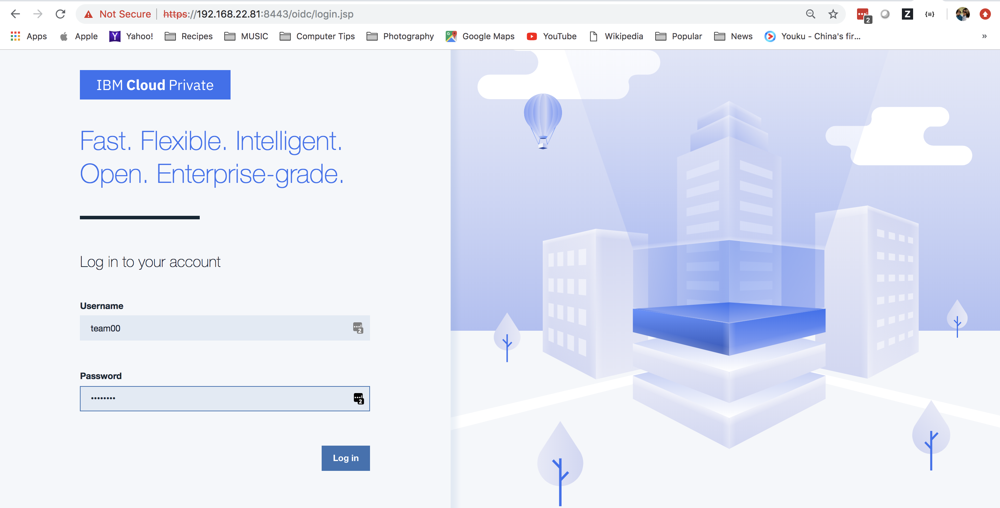
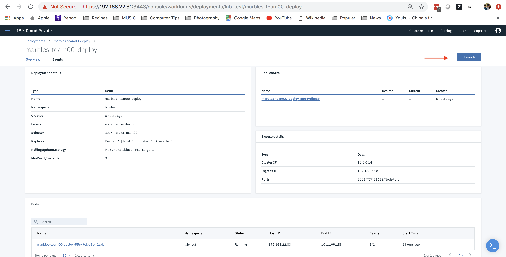

## Overview 

The goal of this part of the lab is to guide you through the process of packaging up a blockchain front end application to run inside a Kubernetes cluster. In the lab environment, this happens to be the same cluster that is hosting your blockchain components. In the real world, this may not always be the case.

In this part of the lab, you will:

1. Build a docker image with the Marbles UI

2. Test the container locally on your Linux image

3. Push the image to the ICP cluster's private docker registry

4. Create a Kubernetes deployment and service for the Marbles UI

5. Deploy the Kubernetes deployment

6. Test the marbles UI

## Only if you stopped in between the lab parts 1 and 2
1. Make sure you still have an ssh connection to your bcuser instance. If not please rerun `IP_ADDRESS=givenip` for your given ip and `ssh bcuser@$IP_ADDRESS`

2. Check to make sure you are still inside your docker image. If you got out of your docker image, go back into the image by first setting your TEAM with `TEAM=teamxx` where xx is the number of your team. Then, check if your container is still running with `docker ps | grep team`
	
      a) If you get sample output showing a container such as:

        6e6ad92499b1        wsc-ibp-icp-cluster.icp:8500/lab-test/connectathon-s390x-team10:1.0   "bash"              12 minutes ago      Up 12 minutes       0.0.0.0:3000->3001/tcp   team10
      

      **follow Option a) of step 3 below**

      b) If you get sample output not showing anything such as:

      ```
      ```

      **follow Option b) of step 3 below**

3.  Do only 1 of the options below based on step 2 above!
      
    a) exec back into your running container with 
   
        docker exec -it $TEAM sh
    
    **OR**

    b) restart your container with 
        
        docker run --rm -it -v /var/run/docker.sock:/var/run/docker.sock --name $TEAM -p 3000:3001 wsc-ibp-icp-cluster.icp:8500/lab-test/connectathon-s390x-$TEAM:1.0 bash

## Before you start, make sure you are still logged in to the cluster. 

Run the following commands to display the pods that are currently deployed to our cluster. First, type `kubectl get pods`

Sample Output:
```
NAME                                                              READY     STATUS    RESTARTS   AGE
connectathon-orderer-orderer-85bb44f87c-qk662                     1/1       Running   0          1d
connectathon-ordererorg-ca-fabric-ca-deployment-7f6b9b6577whxgr   1/1       Running   0          1d
connectathon-org0-ca-fabric-ca-deployment-67cf7486dd-9wtg7        1/1       Running   0          1d
connectathon-org0peer1-55fc894b9-5qncl                            2/2       Running   0          1d
connectathon-org1-ca-fabric-ca-deployment-59f9457fc5-9jmfp        1/1       Running   0          1d
connectathon-org10-ca-fabric-ca-deployment-76794dcbbf-jdkcr       1/1       Running   0          1d
connectathon-org10peer1-86dc5fcdf7-6c5qm                          2/2       Running   0          39m
connectathon-org11-ca-fabric-ca-deployment-5bc55cc776-5cjbz       1/1       Running   0          1d
connectathon-org11peer1-69f67d965-svwjh                           2/2       Running   0          1d
connectathon-org1peer1-7665b7c6d7-x8spx                           2/2       Running   0          1d
connectathon-org2-ca-fabric-ca-deployment-787cbdf766-qwdjw        1/1       Running   0          1d
connectathon-org2peer1-7d4bbfc7bf-gs9qv                           2/2       Running   0          1d
connectathon-org3-ca-fabric-ca-deployment-54cfc78777-m782f        1/1       Running   0          1d
```
 If you are able to see the output of the `kubectl` command such as above you are still logged in. If not, run:

 ```
 cloudctl login -a https://192.168.22.81:8443 -u $team -p $credential -n lab-test
 ```

Sample Output:
```
Targeted account wsc-ibp-icp-cluster Account (id-wsc-ibp-icp-cluster-account)

Targeted namespace lab-test

Configuring kubectl ...
Property "clusters.wsc-ibp-icp-cluster" unset.
Property "users.wsc-ibp-icp-cluster-user" unset.
Property "contexts.wsc-ibp-icp-cluster-context" unset.
Cluster "wsc-ibp-icp-cluster" set.
User "wsc-ibp-icp-cluster-user" set.
Context "wsc-ibp-icp-cluster-context" created.
Switched to context "wsc-ibp-icp-cluster-context".
OK

Configuring helm: /root/.helm
OK
```
Now, run `kubectl get pods | grep $CORE_PEER_LOCALMSPID`

Sample Output:
```
NAME                                                              READY     STATUS    RESTARTS   AGE
connectathon-org0-ca-fabric-ca-deployment-67cf7486dd-9wtg7        1/1       Running   0          7h
connectathon-org0peer1-55fc894b9-5qncl                            2/2       Running   0          7h
```

You should see one peer pod, and one CA pod. Both should be in Running status. Your organization only has one peer in this scenario.

## Build a docker image
Now that you have tested the Marbles front end User Interface (Marbles UI, for short), let's save it as a docker image using the supplied Dockerfile.

A Dockerfile is a text document that contains all the commands a user could call on the command line to assemble an image. Think of it as a specific way to package up a set of files and instructions that together make up a microservice.

- Go to your marbles directory:
```
cd /home/marbles
```
- Here you should see a Dockerfile:
```
ls -ltr Dockerfile
```

Sample Output:
```
-rw-rw-r-- 1 1000 1000 394 Feb 28 22:12 Dockerfile
```
- If you are curious, cat the file to look at its contents:
```
cat Dockerfile
```

Sample Output:
```
FROM node:8-alpine
ENV NPM_CONFIG_LOGLEVEL warn
RUN mkdir -p /usr/src/app
WORKDIR /usr/src/app
COPY package.json /usr/src/app/
RUN apk add --no-cache --virtual .build-deps make gcc g++ python \
 && npm install \
 && npm install gulp -g ---unsafe-perm \
 && apk del .build-deps .build-deps make gcc g++ python
COPY . /usr/src/app/
EXPOSE 3001
CMD [ "gulp", "marbles_tls" ]
```

The above Dockerfile builds from an Alpine node image in DockerHub. This is a bare bones Linux image of the Alpine distribution with node version 8 installed. Next, the `NPM_CONFIG_LOGLEVEL` for npm is globally set to warn so that npm will only print errors and warnings. `ENV` is used for this to persist this change as an environment variable in your finished container. Then, it uses `RUN` to execute a command inside of the base `node:8-alpine` container to make a directory for the marbles application. `WORKDIR` makes this directory the current working directory. Moreover, `COPY` brings the `package.json` file (containing the names of the application's dependent node modules) into the containers `/usr/src/app` directory. The following `RUN` command uses `apk` (Alpine's package manager) to install a variety of pre-reqs to your `npm install` such as make, gcc and python, before running the actual `npm install` twice to install both the necessary node modules for both the Marbles UI itself and gulp to start the marbles UI. Note that this is all done in one line with `&&` to make it occur in one layer. This way, at the end of the `RUN` command you can use a delete command `apk del` and take the developer tools you no longer need out of your image. If you instead ran this as multiple commands, you would not be able to shrink your image size since previous layers can't be effectively deleted due to the layered file system used for docker images. Finally, you copy the application itself and the connection profile materials into your working directory, document the port you will run marbles on (`3001`), and set a command for the container to run when it starts `gulp marbles_tls`. 

- Now let's run docker build in the `/home/marbles` directory:
```
docker build -t marbles-$team .
```

**NOTE: Please remember to not forget that pesky `.` Otherwise you will get an error saying** `"docker build" requires exactly 1 argument`

Sample Output:

```
Sending build context to Docker daemon  261.9MB
Step 1/9 : FROM node:8-alpine
 ---> 66f08ecb7600
Step 2/9 : ENV NPM_CONFIG_LOGLEVEL warn
 ---> Using cache
 ---> 180c28267c41
Step 3/9 : RUN mkdir -p /usr/src/app
 ---> Using cache
 ---> f9615b4a1813
Step 4/9 : WORKDIR /usr/src/app
 ---> Using cache
 ---> e53d507c2bf9
 ....
 ....
 lots more messages
 ....
 Successfully built 9b57c7c3e480
Successfully tagged marbles-team00:latest
```
- Now you should see this new image that you just built:

`docker images`

Sample Output:
```
REPOSITORY                                                        TAG                 IMAGE ID            CREATED             SIZE
marbles-team00                                                    latest              5cc513286904        29 seconds ago      312MB
wsc-ibp-icp-cluster.icp:8500/lab-test/connectathon-s390x-team00   1.0                 a2d1b20e0e1e        12 hours ago        1.16GB
node                                                              8-alpine            030469210de8        2 weeks ago         69.5MB
```
## Test the docker image locally
- Let's test the image that was just built, by running it locally:
```
docker run -it --init -p 3001:3001/tcp --name marbles-$team marbles-$team
```
Sample Output
```
[20:57:50] Using gulpfile /usr/src/app/gulpfile.js
[20:57:50] Starting 'env_tls'...
[20:57:50] Finished 'env_tls' after 73 μs
[20:57:50] Starting 'build-sass'...
[20:57:50] Finished 'build-sass' after 7.48 ms
[20:57:50] Starting 'watch-sass'...
[20:57:50] Finished 'watch-sass' after 7.47 ms
[20:57:50] Starting 'watch-server'...
[20:57:50] Finished 'watch-server' after 2.55 ms
[20:57:50] Starting 'server'...
info: Checking connection profile is done
info: Loaded config file /usr/src/app/config/marbles_tls.json
info: Loaded connection profile file /usr/src/app/config/connection_profile_tls.json
...
lots of output
...
- - - - - - - - - - - - - - - - - - - - - - - - - - - - - - - - - -
debug: Detected that we have launched successfully before
debug: Welcome back - Marbles is ready
debug: Open your browser to http://localhost:3001 and login as "admin"
- - - - - - - - - - - - - - - - - - - - - - - - - - - - - - - - - -
```
- After you see the "Open your browser to https://localhost:3001" message, point your browser to the IP address of your Linux image, e.g., `http://192.168.22.107:3001` and you will see the Marbles UI.

- Once you verify that the image works locally, it's time to stop the running container. Type `Ctrl + C` to exit out of the running container in the current terminal.


## Push image to the ICP Cluster's private repo
- You will now tag the image you created with the private repo's host name and port number, followed by the namespace you are using, as follows.
```
docker tag marbles-$team:latest wsc-ibp-icp-cluster.icp:8500/lab-test/marbles-$team:1.0
```
- Log into the docker private registry using your teamNN id and credential, as follows:
```
echo $credential | docker login wsc-ibp-icp-cluster.icp:8500 -u $team --password-stdin
```

Sample Output:
```
WARNING! Your password will be stored unencrypted in /root/.docker/config.json.
Configure a credential helper to remove this warning. See
https://docs.docker.com/engine/reference/commandline/login/#credentials-store

Login Succeeded
```
- Now push up the image using the tag you just created (again be mindful that the name pushed in the output will reflect your team name):
```
docker push wsc-ibp-icp-cluster.icp:8500/lab-test/marbles-$team:1.0
```
Sample Output:
```
The push refers to repository [wsc-ibp-icp-cluster.icp:8500/lab-test/marbles-team00]
c8490573a0d8: Pushed
8e63f87572fb: Pushed
a6a08bb664f7: Pushed
3a30ca7a2471: Pushed
ccc0f617b78a: Pushed
1801fc515e2a: Pushed
1.0: digest: sha256:6a796e973817f714b64e767b3c35affd93a6dc5df7ef12ca872aca64d20a5155 size: 1997
```

- Let's log in to the ICP Console for the first time and verify that your image got pushed up to the cluster's private docker registry. Point your browser to `https://192.168.22.81:8443`. Accept that it's using a self-signed certificate. This should lead you to the sign in page. Log in with your team's credentials given to you at the beginning of the lab: you can find this by echoing the team and credential variables in your terminal: `echo $team && echo $credential`. Your team is your username and your credential is your password.



- You can verify your image got pushed up by going to the hamburger menu on the top left corner and selecting `Container Images` and look for lab-test/marbles-teamNN. Note: you will have to go to the last page to see images under the namespace lab-test.


## Create a Kubernetes deployment and service

* Log in to the ICP cluster with your team's ID and password:

 ```
 cloudctl login -a https://192.168.22.81:8443 -u $team -p $credential -n lab-test
 ```
 
Sample Output:
```
Targeted account wsc-ibp-icp-cluster Account (id-wsc-ibp-icp-cluster-account)

Targeted namespace lab-test

Configuring kubectl ...
Property "clusters.wsc-ibp-icp-cluster" unset.
Property "users.wsc-ibp-icp-cluster-user" unset.
Property "contexts.wsc-ibp-icp-cluster-context" unset.
Cluster "wsc-ibp-icp-cluster" set.
User "wsc-ibp-icp-cluster-user" set.
Context "wsc-ibp-icp-cluster-context" created.
Switched to context "wsc-ibp-icp-cluster-context".
OK

Configuring helm: /root/.helm
OK
```

* Verify that your organization's Fabric pods are running. Note that you have a Fabric CA pod and one Fabric peer pod running. The environment variable $CORE_PEER_LOCALMSPID was set for you and it was set to your peer's MSPID. In this lab environment, your MSPID corresponds to your team number. i.e. team01 will be org1, team02 will be org2, etc.

```
kubectl get pods | grep connectathon-$CORE_PEER_LOCALMSPID
```

Sample Output:

```
connectathon-org0-ca-fabric-ca-deployment-67cf7486dd-xgqkb        1/1       Running   0          7h
connectathon-org0peer1-55fc894b9-fhz2f                            2/2       Running   0          7h
```
* You should have a Kubernetes deployment yaml file in your `/home/marbles` directory called `marbles-teamNN.yaml`. Kubernetes objects are defined in yaml files and then created on or applied to a running cluster. You can create a Kubernetes resource from the ICP Console as well. But here you will do this via the command line tool `kubectl` which interacts with the Kubernetes API Server on the cluster.

* Now run the following command to create a marbles deployment yaml file that matches your team name.

```
cat marbles-teamNN.yaml | sed -r 's/teamNN/'$team'/' > marbles-$team.yaml
```

* You can cat the yaml file to see its contents:

```
cat marbles-$team.yaml
```

Sample Output:

```
apiVersion: v1
kind: Service
metadata:
  name: marbles-team00-svc
spec:
  selector:
    app: marbles-team00
  ports:
  - protocol: TCP
    port: 3001
    targetPort: 3001
  type: NodePort
---
apiVersion: extensions/v1beta1
kind: Deployment
metadata:
  name: marbles-team00-deploy
  labels:
    app: marbles-team00
spec:
  selector:
    matchLabels:
      app: marbles-team00
  replicas: 1
  template:
    metadata:
      labels:
        app: marbles-team00
    spec:
      nodeSelector:
        beta.kubernetes.io/arch: s390x
      containers:
      - name: marbles-team00
        image: wsc-ibp-icp-cluster.icp:8500/lab-test/marbles-team00:1.0
        ports:
          - containerPort: 3001
        imagePullPolicy: Always
```
The important parts to point out in the yaml file are that it will create a Kubernetes service called `marbles-team00-svc` and that it is pointing to the `marbles-team00` container. The service will be of type `NodePort` which means this service will be reachable outside of the cluster. The yaml file will also create a Kubernetes deployment that has one pod with one container that will be based off of the `wsc-ibp-icp-cluster.icp:8500/lab-test/marbles-team00:1.0` image that you pushed to the private image registry earlier. Finally, since you built the marbles-teamxx image with the s390x (z) architecture and there are machines with multiple different architectures in our cluster (s390x and amd64) you need to specify for it to run on s390x with a nodeSelector of `beta.kubernetes.io/arch: s390x`. If you built it for a different architecture, you would instead use a nodeSelector for that architecture.

## Deploy the service and test the Marbles UI
* Now you are ready to create the Kubernetes resources. Run the following command:

`kubectl apply -f marbles-$team.yaml`

```
service/marbles-team00-svc created
deployment.extensions/marbles-team00-deploy created
```
* The deployment will create one pod that has one container. A service is also created. Check that your pod is READY `1/1` and in `Running` status:

`kubectl get pods | grep marbles-$team`

```
marbles-team00-deploy-55649dbc5b-xf787                            1/1       Running   0          35s
```

## Launch the Marbles service and test the Marbles UI

* Now, let's navigate through the ICP Console to your deployment. Point your browser to `https://192.168.22.81:8443`. Accept that it's using a self signed certificate. This should lead you to the sign in page. Log in with your team's credentials given to you at the beginning of the lab.

* Go to the hamburger menu on the upper left corner, and select `Workloads -> Deployments`.

* Find your team's deployment, it should be similar to `marbles-team00-deploy` but with your team name.


* Click on your deployment. You will be taken to the details page of your deployment. Upon further exploration you will see the deployment has one ReplicaSet, and one Pod. You can choose to click into either the ReplicaSet or Pod to get details about those two objects.


* Now click on the `Launch` button for your deployment. This will bring up the Marbles UI.



* At this point, depending on where the other classroom students are, you will see two or more organizations in the Marbles UI. Test out the application by transacting some marbles with your neighboring students. Enabling `Story Mode` in `Settings` will provide a step by step guided experience during each transaction.

Congratulations! You've successfully created a container for the Marbles front end application, created a Kubernetes deployment for it, and deployed it in a IBM Cloud Private Kubernetes cluster.
