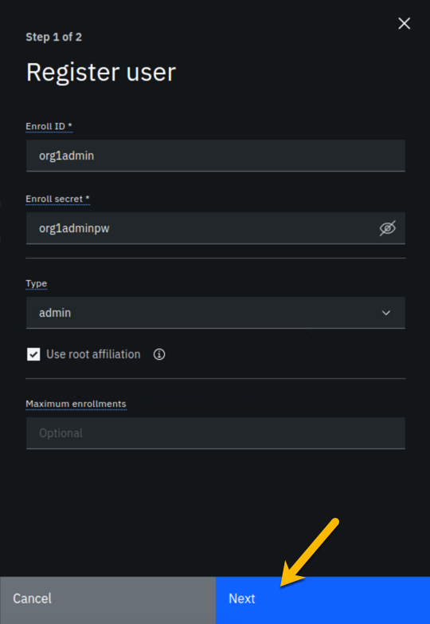
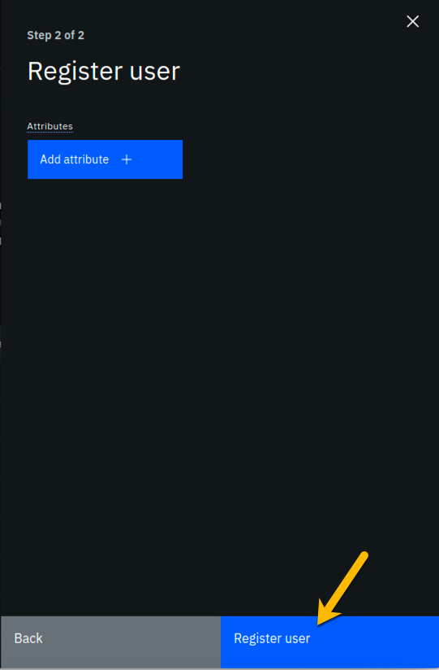
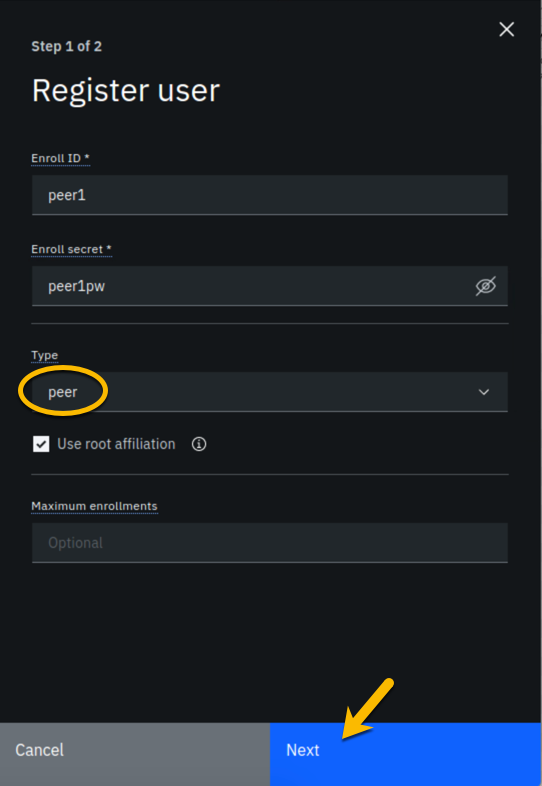
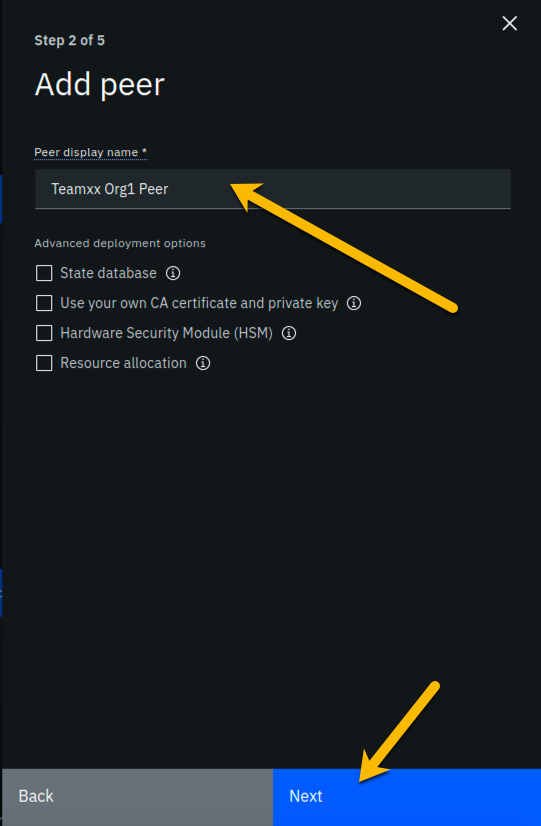
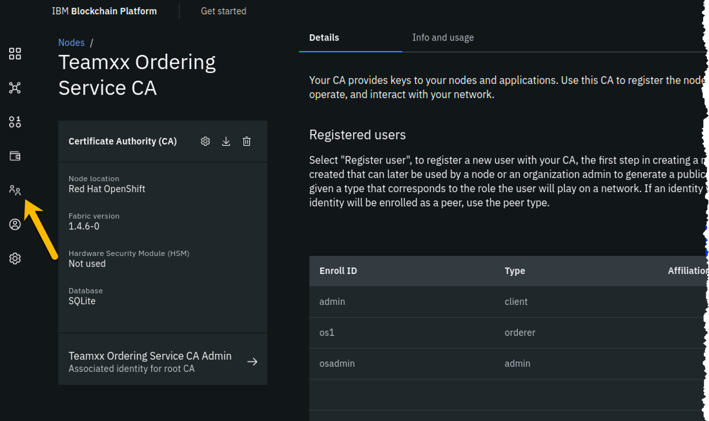
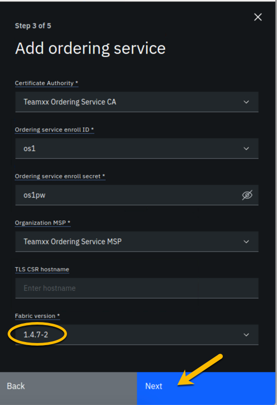
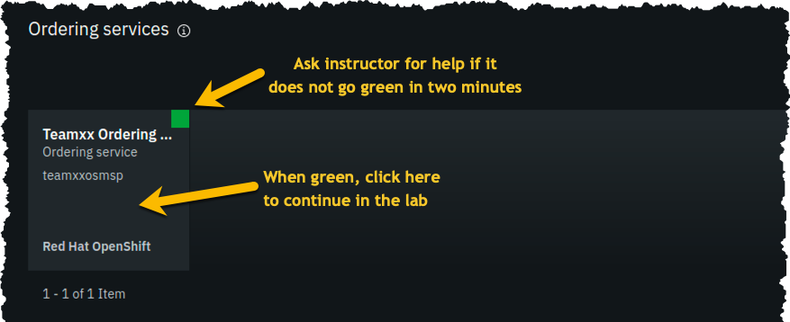
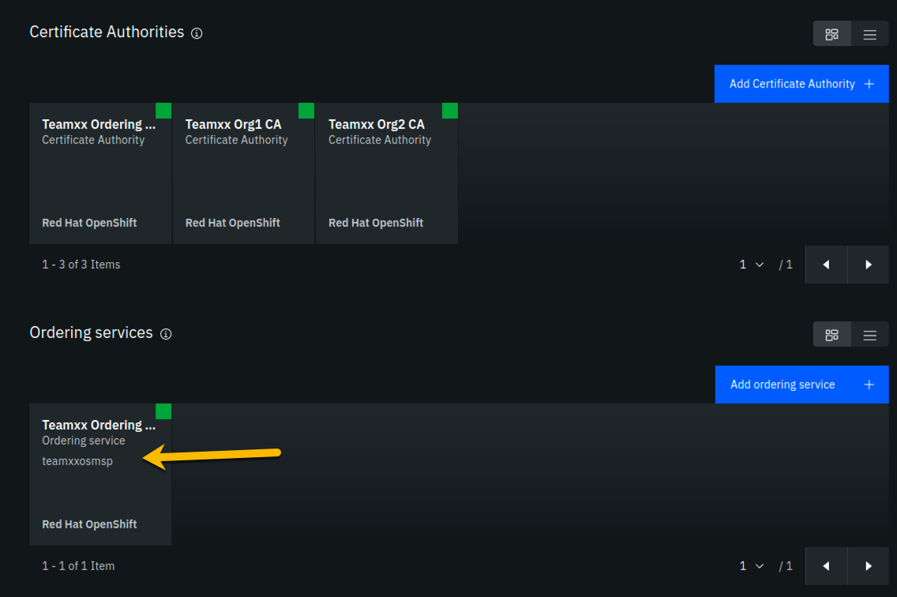

Section 1: IBM Blockchain Platform console lab overview
=======================================================

You will use the IBM Blockchain Platform console in this lab to create a blockchain network.
The network will consist of three organizations.
Two of these organizations will represent organizations that want to participate in the blockchain network and submit transactions.
They will be referred to as *peer organizations* throughout the lab.
The third organization is the organization that provides the ordering service.

First you will create one peer organization.
Then you will create an ordering service organization, create a channel and add your first peer organization to the channel.
Then you will create a second peer organization, and add it to the channel.

Each high-level task is detailed in a separate section, with multiple steps per task.

The diagram below provides a view of what your blockchain network will look like upon completion of the lab:

!!! important
        You will be assigned a two-digit team id by your instructor, and everywhere in this lab where you see **Team*xx* ** in the instructions, you must substitute *xx* with the two-digit id you have been assigned.

The sections in this lab are as follows:

- Section 1: This overview
- Section 2: Logging in to the IBM Blockchain Platform console
- Section 3: Creating a Certificate Authority for your first peer organization
- Section 4: Adding new users using your Org1 Certificate Authority
- Section 5: Creating an MSP for your peer organization
- Section 6: Creating a peer node for your peer organization
- Section 7: Creating a certificate authority for an Ordering Service organization
- Section 8: Adding new users using your Ordering Service Certificate Authority
- Section 9: Creating an MSP for your Ordering Service organization
- Section 10: Creating an ordering service node for your organization
- Section 11: Adding your peer organization to a consortium
- Section 12: Creating a channel
- Section 13: Joining a peer to the channel
- Section 14: Defining the certificate authority for your second peer organization
- Section 15: Adding new users using your Org2 Certificate Authority
- Section 16: Creating an MSP for your second peer organization
- Section 17: Creating a peer node for your second peer organization
- Section 18: Adding your new peer organization to the consortium
- Section 19: Adding your Org2 organization to the channel
- Section 20: Joining your peer for Org2 to the channel
- Section 21: Defining an anchor peer for each of your two peer organizations

Section 2: Log in to the IBM Blockchain Platform console
========================================================

**Step 2.1:** Open a Firefox browser window or new tab and enter the unique URL, which will have been provided to you by the instructor, for your team's IBM Blockchain Platform console.
If you see a security warning after entering the URL, click the **Advanced** button, which is highlighted in the below screen snippet:

**Step 2.2:** The reason you are seeing these security messages is because of a self-signed certificate in our lab environment.
Go ahead and click on the **Proceed to 192.168.22.81 (unsafe)** link that is shown below:

**Step 2.3:** Enter your team's userid and password, which will have been provided to you by the instructor, and click the *Login* button:

[//]: # (

**Step 2.4:** You may be presented with a welcome screen with dazzling interactive graphics. Move your cursor around a bit to take in the wonder, and then click the **Let's get started** button in the lower right corner.

Section 3: Create a Certificate Authority for your first organization
=====================================================================

In a Hyperledger Fabric network, each organization will typically have their own certificate authority. The certificate authority is used to issue identities- consisting of X.509 public certificates and matching private keys- for end users, client applications, administrators, and peer and ordering service nodes. In most uses cases each organization will want to have control over the identities they issue, so the typical practice is that each organization provides their own certificate authority. We will follow that practice in this lab. 

You are starting with a blank slate, and our first component to add is the certificate authority for our first peer organization.
In relation to the diagram in the overview section that showed our finished network upon successful lab completion, here is the component that will be added in this section:

 

**Step 3.1:** Click the blue **Add Certificate Authority** tile:

**Step 3.2:** Click **Create an IBM Cloud Private Certificate Authority** and then click the blue **Next** button:

**Step 3.3:** Type in **Team*xx* Org1 CA** where *xx* is your two-digit team id, and then click the blue **Next** button:

**Step 3.4:** Type in **admin** for the *CA administrator enroll id* and **adminpw** for the *CA administrator enroll secret* and then click the blue **Next** button:

**Step 3.5:** Leave the *Resource allocation* settings unchanged, and click the **Next** button:

**Step 3.6:** Review your settings and click the **Add Certificate Authority** button:

!!! note 
       Throughout this lab, when passwords are entered, you can click the icon that looks like an eye to see the password you have 
       entered.  It is recommended that you do this for the lab to ensure you have entered the intended password. The screenshots shown
       in this lab will show the passwords that you should enter.

**Step 3.7:** You will see a tile for your new certificate authority. Observe the box in the upper right corner of the tile.
If it is gray, and you hover your cursor over it, you may see a message indicating that the status is pending. (The gray box, but not the status message,
is shown in this screenshot).

**Step 3.8:** In about a minute, the box in the upper right should turn green, indicating that the certificate authority is running.
If the box does not turn green in a minute, try reloading the page in your browser. Contact an instructor for help if it does not
turn green and show the running status when you hover your cursor over the button.

Once your certificate authority is running, click on its tile so that you can proceed to the next section where you will add users.

Section 4: Add new users using your Org1 Certificate Authority
==============================================================

**Step 4.1:** Click the **Register user** button on the right side of the screen:

**Step 4.2:** Type in **org1admin** for the *Enroll id*,  **org1adminpw** for the *Enroll secret*, select **client** for the *Type* field, and then click the blue **Next** button:

**Step 4.3:** We will not be using custom attributes in this lab, so all you have to do on this screen is click the **Register user** button:

**Step 4.4:** You should now see the userid you just registered, **org1admin**, listed on the screen. You also need to create a userid that your peer node will operate as, so click the **Register user** button again:

**Step 4.5:** Type in **peer1** for the *Enroll id*,  **peer1pw** for the *Enroll secret*, select **peer** for the *Type* field, and then click the blue **Next** button:

**Step 4.6:** Just click the **Register user** button at the bottom of the screen:

**Step 4.7:** You should now see the **peer1** userid listed along with the others on this screen.
Click the **Organizations** icon on the palette on the left of your screen and continue to the next section of the lab:

Section 5: Create an MSP for your organization
==============================================

The *Membership Service Provider* (MSP) component is integral to the private and permissioned Hyperledger Fabric as it provides the authentication- "who are you?"- and authorization - "ok, we believe you are whom you say you are, but are you permitted to do what you are asking to do?"- services.  The infrastructure that the MSP needs to do its job must be in place before you create your peer node. This step will create this for your "Org1".

As we add components throughout the lab, the diagram that maps to our final goal will be shown, with the new component to be added in any given section annotated with a bright red star, as in the below diagram which shows that we will be adding your **Team*xx* Org1**'s MSP:

 
**Step 5.1:** You should see a screen that looks like below, indicating that you have yet to create a *Membership Service Provider (MSP)* definition for your organization. Click the blue **Create MSP definition** tile:

**Step 5.2:** Enter the following values as instructed here:

- Type **Team*xx* Org1 MSP**, where *xx* is your two-digit team id, in the *MSP display name* field
- Type **team*xx*org1msp**, where *xx* is your two-digit team id, in the *MSP ID* field
- For the *Root Certificate Authority* field, select **Team*xx* Org1 CA** 
 
The sidebar panel contains more information than will likely fit in your browser window, so review the values you have entered per the above list, and then scroll down within the sidebar panel:

**Step 5.3:**  In the *Generate organization admin certificate* section, enter the following values as instructed here:

- Select **org1admin** for the *Enroll ID* field
- Type **org1adminpw** in the *Enroll secret* field. Click the "eyeball" icon if necessary to show the password you've entered. 
- Type **Team*xx* Org1 Admin**, where *xx* is your two-digit team id, in the *Identity name* field

Review the values you have entered per the above list, and then click the blue **Generate** button:

**Step 5.4:** The prior step generated a public certificate and a matching private key. This private key is stored by the IBM Blockchain Platform console in your local browser storage and nowhere else. In order to ensure that you can retrieve your private key later, you must now click the **Export** button which will prompt you to save your private key (along with the public certificate) in a JSON file on your hard drive.

**Step 5.5:** Save the exported JSON file in a location that you can remember. The sample screenshot below shows it being saved to a folder named *json* that was created already. You can use the file save window to create a new folder to match this name if you would like, although it isn't strictly necessary for this lab.  

!!!note
       You probably won't need this saved file for this lab if you use the same browser window for the duration of the lab, but the saved file may be necessary if, for whatever reason, you do have to use a new browser window or session, so go ahead and save it!

**Step 5.6:** Click the blue **Create MSP definition** button in the lower right of your screen:

**Step 5.7:** You should now see the definition for your new MSP listed on your screen. Scroll up and click the **Nodes** icon in the icon palette on your left- it is the topmost icon on this palette, and you will be ready to proceed to the next section:

Section 6: Create a peer node for your organization
===================================================

A peer node is where smart contracts- in essence, your blockchain business transactions- run.  Peer nodes also store the ledgers. We will create a peer for your **Team*xx* Org1** in this section and our fledgling network will then look like this: 

 
**Step 6.1:** Click the **Add peer** tile:

**Step 6.2:** Click the **Create an IBM Cloud Private peer** button and then click the blue **Next** button:

**Step 6.3:** Type **Team*xx* Peer Org1**, where *xx* is your two-digit team id, in the *Peer display name* field and then click the blue **Next** button:

**Step 6.4:** Enter or select the following values on this panel:

- Select **Team*xx* Org1 CA**, where *xx* is your two-digit team id, for the *Certificate Authority* field
- Select **peer1** for the *Peer enroll ID* field
- Type **peer1pw** in the *Peer enroll secret* field
- Select **Team*xx* Org1 MSP**, where *xx* is your two-digit team id, for the *Organization MSP* field  

Review the values you entered or selected to ensure they match the above list, and then click the blue **Next** button:

**Step 6.5:** Enter or select the following values on this panel:

- Select **peer1** for the *TLS CA enroll ID* field
- Type **peer1pw** in the *TLS CA enroll secret* field
- Leave the *TLS CSR hostname* field blank

Review the values your entered for correctness and then click the blue **Next** button:

**Step 6.6:** Leave the *Resource allocation* settings unchanged and click the **Next** button:

**Step 6.7:** Select **Team*xx* Org1 Admin**, where *xx* is your two-digit team id, for the *Identity* field, and click **Next**:

**Step 6.8:** The *Summary* panel provides a review of the values you entered or selected in the prior panels. Click the **Add peer** button to continue:

**Step 6.9:** Similarly to when you created the certificate authority earlier, you should see your new peer listed, along with a gray box in the upper right of its tile, showing that the status of this peer is "pending" if you hover your cursor over the gray box.

**Step 6.10:**  It can take a minute or two on our lab system for the peer to come up completely, and you may need to refresh your browser in order to see the box turn green. If your peer is still not ready after a couple of minutes and after you have tried refreshing your browser, ask an instructor for help.  The peer must be ready, as indicated by a green box in the upper right of the peer's tile, similar to what is shown below, before you can continue:

Section 7: Create a certificate authority for an Ordering Service organization
==============================================================================

In this lab you will create three organizations- two organizations will run peer nodes and run smart contracts. One of the organizations will provide the ordering service for the blockchain network.  In the real world each of the three organizations would likely use their own instance of the IBM Blockchain Platform console to create their necessary artifacts.  (You have already done much of this for the first peer organization, **Team*xx* Org1**, in the previous sections of this lab).

!!! note
       You will carry out activities for all three organizations from your browser for purposes of this lab. This will somewhat simplify the steps you'll need to perform versus the real world scenario where this activity is being carried out separately by each organization. The procedure to perform the tasks in the "real world" case are outlined in the IBM Blockchain Platform documentation- basically, it involves exporting information about your organization into JSON files, and providing this information "out-of-band" to the other organizations. 

       In an earlier step you exported your generated certificate and its private key. While it is a JSON file, this is not the file you would ever send to another organization, as it contains your private key which should never be shared with other organizations. The exported JSON files that are used for inter-organizational tasks contain only public information which is safe to share.

Our network will look like this at the completion of this section:

**Step 7.1:** Click the blue **Add Certificate Authority** tile:

**Step 7.2:** Click **Create an IBM Cloud Private Certificate Authority** and then click the blue **Next** button:

!!! note
       The steps in this section are essentially the same as in *Section 3*, just with different values being entered as appropriate.

**Step 7.3:** Type in **Team*xx* Ordering Service CA** where *xx* is your two-digit team id, and then click the blue **Next** button:

**Step 7.4:** Type in **admin** for the *CA administrator enroll id* and **adminpw** for the *CA administrator enroll secret* and then click the blue **Next** button:

!!! important
       May I kindly suggest that for real world implementations you use stronger, less predictable, passwords?

**Step 7.5:** Leave the *Resource allocation* settings unchanged, and click the **Next** button:

**Step 7.6:** Review your settings and click the **Add Certificate Authority** button:

**Step 7.7:** You will see a tile for your new certificate authority. Observe the box in the upper right corner of the tile.
If it is gray, and you hover your cursor over it, you may see a message indicating that the status is pending. (The gray box, but not the status message, is shown in this screenshot):

**Step 7.8:** In about a minute, the button in the upper right should turn green, indicating that the certificate authority is running.
If your button does not turn green in a minute, try reloading the page in your browser. Contact an instructor for help if it does not
turn green and show the running status when you hover your cursor over the button.

Once your Ordering Service certificate authority is running, click on its tile so that you can proceed to the next section where you will add users.

Section 8: Add new users using your Ordering Service Certificate Authority
==========================================================================

**Step 8.1:** Click the **Register user** button on the right side of the screen:

**Step 8.2:** Type in **osadmin** for the *Enroll id*,  **osadminpw** for the *Enroll secret*, select **client** for the *Type* field, and then click the blue **Next** button:

**Step 8.3:** We will not be using custom attributes in this lab, so all you have to do on this screen is click the **Register user** button:

**Step 8.4:** You should now see the userid you just registered, **osadmin**, listed on the screen. You also need to create a userid that your ordering service node will operate as, so click the **Register user** button again:

**Step 8.5:** Type in **os1** for the *Enroll id*,  **os1pw** for the *Enroll secret*, select **peer** for the *Type* field, and then click the blue **Next** button:

!!! note
       The *peer* value on this panel is used for both peer nodes and ordering service nodes.

**Step 8.6:** Just click the **Register user** button at the bottom of the screen:

**Step 8.7:** You should now see the **os1** userid listed along with the others on this screen.
Click the **Organizations** icon on the palette on the left of your screen and continue to the next section of the lab:

Section 9: Create an MSP for your Ordering Service organization
===============================================================

Our trusty lodestar shows us what will be added to our nascent network now:

**Step 9.1:** You should see a screen that looks like below. You now need to create an MSP definition for your Ordering Service organization, just as you did earlier for your peer (**Team*xx* Org1 MSP**) organization. Click the blue **Create MSP definition** tile to get started:

**Step 9.2:** Enter the following values as instructed here:

- Type **Team*xx* Ordering Service MSP**, where *xx* is your two-digit team id, in the *MSP display name* field
- Type **team*xx*osmsp**, where *xx* is your two-digit team id, in the *MSP ID* field
- For the *Root Certificate Authority* field, ensure that **Team*xx* Ordering Service CA** is selected

The sidebar panel contains more information than will likely fit in your browser window, so review the values you have entered per the above list, and then scroll down within the sidebar panel:

**Step 9.3:**  In the *Generate organization admin certificate* section, enter the following values as instructed here:

- Select **osadmin** for the *Enroll ID* field
- Type **osadminpw** in the *Enroll secret* field. Click the "eyeball" icon if necessary to show the password you've entered.
- Type **Team*xx* Ordering Service Admin**, where *xx* is your two-digit team id, in the *Identity name* field

Review the values you have entered per the above list, and then click the blue **Generate** button:

**Step 9.4:** The prior step generated a public certificate and a matching private key. This private key is stored by the IBM Blockchain Platform console in your local browser storage and nowhere else. In order to ensure that you can retrieve your private key later, you must now click the **Export** button which will prompt you to save your private key (along with the public certificate) in a JSON file on your hard drive.

**Step 9.5:** Save the exported JSON file in a location that you can remember. This example shows it being saved to a folder named *json* that was created already. You can use the file save window to create a new folder to match this name if you would like, although it isn't strictly necessary for this lab.

**Step 9.6:** Click the **Create MSP definition** button in the lower right of your screen:

**Step 9.7:** You should now see the definition for your new Ordering Service MSP listed on your screen alongside the MSP your created earlier for your peer organization. Scroll up and click the **Nodes** icon in the icon palette on your left- it is the topmost icon on this palette, and you will be ready to proceed to the next section:

Section 10: Create an ordering service node for your organization
=================================================================

Having created the MSP, you may now create the ordering service node. Ordering service nodes receive proposed transactions from peer nodes, package them into blocks, and then deliver these blocks to peer nodes to commit to the ledger. Ordering service nodes are pretty important, in other words.

Our star is running out of leg room all cramped up by the circle in our drawing but hopefully you can see what she is trying to highlight in this iteration of our journey:

**Step 10.1:** Click the **Add ordering service** tile:

**Step 10.2:** Click the **Create an IBM Cloud Private Ordering service** button and then click the blue **Next** button:

**Step 10.3:** Type **Team*xx* Ordering Service**, where *xx* is your two-digit team id, in the *Ordering service display name* field, leave the *Number of ordering nodes* field set to **One ordering node**, and then click the blue **Next** button:

**Step 10.4:** Enter or select the following values on this panel:

- Select **Team*xx* Ordering Service CA**, where *xx* is your two-digit team id, for the *Certificate Authority* field
- Select **os1** for the *Ordering service enroll ID* field
- Type **os1pw** in the *Ordering service enroll secret* field
- Select **Team*xx* Ordering Service MSP**, where *xx* is your two-digit team id, for the *Organization MSP* field

Review the values you entered or selected to ensure they match the above list, and then click the blue **Next** button:

**Step 10.5:** Enter or select the following values on this panel:

- Select **os1** for the *TLS CA enroll ID* field
- Type **os1pw** in the *TLS CA enroll secret* field
- Leave the *TLS CSR hostname* field blank

Review the values your entered for correctness and then click the blue **Next** button:

**Step 10.6:** Leave the *Resource allocation* settings unchanged and click the **Next** button:

**Step 10.7:** Select **Team*xx* Ordering Service Admin**, where *xx* is your two-digit team id, for the *Identity* field, and click **Next**:

**Step 10.8:** The *Summary* panel provides a review of the values you entered or selected in the prior panels. Click the **Add ordering service** button to continue:

**Step 10.9:** Similarly to when you created the certificate authority earlier, you should see your new ordering service listed, along with a gray box in the upper right of its tile, showing that the status of this ordering service is "pending" if you hover your cursor over the gray box.

!!! note
       The above instruction pertains to the tile listed in the *Ordering services* section, not to the similarly named tile in the *Certificate Authorities* section

**Step 10.10:**  It can take a minute or two on our lab system for the ordering service to come up completely, and you may need to refresh your browser in order to see the box turn green. If your ordering service is still not ready after a couple of minutes and after you have tried refreshing your browser, ask an instructor for help.  The ordering service must be ready, as indicated by a green box in the upper right of its tile, similar to what is shown below, before you can continue.

Once it is ready, click on its tile and continue to the next section of the lab.

Section 11: Add your peer organization to a consortium
======================================================

**Step 11.1:** Click the blue **Add organization** tile in the *Consortium members* section:

**Step 11.2:** Click the **Existing MSP ID** button, select **Team*xx* Org1 MSP** where *xx* is your two-digit team id, and then click the **Add organization** button:

**Step 11.3:** You should now see your peer organization, **Team*xx* Org1 MSP**, listed as a member of your consortium:

Section 12: Create a channel
============================

You won't get very far without an ordering service node, because they are the animals that create blocks. You won't get very far without a peer, as peers run smart contracts, which create transactions that are sent to an ordering service node. 
 
Well, you won't get much stuff done without a channel either, because a transaction proposal is sent from a peer to an ordering service node over a channel. 

You will define a channel in this section and in its definition you will make your **Team*xx* Org1** peer organization a member of the channel. The actual definition of the channel is verified at the ordering service node and it keeps track of all channels.  (You can define multiple channels in a Hyperledger Fabric network but for simplicity this lab will only have you define one).

The line between the ordering service node and your first peer organization node represents that our ordering service knows about our new channel and that our peer organization is a member of the new channel:

**Step 12.1:** Click the **Channels** icon in the icon palette on the left. The screenshot below shows which icon to click:

**Step 12.2:** Click the blue **Create channel** tile:

**Step 12.3:** Enter **team*xx*-channel1** in the *Channel name* field, and select **Team*xx* Ordering Service** for the *Ordering service* field, where *xx* is your two-digit team id.  Scroll down in the sidebar panel to enter more values as described in the next step:

**Step 12.4:** In the *Organizations* section, select **Team*xx* Org1 MSP (team*xx*org1msp)** for the *Select a channel member* field and click the **Add** button to the right of your selection:

**Step 12.5:** You should now see **team*xx*org1msp** listed in the *Organizations* section. Select the checkbox to the left of the word *Operator* in order to give your organization operator privileges on the channel. Select **1 out of 1** for the *Policy* field in the *Channel update policy* section:

**Step 12.6:** Scroll down in the sidebar panel, and in the *Channel creator organization* section, select **Team*xx* Org1 MSP (team*xx*org1msp)** for the *Channel creator MSP* field, and select **Team*xx* Org1 Admin** for the *Identity* field. Then click the blue **Create channel** button in the lower right:

**Step 12.7:** You should now see your channel listed. Click where it says **Pending- add peer** and continue to the next section:

Section 13: Join a peer to the channel
======================================

In the previous section you defined a channel, **team*xx*channel1**, and made your **Team*xx* Org1** organization a member of the channel. However, in order for a particular peer within that organization to participate in the channel, that peer has to join the channel. Our simple lab network only has one peer in the organization, but in most production implementations an organization will have multiple peers. When the peer joins a channel, it will receive all of the blocks in the channel that were created prior to the time the peer joined the channel, until it catches up.

Our evolving network diagram only gets a subtle change from this section-  the line from the ordering service node to the circle reprepresenting our organization, indicating that our organization is a member of the channel, has been extended with a line segment from the circle to our peer, indicating that our peer has now joined the channel:

**Step 13.1:** For the *Choose from available peers* field, select **Team*xx* Peer Org1**, where *xx* is your two-digit team id, and click the **Join channel** button in the lower right:

**Step 13.2:** You should now see that instead of the **Pending- add peer** message at the bottom of the tile for your channel, it now says **1 Block**. This indicates that the channel has been successfully created and you have joined a peer to it.

Section 14: Define the certificate authority for a second peer organization
===========================================================================

You have now already defined two organizations- **Team*xx* Org1** and **Team*xx* Ordering Service**. The *Ordering Service* organization provides the ordering service and does not itself initiate blockchain transactions. Most, if not all, realistic blockchain networks will involve multiple organizations initiating blockchain transactions. So you will now define a second peer organization to participate in the network. Your network will thus have three organizations- two peer organizations that are collaborating in the blockchain network, and the ordering service organization which is, essentially, a service provider.

You are changing hats again, this time from your **Team*xx* Ordering Service** administrator hat to your **Team*xx* Org2** administrator hat. Our network diagram is coming along quite nicely:

We will define the second peer organization now.  The pattern is identical to what you did earlier for the first organization.

**Step 14.1:** Click the **Nodes** icon on the icon palette on the left, and then click the blue **Add Certificate Authority** tile:

**Step 14.2:** Click **Create an IBM Cloud Private Certificate Authority** and then click the blue **Next** button:

**Step 14.3:** Type in **Team*xx* Org2 CA** where *xx* is your two-digit team id, and then click the blue **Next** button:

**Step 14.4:** Type in **admin** for the *CA administrator enroll id* and **adminpw** for the *CA administrator enroll secret* and then click the blue **Next** button:

**Step 14.5:** Leave the *Resource allocation* settings unchanged, and click the **Next** button:

**Step 14.6:** Review your settings and click the **Add Certificate Authority** button:

**Step 14.7:** You will see a tile for your new certificate authority. Observe the box in the upper right corner of the tile.
If it is gray, and you hover your cursor over it, you may see a message indicating that the status is pending. (The gray box, but not the status message,
is shown in this screenshot):

**Step 14.8:** In about a minute, the box in the upper right should turn green, indicating that the certificate authority is running.
If the box does not turn green in a minute, try reloading the page in your browser. Contact an instructor for help if it does not
turn green and show the running status when you hover your cursor over the button.

Once your certificate authority is running, click on its tile so that you can proceed to the next section where you will add users.

Section 15: Add new users using your Org2 Certificate Authority
===============================================================

**Step 15.1:** Click the **Register user** button on the right side of the screen:

**Step 15.2:** Type in **org2admin** for the *Enroll id*,  **org2adminpw** for the *Enroll secret*, select **client** for the *Type* field, and then click the blue **Next** button:

**Step 15.3:** We will not be using custom attributes in this lab, so all you have to do on this screen is click the **Register user** button:

**Step 15.4:** You should now see the userid you just registered, **org2admin**, listed on the screen. You also need to create a userid that your peer node will operate as, so click the **Register user** button again:

**Step 15.5:** Type in **peer2** for the *Enroll id*,  **peer2pw** for the *Enroll secret*, select **peer** for the *Type* field, and then click the blue **Next** button:

**Step 15.6:** Just click the **Register user** button at the bottom of the screen:

**Step 15.7:** You should now see the **peer2** userid listed along with the others on this screen.
Click the **Organizations** icon on the palette on the left of your screen and continue to the next section of the lab:

Section 16: Create an MSP for your second peer organization
===========================================================

Defining the MSP for **Team*xx* Org2** will bring our network one step closer to fruition:

**Step 16.1:** You should see a screen that looks like below, showing the MSP definitions for your other two organizations. Click the blue **Create MSP definition** tile:

**Step 16.2:** Enter the following values as instructed here:

- Type **Team*xx* Org2 MSP**, where *xx* is your two-digit team id, in the *MSP display name* field
- Type **team*xx*org2msp**, where *xx* is your two-digit team id, in the *MSP ID* field
- For the *Root Certificate Authority* field, ensure that **Team*xx* Org2 CA** is selected

The sidebar panel contains more information than will likely fit in your browser window, so review the values you have entered per the above list, and then scroll down within the sidebar panel:

**Step 16.3:**  In the *Generate organization admin certificate* section, enter the following values as instructed here:

- Select **org2admin** for the *Enroll ID* field
- Type **org2adminpw** in the *Enroll secret* field. Click the "eyeball" icon if necessary to show the password you've entered.
- Type **Team*xx* Org2 Admin**, where *xx* is your two-digit team id, in the *Identity name* field

Review the values you have entered per the above list, and then click the blue **Generate** button:

**Step 16.4:** The prior step generated a public certificate and a matching private key. This private key is stored by the IBM Blockchain Platform console in your local browser storage and nowhere else. In order to ensure that you can retrieve your private key later, you must now click the **Export** button which will prompt you to save your private key (along with the public certificate) in a JSON file on your hard drive.

**Step 16.5:** Save the exported JSON file in a location that you can remember. This example shows it being saved to a folder named *json* that was created already. You can use the file save window to create a new folder to match this name if you would like, although it isn't strictly necessary for this lab.

**Step 16.6:** Click the blue **Create MSP definition** button in the lower right of your screen:

**Step 16.7:** You should now see the definition for your new MSP listed on your screen. Scroll up and click the **Nodes** icon in the icon palette on your left- it is the topmost icon on this palette- and you will be ready to proceed to the next section:

Section 17: Create a peer node for your second peer organization
================================================================

The most useful German phrase I know is *noch einmal Bier, bitte!*, which translates to *another beer, please!* So I am asking you kindly, *noch einmal peer, bitte!*, that is, please define a peer for your second organization:

**Step 17.1:** Click the **Add peer** tile:

**Step 17.2:** Click the **Create an IBM Cloud Private peer** button and then click the blue **Next** button:

**Step 17.3:** Type **Team*xx* Peer Org2**, where *xx* is your two-digit team id, in the *Peer display name* field and then click the blue **Next** button:

**Step 17.4:** Enter or select the following values on this panel:

- Select **Team*xx* Org2 CA**, where *xx* is your two-digit team id, for the *Certificate Authority* field
- Select **peer2** for the *Peer enroll ID* field
- Type **peer2pw** in the *Peer enroll secret* field
- Select **Team*xx* Org2 MSP**, where *xx* is your two-digit team id, for the *Organization MSP* field

Review the values you entered or selected to ensure they match the above list, and then click the blue **Next** button:

**Step 17.5:** Enter or select the following values on this panel:

- Select **peer2** for the *TLS CA enroll ID* field
- Type **peer2pw** in the *TLS CA enroll secret* field
- Leave the *TLS CSR hostname* field blank

Review the values your entered for correctness and then click the blue **Next** button:

**Step 17.6:** Leave the *Resource allocation* settings unchanged and click the **Next** button:

**Step 17.7:** Select **Team*xx* Org2 Admin**, where *xx* is your two-digit team id, for the *Identity* field, and click **Next**:

**Step 17.8:** The *Summary* panel provides a review of the values you entered or selected in the prior panels. Click the **Add peer** button to continue:

**Step 17.9:** Similarly to when you created your other peer earlier, you should see your new peer listed, along with a gray box in the upper right of its tile, showing that the status of this peer is "pending" if you hover your cursor over the gray box.

**Step 17.10:**  It can take a minute or two on our lab system for the peer to come up completely, and you may need to refresh your browser in order to see the box turn green. If your peer is still not ready after a couple of minutes and after you have tried refreshing your browser, ask an instructor for help.  The peer must be ready, as indicated by a green box in the upper right of the peer's tile, similar to what is shown below, before you can continue:

Section 18: Add your new peer organization to the consortium
============================================================

**Step 18.1:** Click on your **Team*xx* Orderin...** tile (the full name is most likely truncated on your screen) under the *Ordering services* section:

**Step 18.2:** Click the blue **Add organization** tile in the *Consortium members* section:

**Step 18.3:** Click the **Existing MSP ID** button, select **Team*xx* Org2 MSP** where *xx* is your two-digit team id, and then click the **Add organization** button:

**Step 18.4:** You should now see your second peer organization, **Team*xx* Org2 MSP**, listed as a member of your consortium:

Section 19: Add your Org2 organization to the channel
=====================================================

**Team*xx* Org2** can now become a member of channels since you added it to the consortium in the prior section. Take advantage of that good fortune and add it as a member of your channel:

When you created your **team*xx*-channel1** channel earlier in the lab, your new **Team*xx* Org2** organization did not exist yet. If it had existed at the time, you could have added it to the channel membership when you created the channel.

You will add the organization to the channel membership now.  

**Step 19.1:** Click the **Channels** icon on the icon palette on the left:

**Step 19.2:** Click the tile for your **team*xx*-channel1** channel:

**Step 19.3:** Click the **Settings** icon (the one that looks like a gear) to the right of the channel name near the top of your screen:

**Step 19.4:** You will see the *Update channel* sidebar panel. Ensure that your channel name, **team*xx*-channel1**, is populated in the *Channel name* field, and scroll down further on the panel:

**Step 19.5:** Select **Team*xx* Org2 MSP (team*xx*org2msp)**, where *xx* is your two-digit team id, for the *Select a channel member* field, and click the **Add** button to the right of the field:

**Step 19.6:** Your **team*xx*org2msp** organization will now be listed under the *Organizations* section.  Select the checkbox to the left of *Operator* in order to give this organization *Operator* authority on the channel.  Select **1 out of 2** for the *Policy* field in the *Channel update policy section*.  Then scroll down further in the sidebar panel:

**Step 19.7:** You are adding your *Org2* to the channel, but until it is added, your *Org1* is the only member of the channel. Therefore, you will select values pointing to *Org1* in the *Channel updater organization* section. Select **Team*xx* Org1 MSP (team*xx*org1msp)** for the *Channel updater MSP* field, select **Team*xx* Org1 Admin** for the *Identity* field, and click the **Send proposal** button:

**Step 19.8:** You will be returned to a page displaying your channel.  Notice that the block height is now two. The first block was the *genesis block* that was produced when the channel was created. The second block contains a transaction that contains the configuration update to the channel which added your *Org2* to the channel.

!!! note
       Hyperledger Fabric distinguishes configuration update transactions from typical application transactions. The IBM Blockchain Platform console does not show details of configuration update transactions nor include them in the count of transactions that it will display. That is, if you display a block that has a configuration update transaction, the IBM Blockchain Platform console will show *0 transactions* for that block.  (A block of application transactions can contain multiple transactions, but a configuration update transaction is the only transaction in its block. That is, a block does not contain a mix of application transactions and configuration update transactions).

Click the **Channel details** tab to the right of the **Transaction overview** tab:

**Step 19.9:** In the *Channel members* section, you should now see both of your peer organizations listed as members. Once you have verified this, click the **Channels** icon on the icon palette on the left:

Section 20: Join your peer for Org2 to the channel
=================================================

You will now join *Org2's* peer to the channel:

**Step 20.1:** Now that your *Org2* is a member of the channel, you can join your peer from *Org2* to the channel. Click the blue **Join channel** tile:

**Step 20.2:** Ensure that **Team*xx* Ordering Service**, where *xx* is your two-digit team id, is selected for the *Ordering service* field and click the blue **Next** button:

**Step 20.3:** Type in **team*xx*-channel1**, where *xx* is your two-digit team id, in the *Channel* field and click the **Next** button:

**Step 20.4:** In the *Choose from available peers* section, select **Team*xx* Peer Org2**, where *xx* is your two-digit team id, and then click the blue **Join channel** button:

**Step 20.5:** You are returned to the *Channels* screen. Click the tile for your channel, **team*xx*-channel1**:

**Step 20.6:** Click the **Channel details** tab to the right of the **Transaction overview** tab:

**Step 20.7:** Observe that your peer node for *Org2*, **Team*xx* Peer Org2**, is listed in the *Nodes* section, indicating that this peer has joined the channel:

Section 21: Define an anchor peer for each of your two peer organizations
=========================================================================

And now, for the *coup de grce*, the finishing stroke of this lab, you will define an anchor peer for each of your two peer organizations.

!!! note "An aside..."
        When writing up this lab, I looked up the meaning of *coup de grce* on dictionary.com.
        My intended usage of the phrase is to match the second definition given there.
        Hopefully it is more apt than the first definition given, but I'll let you decide!

        [https://www.dictionary.com/browse/coup-de-grace](https://www.dictionary.com/browse/coup-de-grace)

An anchor peer is a peer whose external endpoint address is published in the channel configuration. This way other organizations can reach this peer. An organization must provide at least one anchor peer for service discovery or private data collections to work.Upcoming labs will use service discovery so our last task in this lab is to define the anchor peers.

**Step 21.1:** Scroll down until you reach the *Anchor peers* section. You will observe that there are currently no anchor peers defined. Click the **Add anchor peer** button:

**Step 21.2:** Select both peers and click the **Add anchor peer** button:

!!! note
        We are taking a shortcut here in our lab by selecting both organizations' peers here. In the "real world" each organization would perform this action separately on their own instance of the IBM Blockchain Platform console.

**Step 21.3:** Observe now that your two anchor peers are listed in the table of anchor peers. The information you see is now part of the channel configuration. Click the **Channels** icon on the icon palette on the left so that you can get a refreshed view of the block count for the channel in a moment:

**Step 21.4:** You should see that the channel tile now shows a block count of 4. Click on the tile for your channel if it shows a block count of 4, otherwise read the note below:

!!! note
        If your block count is still at 2, wait a moment and refresh your browser.

**Step 21.5:** You should see further confirmation that your block height is 4, and you can see that the last two blocks were added about a second or two apart. We used the console to add both anchor peers with one click, but each anchor peer update is packaged as a separate channel configuration update transaction, each in its own block. Hyperledger Fabric can have many application transactions in a block, but it only allows one configuration update in a block by itself- that is, it cannot be mixed in a block with application transactions.

!!! important "Congratulations!!"
        You have made it to the end of this lab! Job well done!  But after all that work you haven't run any smart contracts on your new network yet! Don't worry, that occurs in the next lab.  You will not have toiled in vain.

