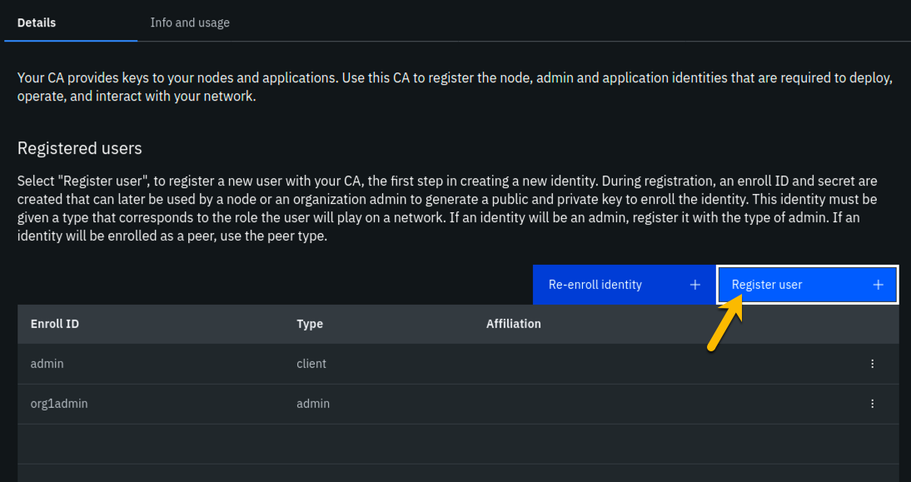
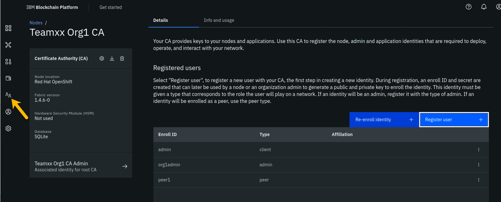
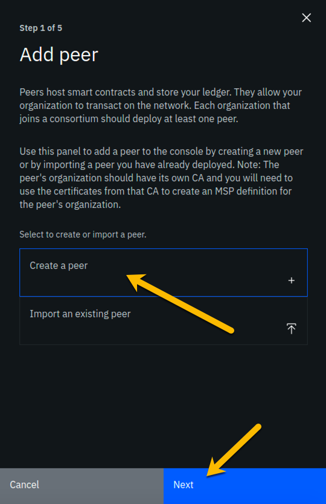
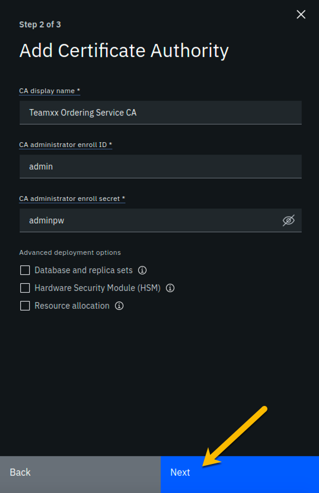
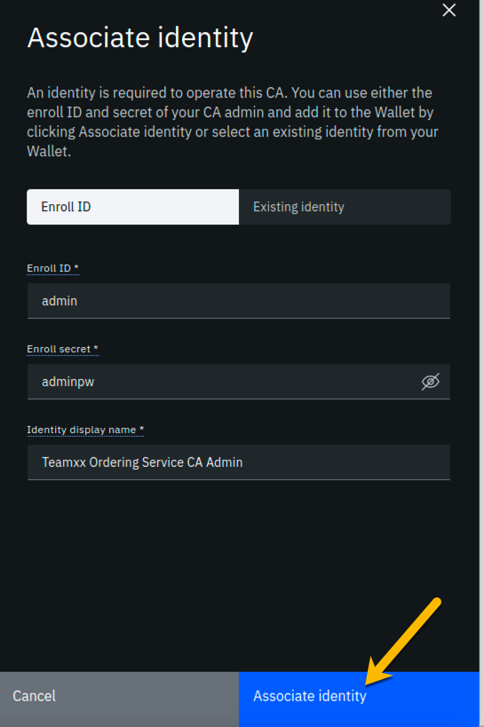
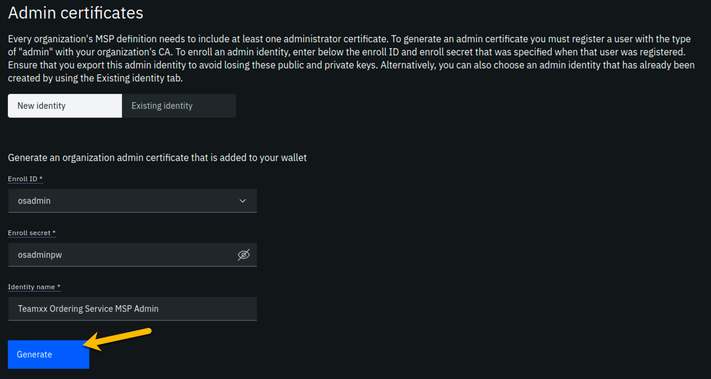
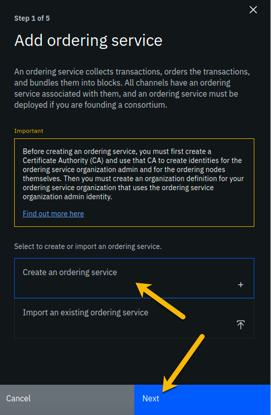
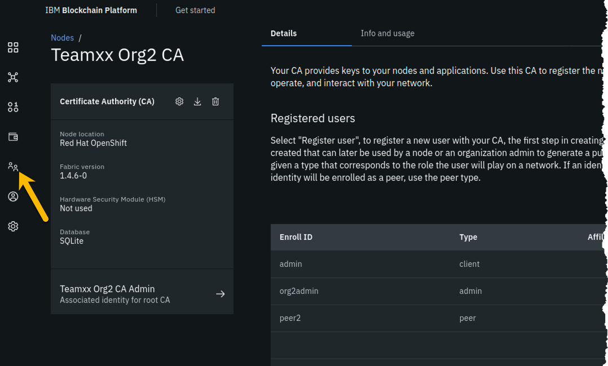
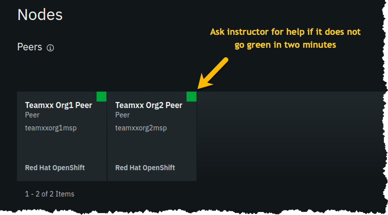
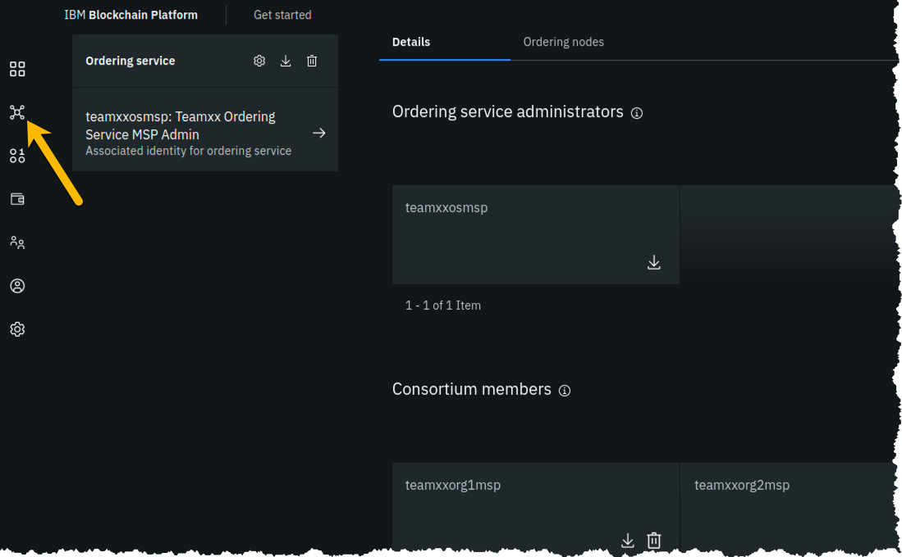

# IBM Blockchain Platform v2.1.3 Lab Part 1 - Create a Blockchain Network

## Section 1: Create a Blockchain Network lab overview

You will use the IBM Blockchain Platform console in this lab to create a blockchain network.
The network will consist of three organizations.
Two of these organizations will represent organizations that want to participate in the blockchain network and submit transactions.
They will be referred to as *peer organizations* throughout the lab.
The third organization is the organization that provides the ordering service.

First you will create one peer organization.
Then you will create an ordering service organization, create a channel and add your first peer organization to the channel.
Then you will create a second peer organization, and add it to the channel.

Each high-level task is detailed in a separate section, with multiple steps per task.

The diagram below provides a view of what your blockchain network will look like upon completion of the lab:

!!! important
        You will be assigned a two-digit team ID by your instructor, and everywhere in this lab where you see **Team*xx* ** in the instructions, you must substitute *xx* with the two-digit id you have been assigned.

The sections in this lab are as follows:

- Section 1: This overview
- Section 2: Logging in to the IBM Blockchain Platform console
- Section 3: Creating a Certificate Authority for your first peer organization, "Team*xx* Org1"
- Section 4: Adding new users using your Team*xx* Org1 Certificate Authority
- Section 5: Creating an MSP for your Team*xx* Org1 organization
- Section 6: Creating a peer node for your Team*xx* Org1 organization
- Section 7: Creating a Certificate Authority for an Ordering Service organization
- Section 8: Adding new users using your Ordering Service Certificate Authority
- Section 9: Creating an MSP for your Ordering Service organization
- Section 10: Creating an ordering service node for your Ordering Service organization
- Section 11: Adding your Team*xx* Org1 organization to a consortium
- Section 12: Creating a channel
- Section 13: Joining your Team*xx* Org1 peer to the channel
- Section 14: Creating a Certificate Authority for your second peer organization, "Team*xx* Org2"
- Section 15: Adding new users using your Team*xx* Org2 Certificate Authority
- Section 16: Creating an MSP for your Team*xx* Org2 organization
- Section 17: Creating a peer node for your Team**xx* Org2 organization
- Section 18: Adding your Team*xx* Org2 organization to the consortium
- Section 19: Adding your Team*xx* Org2 organization to the channel
- Section 20: Joining your Team*xx* Org2 peer to the channel

## Section 2: Log in to the IBM Blockchain Platform console

!!! important
        The lab environment is using self-signed SSL certificates and your browser will not trust them without explicit action on your part so part of this initial section on logging in involves establishing this trust. You will first need to go to the URL address provided by your instructor.

**Step 2.1:** Open a new tab in your Firefox browser window and enter the unique URL for your IBM Blockchain Platform console. This URL will be provided to you by your instructor. 

!!! note
        Your URL will similar to *https://workshop-00-ibpconsole-console.apps.atsocpd3.dmz:443*, but this is just an example, so make sure you use the actual URL given to you by your instructor!

If you see a security warning after entering the URL, click the **Advanced** button, which is highlighted in the below screen snippet:

**Step 2.2:** The reason you are seeing these security messages is because of a self-signed certificate in our lab environment.
Go ahead and click on the **Accept the Risk and Continue** button that is shown below:

**Step 2.3:** Enter your team's userid and password, which will have been provided to you by the instructor, and click the *Login* button:

**Step 2.4:** You may be presented with a screen asking you to change your password.  If not, skip ahead to *Step 2.5*.  If so, enter your current password, and then a new password twice.  Click the **Change password** button, which will turn blue and be enabled once you have entered matching values in the *New password* and the *Confirm new password* fields. Your new password must be at least eight characters in length.  Upon successful password change, you will be presented with the Login screen again, as in *Step 2.3*.  Log in again with your new password.

**Step 2.5:** You may be presented with a welcome screen with some informative interactive graphics. Move your cursor around a bit to see them, and then click the **Let's get started** button in the lower right corner.

!!! note
        If you do not see this welcome screen with the graphics, you can view it at any time by clicking the **Get started** link at the top of your screen, and then clicking the **Understand** box on the left.

## Section 3: Create a Certificate Authority for your first peer organization, "Teamxx Org1"

In a Hyperledger Fabric network, each organization will typically have their own certificate authority. The certificate authority is used to issue identities- consisting of X.509 public certificates and matching private keys- for end users, client applications, administrators, and peer and ordering service nodes. In most uses cases each organization will want to have control over the identities they issue, so the typical practice is that each organization provides their own certificate authority. We will follow that practice in this lab. 

You are starting with a blank slate, and our first component to add is the certificate authority for our first peer organization.
In relation to the diagram in the overview section that showed our finished network upon successful lab completion, here is the component that will be added in this section:

 

**Step 3.1:** You will be on a screen which lets you define three types of nodes- *Peers*, *Certificate Authorities*, and *Ordering services*. Click the blue **Add Certificate Authority** button:

!!!note "Information"
        This will be transparent to you as a user of the IBM Blockchain Platform Console, but each individual node that you create during the lab will result in the creation of a *Kubernetes pod*, which is a collection of one or more *containers*, on a *worker node* in a *Red Hat OpenShift Container Platform* cluster.

**Step 3.2:** Click **Create a Certificate Authority** and then click the blue **Next** button:

**Step 3.3:** Fill in the *Step 2 of 3* screen as follows, and then click the blue **Next** button:

|Field label|Value|Comments|
|-----------|-----|--------|
|CA display name|**Team*xx* Org1 CA**|Substitute your two-digit team ID for *xx*|
|CA administrator enroll ID|**admin**||
|CA administrator enroll secret|**adminpw**||

!!! Important
        Leave the checkboxes in the *Advanced deployment options* section unchecked. You may click on the small information icon to the right of each choice if you would like to learn about each option, but you do not need to do so to successfully complete the lab.  This advice is applicable for all steps throughout this lab that offer advanced deployment option choices.

**Step 3.4:** Review your settings on the *Step 3 of 3* screen and click the **Add Certificate Authority** button:

!!! note 
       Throughout this lab, when passwords are entered, you can click the icon that looks like an eye to see the password you have 
       entered.  It is recommended that you do this for the lab to ensure you have entered the intended password. The screenshots shown
       in this lab will show the passwords that you should enter.

**Step 3.5:** You will see a tile for your new certificate authority. Observe the box in the upper right corner of the tile.
If it is gray, and you hover your cursor over it, you may see a message indicating that the status is pending. 
In about a minute, the box in the upper right should turn green, indicating that the certificate authority is running.

!!! note
       If the box in the upper right corner of the tile does not turn green in a minute or two, try reloading the page in your browser. Contact an instructor for help if it does
       not turn green and show the running status when you hover your cursor over this box.

**Once your certificate authority is running, click on its tile** so that you can proceed to the next section where you will add users.

## Section 4: Add new users using your Team*xx* Org1 Certificate Authority

**Step 4.1:** You must first associate an administrative identity with your certificate authority, so click the **Associate identity** button as shown in this screen snippet:

**Step 4.2:** Ensure that the **Enroll ID** Button is selected in the *Associate Identity* sidebar panel, fill out the panel as directed in the below table, and then click the blue **Associate Identity** button:

|Field label|Value|Comments|
|-----------|-----|--------|
|Enroll ID|**admin**||
|Enroll secret|**adminpw**|click the "eye" icon to see the password|
|Identity display name|**Team*xx* Org1 CA Admin**|substitute your two-digit team ID for *xx*|

**Step 4.3:** You should now see the *admin* userid in the list of registered users. This userid is intended to be used by a person acting as the *registrar* of this Certificate Authority.  Next you will create a userid for use by a person who will be the blockchain network administrator for the organization. Click the **Register user** button on the right side of the screen:

**Step 4.4:** In the *Step 1 of 2* panel, fill it out as guided by the following table, and then click the blue **Next** button:

|Field label|Value|Comments|
|-----------|-----|--------|
|Enroll ID|**org1admin**||
|Enroll secret|**org1adminpw**|click the "eye" icon to see the password|
|Type|**admin**|Choose from dropdown list|

**Step 4.5:** We will not be using custom attributes in this lab, so all you have to do on this screen is click the **Register user** button:

**Step 4.6:** You should now see the userid you just registered, **org1admin**, listed on the screen. You also need to create a userid that your peer node will operate as, so click the **Register user** button again:

**Step 4.7:** In the *Step 1 of 2* panel, fill it out as guided by the following table, and then click the blue **Next** button:

!!! important
       It is **critical** that you change the value of the *Type* field from *client* to *peer* for this userid!

|Field label|Value|Comments|
|-----------|-----|--------|
|Enroll ID|**peer1**||
|Enroll secret|**peer1pw**|click the "eye" icon to see the password|
|Type|**peer**|Choose from dropdown list|

**Step 4.8:** Just click the **Register user** button at the bottom of the screen:

**Step 4.9:** You should now see the **peer1** userid listed along with the others on this screen.
Click the **Organizations** icon on the palette on the left of your screen and continue to the next section of the lab:

## Section 5: Create an MSP for your organization

The *Membership Service Provider* (MSP) component is integral to the private and permissioned Hyperledger Fabric as it provides the authentication- "who are you?"- and authorization - "ok, we believe you are whom you say you are, but are you permitted to do what you are asking to do?"- services.  The infrastructure that the MSP needs to do its job must be in place before you create your peer node. This step will create this for your "Team*xx* Org1" organization.

As we add components throughout the lab, the diagram that maps to our final goal will be shown, with the new component to be added in any given section annotated with a bright red star, as in the below diagram which shows that we will be adding your **Team*xx* Org1**'s MSP:

 
**Step 5.1:** You should see a screen that looks like below, indicating that you have yet to create a *Membership Service Provider (MSP)* definition for your organization. Click the **Create MSP definition** button:

**Step 5.2:** Enter the following values as instructed here on the *MSP definition details* screen and click the **Next** button:

|Field label|Value|Comments|
|-----------|-----|--------|
|MSP display name|**Team*xx* Org1 MSP**|substitute your two-digit team ID for *xx*|
|MSP ID|**teamxxorg1msp**|substitute your two-digit team ID for *xx*|
 

**Step 5.3:**  On the *Root Certificate Authority details* screen, select **Team*xx* Org1 CA** from the dropdown list.
Once you have selected the root certificate authority, you will see that the *Root certificates* and *TLS root certificates* fields appear and are populated with apparent nonsense that is actually base64-encoded X.509 certificates. 

Click the **Next** button:

**Step 5.4:**  On the *Admin certificates* screen, 
fill out the three fields beneath this in accordance with the below table, and then click the **Generate** button, which should become active once you enter values for the three fields:

|Field label|Value|Comments|
|-----------|-----|--------|
|Enroll ID|**org1admin**|Select from dropdown list. It will not be the default presented to you, so make sure you select it.|
|Enroll secret|**org1adminpw**||
|Identity name|**Team*xx* Org1 MSP Admin**|substitute your team ID for *xx*|

**Step 5.5:** The prior step generated a public certificate and a matching private key. This private key is stored by the IBM Blockchain Platform console in your local browser storage and nowhere else. In order to ensure that you can retrieve your private key later, you must now click the **Export** button which will prompt you to save your private key (along with the public certificate) in a JSON file on your hard drive.

**Step 5.6:** Select the **Save File** radio button in the dialog window that appears, and click the **OK** button:

**Step 5.7:** Save the exported JSON file in a location that you can remember. The sample screenshot below shows it being saved to a folder named *Downloads*.

!!!note
       You probably won't need this saved file for this lab if you use the same browser window for the duration of the lab, but the saved file may be necessary if, for whatever reason, you do have to use a new browser window or session, so go ahead and save it!

**Step 5.8:** Now that you have saved the exported certificate, click the blue **Next** button to proceed:

**Step 5.9:** On the *Review MSP information* screen, ensure that the values you entered match what is shown in the following table, taking into account that *xx* should be your two-digit team ID:

|Left column (labels)|Right column (values your provided)|
|----------|-----|
|MSP display name|**Team*xx* Org1 MSP**|Select from dropdown list. It will not be the default presented to you, so make sure you select it.|
|MSP ID|**teamxxorg1msp**|
|Admin certificate|**Team*xx* Org1 MSP Admin**|substitute your team ID for *xx*|
|Selected CA|**Team*xx* Org1 CA**|substitute your team ID for *xx*|

!!!note
       If you entered some values incorrectly, click the *Back* button as necessary to navigate back through the screen flow until you get to the screen(s) necessary to correct your mistakes, and then navigate forward again with the *Next* button until you return to this *Review MSP information* screen and verify you have entered the expected values. Ask an instructor for help if necessary.

When you have ensured that you have entered the right values, click the blue **Create MSP definition** button in the lower right of your screen:

**Step 5.10:** You should now see the definition for your new MSP listed on your screen. Click the **Nodes** icon in the icon palette on your left- it is the topmost icon on this palette, and you will be ready to proceed to the next section:

## Section 6: Create a peer node for your Teamxx Org1 organization

A peer node is where smart contracts- in essence, your blockchain business transactions- run.  Peer nodes also store the ledgers. We will create a peer for your **Team*xx* Org1** in this section and our fledgling network will then look like this: 

 
**Step 6.1:** Click the **Add peer** button:

**Step 6.2:** Click the **Create a peer** button and then click the blue **Next** button:

**Step 6.3:** Type **Team*xx* Org1 Peer**, where *xx* is your two-digit team ID, in the *Peer display name* field and then click the blue **Next** button:

**Step 6.4:** Enter or select the following values on the *Step 3 of 5* panel as directed by the following table, and then click the blue **Next** button:

|Field label|Value|Comments|
|-----------|-----|--------|
|Certificate Authority|**Team*xx* Org1 CA**|Select from dropdown list if this choice is not already presented to you, where *xx* is your two-digit team ID|
|Peer enroll ID|**peer1**|Select from dropdown list|
|Peer enroll secret|**peer1pw**||
|Organization MSP|**Team*xx* Org1 MSP**|Select from dropdown list, where *xx* is your two-digit team ID|

**Step 6.5:** On the *Associate Identity* screen, select **Team*xx* Org1 MSP Admin**, where *xx* is your two-digit team ID, for the *Peer administrator identity* field, and click **Next**:

**Step 6.6:** The *Summary* panel provides a review of the values you entered or selected in the prior panels. You may need to scroll down to see all of the values. The values you entered should match up with the table below. If not, use the **Back** button as necessary to correct your entries.  The table below shows the expected value (where *xx* is your two-digit team ID) and which of the seven panels in the *Add Peer* flow was used to set this value:

|Field label|Expected Value|Comments|
|-----------|--------------|--------|
|Peer display name|**Team*xx* Org1 Peer**|Set in *Step 2 of 5* panel|
|State database|**CouchDB**|Not set by you- default value|
|Certificate Authority|**Team*xx* Org1 CA**|Set in *Step 3 of 5* panel|
|Peer enroll ID|**peer1**|Set in *Step 3 of 5* panel|
|Peer enroll secret|**peer1pw**|Set in *Step 3 of 5* panel|
|Organization MSP|**Team*xx* Org1 MSP**|Set in *Step 3 of 5* panel|
|CPU (VPC) usage total|**1.6**|Not set by you- calculated from defaults|
|Memory usage total|**2,800M**|Not set by you- calculated from defaults|
|Storage usage total|**200Gi**|Not set by you- calculated from defaults|
|Associated identity|**Team*xx* Org1 MSP Admin**|Set in *Step 4 of 5* panel|

!!! Note
       If you have to use the **Back** button to make any corrections, you can return to the summary on *Step 5 of 5* by clicking **Next** the necessary number of times.

When you have ensured that you have entered the right values, click the blue **Add peer** button in the lower right of your screen:

**Step 6.7:** Similarly to when you created the certificate authority earlier, you should see your new peer listed, along with a gray box in the upper right of its tile, showing that the status of this peer is "pending" if you hover your cursor over the gray box.
It can take a minute or two on our lab system for the peer to come up completely, and you may need to refresh your browser in order to see the box turn green. If your peer is still not ready after a couple of minutes and after you have tried refreshing your browser, ask an instructor for help.  The peer must be ready, as indicated by a green box in the upper right of the peer's tile, similar to what is shown below, before you can continue:

## Section 7: Create a Certificate Authority for an Ordering Service organization

In this lab you will create three organizations- two organizations will run peer nodes and run smart contracts. One of the organizations will provide the ordering service for the blockchain network.  In the real world each of the three organizations would likely use their own instance of the IBM Blockchain Platform console to create their necessary artifacts.  (You have already done much of this for the first peer organization, **Team*xx* Org1**, in the previous sections of this lab).

!!! note
       You will carry out activities for all three organizations from your browser for purposes of this lab. This will somewhat simplify the steps you'll need to perform versus the real-world scenario where this activity is being carried out separately by each organization. The procedure to perform the tasks in the "real world" case are outlined in the IBM Blockchain Platform documentation- basically, it involves exporting information about your organization into JSON files, and providing this information "out-of-band" to the other organizations. 

       In an earlier step you exported your generated certificate and its private key. While it is a JSON file, this is not a file you would ever send to another organization, as it contains your private key which should never be shared with other organizations. The exported JSON files that are used for inter-organizational tasks contain only public information which is safe to share.

Our network will look like this at the completion of this section:

**Step 7.1:** Click the **Add Certificate Authority** button:

**Step 7.2:** Click **Create a Certificate Authority** and then click the blue **Next** button:

!!! note
       The steps in this section are essentially the same as in *Section 3*, just with different values being entered as appropriate.

**Step 7.3:** Fill in the *Step 2 of 3* screen as follows, and then click the blue **Next** button:

|Field label|Value|Comments|
|-----------|-----|--------|
|CA display name|**Team*xx* Ordering Service CA**|Substitute your two-digit team ID for *xx*|
|CA administrator enroll ID|**admin**||
|CA administrator enroll secret|**adminpw**||

**Step 7.4:** Review your settings and click the **Add Certificate Authority** button:

**Step 7.5:** You will see a tile for your new certificate authority. Observe the box in the upper right corner of the tile.
If it is gray, and you hover your cursor over it, you may see a message indicating that the status is pending. 
In about a minute, the box in the upper right should turn green, indicating that the certificate authority is running.

!!! note
       If the box in the upper right corner of the tile does not turn green in a minute or two, try reloading the page in your browser. Contact an instructor for help if it does
       not turn green and show the running status when you hover your cursor over this box.

**Once your Ordering Service certificate authority is running, click on its tile** so that you can proceed to the next section where you will add users.

## Section 8: Add new users using your Ordering Service Certificate Authority

**Step 8.1:** You must first associate an administrative identity with your certificate authority, so click the **Associate identity** button as shown in this screen snippet:

**Step 8.2:** Ensure that the **Enroll ID** Button is selected in the *Associate Identity* sidebar panel, fill out the panel as directed in the below table, and then click the blue **Associate Identity** button:

|Field label|Value|Comments|
|-----------|-----|--------|
|Enroll ID|**admin**||
|Enroll secret|**adminpw**|click the "eye" icon to see the password|
|Identity display name|**Team*xx* Ordering Service CA Admin**|substitute your two-digit team ID for *xx*|

**Step 8.3:** You should now see the *admin* userid in the list of registered users. This userid is intended to be used by a person acting as the *registrar* of this Certificate Authority.  Next you will create a userid for use by a person who will be the blockchain network administrator for the organization. Click the **Register user** button on the right side of the screen:

**Step 8.4:** In the *Step 1 of 2* panel, fill it out as guided by the following table, and then click the blue **Next** button:

|Field label|Value|Comments|
|-----------|-----|--------|
|Enroll ID|**osadmin**||
|Enroll secret|**osadminpw**|click the "eye" icon to see the password|
|Type|**admin**|Choose from dropdown list|

**Step 8.5:** We will not be using custom attributes in this lab, so all you have to do on this screen is click the **Register user** button:

**Step 8.6:** You should now see the userid you just registered, **osadmin**, listed on the screen. You also need to create a userid that your ordering service node will operate as, so click the **Register user** button again:

**Step 8.7:** In the *Step 1 of 2* panel, fill it out as guided by the following table, and then click the blue **Next** button:

!!! important
       It is **critical** that you change the value of the *Type* field from *client* to *orderer* for this userid!

|Field label|Value|Comments|
|-----------|-----|--------|
|Enroll ID|**os1**||
|Enroll secret|**os1pw**|click the "eye" icon to see the password|
|Type|**orderer**|Choose from dropdown list|

**Step 8.8:** Just click the **Register user** button at the bottom of the screen:

**Step 8.9:** You should now see the **os1** userid listed along with the others on this screen.
Click the **Organizations** icon on the palette on the left of your screen and continue to the next section of the lab:

## Section 9: Create an MSP for your Ordering Service organization

Our trusty lodestar shows us what will be added to our nascent network now:

**Step 9.1:** You should see a screen that looks like below. You now need to create an MSP definition for your Ordering Service organization, just as you did earlier for your peer (**Team*xx* Org1 MSP**) organization. Click the **Create MSP definition** button to get started:

**Step 9.2:** Enter the following values as instructed here on the *MSP definition details* screen and click the **Next** button:

|Field label|Value|Comments|
|-----------|-----|--------|
|MSP display name|**Team*xx* Ordering Service MSP**|substitute your two-digit team ID for *xx*|
|MSP ID|**teamxxosmsp**|substitute your two-digit team ID for *xx*|
 
The sidebar panel contains more information than will likely fit in your browser window, so review the values you have entered per the above list, and then scroll down within the sidebar panel:

**Step 9.3:**  On the *Root Certificate Authority details* screen, select **Team*xx* Ordering Service CA** from the dropdown list.
Once you have selected the root certificate authority, you will see that the *Root certificates* and *TLS root certificates* fields appear and are populated with apparent nonsense that is actually base64-encoded X.509 certificates. 

Click the **Next** button:

**Step 9.4:**  On the *Admin certificates* screen, 
fill out the three fields beneath this in accordance with the below table, and then click the **Generate** button, which should become active once you enter values for the three fields:

|Field label|Value|Comments|
|-----------|-----|--------|
|Enroll ID|**osadmin**|Select from dropdown list. It will not be the default presented to you, so make sure you select it.|
|Enroll secret|**osadminpw**||
|Identity name|**Team*xx* Ordering Service  MSP Admin**|substitute your team ID for *xx*|

**Step 9.5:** The prior step generated a public certificate and a matching private key. This private key is stored by the IBM Blockchain Platform console in your local browser storage and nowhere else. In order to ensure that you can retrieve your private key later, you must now click the **Export** button which will prompt you to save your private key (along with the public certificate) in a JSON file on your hard drive.

**Step 9.6:** Select the **Save File** radio button in the dialog window that appears, and click the **OK** button:

**Step 9.7:** Save the exported JSON file in a location that you can remember. The sample screenshot below shows it being saved to a folder named *Downloads*.

!!!note
       You probably won't need this saved file for this lab if you use the same browser window for the duration of the lab, but the saved file may be necessary if, for whatever reason, you do have to use a new browser window or session, so go ahead and save it!

**Step 9.8:** Now that you have saved the exported certificate, click the blue **Next** button to proceed:

**Step 9.9:** On the *Review MSP information* screen, ensure that the values you entered match what is shown in the following table, taking into account that *xx* should be your two-digit team ID:

|Left column (labels)|Right column (values your provided)|
|----------|-----|
|MSP display name|**Team*xx* Ordering Service  MSP**|Select from dropdown list. It will not be the default presented to you, so make sure you select it.|
|MSP ID|**teamxxosmsp**|
|Admin certificate|**Team*xx* Ordering Service MSP Admin**|substitute your team ID for *xx*|
|Selected CA|**Team*xx* Ordering Service CA**|substitute your team ID for *xx*|

!!!note
       If you entered some values incorrectly, click the *Back* button as necessary to navigate back through the screen flow until you get to the screen(s) necessary to correct your mistakes, and then navigate forward again with the *Next* button until you return to this *Review MSP information* screen and verify you have entered the expected values. Ask an instructor for help if necessary.

When you have ensured that you have entered the right values, click the blue **Create MSP definition** button in the lower right of your screen:

**Step 9.10:** You should now see the definition for your new MSP listed on your screen. Click the **Nodes** icon in the icon palette on your left- it is the topmost icon on this palette, and you will be ready to proceed to the next section:

## Section 10: Create an ordering service node for your Ordering Service organization

Having created the MSP, you may now create the ordering service node. Ordering service nodes receive proposed transactions from peer nodes, package them into blocks, and then deliver these blocks to peer nodes to commit to the ledger. Ordering service nodes are pretty important, in other words.

Our star is running out of leg room all cramped up by the circle in our drawing but hopefully you can see what she is trying to highlight in this iteration of our journey:

**Step 10.1:** Click the **Add ordering service** button:

**Step 10.2:** Click the **Create an Ordering service** button and then click the blue **Next** button:

**Step 10.3:** Type **Team*xx* Ordering Service**, where *xx* is your two-digit team ID, in the *Ordering service display name* field, leave the *Number of ordering nodes* field set to **One ordering node**, and then click the blue **Next** button:

**Step 10.4:** Enter or select the following values on the *Step 3 of 5* panel using the following table as a guide, and then click the blue **Next** button:

|Field label|Value|Comments|
|-----------|-----|--------|
|Certificate Authority|**Team*xx* Ordering Service CA**|Select from dropdown list if this choice is not already presented to you, where *xx* is your two-digit team ID|
|Ordering service enroll ID|**os1**|Select from dropdown list. It will not be the default presented to you, so make sure you select it.|
|Ordering service enroll secret|**os1pw**||
|Organization MSP|**Team*xx* Ordering Service MSP**|Select from dropdown list, where *xx* is your two-digit team ID|

**Step 10.5:** On the *Associate Identity* screen, select **Team*xx* Ordering Service MSP Admin**, where *xx* is your two-digit team ID, for the *Orderer administrator identity* field, and click **Next**:

**Step 10.6:** The *Summary* panel provides a review of the values you entered or selected in the prior panels. You may need to scroll down to see all of the values. The values you entered should match up with the table below. If not, use the **Back** button as necessary to correct your entries.  The table below shows the expected value (where *xx* is your two-digit team ID) and which of the seven panels in the *Add ordering service* flow was used to set this value:

|Field label|Expected Value|Comments|
|-----------|--------------|--------|
|Ordering service display name|**Team*xx* Ordering Service**|Set in *Step 2 of 5* panel|
|Number of ordering nodes|1|Default value from *Step 2 of 5* panel|
|Certificate Authority|**Team*xx* Ordering Service CA**|Set in *Step 3 of 5* panel|
|Ordering service enroll ID|**os1**|Set in *Step 3 of 5* panel|
|Ordering service enroll secret|**os1pw**|Set in *Step 3 of 5* panel|
|Organization MSP|**Team*xx* Ordering Service MSP**|Set in *Step 3 of 5* panel|
|CPU (VPC) usage total|**0.35**|Not set by you- calculated from defaults|
|Memory usage total|**700 M**|Not set by you- calculated from defaults|
|Storage usage total|**100 Gi**|Not set by you- default value|
|Associated identity|**Team*xx* Ordering Service MSP Admin**|Set in *Step 4 of 5* panel|

!!! Note
        If you have to use the **Back** button to make any corrections, you can return to the summary on *Step 5 of 5* by clicking **Next** the necessary number of times. 

When you have ensured that you have entered the right values, click the blue **Add ordering service** button in the lower right of your screen:

**Step 10.7:** You should see your new ordering service listed, along with a gray box in the upper right of its tile, showing that the status of this ordering service is "pending" if you hover your cursor over the gray box.
It can take a minute or two on our lab system for the ordering service to come up completely, and you may need to refresh your browser in order to see the box turn green. If your ordering service is still not ready after a couple of minutes and after you have tried refreshing your browser, ask an instructor for help.  The ordering service must be ready, as indicated by a green box in the upper right of its tile, similar to what is shown below, before you can continue.

!!! note "Caution"
       This step pertains to the tile listed in the *Ordering services* section, not to the similarly named tile in the *Certificate Authorities* section

**Once it is ready, click on its tile and continue to the next section of the lab.**

## Section 11: Add your Teamxx Org1 organization to a consortium

**Step 11.1:** Click the **Add organization** button in the *Consortium members* section:

**Step 11.2:** Click the **Existing MSP ID** button, select **Team*xx* Org1 MSP (teamxxorg1msp)** where *xx* is your two-digit team ID, and then click the **Add organization** button:

!!! important
       Ensure that you select **Team*xx* Org1 MSP (teamxxorg1msp)** from the dropdown list. This will probably not be the default choice provided to you.

**Step 11.3:** You should now see your peer organization, **team*xx*org1msp**, listed as a member of your consortium:

## Section 12: Create a channel

You won't get very far without an ordering service node, because they are the animals that create blocks. You won't get very far without a peer, as peers run smart contracts, which create transactions that are sent to an ordering service node. 
 
Well, you won't get much stuff done without a channel either, because a transaction proposal is sent from a peer to an ordering service node over a channel. 

You will define a channel in this section and in its definition you will make your **Team*xx* Org1** peer organization a member of the channel. The actual definition of the channel is verified at the ordering service node and it keeps track of all channels.  (You can define multiple channels in a Hyperledger Fabric network but for simplicity this lab will only have you define one).

The line between the ordering service node and your first peer organization node represents that our ordering service knows about our new channel and that our peer organization is a member of the new channel:

**Step 12.1:** Click the **Channels** icon in the icon palette on the left. The screenshot below shows which icon to click:

**Step 12.2:** Click the **Create channel** button:

**Step 12.3:** You may read the information on the *Prerequisites* panel, but you will not have to do anything- the prior sections of the lab have met the prerequisites!  Click on the blue **Next** button to continue:

**Step 12.4:** On the *Channel details* panel, enter **team*xx*-channel1** in the *Channel name* field, and select **Team*xx* Ordering Service** for the *Ordering service* field, where *xx* is your two-digit team ID, then click the **Next** button to continue: 

**Step 12.5:** On the *Organizations* panel, select **Team*xx* Org1 MSP (team*xx*org1msp)** for the *Channel member* field and click the **Add** button to the right of your selection:

**Step 12.6:** You should now see **team*xx*org1msp** listed in the *Organizations* section. Select the checkbox to the left of the word *Operator* in order to give your organization operator privileges on the channel. The **Next** button should become enabled once you do this, so click on it to continue:

**Step 12.7:** On the *Update policy* panel, ensure that *1 out of 1* is selected in the *Policy* field and then click the **Next** button:

**Step 12.8:** On the *Organization creating channel* panel, select **Team*xx* Org1 MSP (team*xx*org1msp)** from the dropdown list for the *Channel creator MSP* field, and select **Team*xx* Org1 MSP Admin** from the dropdown list for the *Identity* field, and then click the **Next** button:

**Step 12.9:** On the *Review channel information* screen, ensure that the values you entered match what is shown in the following table, taking into account that *xx* should be your two-digit team ID:

|Left column (labels)|Right column (values your provided)|
|----------|-----|
|Channel name|**team*xx*-channel1**|
|Ordering service|**Team*xx* Ordering Service_1**|
|Organizations|**team*xx*org1msp|
|Policy|**1 out of 1**|
|Organization creating channel|**Team*xx* Org1 MSP**|
|Identity for organization creating channel|**Team*xx* Org1 MSP Admin**|

!!!note
       If you entered some values incorrectly, click the *Back* button as necessary to navigate back through the screen flow until you get to the screen(s) necessary to correct your mistakes, and then navigate forward again with the *Next* button until you return to this *Review MSP information* screen and verify you have entered the expected values. Ask an instructor for help if necessary.

When you have ensured that you have entered the right values, click the blue **Create MSP definition** button in the lower right of your screen:

**Step 12.10:** You should now see your channel listed. Click where it says **Pending- add peer** and continue to the next section:

##Section 13: Join your Teamxx Org1 peer to the channel

In the previous section you defined a channel, **team*xx*channel1**, and made your **Team*xx* Org1** organization a member of the channel. However, in order for a particular peer within that organization to participate in the channel, that peer has to join the channel. Our simple lab network only has one peer in the organization, but in most production implementations an organization will have multiple peers. When the peer joins a channel, it will receive all of the blocks in the channel that were created prior to the time the peer joined the channel, until it catches up.

Our evolving network diagram only gets a subtle change from this section-  the line from the ordering service node to the circle representing our organization, indicating that our organization is a member of the channel, has been extended with a line segment from the circle to our peer, indicating that our peer has now joined the channel:

**Step 13.1:** For the *Choose from available peers* field, select **Team*xx* Org1 Peer**, where *xx* is your two-digit team ID, and click the **Join channel** button in the lower right:

!!! note
        The *Join channel* button will not be enabled until you click on the peer name.

**Step 13.2:** You should now see that instead of the **Pending- add peer** message at the bottom of the tile for your channel, it now says **2 Blocks**. This indicates that the channel has been successfully created and you have joined a peer to it.

!!! Information
        The first block created in a channel is called the *genesis block*, and it contains configuration data for the channel. The second block in this channel is for a configuration transaction that defined **Team*xx* Org1 Peer** as an *anchor peer* for the **Team*xx* Org1** organization. An anchor peer is a peer whose external endpoint address is published in the channel configuration. This way other organizations can reach this peer. An organization must provide at least one anchor peer for service discovery or private data collections to work.

## Section 14: Create a Certificate Authority for your second peer organization, "Teamxx Org2"

You have now already defined two organizations- **Team*xx* Org1** and **Team*xx* Ordering Service**. The *Ordering Service* organization provides the ordering service and does not itself initiate blockchain transactions. Most, if not all, realistic blockchain networks will involve multiple organizations initiating blockchain transactions. So you will now define a second peer organization to participate in the network. Your network will thus have three organizations- two peer organizations that are collaborating in the blockchain network, and the ordering service organization which is, essentially, a service provider.

You are changing hats again, this time from your **Team*xx* Ordering Service** administrator hat to your **Team*xx* Org2** administrator hat. Our network diagram is coming along quite nicely:

We will define the second peer organization now.  The pattern is identical to what you did earlier for the first organization.

!!! Note
        This will be the third Certificate Authority you define in this lab, so we will show fewer screenshots of repetitive tasks, in this section and in subsequent sections.

**Step 14.1:** Click the **Nodes** icon on the icon palette on the left, and then click the blue **Add Certificate Authority** button.

**Step 14.2:** On the *Step 1 of 3* sidebar panel, click **Create a Certificate Authority** and then click the blue **Next** button.

**Step 14.3:** Fill in the *Step 2 of 3* sidebar panel as follows, and then click the blue **Next** button:

|Field label|Value|Comments|
|-----------|-----|--------|
|CA display name|**Team*xx* Org2 CA**|Substitute your two-digit team ID for *xx*|
|CA administrator enroll ID|**admin**||
|CA administrator enroll secret|**adminpw**||

**Step 14.4:** Review your settings on the *Step 3 of 3* sidebar panel and click the **Add Certificate Authority** button:

**Step 14.5:** You will see a tile for your new certificate authority. Observe the box in the upper right corner of the tile.
If it is gray, and you hover your cursor over it, you may see a message indicating that the status is pending. 
In about a minute, the box in the upper right should turn green, indicating that the certificate authority is running.

!!! note
       If the box in the upper right corner of the tile does not turn green in a minute or two, try reloading the page in your browser. Contact an instructor for help if it does
       not turn green and show the running status when you hover your cursor over this box.

**Once your certificate authority is running, click on its tile** so that you can proceed to the next section where you will add users.

## Section 15: Add new users using your Teamxx Org2 Certificate Authority

**Step 15.1:** You must first associate an administrative identity with your certificate authority, so click the **Associate identity** button as shown in this screen snippet:

**Step 15.2:** Ensure that the **Enroll ID** Button is selected in the *Associate Identity* sidebar panel, fill out the panel as directed in the below table, and then click the blue **Associate Identity** button:

|Field label|Value|Comments|
|-----------|-----|--------|
|Enroll ID|**admin**||
|Enroll secret|**adminpw**|click the "eye" icon to see the password|
|Identity display name|**Team*xx* Org2 CA Admin**|substitute your two-digit team ID for *xx*|

**Step 15.3:** You should now see the *admin* userid in the list of registered users. This userid is intended to be used by a person acting as the *registrar* of this Certificate Authority.  Next you will create a userid for use by a person who will be the blockchain network administrator for the organization. Click the **Register user** button on the right side of the screen:

**Step 15.4:** In the *Step 1 of 2* panel, fill it out as guided by the following table, and then click the blue **Next** button:

|Field label|Value|Comments|
|-----------|-----|--------|
|Enroll ID|**org2admin**||
|Enroll secret|**org2adminpw**|click the "eye" icon to see the password|
|Type|**admin**|Choose from dropdown list|

**Step 15.5:** We will not be using custom attributes in this lab, so all you have to do on this screen is click the **Register user** button.

**Step 15.6:** You should now see the userid you just registered, **org2admin**, listed on the screen. You also need to create a userid that your peer node will operate as, so click the **Register user** button again.

**Step 15.7:** In the *Step 1 of 2* panel, fill it out as guided by the following table, and then click the blue **Next** button:

!!! important
       It is **critical** that you change the value of the *Type* field from *client* to *peer* for this userid!

|Field label|Value|Comments|
|-----------|-----|--------|
|Enroll ID|**peer2**||
|Enroll secret|**peer2pw**|click the "eye" icon to see the password|
|Type|**peer**|Choose from dropdown list|

**Step 15.8:** Just click the **Register user** button at the bottom of the screen.

**Step 15.9:** You should now see the **peer2** userid listed along with the others on this screen.
Click the **Organizations** icon on the palette on the left of your screen and continue to the next section of the lab:

## Section 16: Create an MSP for your second peer organization

Defining the MSP for **Team*xx* Org2** will bring our network one step closer to fruition:

**Step 16.1:** You should see the MSP definitions for your other two organizations. Click the blue **Create MSP definition** button.

**Step 16.2:** Enter the following values as instructed here on the *MSP definition details* screen and click the **Next** button:

|Field label|Value|Comments|
|-----------|-----|--------|
|MSP display name|**Team*xx* Org2 MSP**|substitute your two-digit team ID for *xx*|
|MSP ID|**teamxxorg2msp**|substitute your two-digit team ID for *xx*|
 
**Step 16.3:**  On the *Root Certificate Authority details* screen, select **Team*xx* Org2 CA** from the dropdown list.
Once you have selected the root certificate authority, you will see that the *Root certificates* and *TLS root certificates* fields appear and are populated with apparent nonsense that is actually base64-encoded X.509 certificates. 

!!! important
       Ensure that you selected your certificate authority for your *Org2*, and not *Org1*, in the *Root Certificate Authority* field. It's easy to mistakenly choose *Org1*'s certificate authority here, and this often turns ecstasy to melancholy.

Click the **Next** button.

**Step 16.4:**  On the *Admin certificates* screen, 
fill out the three fields beneath this in accordance with the below table, and then click the **Generate** button, which should become active once you enter values for the three fields:

|Field label|Value|Comments|
|-----------|-----|--------|
|Enroll ID|**org2admin**|Select from dropdown list. It will not be the default presented to you, so make sure you select it.|
|Enroll secret|**org2adminpw**||
|Identity name|**Team*xx* Org2 MSP Admin**|substitute your team ID for *xx*|

**Step 16.5:** The prior step generated a public certificate and a matching private key. This private key is stored by the IBM Blockchain Platform console in your local browser storage and nowhere else. In order to ensure that you can retrieve your private key later, you must now click the **Export** button which will prompt you to save your private key (along with the public certificate) in a JSON file on your hard drive.

**Step 16.6:** Select the **Save File** radio button in the dialog window that appears, and click the **OK** button.

**Step 16.7:** Save the exported JSON file in a location that you can remember. 

!!!note
       You probably won't need this saved file for this lab if you use the same browser window for the duration of the lab, but the saved file may be necessary if, for whatever reason, you do have to use a new browser window or session, so go ahead and save it!

**Step 16.8:** Now that you have saved the exported certificate, click the blue **Next** button to proceed:

**Step 16.9:** On the *Review MSP information* screen, ensure that the values you entered match what is shown in the following table, taking into account that *xx* should be your two-digit team ID:

|Left column (labels)|Right column (values your provided)|
|----------|-----|
|MSP display name|**Team*xx* Org2 MSP**|Select from dropdown list. It will not be the default presented to you, so make sure you select it.|
|MSP ID|**teamxxorg2msp**|
|Admin certificate|**Team*xx* Org2 MSP Admin**|substitute your team ID for *xx*|
|Selected CA|**Team*xx* Org2 CA**|substitute your team ID for *xx*|

!!!note
       If you entered some values incorrectly, click the *Back* button as necessary to navigate back through the screen flow until you get to the screen(s) necessary to correct your mistakes, and then navigate forward again with the *Next* button until you return to this *Review MSP information* screen and verify you have entered the expected values. Ask an instructor for help if necessary.

When you have ensured that you have entered the right values, click the blue **Create MSP definition** button in the lower right of your screen.

**Step 16.9:** You should now see the definition for your new MSP listed on your screen. Scroll up and **click the *Nodes* icon in the icon palette** on your left- it is the topmost icon on this palette- and you will be ready to proceed to the next section.

## Section 17: Create a peer node for your second peer organization

The most useful German phrase I know is *noch einmal Bier, bitte!*, which translates to *another beer, please!* So I am asking you kindly, *noch einmal peer, bitte!*, that is, please define a peer for your second organization:

**Step 17.1:** Click the blue **Add peer** button.

**Step 17.2:** Click the **Create a peer** button and then click the blue **Next** button.

**Step 17.3:** Type **Team*xx* Org2 Peer**, where *xx* is your two-digit team ID, in the *Peer display name* field and then click the blue **Next** button.

**Step 17.4:** Enter or select the following values on the *Step 3 of 5* panel as directed by the following table, and then click the blue **Next** button.

|Field label|Value|Comments|
|-----------|-----|--------|
|Certificate Authority|**Team*xx* Org2 CA**|Select from dropdown list if this choice is not already presented to you, where *xx* is your two-digit team ID|
|Peer enroll ID|**peer2**|Select from dropdown list|
|Peer enroll secret|**peer2pw**||
|Organization MSP|**Team*xx* Org2 MSP**|Select from dropdown list, where *xx* is your two-digit team ID|

**Step 17.5:** On the *Associate Identity* screen, select **Team*xx* Org2 MSP Admin**, where *xx* is your two-digit team ID, for the *Peer administrator identity* field, and click **Next**.

**Step 17.6:** The *Summary* panel provides a review of the values you entered or selected in the prior panels. You may need to scroll down to see all of the values. The values you entered should match up with the table below. If not, use the **Back** button as necessary to correct your entries.  The table below shows the expected value (where *xx* is your two-digit team ID) and which of the seven panels in the *Add Peer* flow was used to set this value:

|Field label|Expected Value|Comments|
|-----------|--------------|--------|
|Peer display name|**Team*xx* Org2 Peer**|Set in *Step 2 of 5* panel|
|State database|**CouchDB**|Not set by you- default value|
|Certificate Authority|**Team*xx* Org2 CA**|Set in *Step 3 of 5* panel|
|Peer enroll ID|**peer2**|Set in *Step 3 of 5* panel|
|Peer enroll secret|**peer2pw**|Set in *Step 3 of 5* panel|
|Organization MSP|**Team*xx* Org2 MSP**|Set in *Step 3 of 5* panel|
|CPU (VPC) usage total|**1.6**|Not set by you- calculated from defaults|
|Memory usage total|**2,800M**|Not set by you- calculated from defaults|
|Storage usage total|**200Gi**|Not set by you- calculated from defaults|
|Associated identity|**Team*xx* Org2 MSP Admin**|Set in *Step 4 of 5* panel|

!!! Note
       If you have to use the **Back** button to make any corrections, you can return to the summary on *Step 5 of 5* by clicking **Next** the necessary number of times.

When you have ensured that you have entered the right values, click the blue **Add peer** button in the lower right of your screen:

**Step 17.7:** You should see your new peer listed, along with a gray box in the upper right of its tile, showing that the status of this peer is "pending" if you hover your cursor over the gray box.
It can take a minute or two on our lab system for the peer to come up completely, and you may need to refresh your browser in order to see the box turn green. If your peer is still not ready after a couple of minutes and after you have tried refreshing your browser, ask an instructor for help.  The peer must be ready, as indicated by a green box in the upper right of the peer's tile, similar to what is shown below, before you can continue:

## Section 18: Add your Teamxx Org2 organization to the consortium

**Step 18.1:** Click on your **Team*xx* Orderin...** tile (the full name is most likely truncated on your screen) under the *Ordering services* section:

!!! Note
       You may need to scroll down a little to see this. Ensure you click the tile in the *Ordering services* section and not the similarly named tile in the *Certificate Authorities* section- it is easy to make that mistake because the full names are truncated.

**Step 18.2:** Click the blue **Add organization** button in the *Consortium members* section.

**Step 18.3:** Click the **Existing MSP ID** button, select **Team*xx* Org2 MSP (team*xx*org2msp)** where *xx* is your two-digit team ID, and then click the **Add organization** button.

**Step 18.4:** You should now see your second peer organization, **team*xx*org2msp**, listed as a member of your consortium.

## Section 19: Add your Teamxx Org2 organization to the channel

**Team*xx* Org2** can now become a member of channels since you added it to the consortium in the prior section. Take advantage of that good fortune and add it as a member of your channel:

When you created your **team*xx*-channel1** channel earlier in the lab, your new **Team*xx* Org2** organization did not exist yet. If it had existed at the time, you could have added it to the channel membership when you created the channel.

You will add the organization to the channel membership now.  

**Step 19.1:** Click the **Channels** icon on the icon palette on the left:

**Step 19.2:** Click the tile for your **team*xx*-channel1** channel:

**Step 19.3:** Click the **Settings** icon (the one that looks like a gear) a little underneath the channel name near the top of your screen:

**Step 19.4:** In the *Organization updating channel* panel, select **Team*xx* Org1 MSP (team*xx*org1msp)** from the dropdown list for the *Channel updater MSP* field, select **Team*xx* Org1 MSP Admin** from the dropdown list for the *Identity* field, and then click the **Next** button:

**Step 19.5:** On the *Organizations* panel, select **Team*xx* Org2 MSP (team*xx*org2msp)** from the dropdown list for the *Channel member* field, and then click the **Add** button to the right of the field:

**Step 19.6:** Your **team*xx*org2msp** organization will now be listed under the *Organizations* section.  Select the checkbox to the left of *Operator* in order to give this organization *Operator* authority on the channel.  Click the **Next** button:

**Step 19.7:** On the *Update policy* panel, select **1 out of 2** for the *Policy* field and then click the **Next** button:

**Step 19.8:** From the *Capabilities* panel, click the **Review channel information** link, as you will not be updating any of the advanced configuration settings:

**Step 19.9:** Review the top half of the information in the *Review channel information* panel. The bottom half of information, below the horizontal line, is for advanced settings that you did not change. Ensure that the information in the top half, which you did enter, corresponds to the table below, with *xx* corresponding to your two-digit team ID:

|Left column (labels)|Right column (values your provided)|
|----------|-----|
|Channel name|**team*xx*-channel1**|
|Ordering service|**Team*xx* Ordering Service_1**|
|Organizations|**team*xx*org1msp** and **team*xx*org2msp**|
|Policy|**1 out of 2**|
|Organization updating channel|**Team*xx* Org1 MSP**|
|Identity for organization updating channel|**Team*xx* Org1 MSP Admin**|

!!!note
       If you entered some values incorrectly, click the *Back* button as necessary to navigate back through the screen flow until you get to the screen(s) necessary to correct your mistakes, and then navigate forward again with the *Next* button until you return to this *Review MSP information* screen and verify you have entered the expected values. Ask an instructor for help if necessary.

When you have ensured that you have entered the right values, click the blue **Update channel** button in the lower right of your screen.

**Step 19.10:** Notice that the block height is now three. The most recent block, that has an ID of *2*- block numbering starts at zero- contains a transaction that contains the configuration update you just made, which added your *Team**xx** Org2* to the channel.

!!! note
       Hyperledger Fabric distinguishes configuration update transactions from typical application transactions. The IBM Blockchain Platform console does not show details of configuration update transactions nor include them in the count of transactions that it will display. That is, if you display a block that has a configuration update transaction, the IBM Blockchain Platform console will show *0 transactions* for that block.  (A block of application transactions can contain multiple transactions, but a configuration update transaction is the only transaction in its block. That is, a block does not contain a mix of application transactions and configuration update transactions).

Click the **Channel details** tab, which is to the right of the **Transaction overview** tab:

CONSTRUCTION

**Step 19.11:** In the *Channel members* section  of the panel, you should now see both of your peer organizations listed as members. Once you have verified this, click the **Channels** icon on the icon palette on the left:

!!! note
        Although **team*xx*org2msp** is listed in the *Channel members* section, you don't see it listed above that in the *Nodes* section. That is because you have not joined a peer from **team*xx*org2msp** to the channel yet.  You will do that next.

## Section 20: Join your Teamxx Org2 peer to the channel

You will now join *Team**xx** Org2 Peer* to the channel:

**Step 20.1:** Now that your *Org2* is a member of the channel, you can join your peer from *Org2* to the channel. Click the blue **Join channel** button:

**Step 20.2:** Ensure that **Team*xx* Ordering Service**, where *xx* is your two-digit team ID, is selected for the *Ordering service* field and click the blue **Next** button:

**Step 20.3:** Type **team*xx*-channel1**, where *xx* is your two-digit team ID, in the *Channel* field and click the **Next** button:

**Step 20.4:** In the *Choose from available peers* section, select **Team*xx* Org2 Peer**, where *xx* is your two-digit team ID, and then click the blue **Join channel** button:

**Step 20.5:** You are returned to the *Channels* screen. Click the tile for your channel, **team*xx*-channel1**:

**Step 20.6:** Click the **Channel details** tab to the right of the **Transaction overview** tab:

**Step 20.7:** Observe that your peer node for *Org2*, **Team*xx* Org2 Peer**, is listed in the *Nodes* section, indicating that this peer has joined the channel:

!!! important "Congratulations!!"
        You have made it to the end of this lab! Job well done!  But after all that work you haven't run any smart contracts on your new network yet! Don't worry, that occurs in the [next lab](ibpdeploy.md).  You will not have toiled in vain.

