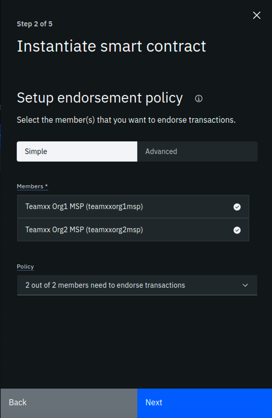
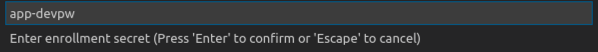

# IBM Blockchain Platform for Multicloud Part 2 - Deploying a Smart Contract

This lab will walk you through deploying the smart contract that you worked with from the VSCode labs: namely `commercial-paper`. This lab assumes that you have successfully completed the [IBM Blockchain Platform for Multicloud Part 1 - Deploying a blockchain network lab](ibpconsole.md). If you have not completed part 1, you must do so before continuing with this lab.

## Section 1: Export Commercial Paper Smart Contract

Remember from the VSCode labs, you have already packaged up the commercial paper (`papercontract@0.0.4`) smart contract. Now you will export the contract to its own smart contract package (*in .cds format*) and deploy it to your IBM Blockchain Platform network.

!!! note
        If you did not complete the VSCode labs, you can still continue with this lab. You need to download the .cds package here: [commercial-paper](files/papercontract@0.0.4.cds) and save it to your lab image under the `/home/tecadmin/` directory. Then you can skip to Section 2 of this lab.

**1.** Go back to your VSCode editor, and go to the IBM Blockchain Platform Extension view. Under the `Smart Contract Packages` panel, right-click on `papercontract@0.0.4` and select `Export Package`:


**2.** Select the location `/home/tecadmin/`, and click `Enter`. Upon successful exporting, you will see a message like below:


## Section 2: Install Paper Contract to your Blockchain Network

**1.** Go back to your IBM Blockchain Platform Console at your assigned URL:port. Go to the `Smart Contracts` panel, and select `Install Smart Contract`:


**2.** In the `Install Smart Contract` side panel, upload the `papercontract@0.0.4.cds` package (from the location `/home/tecadmin`), and click `Next`.


**3.** Now select both peers to install to and press `Install Smart Contract`. Note this is not a very realistic situation because we are installing to peers from two separate organizations. In reality, the smart contract would be shared in a private Github repo with members of the blockchain network and each organization would install the smart contract to their own peers through their console.


**4.** Now, tou should see 'papercontract' appear in the `Installed Smart Contracts` panel.


## Section 3: Instantiate Paper Contract

**1.** From the `Smart Contracts - Installed Smart Contracts` panel, select the three dots to the right of `papercontract` and select `Instantiate`:


**2.** In the `Instantiate smart contract` side panel, select `teamXX-channel1` as the channel to instantiate to:


**3.** In the next side panel, select both members to endorse transactions. And then select 1 out of 2 members need to endorse transactions.



**4.** In the next side panel, select `TeamXX Peer Org1` as the peer to approve proposals for instantiating the smart contract.


**5.** In the next side panel, skip adding a private data collection and just hit `Next`.


**6.** In the next panel, leave the function name blank (it will by default call the `init` function in the smart contract which is what we want for `papercontract`) And leave the arguments box blank. Simply select the `Instantiate smart contract` button.


**7.** First time initiation could take a while because the Node smart contract is pulling in all the package dependencies from the NPM registry. After a few minutes, instantiation should complete. If you scroll down on the `Smart Contracts` panel, you will see the list of `Instantiated Smart Contracts` now includes `papercontract`:


Now that you have the smart contract instantiated on the channel, you are ready to move on to the next step.

## Section 6: Register client user for TeamXX Org1

Now you need to register a client user to use to enroll application identities for Org1. In real life, as the blockchain network administrator for your organization, you might want to register a distinct client user for each business application that has a need to access the smart contract. In this case, the same client user is used to enroll a number of application identities. Another development pattern is to register a distinct client user for each distinct application identity. You can register a client user through the Fabric application SDK as well, though that is not covered in this lab.

**1.** Go to the Nodes view on your IBM Blockchain Platform Console, and navigate to the `Certificate Authorities` section. Then select `TeamXX Org1 CA`:


**2.** In the `TeamXX Org1 CA` view, select `Register user`:


**3.** In the `Register User` side panel, fill in the following fields for the user, then hit `Next`:


**4.** In the next panel, just press `Next`:


**5.** Now you should see the `app-admin` user you added show up under `Registered users`:


## Section 7: Register client user for TeamXX Org2 (Optional)

Now we will register a client user for enrolling application identities for Org2. This section is optional. In the sections that follow, you will only connect to Org1's peer and invoke transactions against that endpoint. You will only need to register client user for Org2 if you wish to connect to Org2's peer.

**1.** Go to the Nodes view on your IBM Blockchain Platform Console, and navigate to the Certificate Authorities section. Then select `TeamXX Org2 CA`:


**2.** Follow the same steps from Section 6, 2-5, in order to register a client user for Org2.

## Section 8: Download the connection profile to connect to TeamXX Org1 Peer

The connection profile is a .JSON file that describes all the connection endpoints, MSP information, channel information and certification information required to connect to your organization's peer. A client application wishing to invoke transactions against a smart contract would require this file to obtain the necessary information needed to make that connection. Without IBM Blockchain Platform, this is a file you would put together yourself using existing sample connection profiles available in the Hyperledger Fabric community. With the IBM Blockchain Platform, you can download a ready-made file from the IBM Blockchain Platform Console.

**1.** Go to the `Smart Contracts` view from the Console menu on the left. Scroll down to the `Instantiated Contracts` section. Click on the three dots to the right of `papercontract` and select `Connect with SDK`:


**3.** In the `Connect with SDK` side panel, you want to select the following (Remember to replace the `XX` below with your team number):
* MSP for connection: `teamXXorg1msp`
* Certificate Authority: `TeamXX Org1 CA`

And then click on `Download connection profile` button at the bottom. Then you can click on `Close`.

## Section 9: Create a new Gateway in VSCode IBM Blockchain Platform Extension

Now you can use that connection profile to create a new gateway in VSCode IBM Blockchain Platform Extension.

**1.** In the VSCode IBM Blockchain Platform view, click on the `+` in the `Fabric Gateways` panel (if you are still connected to your local gateway you will need to disconnect from this gateway first. You can do so by clicking on the door icon where the `+` should be):


**2.** Then in the pop-up window at the top of VSCode, select `Create a gateway from a connection profile`:


**3.** Next you will be asked to enter the name of the gateway. Enter `teamXX-ibp`, remembering to replace `XX` with your team number. 

**4.** Finally, you will be asked to browse to the connection profile that you downloaded from Section 8. Browse to it, and select Open. 

**5.** Upon success, you will see the `teamXX-ibp` show up in the `Fabric Gateways` panel as follows:


## Section 10: Create a new wallet and identity in VSCode IBM Blockchain Platform Extension

**1.** In the VSCode IBM Blockchain Platform view, click on the `+` in the `Fabric Wallets` panel:


**2.** Select `create a new wallet and add an identity` in the pop-up window:


**3.** Enter `teamXX-wallet` in the next pop-up window:


**4.** Enter `isabella` as the name for the identity:


**5.** Enter `teamXXorg1msp` as the MSPID (important to replace the xx with your team number)


**6.** Pick `Select a gateway and provide an enrollment ID and secret`


**7.** Choose `teamXX-ibp` as the gateway you want to enroll and identity with:


**8.** Type `app-admin` as the enrollment ID:


**9.** Type `app-adminpw` as the enrollment secret:



**10.** Upon success you will see the new wallet and identity in the `Fabric Wallets` panel:


## Section 11: Connect to the teamXX-ibp gateway

Now that you have created a wallet and enrolled an ID and password, you are ready to connect to the `teamXX-ibp` gateway.

**1.** Click on the `teamXX-ibp` in the `Fabric Gateways panel.


**2.** In the pop-up window, select `teamXX-wallet`.


**3.** Upon success, you will also see your new gateway represented in the `Fabric Gateways` panel. Expand the twisties until you see your `papercontract` transactions:


## Section 12: Issue a transaction to test the connection

Now we are ready to submit a test transaction.

**1.** From the `Fabric Gateways` panel, expand into the `papercontract@0.0.4` contract, right-click on the `issue` transaction and select `Submit Transaction`:


**2.** Copy and paste the following inside the brackets as the argument:

```
"MagnetoCorp","00002","2020-07-31","2020-12-31","6000000"
```

Example:


**3.** Hit `Enter` on the transient data pop-up window.

**4.** Upon success you will see the results from the issue transaction in the OUTPUT panel in VSCode:

```
[9/24/2019 10:49:57 PM] [INFO] submitTransaction
[9/24/2019 10:51:08 PM] [INFO] submitting transaction issue with args MagnetoCorp,00002,2020-07-31,2020-12-31,6000000
[9/24/2019 10:51:11 PM] [SUCCESS] Returned value from issue: {"class":"org.papernet.commercialpaper","key":"\"MagnetoCorp\":\"00002\"","currentState":1,"issuer":"MagnetoCorp","paperNumber":"00002","issueDateTime":"2020-07-31","maturityDateTime":"2020-12-31","faceValue":"6000000","owner":"MagnetoCorp"}
```

**5.** Now, return to the IBM Blockchain Platform console at your assigned URL. Go to the Channels view, and click on the `teamXX-channel1` tile.


**6.** You should see the block height at 8. Now scroll down to `Block History` section, and click on the block at the top of the table.


**7.** Now you will see a list of transactions in block #7. Click on the top most transaction (there should only be one):


**8.** In the side panel you should see the digibank transaction that you just submitted via the VSCode IBM Blockchain Platform Extension.


**9.** OPTIONAL: you can submit additional transactions through VSCode, and watch the block height increase and look at the transaction in the IBM Blockchain Platform Console.

Congratulations!! You've now successfully enrolled an application identity and used it to invoke transactions against a smart contract deployed to IBM Blockchain Platform.
