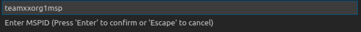
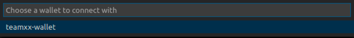
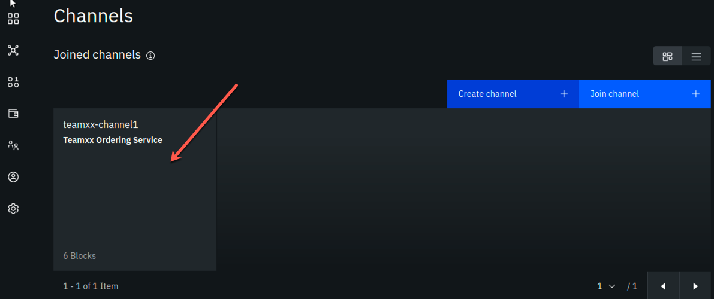

# IBM Blockchain Platform v2.1.3 Lab Part 2 - Deploying a Smart Contract

This lab will walk you through deploying the smart contract that you worked with from the VSCode labs: namely, `commercial-paper`. This lab assumes that you have successfully completed the [IBM Blockchain Platform v2.1.3 Lab Part 1 - Create a Blockchain Network](ibpconsole.md). If you have not completed part 1, you must do so before continuing with this lab.

## Section 1: Export Commercial Paper Smart Contract

Remember from the VSCode labs, you have already packaged up the commercial paper (`papercontract@0.0.4`) smart contract. Now you will export the contract to its own smart contract package (*in .cds format*) and deploy it to your IBM Blockchain Platform network.

!!! note
        If you did not complete the VSCode labs, you can still continue with this lab. You need to download the .cds package here: [commercial-paper](files/papercontract@0.0.4.cds) and save it to your lab image under the `/home/blockchain/` directory. Then you can skip to Section 2 of this lab.

**Step 1.1:** Go back to your VSCode editor, and go to the IBM Blockchain Platform Extension view. Under the *Smart Contract Packages* panel, right-click on **papercontract@0.0.4** and select `Export Package`:


**Step 1.2:** Select the location `/home/blockchain/`, and click **Enter**. Upon successful exporting, you will see a message like below:


## Section 2: Install Paper Contract to your Blockchain Network

**Step 2.1:** Go back to your IBM Blockchain Platform Console at your assigned URL in your Firefox browser. Click on the *Smart Contracts* icon in the icon palette on the left, and in the *Smart contracts* panel, click the blue **Install Smart Contract** button:


**Step 2.2:** In the *(Step 1 of 2) Install Smart Contract* side panel, using the blue **Add File** button, upload the `papercontract@0.0.4.cds` package (from the location `/home/blockchain`), and click the **Next** button. The screenshot that follows shows that the name and version of the smart contract have replaced the *Add File* button:


**Step 2.3:** Now select both peers (ensure each has a check mark to the right of it) and click the **Install Smart Contract** button. Note that in this lab we are installing to peers from two separate organizations. In most "real world" situations, the smart contract would be shared with members of the blockchain network, in a private Github repo or through some other means, and each organization would install the smart contract to its own peers through its own console.


**Step 2.4:** Now, you should see `papercontract` appear in the *Installed Smart Contracts* section of the *Smart Contracts* screen:


## Section 3: Instantiate Paper Contract

**Step 3.1:** From the *Installed Smart Contracts* section of the *Smart Contracts*  panel, select the three dots to the right of `papercontract` and select **Instantiate**:


**Step 3.2:** In the *Instantiate smart contract (Step 1 of 5)* sidebar panel, select **team*xx*-channel1**, where *xx* is your two-digit team ID, in the *Channel* field and click the **Next** button:


**Step 3.3:** In the *Step 2 of 5*  sidebar panel, select both peers in the *Members list* (ensure that each has a checkmark to the right of it), select **2 out of 2 members need to endorse transactions** from the *Policy* dropdown list, and then click the **Next** button:


**Step 3.4:** In the *Step 3 of 5* sidebar panel, select **Team*xx* Org1 Peer**, where *xx* is your two-digit team ID, in the *Peer* field, as the peer to approve proposals for instantiating the smart contract, and click the **Next** button:


**Step 3.5:** In the *Step 4 of 5* sidebar panel, skip adding a private data collection and just click **Next**:


**Step 3.6:** In the *Step 5 of 5* sidebar panel, leave the function name blank (it will by default call the `init` function in the smart contract which is what we want for `papercontract`) And leave the arguments box blank. Simply click the **Instantiate smart contract** button:


**Step 3.7:** First time instantiation could take a while because the Node.js smart contract is pulling in all the package dependencies from the public NPM registry. After a few minutes, instantiation should complete. If you scroll down on the *Smart Contracts* panel, you will see the list of *Instantiated Smart Contracts* now includes `papercontract`:


!!! note "Read this if your instantiation failed"
        If you receive a message indicating that an error occurred during instantiation, click the *Show error details* link. If it states that the grpc web client timed out the proposal after five minutes, simply click the **Instantiate smart contract** button again. There is a hard-coded timeout of five minutes, and sometimes in our lab system it takes just over five minutes to build the Docker image for the smart contract.  Even if this timeout occurs, the Docker image does get built, so that if you try it again, the Docker image already exists, and you will most likely succeed on this second attempt in much less than five minutes.  

Now that you have the smart contract instantiated on the channel, you are ready to move on to the next step.

## Section 4: Register client user for TeamXX Org1

Now you need to register a client user to use to enroll application identities for Org1. In real life, as the blockchain network administrator for your organization, you might want to register a distinct client user for each business application that has a need to access the smart contract. In this case, the same client user is used to enroll a number of application identities. Another development pattern is to register a distinct client user for each distinct application identity. You can register a client user through the Fabric application SDK as well, though that is not covered in this lab.

**Step 4.1:** Go to the *Nodes* view on your IBM Blockchain Platform Console, and navigate to the *Certificate Authorities* section. Then select **Team*xx* Org1 CA**, where *xx* is your two-digit team ID:


**Step 4.2:** Select the **Register user** button:


**Step 4.3:** In the *Register User (Step 1 of 2)* sidebar panel, fill in the fields as directed by the table below, and then click the **Next** button:

|Field label|Value|Comments|
|-----------|-----|--------|
|Enroll ID|**app-dev**||
|Enroll secret|**app-devpw**|click the "eye" icon to see the password|
|Type|**Client**|This will be populated for you|

**Step 4.4:** In the *Register User (Step 2 of 2)* sidebar panel, just click the **Register user** button.

**Step 4.5:** Now you should see the `app-dev` user you added show up under *Registered users*:


## Section 5: Register client user for TeamXX Org2 (Optional)

Now we will register a client user for enrolling application identities for Org2. This section is optional. In the sections that follow, you will only connect directly to Org1's peer. You will only need to register a client user for Org2 if you wish to connect to go above and beyond the steps in this lab and try connecting directly to Org2's peer.

**Step 5.1:** Go to the *Nodes* view on your IBM Blockchain Platform Console, and navigate to the *Certificate Authorities* section. Then select **Team*xx* Org2 CA**, where *xx* is your two-digit team ID.

**Step 5.2.** Follow the same steps from *Section 4, Steps 4.2-4.5* in order to register a client user, also named *app-dev*, for Org2.

## Section 6: Download the connection profile to connect to TeamXX Org1 Peer

The connection profile is a JSON file that describes all the connection endpoints, MSP information, channel information and certificate information required to connect to your organization's peer. A client application wishing to invoke transactions against a smart contract would require this file to obtain the necessary information needed to make that connection. Without IBM Blockchain Platform, this is a file you would put together yourself using existing sample connection profiles available in the Hyperledger Fabric community. With the IBM Blockchain Platform, you can download a ready-made file from the IBM Blockchain Platform Console.

**Step 6.1:** Select the **Smart contracts** icon from the icon palette on the left, scroll down to the *Instantiated smart contracts* section, click on the three dots to the right of `papercontract` and click **Connect with SDK**:


**Step 6.2.** In the *Connect with SDK* sidebar panel, you want to select the following (Remember to replace the `xx` below with your team number):

* MSP for connection: `Teamxx Org1 MSP`
* Certificate Authority: `TeamXX Org1 CA`

And then click on the **Download connection profile** button at the bottom. You may need to scroll down in the sidebar panel to see this button. Use the file save dialog to save the profile under its default name of `teamxx-channel1_papercontract_profile.json` (where *xx* is your two-digit team ID). Keep track of where you saved this profile, as you will be using it in the next section. 

Click the **Close** button to close the sidebar panel after you have downloaded the connection profile.

## Section 7: Create a new Gateway in VSCode IBM Blockchain Platform Extension

!!! note
       You will be using the IBM Blockchain Platform VSCode extension for the next few sections but leave your Firefox browser tab for the IBM Blockchain Platform Console open (you can minimize your browser window if you'd like) as you will be going back to it in the latter half of *Section 10*.

Now you can use that connection profile you just downloaded to create a new gateway in VSCode IBM Blockchain Platform Extension.

**Step 7.1:** In the VSCode IBM Blockchain Platform view, click on the `+` in the `Fabric Gateways` panel (if you are still connected to your local gateway you will need to disconnect from this gateway first. You can do so by clicking on the door icon where the `+` should be):


**Step 7.2:** Then in the popup window at the top of VSCode, select **Create a gateway from a connection profile**:


**Step 7.3:** Next you will be asked to enter the name of the gateway. Type **team*xx*-ibp**, remembering to replace *xx* with your team number, and press **Enter**. 

**Step 7.4:** Finally, you will be asked to browse to the connection profile that you downloaded from *Section 6*. Browse to it, and select **Open**. 

**Step 7.5:** Upon success, you will see *team**xx**-ibp*, where *xx* is your two-digit team ID, show up in the *Fabric Gateways* panel as follows:


## Section 8: Create a new wallet and identity in VSCode IBM Blockchain Platform Extension

**Step 8.1:** In the VSCode IBM Blockchain Platform view, click on the `+` in the `Fabric Wallets` panel:


**Step 8.2.** Select **create a new wallet and add an identity** in the popup window:


**Step 8.3:** Type **team*xx*-wallet** in the next popup window, where *xx* is your two-digit team ID, and press **Enter**:


**Step 8.4:** Type **isabella** as the name for the identity, and press **Enter**:


**Step 8.5:** Type **team*xx*org1msp** as the MSPID, where *xx* is your two-digit team ID, and press **Enter**:



**Step 8.6:** Pick **Select a gateway and provide an enrollment ID and secret**:


**Step 8.7:** Choose **team*xx*-ibp** as the gateway you want to enroll and identity with, where *xx* is your two-digit team ID:


**Step 8.8:** Type **app-dev** as the enrollment ID and press **Enter**:


**Step 8.9:** Type **app-devpw** as the enrollment secret and press **Enter**:


**Step 8.10:** Upon success you will see the new wallet and identity in the *Fabric Wallets* panel:


## Section 9: Connect to the teamxx-ibp gateway

Now that you have created a wallet and enrolled an ID and password, you are ready to connect to the *teamxx-ibp* gateway.

**Step 9.1:** Click on **team*xx*-ibp**, in the *Fabric Gateways* panel, where *xx* is your two-digit team ID:


**Step 9.2:** In the popup window, select **team*xx*-wallet**, where *xx* is your two-digit team ID:



**Step 9.3:** Upon success, you will also see your new gateway represented in the *Fabric Gateways* panel. Expand the twisties until you see your `papercontract` transactions:


## Section 10: Issue a transaction to test the connection

Now we are ready to submit a test transaction.

**Step 10.1:** From the *Fabric Gateways* panel, expand into the `papercontract@0.0.4` contract, right-click on the **issue** transaction and select **Submit Transaction**:


**Step 10.2:** Copy and paste the following inside the brackets as the argument, and then press **Enter**:

```
"MagnetoCorp","00002","2020-07-31","2020-12-31","6000000"
```

Example:


**Step 10.3:** Press **Enter** on the transient data popup window.

!!! Note "Read this if your transaction timed out"
        This step may take several minutes. When you *instantiated* the smart contract in *Section 3*, it built a Docker image for the smart contract on only one peer, the peer on which you chose to run the instantiate proposal (see *Step 3.4*).  The Docker image for the other peer will be built on first use, and this transaction may time out. If it does, simply run steps *10.1* through *10.3* again, and it should succeed this time. 

**Step 10.4:** Upon success you will see the results from the issue transaction in the *OUTPUT* panel in VSCode, similar to what is shown here:

```
[4/15/2020 4:49:08 PM] [INFO] submitTransaction
[4/15/2020 4:49:15 PM] [INFO] submitting transaction issue with args MagnetoCorp,00002,2020-07-31,2020-12-31,6000000 on channel teamxx-channel1
[4/15/2020 4:49:26 PM] [SUCCESS] Returned value from issue: {"class":"org.papernet.commercialpaper","key":"\"MagnetoCorp\":\"00002\"","currentState":1,"issuer":"MagnetoCorp","paperNumber":"00002","issueDateTime":"2020-07-31","maturityDateTime":"2020-12-31","faceValue":"6000000","owner":"MagnetoCorp"}
```

**Step 10.5:** Now, return to the IBM Blockchain Platform Console at your assigned URL in Firefox. Go to the *Channels* view, and click on the **team*xx*-channel1** tile, where *xx* is your two-digit team ID:



**Step 10.6:** You should see that the block height is now 6. In the *Block History* section, click on the block at the top of the table:


**Step 10.7:** Now you will see a list of transactions in block #5. Click on the topmost transaction (there should only be one):


**Step 10.8:** In the *Transaction* sidebar panel you should see the *issue* transaction and its input arguments in the *Input* section, and the output of the transaction in the *Output* section, from the transaction that you just submitted via the VSCode IBM Blockchain Platform Extension.


**Step 10.9:** OPTIONAL: you can submit additional transactions through VSCode, and watch the block height increase and look at the transaction in the IBM Blockchain Platform Console.

Congratulations!! You've now successfully enrolled an application identity and used it to invoke transactions against a smart contract deployed to IBM Blockchain Platform v2.1.3!
