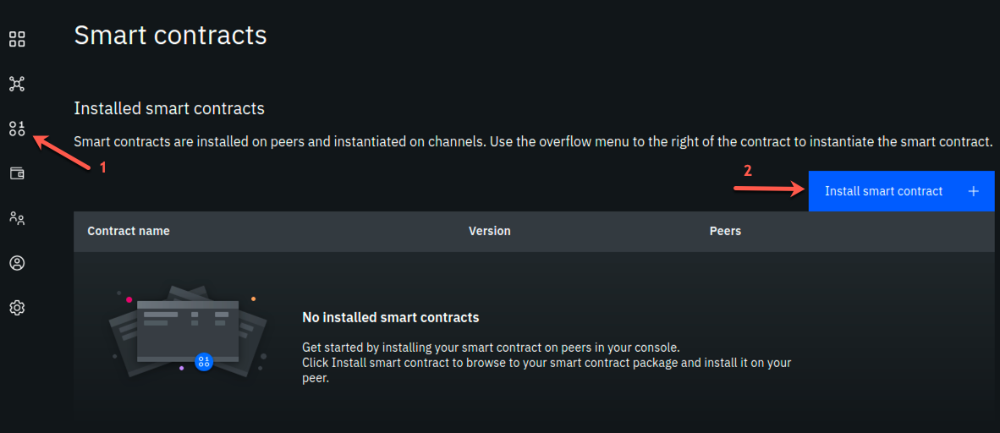
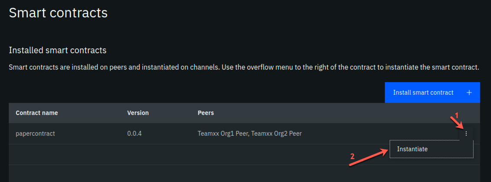
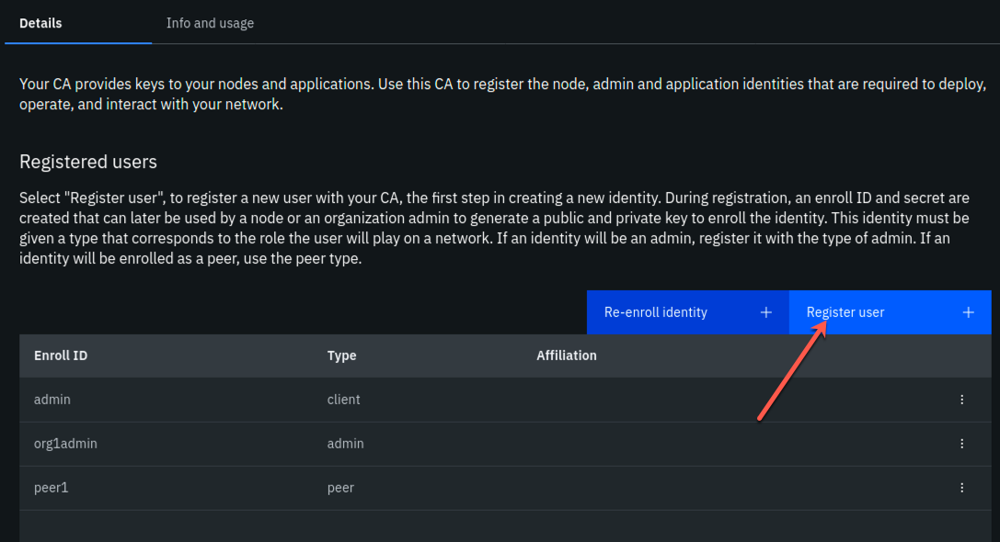
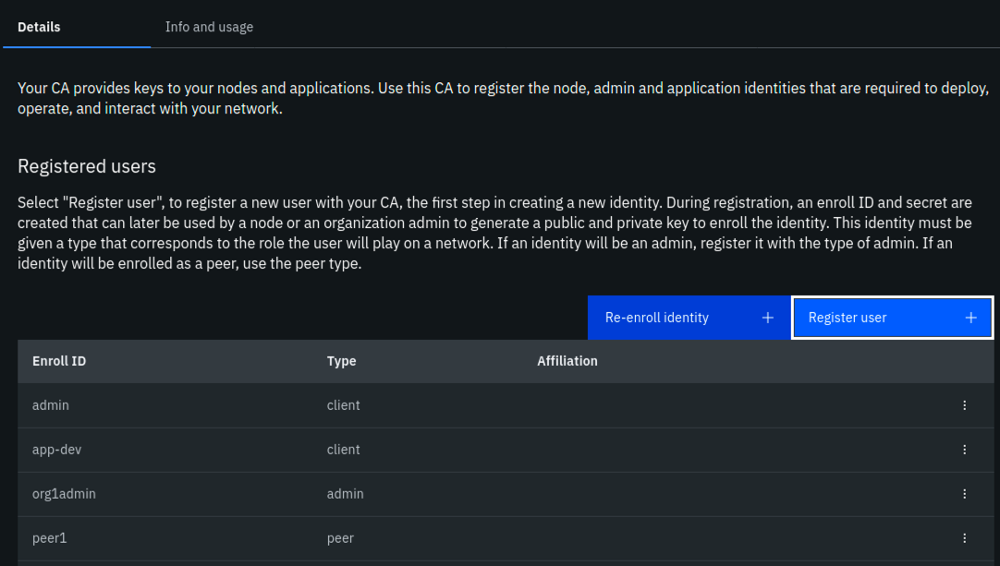
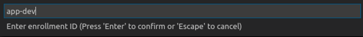
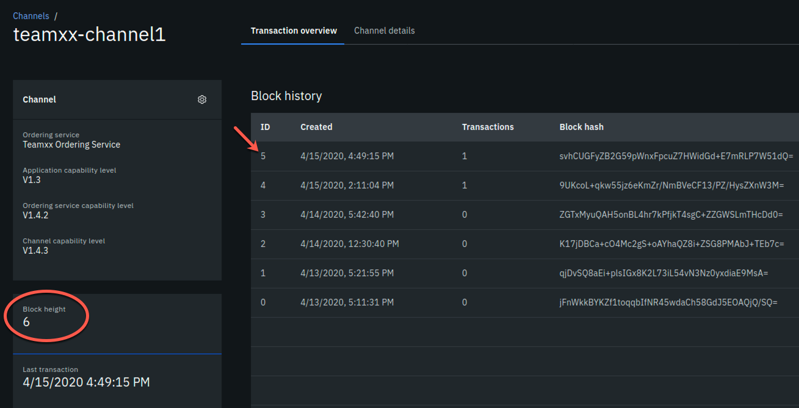

# IBM Blockchain Platform for Multicloud Part 2 - Deploying a Smart Contract

This lab will walk you through deploying the smart contracts that you worked with from the VSCode labs: namely `commercial-bond` and `commercial-paper`. This lab assumes that you have successfully completed the [IBM Blockchain Platform for Multicloud Part 1 - Deploying a blockchain network lab](ibpconsole.md). If you have not completed part 1, you must do so before continuing with this lab.

## Section 1: Export Commercial Paper and Commercial Bond

Remember from the VSCode labs, you have already packaged up the commercial paper (`papercontract@0.0.2`) and commercial bond (`commercial-bond`) smart contracts. Now you will export each to their own smart contract package (*in .cds format*) and deploy them onto your IBM Blockchain Platform for Multicloud peers.

!!! note
        If you did not complete the VSCode labs, you can still continue with this lab. You need to download the .cds packages here: [commercial-paper](files/papercontract@0.0.2.cds) and [commercial-bond](files/commercial-bond@0.0.1.cds). Save them to `/home/tecadmin/` on your lab image. Then you can skip to Section 2 of this lab.

**1.** Go back to your VSCode editor, and go to the IBM Blockchain Platform Extension view. Under the `Smart Contract Packages` panel, right-click on `commercial-bond@0.0.1` and select `Export Package` (you will have many less packages than the screen shots below!):


**2.** Select the location `/home/tecadmin/`, and click `Enter`. Upon successful exporting, you will see a message like below:


**3.** Now, in the same VSCode IBM Blockchain Platform Extension view. Under the `Smart Contract Packages` panel, right-click on `papercontract@0.0.2` and select `Export Package`:


**4.** Select the location `/home/tecadmin/`, and click `Enter`. Upon successful exporting, you will see a message like below:


## Section 2: Install Commercial Bond to your Blockchain Network

**1.** Go back to your IBM Blockchain Platform Console at your assigned URL. Go to the `Smart Contracts` panel, and select `Install Smart Contract`:



**2.** In the `Install Smart Contract` side panel, upload the `commercial-bond@0.0.1.cds` package, and click `Next`.


**3.** Now select both peers to install to and press `Install Smart Contract`. Note this is not a very realistic situation because we are installing to peers from two separate organizations. In reality, the smart contract would be shared on a private Github repo with members of the blockchain network and each organization would install the smart contract to their peers through their console.


**4.** You should see the following in the `Installed Smart Contracts` panel:


## Section 3: Install Commercial Paper to your Blockchain Network

**1.** From the `Installed Smart Contracts` panel, select `Install Smart Contract` again. Then upload the `papercontract@0.0.2.cds` file and select both peers to install to. At the end of this flow, you will see the following in the `Installed Smart Contracts` panel:


## Section 4: Instantiate Commercial Bond

**1.** From the `Smart Contracts - Installed Smart Contracts` panel, select the three dots to the right of `commercial-bond` and select `Instantiate`:


**2.** In the `Instantiate smart contract` side panel, select `teamXX-channel1` as the channel to instantiate to:


**3.** In the next side panel, select both members to endorse transactions. And then select 1 out of 2 members need to endorse transactions.


**4.** In the next side panel, select `TeamXX Peer Org1` as the peer to approve proposals for instantiating the smart contract.


**5.** In the next side panel, skip adding a private data collection and just hit `Next`.


**6.** In the next panel, type in `instantiate` as the function name. And leave the arguments box blank.


## Section 5: Instantiate Commercial paper

**1.** From the `Smart Contracts - Installed Smart Contracts` panel, select the three dots to the right of `papercontract` and select `Instantiate`:



**2.** Follow the same instructions as Section 4, steps 2 - 6, to instantiate `papercontract`. At the end of the flow, if you scroll down on the `Smart Contracts` panel, you will see the list of `Instantiated Smart Contracts` includes `commercial-bond` and `papercontract`:


Now that you have both smart contracts instantiated on the channel, we are ready to connect to the smart contract from VSCode.

## Section 6: Register client user for TeamXX Org1

We need to register a client user to use to enroll application identities for Org1.

**1.** Go to the Nodes view on your IBM Blockchain Platform Console, and navigate to the Certificate Authorities section. Then select `TeamXX Org1 CA`:


**2.** In the `TeamXX Org1 CA` view, select `Register user`:



**3.** In the `Register User` side panel, fill in the following fields for the user, then hit `Next`:


**4.** In the next panel, just press `Next`:


**5.** Now you should see the new user you added show up under `Registered users`:



## Section 7: Register client user for TeamXX Org2

Now we will register a client user for enrolling application identities for Org2.

**1.** Go to the Nodes view on your IBM Blockchain Platform Console, and navigate to the Certificate Authorities section. Then select `TeamXX Org2 CA`:


**2.** In the `TeamXX Org2 CA` view, select `Register user`:


**3.** In the `Register User` side panel, fill in the following fields for the user, then hit `Next`:


**4.** In the next panel, just press `Next`:


**5.** Now you should see the new user you added show up under `Registered users`:


## Section 8: Download the connection profile to connect to TeamXX Org1 Peer

The connection profile is a .JSON file that describes all the connection endpoints, MSP information, channel information and certification information required to connect to your peer. A client application wishing to invoke transactions against a smart contract would require this file to obtain the necessary information needed to make that connection. Without IBM Blockchain Platform, this is a file you would put together yourself using existing sample connection profiles available in the Hyperledger Fabric community. With the IBM Blockchain Platform, you can download an already made file from the IBM Blockchain Platform Console.

**1.** Go to the `Smart Contracts` view from the Console:


**2.** Scroll down to the `Instantiated Contracts` section. Click on the three dots to the right of `papercontract` and select `Connect with SDK`:


**3.** In the `Connect with SDK` side panel, you want to select the following:
* MSP for connection: `team19org1msp`
* Certificate Authority: `Team19 Org1 CA`

And then click on `Download connection profile` button at the bottom. Then you can click on `Close`.

## Section 9: Create a new Gateway in VSCode IBM Blockchain Platform Extension

Now you can use that connection profile to create a new gateway in VSCode IBM Blockchain Platform Extension.

**1.** In the VSCode IBM Blockchain Platform view, click on the `+` in the `Fabric Gateways` panel:


**2.** Then in the pop-up window, type in `teamXX-ibp` as your new gateway name.


**3.** Upon success, you will see the following message in the OUTPUT panel in VSCode: `[SUCCESS] Successfully added a new gateway`.

## Section 10: Create a new wallet and identity in VSCode IBM Blockchain Platform Extension

**1.** In the VSCode IBM Blockchain Platform view, click on the `+` in the `Fabric Wallets` panel:


**2.** Select `create a new wallet and add an identity` in the pop-up window:


**3.** Enter `teamXX-wallet` in the next pop-up window:


**4.** Enter `isabella` as the name for the identity:


**5.** Enter `teamXXorg1msp` as the MSPID (important to replace the xx with your team number)


**6.** Pick `Select a gateway and provide an enrollment ID and secret`



**7.** Choose `teamXX-ibp` as the gateway you want to enroll and identity with:


**8.** Type `app-admin` as the enrollment ID:


**9.** Type `app-adminpw` as the enrollment secret:


**10.** Upon success you will see the following messages in the OUTPUT panel:
```
[6/26/2019 10:23:14 PM] [INFO] addWallet
[6/26/2019 10:23:18 PM] [INFO] addWalletIdentity
[6/26/2019 10:23:56 PM] [SUCCESS] Successfully added identity to wallet
[6/26/2019 10:23:56 PM] [SUCCESS] Successfully added a new wallet
```
You will also see the new wallet and identity in the `Fabric Wallets` panel:


## Section 11: Connect to the teamXX-ibp gateway

Now that you have created a wallet and enrolled an ID and password, you are ready to connect to the `teamXX-ibp` gateway.

**1.** Click on the `teamXX-ibp` in the `Fabric Gateways panel.


**2.** In the pop-up window, select `teamXX-wallet`.


**3.** Upon success, you will see the following message in the OUPUT panel:
```
[6/26/2019 10:29:46 PM] [INFO] connect
[6/26/2019 10:29:47 PM] [SUCCESS] Connecting to team19-ibp
```

**4.** You will also see your new gateway represented in the `Fabric Gateways` panel:


## Section 12: Issue a transaction to test the connection

Now we are ready to submit a test transaction.

**1.** From the `Fabric Gateways` panel, expand into the `commercial-bond@0.0.1` contract, right-click on the `getAllBondsFromIssuer` transaction and select `Submit Transaction`:


**2.** Type in "Digibank" inside the brackets as the argument:


**3.** Hit `Enter` on the transient data pop-up window.

**4.** Upon success you will see the two bonds listed in the OUTPUT panel:

```
[6/26/2019 10:40:22 PM] [INFO] submitting transaction getAllBondsFromIssuer with args Digibank
[6/26/2019 10:40:26 PM] [SUCCESS] Returned value from getAllBondsFromIssuer: "[{\"Key\":\"\\u0000org.bondnet.commercialbondlist\\u0000\\\"Digibank\\\"\\u0000\\\"00001\\\"\\u0000\",\"Record\":{\"bondNumber\":\"00001\",\"class\":\"org.bondnet.commercialbond\",\"currentState\":1,\"faceValue\":\"50000\",\"interestRate\":\"0.04\",\"issueDateTime\":\"2019-05-17\",\"issuer\":\"Digibank\",\"key\":\"\\\"Digibank\\\":\\\"00001\\\"\",\"maturityDateTime\":\"2020-05-17\",\"owner\":\"Digibank\"}},{\"Key\":\"\\u0000org.bondnet.commercialbondlist\\u0000\\\"Digibank\\\"\\u0000\\\"00002\\\"\\u0000\",\"Record\":{\"bondNumber\":\"00002\",\"class\":\"org.bondnet.commercialbond\",\"currentState\":1,\"faceValue\":\"50000\",\"interestRate\":\"0.04\",\"issueDateTime\":\"2019-07-17\",\"issuer\":\"Digibank\",\"key\":\"\\\"Digibank\\\":\\\"00002\\\"\",\"maturityDateTime\":\"2020-07-17\",\"owner\":\"Digibank\"}}]"
```

**5.** Now, return to the IBM Blockchain Platform console at your assigned URL. Go to the Channels view, and click on the `team19-channel1` tile.


**6.** You should see the block height at 7. Now scroll down to `Block History` section, and click on the block at the top of the table.



**7.** Now you will see a list of transactions in block #6. Click on the top most transaction (there should only be one):


**8.** In the side panel you should see the digibank transaction that you just submitted via the VSCode IBM Blockchain Platform Extension.


**9.** OPTIONAL: you can submit additional transactions through VSCode, and watch the block height increase and look at the transaction in the IBM Blockchain Platform Console.

Congraulations!! You've now successfully enrolled an application identity and used it to invoke transactions against a smart contract deployed to IBM Blockchain Platform.


