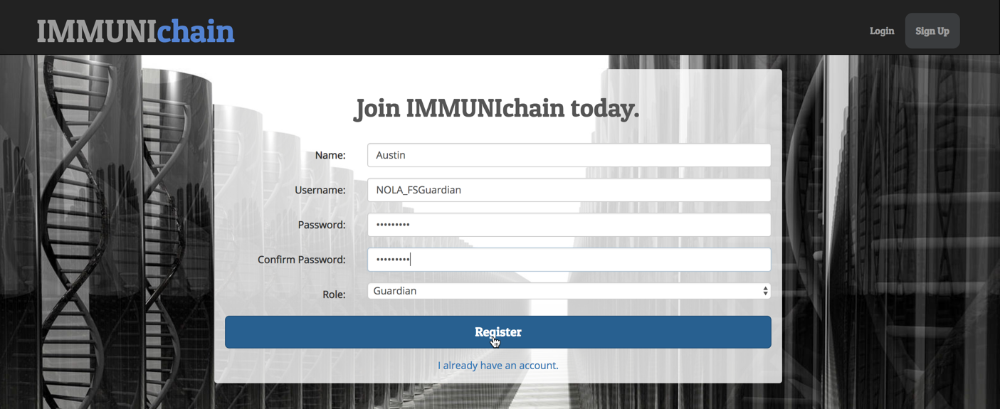
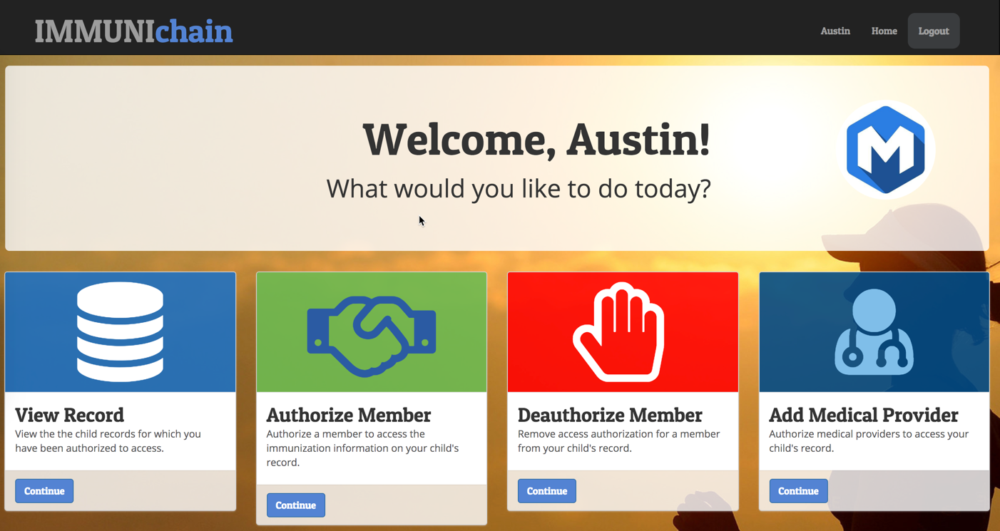
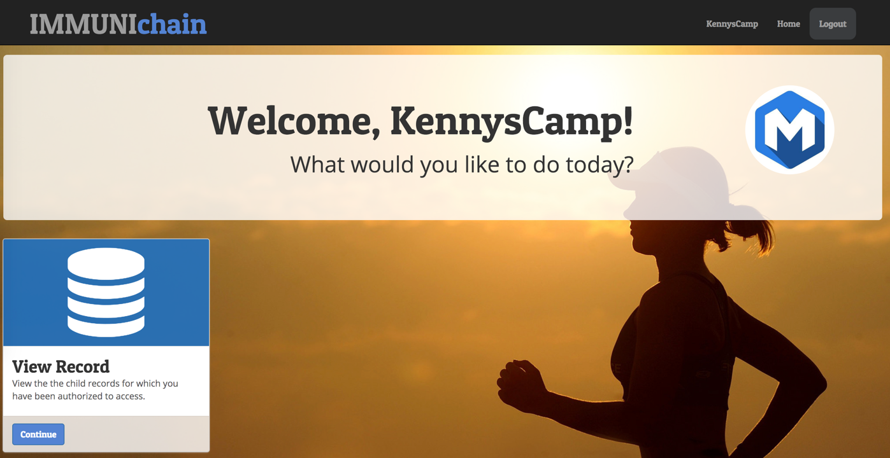
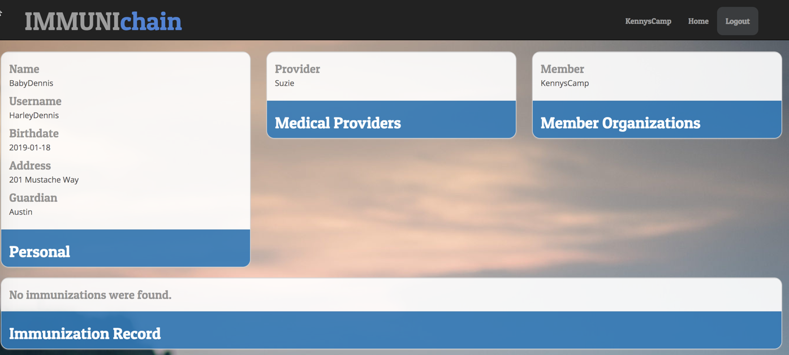
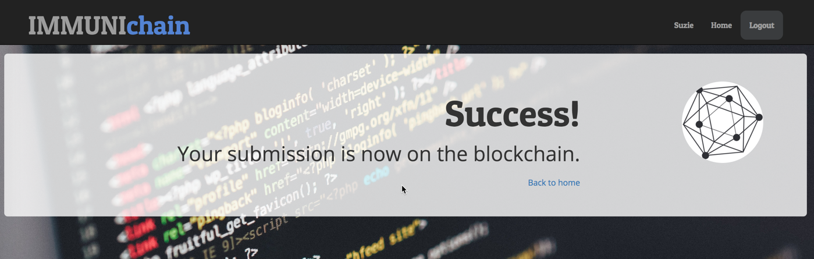
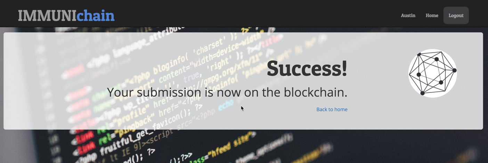
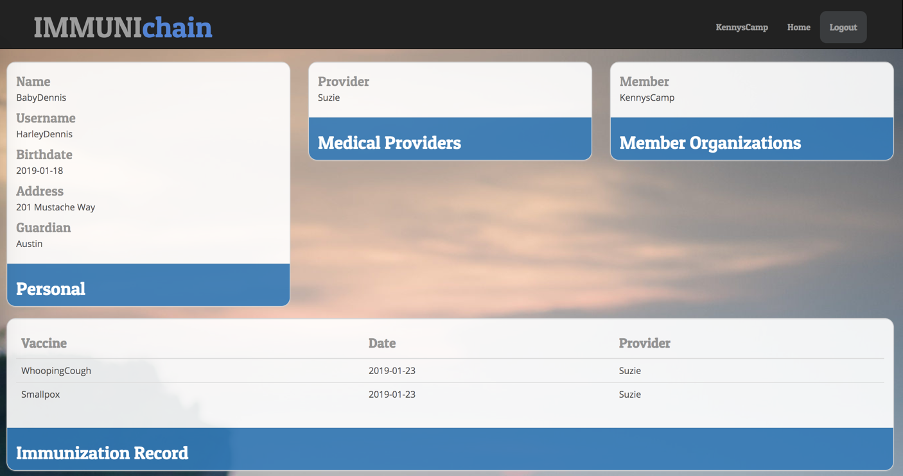

Part 1: Immunichain Walk Through
================================

Section 1: Create your Participants & Child
--------------------------------------------

**1.**  Begin by going to the Immunichain UI below:

    https://immunichain.zcloud.marist.edu/login/

**2.**  Click on `Create an account`

**3.**  You will be prompted to fill out a profile for your participant. In
    the `Role` field, select your participant (Guardian, Healthcare
    Provider and Member Organization). Based on your role, fill out the
    rest of the information.

**NOTE:** You will want to make your profile specific to you. As
everyone is creating their participant, it is being inserted into one
database. By the time you create your participants, there could be
multiple medical providers and member organizations. If you make them
specific to you, you will know which medical provider and member
organiation to assign to your child.

Here is my guardian:

**4.**  Once you have successfully created a guardian, you will be welcomed
    with the guardian's homepage

**5.**  Once you have looked through the available options for our guardian,
    you can click on `logout` in the top right
    
**6.**  Once you are on the Immunichain homepage, you can click on
    `Create an account` once more. This time, make a healthcare provider

Here is my healthcare provider:

**7.**  Once you have made your healthcare provider, you will be graced with
    its profile

**8.**  Once you have looked through the available options for our
    healthcare provider, you can click on `logout` in the top right
    
**9.**  Once you are on the Immunichain homepage, you can click on
    `Create an account` once more. This time, make a member organization

Here is my member organization:

**10.** Once you have made you member organization, you will be greeted with
    its profile

**11.** Look through the available options for our member organization. Once
    you are finished, you can click on `logout` in the top right

Section 2: Create a Child and Grant Access
-------------------------------------------

**1.**  You should be on the Immunichain homepage. If you are log into your
    `guardian`

**2.**  Once you get to your guardian's profile, scroll down and click on
    `Continue` of `Add a Child`
    
**3.**  Fill out the information for our hypothetical child and choose the
    healthcare provider and member organization that you created

**NOTE** Remember how I said - at the beginning - that there would be
multiple healthcare providers and members to choose from, you now know
why I said to make the participants specific to you.

**4.**  Click on `Submit` once you have filled out your child's information

**5.**  Click on `return home` and that should take you back to the
    guardian's profile. Now that you think you have create a child, you
    can confirm by click on `Continue` of `View Record`
    
**6.**  Select our new child and click on `Continue`

**7.**  You should now see all the information you just filled in for our
    child

**8.**  You will notice that we have already granted access for our
    healthcare provider, Suzie, and then our member organization,
    KennysCamp.

If you did not grant access for our other participants when creating the
child, you will see blank information in the `Medical Providers` and
`Member Organizations` section. You can change that by going to the
guardian's profile and then click on `Authorize Member` or
`Add Medical Provider`

Section 3: Add Immunizations
-----------------------------

**1.**  Navigate your way back to the Immunichain homepage. Once you are
    there, log into our member organization

**2.**  Click on `Continue` of the `View Record` tile

**3.**  You should only see the children in which we have access to - in
    this case, it should only be `BabyDennis`

**4.**  Click on `Continue` and you should see all of Dennis's information

**5.**  You will notice, that there are no immunization shots on Dennis's
    record. Let's change that. We can do that by logging out of our
    Member and then logging into our Healthcare Provider

**6.**  Once you get to the medical providers homepage, click on `Continue`
    of `Add Immunization`. Then select our child, `Dennis`.
    
**7.**  You should now be on the screen to add immunizations for Dennis. Go
    ahead and give Dennis an immunization shot with today's date

**8.**  Go ahead and click on `Submit` to add this immunization shot. Once
    you have done that, you will should see a `Success` message

**9.**  Now that we have successfully added an immunization shot, we can see
    if our member can see it on their end. You can do that by logging
    out of the healthcare provider and then logging into our member.
    
**10.** Once you are on the member's profile, you can click on `Continue`
    of the `View Record` tile and selecting Dennis.
    
**11.** Now that we have selected Dennis, you can see see the updated
    information of Dennis's immunization shot

**12.** Imagine if you were a SummerCamp or another member participant that
    needs childrens medical shot record. Doing this digital increases
    the accuracy of the data due to the healthcare provider inputting
    the data right when the shot was administered. Additionally, this
    will allow them to increase their efficency of approving children
    into their camp, for example.

Now if you were a guardian and a summer camp already approved your
child, we would want to revoke that member from seeing our child's
immunization record. How do we do that? We will do exactly that in the
next section.

Section 4: Revoking Access
---------------------------

**1.**  Navigate back to Immunchain's homepage and log into the Guardian's
    profile
    
**2.**  Click on `Continue` of the `Deauthorize Member` tile

**3.**  Select Dennis as our child and then select our Member, KennysCamp,
    as the one we revoking access to

**4.**  You should get a `Success` message once click on `Submit` of the
    revoking our member

**5.**  Now, log out of our guardian and log into our medical provider

**6.**  Once in the medical provider's profile, click on `Continue` of the
    `Add Immunization` tile
    
**7.**  Select our child, Dennis, and then add another immunization to his
    record

**8.**  Once you get the `Success` message, click on `Back to Home`.

**9.**  You should still be in the guardian's profile. Since you are, click
    on `Continue` of the `View Record` tile. Then select our child,
    Dennis. You should then see Dennis's updated immunization record

**10.** Log out of our medical provider and then log into our member,
    KennysCamp.
    
**11.** Click on `Continue` of the `View Record` tile. You should see the
    message of: `You do not have any children`. This means the
    KennysCamp can't view Dennis's immunization record anymore.

Optional: If you want to grant KennysCamp as a member again, you can go
back into the guardian's profile. Once there, you can click on
`Continue` of the `Authorize Member` tile. Then you can grant KennysCamp
as an authorized member for Dennis. Now if you go back to KennysCamp,
click on `Continue` of the `View Record` tile and you should see the
updated information for Dennis.

**End of Lab**
