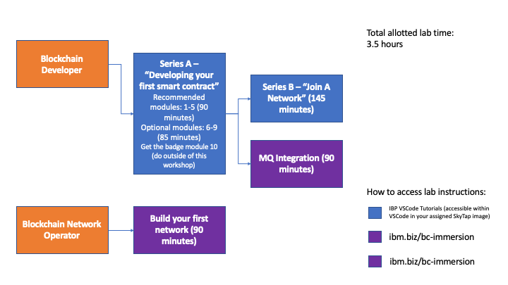

# Choose Your Own Lab - Introduction
You have the opportunity to try your hand at four sets of blockchain labs. It is likely that you will not be able to try them all in the alloted time of the workshop. The diagram below is to help you decide which one(s) you want to do based on the type of blockchain role you want to take on.

### All four labs will be done on your [assigned SkyTap image](assignment.md)

### Blockchain Developer Labs
If you want to develop smart contracts and applications that interact with the smart contracts, the recommendation is that you start with the "Series A" modules, followed by either "Series B" or the MQ Integration lab.

**Series A** labs start from the basics of developing a simple smart contract all the way to how events are handled in the smart contract and the applications.

**Series B** labs allow you to join an existing DriveNet network that is running on Linux on Z. The genesis behind this series of modules is that some clients will likely start out by joining an existing network, versus starting a fresh one of their own.

Both Series A and Series B lab instructions can be found within VSCode inside your [assigned SkyTap image](assignment.md).

**IBM MQ Integration** lab will show you how to integrate a sample blockchain network with another application via IBM MQ Bridge. You will setup the MQ Bridge to pull changes made to the blockchain network and send those updates to another application. This is useful when you need to integrate your blockchain network to existing legacy applications within your enterprise.

The lab instructions for the MQ Integration lab can be found [here](files/IBP_MQ_Bridge_Lab.pdf). A copy is also staged inside your [assigned SkyTap image](assignment.md).

### Build your first network on Linux on IBM Z Lab
In these labs you will setup, operate, and test a blockchain network.

From your [assigned SkyTap image](assignment.md), you will access [your assigned IBM Blockchain Platform console](console-urls.md). 

The Lab instructions:

* [Part 1 - Create a Blockchain Network](ibpconsole.md)
* [Part 2 - Deploy a Smart Contract](ibpdeploy.md)