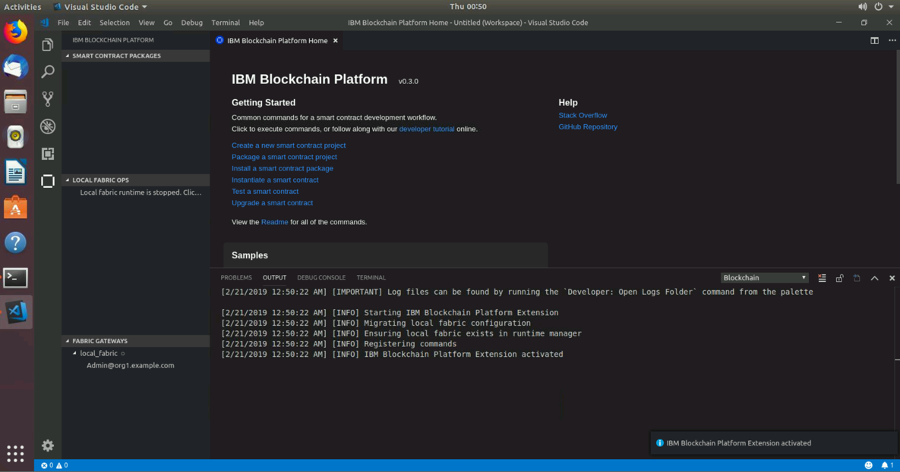
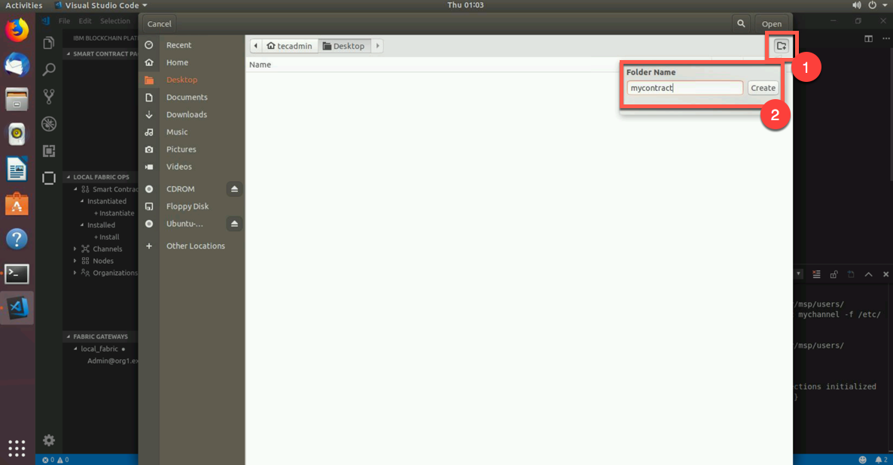
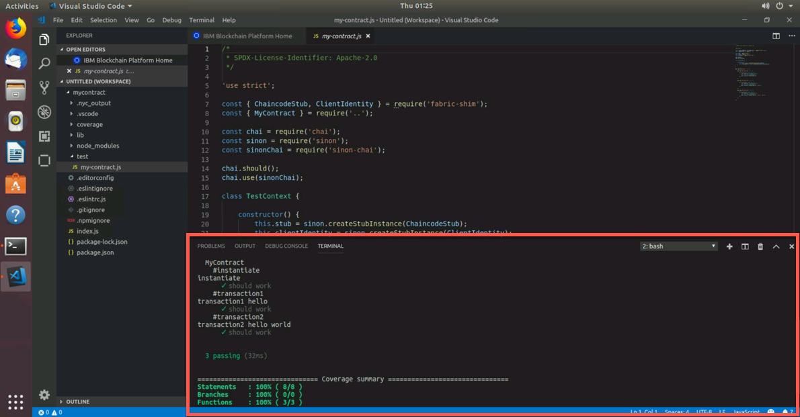
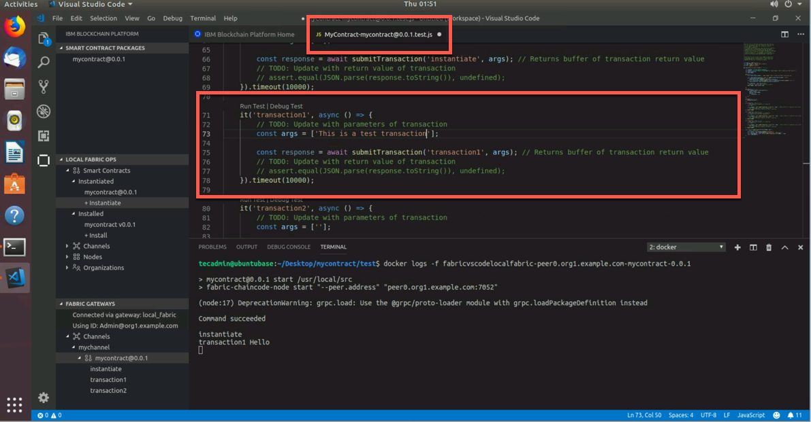

Part 1: VSCode and the IBM Blockchain Extension
===============================================

Section 1: Overview
-------------------

In this part of the lab, we will guide you through the steps for
generating, installing and instantiating a smart contract and then
testing that smart contract to verify that it works. Before all of that,
we will have you start up the local Hyperledger Fabric network so that
we can build our smart contract on top of it. In this lab, we have you
deploy to a local network that is running on your laptop, but you can
also connect the IBM Blockchain Platform VSCode extension to either your
IBM Blockchain Platform network running in the cloud or your IBM
Blockchain Platform on IBM Cloud Private network on-premises. Below is a
breakdown of `Part 1` of our lab

-   Install and Start up a Blockchain Network:

    -   We must make sure that all levels of software (docker, node,
            npm, docker-compose and yo) are at the correct level before
            we start building our smart contract. Then, we will install
            the IBM Blockchain Platform extension that will allow us to
            create and develop our smart contract. Once we have done
            that, we will then start up the Hyperledger Fabric network,
            which will consist of a certificate authority (CA), orderer
            (solo - meant for dev/test), couchdb, ccenv (chaincode
            environment), and most importantly our peer.

-   Create our Smart Contract:

    -   Now that we have a running Hyperledger Fabric blockchain
            network, we will create our smart contract. The smart
            contract will be very basic in nature, but we will explain
            what the contract is trying to accomplish before we go
            through some of the unique features that the extension can
            do for us and our smart contract.

-   Package, Install and Instantiate our Smart Contract:

    -   Since we have an understanding of how our smart contract
            works, we will need to install (peer level command) it on
            our peer and then instantiate (channel level command) the
            installed smart contract on the channel. Once we have
            instantiated the smart contract, we will be able to submit
            transactions.

-   Unit Test our Smart Contract:

    -   Once we have an instantiated smart contract on our channel,
            we will then test out the code to make sure that the
            contract will actually work when we submit transactions.
            This checks all the files within our smart contract and
            simulates all of our transactions. We will know we are
            cooking with gas when our test comes back successful. This
            test feature does not actually commit anything to the ledger
            or world state, but the last section of part 1 of this lab
            will submit tests that will commit data to the ledger. We
            will go into detail once we get to that point.

-   Submit Transactions:

    -   What fun is it to have a working smart contract and have it
            instantiated across the channel, if we can't submit
            transactions? In this section, we will actually submit
            transactions from the UI of VSCode. We will see data get
            committed to the ledger.

-   Generate Smart Contract Test Client:

    -   In the final section of part 1, we will generate a test file
            that will test our smart contract, while submitting
            transactions to the ledger. We will view the docker logs of
            our running smart contract and see the transactions being
            added to the logs as well as the ledger.

Section 2: Install and Start Up a Blockchain Network
----------------------------------------------------

**NOTE:** For `Part 1` of our lab, we will be using the terminal within
VSCode. Do **not** execute the commands within the actual terminal
application. You can enter them from the terminal application, but the
instructions below will all be within the VSCode terminal. `Part 2` of
this lab, you will use the terminal application.

**1.** Open up your teminal and type in the following commands below

    tecadmin@ubuntubase:~$ node -v # We want Node to be v8.x or higher
    v8.11.3
    tecadmin@ubuntubase:~$ npm -v # We want NPM to be v5.x or higher
    5.6.0
    tecadmin@ubuntubase:~$ yo --version # We want yo to be v2.x or higher
    2.0.5
    tecadmin@ubuntubase:~$ docker --version # We want Docker to be v17.06.2-ce or higher
    Docker version 17.06.2-ce, build cec0b72
    tecadmin@ubuntubase:~$ docker-compose --version # We want Docker Compose to be v1.14.0 or higher
    docker-compose version 1.14.0, build c7bdf9e

If you get a version that doesn't support our qualifications, raise
your hand and tell the instructor.

**2.** From the same command line, enter the following command below

    tecadmin@ubuntubase:~$ code

This will start Visual Studio Code (VSCode)

**3.** From the user interface (UI) of VSCode, click on the 4th item
down. This will allow you to search for available extensions to install
and work from

**4.** In the search bar, type in `blockchain` and that should populate
all the available extensions that deal with blockchain. The top choice
should be the `IBM Blockchain Platform` extension. I promise we didn't
manipulate the algothrim to make it the top choice! If you see the IBM
Blockchain Platform (IBP) extension, please click on `install` to
install the extension.

**5.** Once you have successfully installed the extension, you should
see an outline of a block just below the extensions button
(approximately, the 6th button in VSCode). Go ahead and click on that
button. Once you do, you'll be welcomed with the IBM Blockchain
Platform VSCode Homepage with the sides being divided into thirds.

The IBM Blockchain Extension perspective is broken into thirds on the
left. It is broken into `Smart Contract Packages`, `Local Fabric Ops`
and `Fabric Gateways`. `Smart Contract Packages` is the home for all of
our smart contracts that are packaged into `.cds` files. It packages
these smart contracts based on the files that are in the `Editor`
perspective. Now, just because there are packages here doesn't mean
that the smart contract is actually installed and instantiated on the
channel. To do that we can go to the `Local Fabric Ops` pane. The
`Local Fabric Ops` is a place where we can quickly gather and see all of
our network information. If you untoggle the Smart Contracts flag, we
can see all the contracts that are installed and instantiated. We can
install and instantiate smart contracts from the `Local Fabric Ops`
field. The Channel field shows all of the channels that are in our
blockchain network. By default when we do `Start Fabric Runtime` in the
next command, we'll join a channel called `mychannel`. The Nodes field
shows us all of the peers that are in our network. In the Organizations
field, we'll see all the organizations that are in the network. You can
have an organization with no peers (nodes - in this case), but you
can't have a peer without an organization. An organization can have
many peers. The last pane, `Fabric Gateway`, allows you to connect to a
Hyperledger Fabric instance by an identity. In our case, it will be the
`Admin@org1.example.com` of our local Fabric network. In Part 2 of this
lab, we will create an identity and submit transactions from this new
identity.

**6.** Hover your mouse over the `Local Fabric Ops` panel and we'll see
three dots - `...` - and click on those dots. We'll be presented with
two options. `Start Fabric Runtime` and `Teardown Fabric Runtime` are
those two options. We will want to click on `Start Fabric Runtime` in
this case.

This will start our local Hyperledger Fabric network. It will stand up a
peer, certificate authority, orderer and a couchdb container. In
addition to standing up these containers, it will join our peer to a
channel called `mychannel`.

The difference between `Start Fabric Runtime` and
`Teardown Fabric Runtime` might be obvious, but `Start Fabric Runtime`
grabs all of the Hyperledger Fabric images and starts them as
containers. In addition, it builds the crypto material (certificates,
public and private keys) and creates and joins a sample channel called
`mychannel`. The other option, `Teardown Fabric Runtime` basically
cleans up the network and removes all of the containers that
`Start Fabric Runtime` builds. It does leave the `Start Fabric Runtime`
docker images. To do a full cleanup, we will need to manually remove
those images and containers.

**7.** How do we know if we have a successful blockchain network up and
running? I'm glad you asked! We will see messages flooding the `Output`
panel. We will want to see a message that resembles the one below

    [2/20/2019 7:26:54 PM] [INFO] 2019-02-21 00:26:34.756 UTC [cli.common] readBlock -> INFO 002 Received block: 0
    [2/20/2019 7:26:54 PM] [INFO] 2019-02-21 00:26:34.930 UTC [channelCmd] InitCmdFactory -> INFO 001 Endorser and orderer connections initialized
    [2/20/2019 7:26:55 PM] [INFO] 2019-02-21 00:26:35.458 UTC [channelCmd] executeJoin -> INFO 002 Successfully submitted proposal to join channel

**8.** We can verify that everything is up and working by entering the
following `docker ps -a` command that will print out all of our
containers

Section 3: Create our Smart Contract
------------------------------------

Now that we have a local running Hyperledger Fabric network, let's
create our Smart Contract that we will then install and instantiate onto
our network.

**1.** We can do that by clicking on the gear icon in the bottom left
and then clicking on `Command Palette.` This will give us the option to
do a series of commands, some that are VSCode-related and some that are
IBM Blockchain Platform-related.

**2.** You will notice a series of commands pop up. Go ahead and enter
this command below into the search bar

    >IBM Blockchain Platform: Create Smart Contract Project 

This command will generate a skeleton smart contract for us. We will
walk through all that it generates in a second.

**3.** We might get a message that says 

    Can this extension install missing npm packages before proceeding?

Select `yes` if that message comes up. What it is installing is
`generator-fabric` which is actually the generator that creates our
skeleton smart contract.

**4.** We'll then get a message that says 

    Chose smart contract language (esc to cancel)

Choose `JavaScript` as our smart contract language of choice

**5.** Then will pop open a folder directory. Since we are starting a
new project, let's create a new folder for our smart contract. We can
call this folder `mycontract`. Then click on `open` to allow VSCode to
generate our smart contract in that folder.

**6.** We will get another pop-up asking 

    Choose how to open your new project

We'll want to select `Add to workplace` to add it to our VSCode

**7.** So we have created our smart contract, but gosh darnit, where is
it? Well, let's click on the `Explorer` in the top left. It's the
first botton on our left side panel

**8.** From the `Explorer` page, we will see all the open tabs we have
open in VSCode and then all the smart contracts we created in our
workspace, which should only be our [mycontract]{.title-ref}.

**9.** If you navigate within this UI to `lib/my-contract.js` and click
on `my-contract.js` it will open that file within VSCode. From there we
can inspect this file to see what our smart contract is capable of. In
this case, we only have `instantiate, transaction1 and transaction2`

The main file in our smart contract is the `my-contract.js` file. It
contains information as to the various transactions we can do as well as
pulling in some predefined classes. Take a look at these lines in the
code

These couple of lines are vital to understand what is happening in our
smart contract, below. The MyContract class contains the transaction
definitions for mycontract - like instantiate, transaction1 and
transaction2. It's these transactions that bring mycontract into
existence. We'll examine these transactions soon, but for now notice how
MyContract extends the Hyperledger Fabric Contract class which is the
first line of code here. Our mycontract will use built-in features of
these classes, such as automatic method invocation, a per-transaction
context, transaction handlers, and class-shared state 

    const { Contract } = require('fabric-contract-api');

    class MyContract extends Contract {

You might have noticed an extra variable in each transaction definition
-- `ctx`. It's called the transaction context, and it's always first. By
default, it maintains both per-contract and per-transaction information
relevant to transaction logic. We also see that transaction1 expects 1
argument in addition to ctx and transaction2 expects 2 different
arugments in addition to ctx. The instantiate transaction expects an
`instantiate` argument when actually instantiating this smart contract.
You can see that below. In fact, we will instantiate in the next section

    async instantiate(ctx) {
       console.info('instantiate');
    }

    async transaction1(ctx, arg1) {
       console.info('transaction1', arg1);
    }

    async transaction2(ctx, arg1, arg2) {
       console.info('transaction2', arg1, arg2);
    }

Section 4: Package, Install and Instantiate our Smart Contract
--------------------------------------------------------------

In this section, we will package the smart contract we just created and
then install and instantiate it onto our local Hyperledger Fabric
network. We will realize how easy this is very soon.

**1.** In order to successfully install and instantiate a smart
contract, we first need to package our contract up. We can do this by
navigating to the IBP Extension (the block outline within our VSCode).

**2.** Once we are in the IBP extension, repeat the steps from
`section 2, step 1` by clicking on the gear in the bottom left and then
selecting `Command Palette`. When it asks us for a command to run, type
this in below and press enter 

    >IBM Blockchain Platform: Package a Smart Contract Project

**3.** Then the extension will create a package (a .cds file) with your
smart contract name and then set its version to `0.0.1` - in this case
`mycontract@0.0.1` within the `Smart Contract Packages` side panel.

**4.** Now that we have our smart contract packaged up, untoggle the
`Smart Contracts` option from within the `Local Fabric Ops` panel. There
you will have the option to install and instantiate our smart contract
package. Since we all are very smart, we know that we have to install
before instantiating. So do that by clicking on `+ Install`.

**5.** Installing chaincode is a peer level operation, so we will get a
pop-up message asking which peer to install the chaincode on. Simply
click on the peer it gives us, in this case it is
`peer0.org1.example.com`. Then it will ask what to install. We will want
to install `mycontract@0.0.1` onto that peer. Press `enter` to begin
this operation 

    Peer: peer0.org1.example.com
    Package: mycontract@0.0.1

**6.** Once we have it installed, we see the smart contract underneath
the `Installed` section of the `Local Fabric Ops` panel. Make sure this
is there before continuing.

**7.** To activate the chaincode on the peer, we have to instantiate the
chaincode. To do this, simply click on the `+ Instantiate` underneath
the `Instantiated` option. Since instantiation is a channel operation,
it will ask what channel to instantiate the chaincode on. You will want
to instantiate on `mychannel` and then the `mycontract@0.0.1` as the
smart contract. Then it will ask what function we want to pass through.
We want to enter `instantiate` here. Then for the last popup message,
simply just press `enter` and it will begin to instantiate 

    Channel: mychannel
    Package: mycontract@0.0.1 # It should say installed to the right of the package
    Function: instantiate

**8.** We will know if we successfully instantiated the smart contract
when it says so underneath the `Instantiated` section in the
`Local Fabric Ops` panel.

Section 5: Unit Test our Smart Contract
---------------------------------------

In this section, we will test our smart contract to make sure the
transactions will work the way they should. This test does not commit
any data to the ledger, but rather tests to make sure they work in
general. You can say this is a way to make sure your code is working the
way you want it to. Later, we will test our transactions that commit
data to the ledger.

**1.** Jump back up to our `Explorer` perspective at the top left of
VSCode. From there naviagate to `mycontract/test/my-contract.js` and
actually click on the `my-contract.js` file to open it in our VSCode.

**2.** Once you have the file open, right click on `my-contract.js` and
then select `Open in Terminal` - this will open this file path directly
to our terminal at the bottom of our VSCode

**3.** From there you will see your terminal go directly to our `test`
folder. We can verify it by entering `pwd` and observing that we are in
the path from where we created our smart contract folder back in section
2. Equally, we can do a `ls -l` command to verify that we see our
`my-contract.js` file in there.

**4.** To test our smart contract code, simply enter `npm test` below from the
terminal in VSCode 

    tecadmin@ubuntubase:~/Desktop/mycontract/test$ npm test

**5.** From there, we will test our smart contract. If we are
successful, we will see the following messages below 

    #instantiate
    instantiate
    ✓ should work
    #transaction1
    transaction1 hello
    ✓ should work
    #transaction2
    transaction2 hello world
    ✓ should work
    
    3 passing (25ms)

Section 6: Submit Transactions
------------------------------

In this section we will actually submit transactions after knowing that
our smart contract is good to go!

**1.** Enter the following command below to see all of our Docker containers
running. Please do this from the command line in VSCode 

    tecadmin@ubuntubase:~/Desktop/mycontract/test$ docker ps -a

You should see 5 containers running: peer, cerificate authority,
orderer, couchdb and the chaincode container

**2.** To see the logs of our chaincode container enter the following
commmand from your terminal in VSCode. **NOTE:** scroll to see the
entire command below 

    tecadmin@ubuntubase:~/Desktop/mycontract/test$ docker logs -f fabricvscodelocalfabric-peer0.org1.example.com-mycontract-0.0.1

**NOTE:** The docker smart contract container name will be different if
you named your smart contract something other than `mycontract`.

**3.** Navigate to the IBP Extension where we will utilize the third
panel on the left - called `Fabric Gateways`

**4.** From here, click on `Admin@org1.example.com` and you will see all
the channels in our network, in this case it is just `mychannel`.
Untoggle on `mychannel` and then `mycontract@0.0.1` to see all of our
possible transactions: `instantiate, transaction1, transaction2`

**5.** Once you have untoggled all the required things, right click on
`transaction1` and select `Submit Transaction`. Again there will be a
popup in the top middle of VSCode. When it asks for an argument, type in
`Hello` and press enter 

    Arguments: "Hello"

**6.** Once the transaction has been submitted, you should see the
transaction coming through the chaincode container.

**7.** Equally, you could check the logs of your peer by entering the
following command below within VSCode. I'm grep-ing these logs because there
is a lot of output due to the signatures and messages a transaction
sends, but I'm just wanting to see all the blocks 

    tecadmin@ubuntubase:~/Desktop/mycontract/test$ docker logs -f fabricvscodelocalfabric_peer0.org1.example.com | grep block
    2019-02-21 20:02:09.209 UTC [endorser] callChaincode -> INFO 093 [mychannel][c55f59cc] Entry chaincode: name:"mycontract" 
    2019-02-21 20:02:09.213 UTC [endorser] callChaincode -> INFO 094 [mychannel][c55f59cc] Exit chaincode: name:"mycontract"  (4ms)
    2019-02-21 20:02:09.213 UTC [comm.grpc.server] 1 -> INFO 095 unary call completed {"grpc.start_time": "2019-02-21T20:02:09.207Z", "grpc.service": "protos.Endorser", "grpc.method": "ProcessProposal", "grpc.peer_address": "172.18.0.1:39474", "grpc.code": "OK", "grpc.call_duration": "6.3366ms"}
    2019-02-21 20:02:09.945 UTC [endorser] callChaincode -> INFO 096 [mychannel][4bb0a014] Entry chaincode: name:"mycontract" 
    2019-02-21 20:02:09.948 UTC [endorser] callChaincode -> INFO 097 [mychannel][4bb0a014] Exit chaincode: name:"mycontract"  (3ms)
    2019-02-21 20:02:09.949 UTC [comm.grpc.server] 1 -> INFO 098 unary call completed {"grpc.start_time": "2019-02-21T20:02:09.944Z", "grpc.service": "protos.Endorser", "grpc.method": "ProcessProposal", "grpc.peer_address": "172.18.0.1:39474", "grpc.code": "OK", "grpc.call_duration": "4.6952ms"}
    2019-02-21 20:09:52.334 UTC [endorser] callChaincode -> INFO 099 [mychannel][3015cddc] Entry chaincode: name:"mycontract" 
    2019-02-21 20:09:52.340 UTC [endorser] callChaincode -> INFO 09a [mychannel][3015cddc] Exit chaincode: name:"mycontract"  (6ms)
    2019-02-21 20:09:52.340 UTC [comm.grpc.server] 1 -> INFO 09b unary call completed {"grpc.start_time": "2019-02-21T20:09:52.333Z", "grpc.service": "protos.Endorser", "grpc.method": "ProcessProposal", "grpc.peer_address": "172.18.0.1:39474", "grpc.code": "OK", "grpc.call_duration": "7.2863ms"}
    2019-02-21 20:09:54.435 UTC [gossip.privdata] StoreBlock -> INFO 09c [mychannel] Received block [2] from buffer
    2019-02-21 20:09:54.437 UTC [committer.txvalidator] Validate -> INFO 09d [mychannel] Validated block [2] in 1ms
    2019-02-21 20:09:54.698 UTC [kvledger] CommitWithPvtData -> INFO 09e [mychannel] Committed block [2] with 1 transaction(s) in 260ms (state_validation=69ms block_commit=92ms state_commit=76ms)

Can you guess what `Block: #1` was?

**8.** Feel free to pass in other transactions if you would like!

Section 7: Generate Smart Contract Test Client
----------------------------------------------

In this section, we will generate a test client for our smart contract
as well. This test is different from the unit tests in section 5 due to
the fact that we will actually commit a transaction to the ledger with
data.

**1.** From the IBP Extension and within the `Fabric Gateways` panel,
right click on the smart contract - in this case `mycontract@0.0.1`.
Then click on `Generate Smart Contract Tests`.

**2.** When another pop-up opens, select `JavaScript` as the smart
contract language. In VSCode you will see a new file open again. In my
case it is called `MyContract-mycontract@0.0.1.test.js` 

    SmartContract Language: JavaScript
    File Name: MyContract-mycontract@0.0.1.test.js

**NOTE:** If we see a little caution box appear in the bottom, right
click on the `X` to close that message. That little booger of a message
is as annoying as someone typing `@here` on a SLACK channel

**3.** Within that new file, scroll down to where you see `transaction1`,
in my case it is on line 71, but that could be different for you. A
couple of lines down (on 83 for me) you'll see (**NOTE:** I realize the
picture differs, but with each release of the IBM Blockchain extension,
they might add or delete lines with certain files.)
`const args = [''];`. Now, place some text between those two apostrophes. See below to get an example

    const args = ['This is test transaction']; 

We could even do this if we wanted too 

    const args = ["I'm going to brag to my friends about my blockchain skillz and not my spelling skills"];

**4.** Before we do anything further, please **save (control + s)** this
file. Now that we have data to put onto the ledger, click on `Run Test`
to submit the transaction and we should see this in the terminal. The
`Run Test` button can be found by placing your cursor just above the
`transaction1` code. The output below will occur within your VSCode
terminal 

    tecadmin@ubuntubase:~/Desktop/mycontract$ cd /home/tecadmin/Desktop/mycontract
    tecadmin@ubuntubase:~/Desktop/mycontract$ node_modules/.bin/mocha functionalTests/MyContract-mycontract@0.0.1.test.js --grep="transaction1" 

    MyContract-mycontract@0.0.1
    2019-02-21T20:44:28.345Z - info: [TransactionEventHandler]: _strategySuccess: strategy success for transaction "975a2eaf65a3d6866aeae6e102226c00fefa99395b660869c5fb30d0557e19e2"
      ✓ transaction1 (2453ms)

    1 passing (3s)

**5.** Again, we can check the logs of our chaincode container within
your VSCode terminal. **NOTE:** scroll over to see the entire command
below 

    tecadmin@ubuntubase:~/Desktop/mycontract$ docker logs -f fabricvscodelocalfabric-peer0.org1.example.com-mycontract-0.0.1

    > mycontract@0.0.1 start /usr/local/src
    > fabric-chaincode-node start "--peer.address" "peer0.org1.example.com:7052"

    (node:18) DeprecationWarning: grpc.load: Use the @grpc/proto-loader module with grpc.loadPackageDefinition instead

    Command succeeded

    instantiate
    transaction1 Hello
    transaction1

**6.** If we wanted to check the logs of the peer, we can do that as
well within your VSCode terminal. You'll see similar output as what is
below 

    tecadmin@ubuntubase:~/Desktop/mycontract$ docker logs -f fabricvscodelocalfabric_peer0.org1.example.com | grep block
    2019-02-21 20:29:41.609 UTC [endorser] callChaincode -> INFO 09f [mychannel][40cef608] Entry chaincode: name:"mycontract" 
    2019-02-21 20:29:41.615 UTC [endorser] callChaincode -> INFO 0a0 [mychannel][40cef608] Exit chaincode: name:"mycontract"  (7ms)
    2019-02-21 20:29:41.616 UTC [comm.grpc.server] 1 -> INFO 0a1 unary call completed {"grpc.start_time": "2019-02-21T20:29:41.607Z", "grpc.service": "protos.Endorser", "grpc.method": "ProcessProposal", "grpc.peer_address": "172.18.0.1:39474", "grpc.code": "OK", "grpc.call_duration": "8.9484ms"}
    2019-02-21 20:44:16.003 UTC [endorser] callChaincode -> INFO 0a2 [mychannel][34444572] Entry chaincode: name:"cscc" 
    2019-02-21 20:44:16.005 UTC [endorser] callChaincode -> INFO 0a3 [mychannel][34444572] Exit chaincode: name:"cscc"  (1ms)
    2019-02-21 20:44:16.005 UTC [comm.grpc.server] 1 -> INFO 0a4 unary call completed {"grpc.start_time": "2019-02-21T20:44:16.003Z", "grpc.service": "protos.Endorser", "grpc.method": "ProcessProposal", "grpc.peer_address": "172.18.0.1:39632", "grpc.code": "OK", "grpc.call_duration": "1.9887ms"}
    2019-02-21 20:44:16.021 UTC [endorser] callChaincode -> INFO 0a5 [mychannel][975a2eaf] Entry chaincode: name:"mycontract" 
    2019-02-21 20:44:16.046 UTC [endorser] callChaincode -> INFO 0a6 [mychannel][975a2eaf] Exit chaincode: name:"mycontract"  (25ms)
    2019-02-21 20:44:16.046 UTC [comm.grpc.server] 1 -> INFO 0a7 unary call completed {"grpc.start_time": "2019-02-21T20:44:16.02Z", "grpc.service": "protos.Endorser", "grpc.method": "ProcessProposal", "grpc.peer_address": "172.18.0.1:39632", "grpc.code": "OK", "grpc.call_duration": "26.922ms"}
    2019-02-21 20:44:18.151 UTC [gossip.privdata] StoreBlock -> INFO 0a8 [mychannel] Received block [3] from buffer
    2019-02-21 20:44:18.154 UTC [committer.txvalidator] Validate -> INFO 0a9 [mychannel] Validated block [3] in 2ms
    2019-02-21 20:44:18.418 UTC [kvledger] CommitWithPvtData -> INFO 0aa [mychannel] Committed block [3] with 1 transaction(s) in 264ms (state_validation=66ms block_commit=93ms state_commit=85ms)

**7.** To prepare for `Part 2: Commercial Paper Tutorial` close out of
all the tabs in VSCode and exit all log messages in your terminal by
pressing `control + c`. Additionally, you can switch back to the
`Explorer` tab and close the `mycontract` folder by right clicking on it
and selecting `Remove Folder from Workplace`.
