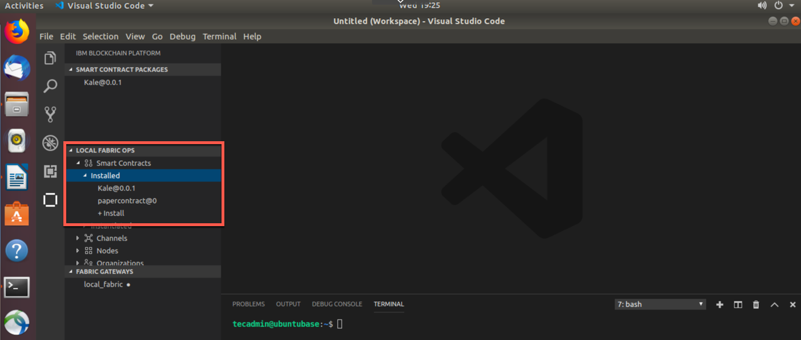
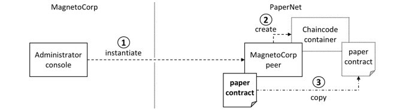
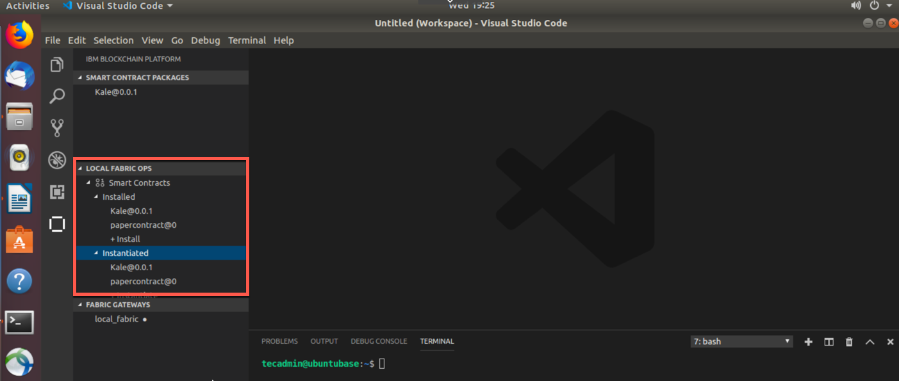
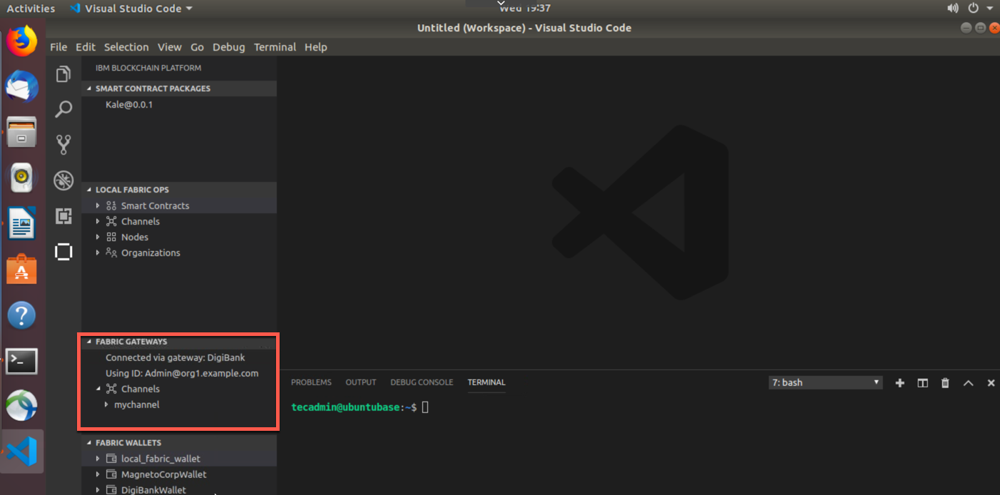
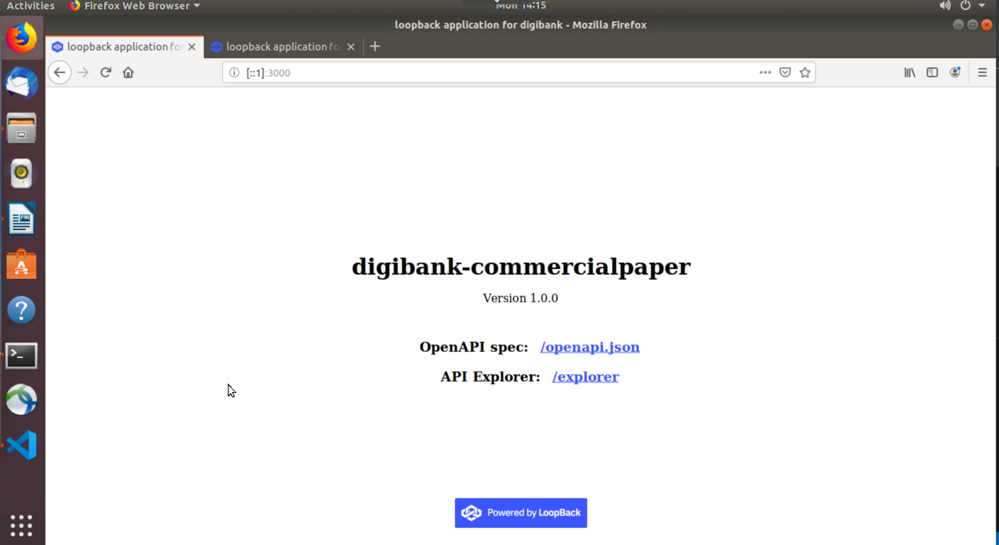
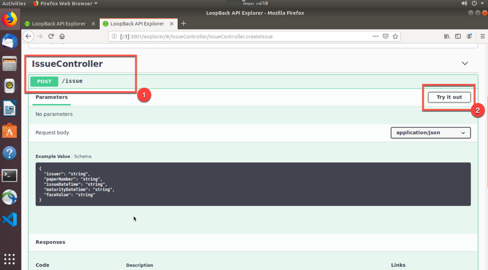
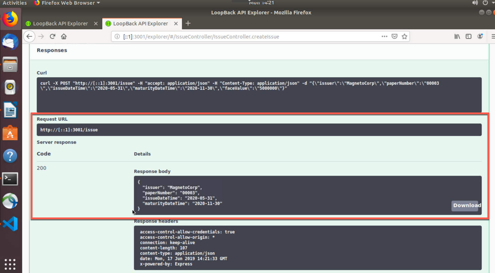
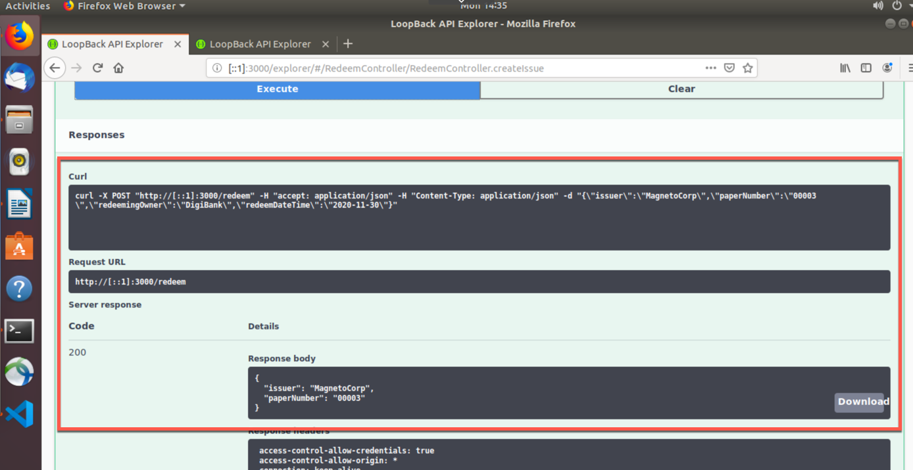

Section 1: Commercial Paper Overview
====================================

This tutorial works with a sample commercial paper trading network
called `PaperNet`. Commercial paper is a type of unsecured lending in
the form of a "promissory note". The papers are normally issued by large
corporations to raise funds to meet short-term financial obligations at
a fixed rate of interest. Once issued at a fixed price, for a fixed
term, another company or bank will purchase them at a discount to the
face value and when the term is up, they will be redeemed for their face
value.

As an example, if a paper was issued at a face value of 10M USD for a
6-month term at 2% interest then it could be bought for 9.8M USD (10M less
2%) by another company or bank who is willing to bear the risk that the
issuer will not default. Once the term is up, then the paper could be
redeemed or sold back to the issuer for its full face value of 10M USD.
Between buying and redemption, the paper can be bought or sold between
different parties on a commercial paper market.

These three key steps of issue, buy and redeem are the main transactions
in a simplified commercial paper marketplace, which we will mirror in
our lab. We will see a commercial paper issued by a company called
MagnetoCorp and, once issued on the commercial paper blockchain network,
another company called DigiBank will first buy the paper and then redeem
it.

You'll act as a developer, end user, and administrator, within different
organizations, performing various steps designed to help you understand
what it's like to collaborate as two different organizations working
independently, but according to mutually agreed rules in a Hyperledger
Fabric network.

Below is an image of our PaperNet network. For our lab, we will create
Isabella who is with MagnetoCorp. Additionally, we will create Balaji
who is with DigiBank. Isabella will issue a paper for the network. The
paper will have an ID number, when it was issued, the maturity date, and
the face value in USD. Balaji, from DigiBank, will then buy the paper and
then eventually redeem it.

Below is the full breakdown of Part 2 of this lab:

-   Setting the Stage
    :      Based off of Part 1, we have started a blockchain network,
            created a smart contract, created and run tests and then
            submitted transactions. For Part 2, we need to create a
            couple more docker containers that will set us up for
            success for the rest of the lab. One of these containers
            will just monitor the docker network we are operating in. If
            you have no idea what a docker network is, I will explain
            later on. The other container contains Hyperledger Fabric
            tools and is named cliMagnetoCorp, as MagnetoCorp will use
            the Hyperledger Fabric command line interface (cli) within
            this container.

-   Install and Instantiate Smart Contract
    :      Now that we have those new docker containers up and running,
            we will enter our cliMagnetoCorp container and install and
            instantiate our smart contract. Since we are connected to
            the same running local Hyperledger Fabric network, we will
            see the smart contract show up in VSCode.

-   Issue Identities and Submit Transactions
    :      In this section, we will issue two identities. One is an
            end-user named Isabella with MagnetoCorp. She will invoke a
            transaction that will issue a paper. Then we will issue an
            identity for DigiBank named Balaji. Balaji will act as the
            adminstrator for Digibank and will buy and redeem the paper
            that Isabella issued. Balaji is important in this lab, as we
            will add a Fabric Gateway connection to connect to his
            perspective of the network.

-   Create Fabric Gateways and Submit Transactions
    :      In this section we will create gateways that allows VSCode to
            connect to a running Hyperledger Fabric or IBM Blockchain
            Platform instance through a connection profile. In this lab,
            we will connect to our `local_fabric` network, which is also
            the Papernet network. We will create two gateways and
            associate our identies to these gateways. That way we can
            ensure the appropiate people are making the transactions
            they should.
            
-   Lab Cleanup
    :      This is the most bittersweet part of the entire lab. It means that this lab portion is over and we have to clean up. If you have kids (I don't), I'd imagine their faces are sad and full of despair when you (the guardian) tell them to clean up their mess. I'd also like to imagine your face is making a similar expression when we get to this lab. It's okay, more fun is going to be had soon - very soon!      

-   Loopback APIs
    :      We have proven that we can submit transactions through the
            command line interface (CLI) and the VSCode user interface.
            In this section, we will deploy two loopback API
            applications (for each of our organizations) and submit
            transactions through loopback. We will also include some
            transactions through the CLI and VSCode.

Section 2: Setting the Stage
============================

**1.** Navigate to your Desktop and then do a git clone of a repository
to gather all the things you need to run through this tutorial :

    tecadmin@ubuntubase:~$ cd Desktop/
    tecadmin@ubuntubase:~/Desktop$ ls -l
    total 0
    drwxr-xr-x  16 tecadmin  tecadmin  512 Jun 11 12:34 Kale
    tecadmin@ubuntubase:~/Desktop$ git clone https://github.com/austingrice/fabric-samples-cp.git
    Cloning into 'fabric-samples-cp'...
    remote: Enumerating objects: 85, done.
    remote: Counting objects: 100% (85/85), done.
    remote: Compressing objects: 100% (71/71), done.
    remote: Total 2658 (delta 26), reused 71 (delta 13), pack-reused 2573
    Receiving objects: 100% (2658/2658), 927.08 KiB | 0 bytes/s, done.
    Resolving deltas: 100% (1293/1293), done.
    tecadmin@ubuntubase:~/Desktop$ ls -l
    total 0
    drwxr-xr-x  22 tecadmin  tecadmin  704 Jun 11 12:41 fabric-samples-cp
    drwxr-xr-x  16 tecadmin  tecadmin  512 Jun 11 12:34 Kale

**2.** Then, do a `docker network list` to see all the running Docker
networks :

    tecadmin@ubuntubase:~/Desktop$ docker network list
    NETWORK ID          NAME                            DRIVER              SCOPE
    ad2e1a3e2fc2        bridge                          bridge              local
    35837170ae5b        fabricvscodelocalfabric_basic   bridge              local
    c5e0411b0d34        host                            host                local
    42ffa501f2f9        none                            null                local

**3.** The network we are operating out of is the
`fabricvscodelocalfabric_basic` network. You can see that by entering
the following command below :

    tecadmin@ubuntubase:~/Desktop$ docker network inspect fabricvscodelocalfabric_basic

That command will show you all the containers running in this network.
In a nutshell, docker networks are natural ways to isolate containers
from other containers or other networks. Having containers within a
network allows them to communicate with other containers in the same
network.

**4.** Within VSCode, go to the `Explorer` perspective and click on
`File` and select `Add Folder to Workplace..`. This will allow us to
work from an Untitled Workplace, but have the `fabric-samples-cp` folder
in there.

**5.** Within VSCode, navigate to the folder below within MagnetoCorp :

    fabric-samples-cp -> commercial-paper -> organizations -> magnetocorp -> configuration -> cli

You will see two files in there. One file is `monitordocker.sh` that
will produce log messages across the network that you specify it to look
at. If you click on this file to open it up, you'll see the file is
called to look at the `fabricvscodelocalfabric_basic` Docker network.
The other file is `docker-compose.yml`, which pulls down a
`fabric-tools` container that is connected to our local network. When we
spun up our `local_fabric` network, back in Part 1, it placed all the
cryptographic material in our
`/home/tecadmin/.fabric-vscode/crypto-config/` directory. It is then
taking all the crypto material and placing it in our fabric-tools
container. This will make more sense once we install and instantiate the
smart contract from this container instead of VSCode.

**6.** Now from the terminal navigate to the cli directory within
MagnetoCorp. **NOTE:** scroll over to see the entire command below :

    tecadmin@ubuntubase:~/Desktop$ cd fabric-samples-cp/commercial-paper/organization/magnetocorp/configuration/cli/
    tecadmin@ubuntubase:~/Desktop/fabric-samples-cp/commercial-paper/organization/magnetocorp/configuration/cli/$ ls -l
    total 16
    -rw-r--r--  1 tecadmin  tecadmin  1168 Jun 11 12:41 docker-compose.yml
    -rwxr-xr-x  1 tecadmin  tecadmin   751 Jun 11 12:44 monitordocker.sh

**7.** From here, we can actually start the `monitordocker.sh` script by
entering the command below. **NOTE:** scroll over to see the entire
command below :

    tecadmin@ubuntubase:~/Desktop/fabric-samples-cp/commercial-paper/organization/magnetocorp/configuration/cli/$ ./monitordocker.sh fabricvscodelocalfabric_basic
    #

**8.** Since this terminal is occupied with log messages, let's open
another terminal tab. We can open a new tab by clicking on `File` and
then selecting `New Tab`

**9.** When you opened a new tab, you should have been taken to the same
file path that you were in on the previous tab. Now that we have a
command line ready, go ahead and enter the command below that will
create a `cliMagnetoCorp` container for our docker network to use.
**NOTE:** scroll over to see the entire command below :

    tecadmin@ubuntubase:~/Desktop/fabric-samples-cp/commercial-paper/organization/magnetocorp/configuration/cli/$ docker-compose -f docker-compose.yml up -d cliMagnetoCorp
    .
    . # We'll see docker messages
    .
    Status: Downloaded newer image for hyperledger/fabric-tools:latest
    Creating cliMagnetoCorp ... 
    Creating cliMagnetoCorp ... done

When we first install the smart contract, we will go through the
cliMagnetoCorp container, which is our Administrator Console. This will
allow us to use Fabric peer commands.

**10.** We can also do a `docker ps -a` command to see all of our docker
containers. We should see two new containers - `cliMagnetoCorp` and
`logspout`

**11.** Equally, we could do
`docker network inspect fabricvscodelocalfabric_basic` to see all of our
containers together in one network - and no, not in a blockchain
network. They are, however, the components that make up our local
blockchain network :-)

Section 3: Install and Instantiate Commercial Paper Smart Contract
==================================================================

Before we actually install the commercial paper smart contract, let's
actually open the file to see what the smart contract is trying to do.

**1.** From your explorer perspective within VSCode, navigate from the
`fabric-samples-cp` folder to the contract folder of MagnetoCorp :

    fabric-samples-cp -> commercial-paper -> organization -> magnetocorp -> contract

Within the lib folder, you'll see 3 javascript (.js) files in there.
Click on the papercontract.js file, which will open it within VSCode

Let's dissect our papercontract.js file as it is our smart contract. We
will only go over the issue transaction, but the other transactions
follow pretty closely to this one

Below, these 2 lines of code bring into scope two key Hyperledger Fabric
classes that will be used extensively by the smart contract --
`Contract and Context` :

    // Fabric smart contract classes
    const { Contract, Context } = require('fabric-contract-api');

Below, we define the smart contract class `CommercialPaperContract`
based on the built-in Fabric Contract class. The methods which implement
the key transactions to issue, buy and redeem commercial paper are
defined within this class :

    /**
    * Define commercial paper smart contract by extending Fabric Contract class
    *
    */
    class CommercialPaperContract extends Contract {

Below, this method defines the commercial paper `issue` transaction for
the commercial paper blockchain network. The parameters that are passed
to this method will be used to create the new commercial paper. Locate
and examine the buy and redeem transactions within the smart contract :

    /**
    * Issue commercial paper
    *
    * @param {Context} ctx the transaction context
    * @param {String} issuer commercial paper issuer
    * @param {Integer} paperNumber paper number for this issuer
    * @param {String} issueDateTime paper issue date
    * @param {String} maturityDateTime paper maturity date
    * @param {Integer} faceValue face value of paper
    */
    async issue(ctx, issuer, paperNumber, issueDateTime, maturityDateTime, faceValue) {

Within the `issue` transaction, this statement creates a new commercial
paper in memory using the CommercialPaper class with the supplied
transaction inputs. Examine the buy, get paper and redeem transactions
to see how they similarly use this class :

    // create an instance of the paper
    let paper = CommercialPaper.createInstance(issuer, paperNumber, issueDateTime, maturityDateTime, faceValue);

Below, this statement adds the new commercial paper to the ledger using
`ctx.paperList`, an instance of a PaperList class that was created when
the smart contract context CommercialPaperContext was initialized.
Again, examine the buy and redeem methods to see how they use this class
:

    // Add the paper to the list of all similar commercial papers in the ledger world state
    await ctx.paperList.addPaper(paper);

Below you will find that this statement returns a binary buffer as
response from the issue transaction for processing by the caller of the
smart contract :

    // Must return a serialized paper to caller of smart contract
    return paper.toBuffer();

**2.** Now that we have an understanding of the smart contract, let's
actually install it on our peer through our terminal application.
**NOTE:** scroll over to see the entire command below :

    tecadmin@ubuntubase:~/Desktop/fabric-samples-cp/commercial-paper/organization/magnetocorp/configuration/cli/$ docker exec cliMagnetoCorp peer chaincode install -n papercontract -v 0 -p /opt/gopath/src/github.com/contract -l node
    2019-06-11 17:48:23.721 UTC [chaincodeCmd] checkChaincodeCmdParams -> INFO 001 Using default escc
    2019-06-11 17:48:23.721 UTC [chaincodeCmd] checkChaincodeCmdParams -> INFO 002 Using default vscc
    2019-06-11 17:48:23.862 UTC [chaincodeCmd] install -> INFO 003 Installed remotely response:<status:200 payload:"OK" >

A message saying 200 is a great sign to see.

If you notice, we are not in the contract folder of our command line
interface. Instead, we are entering the `cliMagnetoCorp` docker
container with `docker exec cliMagnetoCorp` and navigating to the
`/opt/gopath/src/github.com/contract` file path within our container to
grab the files we need to install the smart contract. The
`-n papercontract` flag names our smart contract papercontract. The
`-v 0` gives our smart contract a version of 0. Finally, the `-l node`
tells us that the language of our smart contract is nodejs. The picture
below goes into detail, visually, as to how we are actually installing a
copy of the commercial paper smart contract on our peer.

**3.** Since our network is connected to our VSCode instance, you can
refresh the `Local Fabric Ops panel` in VSCode under the
`IBM Blockchain Extension`. The refresh button (`unclosed circle icon`)
is revealed when you hover your mouse over the Local Fabric Ops panel

**4.** Since we have installed the smart contract, we should actually
make it active by instantiating it. **NOTE:** scroll over to see the
entire command below :

    tecadmin@ubuntubase:~/Desktop/fabric-samples-cp/commercial-paper/organization/magnetocorp/configuration/cli/$ docker exec cliMagnetoCorp peer chaincode instantiate -n papercontract -v 0 -l node -c '{"Args":["org.papernet.commercialpaper:instantiate"]}' -C mychannel -P ""
    2019-06-11 17:50:34.673 UTC [chaincodeCmd] InitCmdFactory -> INFO 001 Retrieved channel (mychannel) orderer endpoint:   orderer.example.com:17050
    2019-06-11 17:50:34.675 UTC [chaincodeCmd] checkChaincodeCmdParams -> INFO 002 Using default escc
    2019-06-11 17:50:34.675 UTC [chaincodeCmd] checkChaincodeCmdParams -> INFO 003 Using default vscc
    tecadmin@ubuntubase:~/Desktop/fabric-samples-cp/commercial-paper/organization/magnetocorp/configuration/cli/$

As you can see in the image below, we are instantiating a copy of the
commercial paper smart contract on our MagnetoCorp peer. Similar to the
installation of the smart contract, the instantiation goes into the
`cliMagnetoCorp` container. After successfully instantiating the smart
contract, there will be a commercial paper smart contract docker image
and container.

**5.** You will know our instantiate command worked when we get our
command prompt back without any error messages. You can really verify it
worked by going back to the VSCode and refreshing the Local Fabric Ops
panel and you should see it under the instantiate section.

Section 4: Create Identities and Submit Transactions
====================================================

Now that we have a ready-to-use smart contract, let's issue some
identities so that those identities can invoke and query transactions.

**1.** You should be within the cli folder of the MagnetoCorp folder.
You can confirm this by issuing the command below. **NOTE:** scroll over
to see the entire command below :

    tecadmin@ubuntubase:~/Desktop/fabric-samples-cp/commercial-paper/organization/magnetocorp/configuration/cli/$ pwd
    /home/tecadmin/Desktop/fabric-samples-cp/commercial-paper/organization/magnetocorp/configuration/cli
    tecadmin@ubuntubase:~/Desktop/fabric-samples-cp/commercial-paper/organization/magnetocorp/configuration/cli/$ 

**2.** This is a good sign. Issue the following command below to get to
the application folder within MagnetoCorp. **NOTE:** scroll over to see
the entire command below :

    tecadmin@ubuntubase:~/Desktop/fabric-samples-cp/commercial-paper/organization/magnetocorp/configuration/cli/$ cd ../../application/
    tecadmin@ubuntubase:~/Desktop/fabric-samples/commercial-paper/organization/magnetocorp/application$

**3.** Within VSCode, navigate to the same folder :

    fabric-samples-cp -> commercial-paper -> organization -> magnetocorp -> appplication

**4.** In that folder, you should see a file called `addtoWallet.js`.
Go ahead and click on it to open it up.

**5.** On line 25, you should see what is below :

    const key = fs.readFileSync(path.join(credPath, '/msp/keystore/<PUT_PRIVATE_KEY_HERE>')).toString();

**6.** To put in the file name of your actual private key, you can enter the command below
in your terminal application to find the key's file name. **NOTE:** scroll over
to see the entire command below :

    tecadmin@ubuntubase:~/Desktop/fabric-samples-cp/commercial-paper/organization/magnetocorp/application$ ls -l /home/tecadmin/.fabric-vscode/runtime/crypto-config/peerOrganizations/org1.example.com/users/User1@org1.example.com/msp/keystore/
    -rw-------@ 1 tecadmin  tecadmin  241 Jun 11 08:57 e7a117b799890646fe1d6e688d9c979845a411830400b673e2fe7dc01f91f9b8_sk

**7.** Now, copy your private key's file name,
`e7a117b799890646fe1d6e688d9c979845a411830400b673e2fe7dc01f91f9b8_sk` in this example- but your name will differ- 
and paste it in the field asking for your private key. For example, line 25
looks like this now. **NOTE:** scroll over to see the entire key file name below:

    const key = fs.readFileSync(path.join(credPath, '/msp/keystore/e7a117b799890646fe1d6e688d9c979845a411830400b673e2fe7dc01f91f9b8_sk')).toString(); 

**NOTE:** It is of the upmost importance that you are doing this from the
`magnetocorp/application` folder and you save this file. We will do the
Digibank folder here in a second.

**8.** Go ahead and save this file by either doing `File -> Save` or
`Control + s`.

**9.** Back in your terminal application, you can enter the command
below to install some dependencies. **NOTE:** scroll over to see the
entire command below :

    tecadmin@ubuntubase:~/Desktop/fabric-samples-cp/commercial-paper/organization/magnetocorp/application$ npm install 
    .
    . # A bunch of output, with some of the output repeating
    .
    node-pre-gyp WARN Using request for node-pre-gyp https download 
    [grpc] Success: "/home/tecadmin/Desktop/fabric-samples/commercial-paper/organization/magnetocorp/application/node_modules/grpc/src/node/extension_binary/node-v57-darwin-x64-unknown/grpc_node.node" is installed via remote
    npm notice created a lockfile as package-lock.json. You should commit this file.
    npm WARN nodejs@1.0.0 No description
    npm WARN nodejs@1.0.0 No repository field.

    added 318 packages in 36.994s

**10.** Since we are in our command line, let's issue the following
command that will create Isabella. **NOTE:** scroll over to see the
entire command below :

    tecadmin@ubuntubase:~/Desktop/fabric-samples-cp/commercial-paper/organization/magnetocorp/application$ node addToWallet.js 
    done

**11.** We will know it worked if we can execute the following command
successfully. **NOTE:** scroll over to see the entire command below :

    tecadmin@ubuntubase:~/Desktop/fabric-samples-cp/commercial-paper/organization/magnetocorp/application$ ls -l ../identity/user/isabella/wallet/
    total 0
    drwxr-xr-x  5 tecadmin  tecadmin  160 Jun 11 12:53 User1@org1.example.com
    tecadmin@ubuntubase:~/Desktop/fabric-samples-cp/commercial-paper/organization/magnetocorp/application$ ls -l ../identity/user/isabella/wallet/User1@org1.example.com/
    total 24
    -rw-r--r--  1 tecadmin  tecadmin  1037 Jun 11 12:53 User1@org1.example.com
    -rw-r--r--  1 tecadmin  tecadmin   246 Jun 11 12:53 e7a117b799890646fe1d6e688d9c979845a411830400b673e2fe7dc01f91f9b8-priv
    -rw-r--r--  1 tecadmin  tecadmin   182 Jun 11 12:53 e7a117b799890646fe1d6e688d9c979845a411830400b673e2fe7dc01f91f9b8-pub

Keys are vital to understanding how transactions and identity work
within a blockchain network. Below is a breakdown of the keys and
certificate used in this example:

-   a **private key** `e7a117b799...-priv` used to sign transactions on
    Isabella's behalf, but not distributed outside of her immediate
    control
-   a **public key** `e7a117b799...-pub` which is cryptographically
    linked to Isabella's private key. This public key is contained
    within Isabella's X.509 certificate
-   a **certificate** `User1@org.example.com` which contains Isabella's
    public key and other X.509 attributes added by the Certificate
    Authority at certificate creation. This certificate is distributed
    to the network so that different actors at different times can
    cryptographically verify information signed by Isabella's private
    key

**12.** Before we submit our first transaction, let's go over it below.
You can find the code by clicking on `issue.js` within the
`magnetocorp/application` folder in VSCode.

Below we bring two key Hyperledger Fabric SDK classes into scope --
`Wallet and Gateway`. Because Isabella's X.509 certificate is in the
local file system, the application uses FileSystemWallet :

    // Bring key classes into scope, most importantly Fabric SDK network class 
    const { FileSystemWallet, Gateway } = require('fabric-network');

Below, this line is very important. Because we are connecting to our
local\_fabric we started at the beginning of Part 1, the crypto material
is stored under the .fabric-vscode/runtime folder. This is important for
grabbing our unique private key:

    const fixtures = path.resolve(__dirname, '/home/tecadmin/.fabric-vscode/runtime');

Below, this statement identifies that the application will use
Isabella's wallet when it connects to the blockchain network channel.
The application will select a particular identity within Isabella's
wallet. (The wallet must have been loaded with Isabella's X.509
certificate -- that's what addToWallet.js does):

    // A wallet stores a collection of identities for use 
    const wallet = new FileSystemWallet('../identity/user/isabella/wallet');

This line of code, below, connects to the network using the gateway
identified by connectionProfile, using the identity referred to in
connectionOptions. See how `../gateway/networkConnection.yaml` and
`User1@org1.example.com` are used for these values respectively:

    // Connect to gateway using application specified parameters 
    await gateway.connect(connectionProfile, connectionOptions);

Below in the couple lines of code, the application connects to the
network channel `mychannel`, where the papercontract was previously
instantiated. If you had a different channel name, you would have to
modify this line of code:

    // Access commercial paper network 
    const network = await gateway.getNetwork('mychannel');

Below, this statement gives the application addressability to the smart
contract defined by the namespace `org.papernet.commercialpaper` within
`papercontract`. Once an application has issued `getContract`, it can
submit any transaction implemented within it:

    // Get addressability to commercial paper contract 
    const contract = await network.getContract('papercontract', 'org.papernet.comm...');

Below, these lines of code submit a transaction to the network using the
issue transaction defined within the smart contract.
`MagnetoCorp, 00001` are the values to be used by the issue transaction
to create a new commercial paper:

    // issue commercial paper 
    const issueResponse = await contract.submitTransaction('issue','MagnetoCorp', '00001', '2020-05-31', '2020-11-30','5000000');

This statement, below, processes the response from the issue
transaction. The response needs to be deserialized from a buffer into
paper, a CommercialPaper object which can be interpreted correctly by
the application:

    // process response let paper =
    CommercialPaper.fromBuffer(issueResponse);

**13.** Now that we have Isabella from MagnetoCorp, let's perform the
issue transaction from our terminal. **NOTE:** scroll over to see the
entire command below:

    tecadmin@ubuntubase:~/Desktop/fabric-samples-cp/commercial-paper/organization/magnetocorp/application$ node issue.js
    Connect to Fabric gateway.
    Use network channel: mychannel.
    Use org.papernet.commercialpaper smart contract.
    Submit commercial paper issue transaction.
    2019-02-22T17:55:20.631Z - info: [TransactionEventHandler]: _strategySuccess: strategy success for transaction "f8e124886d6cb84434cb6a996f4889145c0541199c88bab7d4d85ae41266e51e"
    Process issue transaction response.
    MagnetoCorp commercial paper : 00001 successfully issued for value 5000000
    Transaction complete.
    Disconnect from Fabric gateway.
    Issue program complete.

This successfully committed a transaction to the ledger. See how it
outputted a transaction hash for us. You can look at our
`monitoring docker` terminal tab as well.

As you can see in the image below, we are using the certificate
belonging to Isabella to submit our paper issue transaction. Once we
verify that Isabella can submit a transaction (via her certificate), the
gateway allows the application to focus on transaction generation,
submission and response. It coordinates the transaction proposal,
ordering and notification processing between the different network
components.

**14.** Since we have created an identity for MagnetoCorp, let's also
create Balaji from DigiBank. To do so, we will need a third command line
tab. We can add another command line tab by clicking on
`File -> New Tab.` This will create a new tab in the terminal from the
exact folder directory we were in from our second command line tab. This
third tab will act as DigiBank.

**15.** We now need to switch to a new directory, specifically the
application folder of DigiBank. **NOTE:** scroll over to see the entire
command below:

    tecadmin@ubuntubase:~/Desktop/fabric-samples-cp/commercial-paper/organization/magnetocorp/application$ cd ../../digibank/application/
    tecadmin@ubuntubase:~/Desktop/fabric-samples-cp/commercial-paper/organization/digibank/application$

**16.** Within VSCode, navigate to the application folder of DigiBank :

    fabric-samples-cp -> commercial-paper -> organization -> digibank -> application

**17.** Similarly, you will see `<PUT_PRIVATE_KEY_HERE>` in the
`addtoWallet.js` file within the `application` folder. On line 25, you
should see what is below :

    const key = fs.readFileSync(path.join(credPath, '/msp/keystore/<PUT_PRIVATE_KEY_HERE>')).toString();

**18.** To put in an actual private keys's file name, you can enter the command below
in your terminal application to find the key's file name. **NOTE:** scroll over
to see the entire key below:

    tecadmin@ubuntubase:~/Desktop/fabric-samples-cp/commercial-paper/organization/digibank/application$ ls -l /home/tecadmin/.fabric-vscode/runtime/crypto-config/peerOrganizations/org1.example.com/users/Admin@org1.example.com/msp/keystore/
    -rw-------@ 1 tecadmin  tecadmin  241 Jun 11 08:57 4fd5a19cad827af71cf356d629f95c41f77e27db09d268a3c72aabdaead43737_sk

**19.** Now, copy your private key's file name,
`4fd5a19cad827af71cf356d629f95c41f77e27db09d268a3c72aabdaead43737_sk` in our example- yours will differ- 
and paste in the field asking for your private key. For example, line 25
looks like this now. **NOTE:** scroll over to see the entire file name below:

    const key = fs.readFileSync(path.join(credPath, '/msp/keystore/4fd5a19cad827af71cf356d629f95c41f77e27db09d268a3c72aabdaead43737_sk')).toString(); 

**NOTE:** It is of the upmost importance that you are doing this from the
`digibank/application` folder and you save this file.

**20.** Now we can install some dependencies that are required to create
our identity. To do this, enter the command that is below. **NOTE:**
scroll over to see the entire command below :

    tecadmin@ubuntubase:~/Desktop/fabric-samples-cp/commercial-paper/organization/digibank/application$ npm install 
    .
    . # A bunch of output, with some of the output repeating
    .
    node-pre-gyp WARN Using request for node-pre-gyp https download 
    [grpc] Success: "/home/tecadmin/Desktop/fabric-samples/commercial-paper/organization/magnetocorp/application/node_modules/grpc/src/node/extension_binary/node-v57-darwin-x64-unknown/grpc_node.node" is installed via remote
    npm notice created a lockfile as package-lock.json. You should commit this file.
    npm WARN nodejs@1.0.0 No description
    npm WARN nodejs@1.0.0 No repository field.

    added 318 packages in 36.994s

**21.** Since we are in our command line, let's issue the following
command that will create Balaji. **NOTE:** scroll over to see the
entire command below:

    tecadmin@ubuntubase:~/Desktop/fabric-samples-cp/commercial-paper/organization/digibank/application$ node addToWallet.js 
    done

**22.** We will know it worked if we can execute the following command
successfully. **NOTE:** scroll over to see the entire command below :

    tecadmin@ubuntubase:~/Desktop/fabric-samples-cp/commercial-paper/organization/digibank/application$ ls -l ../identity/user/balaji/wallet/
    total 0
    drwxr-xr-x  5 tecadmin  tecadmin  160 Jun 11 12:53 Admin@org1.example.com
    tecadmin@ubuntubase:~/Desktop/fabric-samples-cp/commercial-paper/organization/digibank/application$ ls -l ../identity/user/balaji/wallet/Admin@org1.example.com/
    total 24
    -rw-r--r--  1 tecadmin  tecadmin  1037 Jun 11 12:53 User1@org1.example.com
    -rw-r--r--  1 tecadmin  tecadmin   246 Jun 11 12:53 4fd5a19cad827af71cf356d629f95c41f77e27db09d268a3c72aabdaead43737-priv
    -rw-r--r--  1 tecadmin  tecadmin   182 Jun 11 12:53 4fd5a19cad827af71cf356d629f95c41f77e27db09d268a3c72aabdaead43737-pub

Based on the picture below, we now have 2 participants in this network.
Obviously, this is MagnetoCorp (Isabella) and DigiBank (Balaji). Both
participants are allowed to interact with the commercial paper
blockchain network through their application.

**23.** Since we have issued a paper from Isabella, let's go ahead and
submit a couple of transactions from Balaji and DigiBank. Go ahead and
get the latest status of our paper by entering the command below.
**NOTE:** scroll over to see the entire command below:

    tecadmin@ubuntubase:~/Desktop/fabric-samples-cp/commercial-paper/organization/digibank/application$ node getPaper.js
    Connect to Fabric gateway.
    Use network channel: mychannel.
    Use org.papernet.commercialpaper smart contract.
    Submit commercial paper getPaper transaction.
    Process getPaper transaction response.
     +--------- Paper Retrieved ---------+ 
     | Paper number: "00001"
     | Paper is owned by: "MagnetoCorp"
     | Paper is currently: "ISSUED"
     | Paper face value: "5000000"
     | Paper is issued by: "MagnetoCorp"
     | Paper issue on: "2020-05-31"
     | Paper matures on: "2020-11-30"
     +-----------------------------------+ 
    Transaction complete.
    Disconnect from Fabric gateway.
    getPaper program complete.

**24.** Now that we know the current status of our `00001` paper,
let's go ahead and buy and redeem the paper by entering the command
below. **NOTE:** scroll over to see the entire command below :

    tecadmin@ubuntubase:~/Desktop/fabric-samples-cp/commercial-paper/organization/digibank/application$ node buy.js
    Connect to Fabric gateway.
    Use network channel: mychannel.
    Use org.papernet.commercialpaper smart contract.
    Submit commercial paper buy transaction.
    2019-02-28T19:52:17.372Z - info: [TransactionEventHandler]: _strategySuccess: strategy success for transaction "871e7743c58e406575d4e553330faae3711c0a65a2f677b6e6d398650069d81a"
    Process buy transaction response.
    MagnetoCorp commercial paper : 00001 successfully purchased by DigiBank
    Transaction complete.
    Disconnect from Fabric gateway.
    Buy program complete.

**25.** We can finish the cycle of paper `00001` by doing a redeem
transaction. The command is below. **NOTE:** scroll over to see the
entire command below :

    tecadmin@ubuntubase:~/Desktop/fabric-samples-cp/commercial-paper/organization/digibank/application$ node redeem.js 
    Connect to Fabric gateway.
    Use network channel: mychannel.
    Use org.papernet.commercialpaper smart contract.
    Submit commercial paper redeem transaction.
    2019-02-28T19:52:46.452Z - info: [TransactionEventHandler]: _strategySuccess: strategy success for transaction "c26ecbf1077d99a5ea025c339ffabd88eb22cf4e6ac5ff8d9b570cd6c38eb531"
    Process redeem transaction response.
    MagnetoCorp commercial paper : 00001 successfully redeemed with MagnetoCorp
    Transaction complete.
    Disconnect from Fabric gateway.
    Redeem program complete

**26.** To confirm that we actually redeemed the paper, you can do a
`getPaper` transaction to see that it was, indeed, redeemed. **NOTE:**
scroll over to see the entire command below :

    tecadmin@ubuntubase:~/Desktop/fabric-samples-cp/commercial-paper/organization/digibank/application$ node getPaper.js
    Connect to Fabric gateway.
    Use network channel: mychannel.
    Use org.papernet.commercialpaper smart contract.
    Submit commercial paper getPaper transaction.
    Process getPaper transaction response.
    +--------- Paper Retrieved ---------+ 
    | Paper number: "00001"
    | Paper is owned by: "MagnetoCorp"
    | Paper is currently: "REDEEMED"
    | Paper face value: "5000000"
    | Paper is issued by: "MagnetoCorp"
    | Paper issue on: "2020-05-31"
    | Paper matures on: "2020-11-30"
    +-----------------------------------+ 
    Transaction complete.
    Disconnect from Fabric gateway.
    getPaper program complete

Now, we have run through the full lifecycle of one paper through the
command line interface (CLI). In the following sections we will use a
mixture of the CLI, the VSCode user interface, and a loopback API service
application.

Section 5: Create Fabric Gateways and Submit Transactions
=========================================================

In the previous section, we created two identities -
`Isabella and Balaji` - and then completed a full lifecycle of one paper.
Let's create a fabric gateway for Isabella and Balaji and then submit
some more transactions.

**1.** Within VSCode, go to the IBM Blockchain Platform Extension. One
of the sections you'll see is called `Fabric Gateways`. If you click on
the gear icon in the bottom left, select `Command Pallette..`. You'll be
given a prompt and you can enter this command below :

    >IBM Blockchain Platform: Add Gateway

**2.** For our first Gateway, let's create MagnetoCorp. So when it
prompts you for: `Enter a name for the gateway` enter the following
below :

    MagnetoCorp

**3.** Then it will prompt you for a path to the connection profile.
Click on browse and it will open a file window. Navigate to the path
below and select `networkConnection.yaml`. **NOTE:** scroll over to see
the entire file path below :

    Desktop -> fabric-samples-cp -> commercial-paper -> organization -> magnetocorp -> gateway -> networkConnection.yaml
    .

**4.** Then it will place that new gateway in the `Fabric Gateway`
section within the IBM Blockchain Platform Extension. Now that we have a
gateway, we need to create an identity to use this gateway. To do this,
hover your cursor over the `Fabric Wallets` section of the extension.
There you'll see a `+` icon. Click on that `+` icon to add a wallet.

**5.** Then it will prompt you: `Choose a method to add a wallet` and
for that select `Specify an existing file system wallet`. We are
selecting this because we already have added Isabella as an identity and
she has a wallet folder.

**6.** Then it will prompt you: `Enter file path to a wallet directory`
and then select `Browse`. It will then pop-up a file window. From there,
you can navigate to the following path below. **NOTE:** scroll over to
see the entire file path below:

    Desktop -> fabric-samples-cp -> commercial-paper -> organization -> magnetocorp -> identity -> user -> isabella -> wallet
    .

Once you have selected `wallet`, click on `select` to choose this
option. Then it will add a wallet, called `wallet`, to our
`Fabric Wallets` section of the extension.

**7.** Once you see the wallet called `wallet` in the `Fabric Wallet`
section, go ahead and right click on `wallet`. How many times can you
say `wallet` in a sentence. From there, select `Edit Wallet` and it will
open a `settings.json` file with your wallet name and wallet path
highlighted. Go ahead and **only** change the `wallet name` to
`MagnetoCorpWallet`. Look below to see the example:

    "name": "wallet",
    "walletPath": "/home/tecadmin/Desktop/fabric-samples-cp/commercial-paper/organization/magnetocorp/identity/user/isabella/wallet"

    ---- CHANGE TO -----

    "name": "MagnetoCorpWallet",
    "walletPath": "/home/tecadmin/Desktop/fabric-samples-cp/commercial-paper/organization/magnetocorp/identity/user/isabella/wallet"

**8.** Once you have made that change, go ahead and save this file by
doing a `File -> Save` or `Control + S`. Also - leave this file open as
we will want to change the name for Digibank once we create their
wallet.

**9.** Speaking of Digibank, we now need to do the same process for
them. So click on the gear icon in the bottom left, select
`Command Pallette..`. You'll be given a prompt and you can enter this
command below:

    >IBM Blockchain Platform: Add Gateway

**10.** For our second Gateway, let's create DigiBank. So when it
prompts you for: `Enter a name for the gateway` enter the following
below:

    DigiBank

**11.** Then it will prompt you for a path to the connection profile.
Click on browse and it will open a file window. Navigate to the path
below and select `networkConnection.yaml`. **NOTE:** scroll over to see
the entire file path below:

    Desktop -> fabric-samples-cp -> commercial-paper -> organization -> digibank -> gateway -> networkConnection.yaml
    .

**12.** Then it will place that new gateway in the `Fabric Gateway`
section within the IBM Blockchain Platform Extension. Now that we have a
gateway, we need to create an identity to use this gateway. To do this,
hover your cursor over the `Fabric Wallets` section of the extension.
There you'll see a `+` icon. Click on that `+` icon to add a wallet.

**13.** Then it will prompt you: `Choose a method to add a wallet` and
for that select `Specify an existing file system wallet`. We are
selecting this because we already have added Isabella as an identity and
she has a wallet folder.

**14.** Then it will prompt you: `Enter file path to a wallet directory`
and then select `Browse`. It will then pop-up a file window. From there,
you can navigate to the following path below. **NOTE:** scroll over to
see the entire file path below:

    Desktop -> fabric-samples-cp -> commercial-paper -> organization -> digibank -> identity -> user -> balaji -> wallet
    .

Once you have selected `wallet`, click on `select` to choose this
option. Then it will add a wallet, called `wallet`, to our
`Fabric Wallets` section of the extension.

**15.** Once you see the wallet called `wallet` in the `Fabric Wallet`
section, go ahead and right click on `wallet`. From there, select
`Edit Wallet` and it will open a `settings.json` file with your wallet
name and wallet path highlighted. Go ahead and **only** change the
`wallet name` to `DigiBankWallet`. Look below to see the example:

    "name": "wallet",
    "walletPath": "/home/tecadmin/Desktop/fabric-samples-cp/commercial-paper/organization/digibank/identity/user/balaji/wallet"

    ---- CHANGE TO -----

    "name": "DigiBankWallet",
    "walletPath": "/home/tecadmin/Desktop/fabric-samples-cp/commercial-paper/organization/digibank/identity/user/balaji/wallet"

**16.** Once you have made that change, go ahead and save this file by
doing a `File -> Save` or `Control + S`. Now within your
`Fabric Wallets` section, you should have `MagnetCorpWallet` and
`DigiBankWallet` as our two custom wallets.

**17.** Now that we have two wallets, we can associate our wallets to
our two gateways. To do this `right click` on `MagnetoCorp` within the
`Fabric Gateways` section. Then select `Associate A Wallet`. Then it
will prompt you for which wallet to associate with this gateway. You
will want to select `MagnetoCorpWallet`.

What this does is when you connect with a specific gateway, it will
automatically use that wallet you associated it with. For example,
whenever you click on MagnetoCorp within the `Fabric Gateway` section,
it will automatically use the `MagnetoCorpWallet` wallet without
prompting you.

**18.** Do the same thing for DigiBank. `Right click` on `DigiBank`
within the `Fabric Gateways` section. Then select `Associate A Wallet`.
Then it will prompt you for which wallet to associate with this gateway.
You will want to select `DigiBankWallet`.

**19.** To confirm that we have done this successfully, you can click on
both gateways. You'll see the identities it is using once you connect to
a specific gateway. To disconect from a gateway, there is a `door` in
the `Fabric Gateways` section in which you can click on to leave.

**20.** Now that we have our gateways figured out, let's do another
lifecycle of a commercial paper. To do this, we need to do an `issue`
transaction. First click on the `MagnetoCorp` gateway and untoggle till
you see the transactions within the `papercontract@0`. From there,
`right click` on the `issue` transaction and select
`Submit Transaction`. Within the brackets, place the text below:

    "MagnetoCorp", "00002", "2020-05-31", "2020-11-30", "5000000"

You can hit enter again to bypass the next prompt asking for transient
data. That will execute the transaction and issue paper `00002`

**21.** To make sure we are all operating on the same paper number, we
need to change a few files. I have broken down the files we need to
change below within VSCode in the Editior perspective.

From `digibank/application` folder, within the `getPaper.js` file
on line `68`:

    const getPaperResponse = await contract.evaluateTransaction('getPaper', 'MagnetoCorp', '00001');

    ---- CHANGE TO ----

    const getPaperResponse = await contract.evaluateTransaction('getPaper', 'MagnetoCorp', '00002');

**Make sure you save this file.**

From `` `digibank/application `` folder, within the `redeem.js` file on
line `67`:

    const redeemResponse = await contract.submitTransaction('redeem', 'MagnetoCorp', '00001', 'DigiBank', '2020-11-30');

    ---- CHANGE TO ----

    const redeemResponse = await contract.submitTransaction('redeem', 'MagnetoCorp', '00002', 'DigiBank', '2020-11-30');

**Make sure you save this file.**

**22.** Now we can execute more transactions. First, jump back to the
CLI and do a `getPaper.js` transaction. Below you will see what the
command is to execute the transaction. **NOTE:** scroll over to see the entire command below:

    tecadmin@ubuntubase:~/Desktop/fabric-samples-cp/commercial-paper/organization/digibank/application$ node getPaper.js
    Connect to Fabric gateway.
    Use network channel: mychannel.
    Use org.papernet.commercialpaper smart contract.
    Submit commercial paper getPaper transaction.
    Process getPaper transaction response.
     +--------- Paper Retrieved ---------+ 
     | Paper number: "00002"
     | Paper is owned by: "MagnetoCorp"
     | Paper is currently: "ISSUED"
     | Paper face value: "5000000"
     | Paper is issued by: "MagnetoCorp"
     | Paper issue on: "2020-05-31"
     | Paper matures on: "2020-11-30"
     +-----------------------------------+ 
    Transaction complete.
    Disconnect from Fabric gateway.
    getPaper program complete.

**23.** Within VSCode and the IBM Blockchain Platform, we can buy the
same paper. To do this, leave the `MagnetoCorp` gateway, and then click on the
`DigiBank` gateway.

**24.** Now, untoggle till you see the `buy` transaction within the
`papercontract@0` smart contract. From there, `right click` on the `buy`
transaction and select `Submit Transaction`. Once it gives you a prompt,
enter the text below between the brackets:

    "MagnetoCorp","00002","MagnetoCorp","DigiBank","4900000","2019-07-31"

Then hit `enter` to go to the next prompt. Hit `enter` once again to
bypass the transient data prompt. Then that will execute the `buy`
transaction.

**25.** To confirm that the transaction worked (other than the log
messages in the output window), we can do a `getPaper` transaction from
the CLI again. **NOTE:** scroll over to see the entire command below:

    tecadmin@ubuntubase:~/Desktop/fabric-samples-cp/commercial-paper/organization/digibank/application$ node getPaper.js
    Connect to Fabric gateway.
    Use network channel: mychannel.
    Use org.papernet.commercialpaper smart contract.
    Submit commercial paper getPaper transaction.
    Process getPaper transaction response.
    +--------- Paper Retrieved ---------+ 
     | Paper number: "00002"
     | Paper is owned by: "DigiBank"
     | Paper is currently: "TRADING"
     | Paper face value: "5000000"
     | Paper is issued by: "MagnetoCorp"
     | Paper issue on: "2020-05-31"
     | Paper matures on: "2020-11-30"
     +-----------------------------------+ 
    Transaction complete.
    Disconnect from Fabric gateway.
    getPaper program complete.

**26.** From the same CLI, we can do a `redeem.js` transaction. **NOTE:** scroll over to see the entire command below:

    tecadmin@ubuntubase:~/Desktop/fabric-samples/commercial-paper/organization/digibank/application$ node redeem.js 
    Connect to Fabric gateway.
    Use network channel: mychannel.
    Use org.papernet.commercialpaper smart contract.
    Submit commercial paper redeem transaction.
    2019-02-28T19:52:46.452Z - info: [TransactionEventHandler]: _strategySuccess: strategy success for transaction "c26ecbf1077d99a5ea025c339ffabd88eb22cf4e6ac5ff8d9b570cd6c38eb531"
    Process redeem transaction response.
    MagnetoCorp commercial paper : 00002 successfully redeemed with MagnetoCorp
    Transaction complete.
    Disconnect from Fabric gateway.
    Redeem program complete.

**27.** Again, we can confirm that this was recorded by doing another
`getPaper.js` transaction. **NOTE:** scroll over to see the entire
command below:

    tecadmin@ubuntubase:~/Desktop/fabric-samples-cp/commercial-paper/organization/digibank/application$ node getPaper.js
    Connect to Fabric gateway.
    Use network channel: mychannel.
    Use org.papernet.commercialpaper smart contract.
    Submit commercial paper getPaper transaction.
    Process getPaper transaction response.
     +--------- Paper Retrieved ---------+ 
     | Paper number: "00002"
     | Paper is owned by: "MagnetoCorp"
     | Paper is currently: "REDEEMED"
     | Paper face value: "5000000"
     | Paper is issued by: "MagnetoCorp"
     | Paper issue on: "2020-05-31"
     | Paper matures on: "2020-11-30"
     +-----------------------------------+ 
    Transaction complete.
    Disconnect from Fabric gateway.
    getPaper program complete.

Section 6: Lab Clean-Up
=========================================================

This lab has run it's course, but now it is time to clean up. Don't worry, this is a very short section! 

**1.** Entering the following commands to stop and remove our docker containers. Then we can remove the images as well. Look at the following commands below
::

    tecadmin@ubuntubase:~/Desktop/fabric-samples-cp/commercial-paper/organization/digibank/application$ docker stop $(docker ps -a -q)
    *
    *
    * Docker container IDs
    *
    *
    tecadmin@ubuntubase:~/Desktop/fabric-samples-cp/commercial-paper/organization/digibank/application$ docker rm $(docker ps -a -q)
    *
    *
    * Docker container IDs
    
That's it!

Section 7: Loopback APIs
========================

In this section, we are going to create a loopback API application for
each MagnetoCorp and Digibank. Once we have created these applications,
you'll be able to submit transactions and have them be recorded in our
blockchain network.

**1.** From the CLI application, open a new tab and naviagate to your
desktop. Once you are at the desktop, install the loopback npm package.
You can find these commands below :

    tecadmin@ubuntubase:~/Desktop/fabric-samples-cp/commercial-paper/organization/digibank/application$ cd /home/tecadmin/Desktop
    tecadmin@ubuntubase:~/Desktop$ npm install -g @loopback/cli

**2.** Once you have the loopback installed, go ahead and follow the
series of commands and prompts below. I'll explain these after we have
completed this. :

    ----- Create Our App -----

    tecadmin@ubuntubase:~/Desktop$ lb4 app
    ? Project name: digibank
    ? Project description: loopback application for digibank
    ? Project root directory: digibank
    ? Application class name: DigibankApplication
    ? Select features to enable in the project (Press <space> to select, <a> to toggle all, <i> to invert selection)Enable eslint, Enable 
    prettier, Enable mocha, Enable loopbackBuild, Enable vscode, Enable docker, Enable repositories, Enable services
       create .eslintignore
       create .eslintrc.js
       create .mocharc.json
       create .npmrc
       create .prettierignore
       create .prettierrc
       create DEVELOPING.md
       create README.md
       create index.ts
       create package.json
       create tsconfig.json
       create .vscode/settings.json
       create .vscode/tasks.json
       create .gitignore
       create .dockerignore
       create Dockerfile
       create index.js
       create public/index.html
       create src/application.ts
       create src/index.ts
       create src/migrate.ts
       create src/sequence.ts
       create src/__tests__/README.md
       create src/controllers/README.md
       create src/controllers/index.ts
       create src/controllers/ping.controller.ts
       create src/datasources/README.md
       create src/models/README.md
       create src/repositories/README.md
       create src/__tests__/acceptance/home-page.acceptance.ts
       create src/__tests__/acceptance/ping.controller.acceptance.ts
       create src/__tests__/acceptance/test-helper.ts

    added 546 packages from 1480 contributors and audited 4133 packages in 14.495s
    found 3 vulnerabilities (1 low, 2 moderate)
      run `npm audit fix` to fix them, or `npm audit` for details

    Application digibank was created in digibank.

    ----- Create Models for our Buy and Redeem Transactions -----

    tecadmin@ubuntubase:~/Desktop$ cd digibank/
    tecadmin@ubuntubase:~/Desktop/digibank$ lb4 model
    ? Model class name: Buy
    ? Please select the model base class Entity (A persisted model with an ID)
    ? Allow additional (free-form) properties? No
    Let's add a property to Buy
    Enter an empty property name when done

    ? Enter the property name: issuer
    ? Property type: string
    ? Is issuer the ID property? No
    ? Is it required?: Yes
    ? Default value [leave blank for none]: 

    Let's add another property to Buy
    Enter an empty property name when done

    ? Enter the property name: paperNumber
    ? Property type: string
    ? Is paperNumber the ID property? No
    ? Is it required?: Yes
    ? Default value [leave blank for none]: 

    Let's add another property to Buy
    Enter an empty property name when done

    ? Enter the property name: currentOwner
    ? Property type: string
    ? Is currentOwner the ID property? No
    ? Is it required?: Yes
    ? Default value [leave blank for none]: 

    Let's add another property to Buy
    Enter an empty property name when done

    ? Enter the property name: newOwner
    ? Property type: string
    ? Is newOwner the ID property? No
    ? Is it required?: Yes
    ? Default value [leave blank for none]: 

    Let's add another property to Buy
    Enter an empty property name when done

    ? Enter the property name: price
    ? Property type: string
    ? Is price the ID property? No
    ? Is it required?: Yes
    ? Default value [leave blank for none]: 

    Let's add another property to Buy
    Enter an empty property name when done

    ? Enter the property name: purchaseDateTime
    ? Property type: string
    ? Is purchaseDateTime the ID property? No
    ? Is it required?: Yes
    ? Default value [leave blank for none]: 

    Let's add another property to Buy
    Enter an empty property name when done

    ? Enter the property name: --- Press Enter! ---
       create src/models/buy.model.ts
       update src/models/index.ts

    Model Buy was created in src/models/

    tecadmin@ubuntubase:~/Desktop/digibank$ lb4 model
    ? Model class name: Redeem
    ? Please select the model base class Entity (A persisted model with an ID)
    ? Allow additional (free-form) properties? No
    Let's add a property to Redeem
    Enter an empty property name when done

    ? Enter the property name: issuer
    ? Property type: string
    ? Is issuer the ID property? No
    ? Is it required?: Yes
    ? Default value [leave blank for none]: 

    Let's add another property to Redeem
    Enter an empty property name when done

    ? Enter the property name: paperNumber
    ? Property type: string
    ? Is paperNumber the ID property? No
    ? Is it required?: Yes
    ? Default value [leave blank for none]: 

    Let's add another property to Redeem
    Enter an empty property name when done

    ? Enter the property name: redeemingOwner
    ? Property type: string
    ? Is redeemingOwner the ID property? No
    ? Is it required?: Yes
    ? Default value [leave blank for none]: 

    Let's add another property to Redeem
    Enter an empty property name when done

    ? Enter the property name: redeemDateTime
    ? Property type: string
    ? Is redeemDateTime the ID property? No
    ? Is it required?: Yes
    ? Default value [leave blank for none]: 

    Let's add another property to Redeem
    Enter an empty property name when done

    ? Enter the property name: --- Press Enter! ---
       create src/models/redeem.model.ts
       update src/models/index.ts

    Model Redeem was created in src/models/

    ----- Create a Datasource -----

    tecadmin@ubuntubase:~/Desktop/digibank$ lb4 datasource
    ? Datasource name: db
    ? Select the connector for db: In-memory db (supported by StrongLoop)
    ? window.localStorage key to use for persistence (browser only): 
    ? Full path to file for persistence (server only): ./data/db.json
       create src/datasources/db.datasource.json
       create src/datasources/db.datasource.ts
       update src/datasources/index.ts

    Datasource db was created in src/datasources/

    ----- Create a Repository -----

    tecadmin@ubuntubase:~/Desktop/digibank$ lb4 repository
    ? Please select the datasource DbDatasource
    ? Select the model(s) you want to generate a repository (Press <space> to select, <a> to toggle all, <i> to invert selection)Buy, Redeem
    ? Please select the repository base class DefaultCrudRepository (Legacy juggler bridge)
    ? Please enter the name of the ID property for Buy: id
    ? Please enter the name of the ID property for Redeem: id
       create src/repositories/buy.repository.ts
       create src/repositories/redeem.repository.ts
       update src/repositories/index.ts
       update src/repositories/index.ts

    Repositories BuyRepository,RedeemRepository was created in src/repositories/

    ----- Create a Controller for both the Buy and Redeem Transaction -----

    tecadmin@ubuntubase:~/Desktop/digibank$ lb4 controller
    ? Controller class name: Buy
    ? What kind of controller would you like to generate? REST Controller with CRUD functions
    ? What is the name of the model to use with this CRUD repository? Buy
    ? What is the name of your CRUD repository? BuyRepository
    ? What is the type of your ID? string
    ? What is the base HTTP path name of the CRUD operations? /buys
       create src/controllers/buy.controller.ts
       update src/controllers/index.ts

    Controller Buy was created in src/controllers/

    tecadmin@ubuntubase:~/Desktop/digibank$ lb4 controller
    ? Controller class name: Redeem
    ? What kind of controller would you like to generate? REST Controller with CRUD functions
    ? What is the name of the model to use with this CRUD repository? Redeem
    ? What is the name of your CRUD repository? RedeemRepository
    ? What is the type of your ID? string
    ? What is the base HTTP path name of the CRUD operations? /redeems
       create src/controllers/redeem.controller.ts
       update src/controllers/index.ts

    Controller Redeem was created in src/controllers/

What you just did above is basically create the bones to our loopback
API application. We needed to create our app, model, datasource,
repository and controller to actually create our application. Below is a
breakdown of each thing we created

**App:** :

    The LoopBack 4 CLI toolkit comes with templates that generate whole applications, as well as artifacts (for example, controllers, models, and repositories) for existing applications.

    tecadmin@ubuntubase:~/Desktop$ lb4 app
    ? Project name: digibank
    ? Project description: loopback application for digibank
    ? Project root directory: digibank
    ? Application class name: DigibankApplication
    ? Select features to enable in the project (Press <space> to select, <a> to toggle all, <i> to invert selection)Enable eslint, Enable --- Press enter to enable all of these! ---
    prettier, Enable mocha, Enable loopbackBuild, Enable vscode, Enable docker, Enable repositories, Enable services

**Model:** :

    Now we can begin working on the representation of our data for use with LoopBack 4, which needs to aglin with what is in our . To that end, we’re going to create an issue and buy model that can represent instances of a task for our papercontract. A model describes business domain objects and defines a list of properties with name, type, and other constraints. Models are used for data exchange on the wire or between different systems. 

    tecadmin@ubuntubase:~/Desktop/digibank$ lb4 model
    ? Model class name: Buy
    ? Please select the model base class Entity (A persisted model with an ID)
    ? Allow additional (free-form) properties? No
    Let's add a property to Buy
    Enter an empty property name when done

    ? Enter the property name: issuer
    ? Property type: string
    ? Is issuer the ID property? No
    ? Is it required?: Yes
    ? Default value [leave blank for none]:

    Let's add another property to Buy
    Enter an empty property name when done

    * More data fields

    create src/models/buy.model.ts
    update src/models/index.ts

    Model Buy was created in src/models/

**Datasource:** :

    Datasources are LoopBack’s way of connecting to various sources of data, such as databases, APIs, message queues and more. In LoopBack 4, datasources can be represented as strongly-typed objects and freely made available for injection throughout the application. Typically, in LoopBack 4, datasources are used in conjunction with Repositories to provide access to data.

    tecadmin@ubuntubase:~/Desktop/digibank$ lb4 datasource
    ? Datasource name: db
    ? Select the connector for db: In-memory db (supported by StrongLoop)
    ? window.localStorage key to use for persistence (browser only):
    ? Full path to file for persistence (server only): ./data/db.json
       create src/datasources/db.datasource.json
       create src/datasources/db.datasource.ts
       update src/datasources/index.ts

    Datasource db was created in src/datasources/

**Repositories:** :

    A Repository represents a specialized Service interface that provides strong-typed data access (for example, CRUD) operations of a domain model against the underlying database or service.

    tecadmin@ubuntubase:~/Desktop/digibank$ lb4 repository
    ? Please select the datasource DbDatasource
    ? Select the model(s) you want to generate a repository (Press <space> to select, <a> to toggle all, <i> to invert selection)Buy, Redeem
    ? Please select the repository base class DefaultCrudRepository (Legacy juggler bridge)
    ? Please enter the name of the ID property for Buy: id
    ? Please enter the name of the ID property for Redeem: id
       create src/repositories/buy.repository.ts
       create src/repositories/redeem.repository.ts
       update src/repositories/index.ts
       update src/repositories/index.ts

**Controller:** :

    In LoopBack 4, controllers handle the request-response lifecycle for your API. Each function on a controller can be addressed individually to handle an incoming request (like a POST request to /todos), to perform business logic, and to return a response.

    tecadmin@ubuntubase:~/Desktop/digibank$ lb4 controller
    ? Controller class name: Buy
    ? What kind of controller would you like to generate? REST Controller with CRUD functions
    ? What is the name of the model to use with this CRUD repository? Buy
    ? What is the name of your CRUD repository? BuyRepository
    ? What is the type of your ID? string
    ? What is the base HTTP path name of the CRUD operations? /buys
      create src/controllers/buy.controller.ts
      update src/controllers/index.ts

    Controller Buy was created in src/controllers/

You can find out more information and great tutorials as to how to build
your own loopback API application here:
<https://loopback.io/doc/en/lb4/index.html>

**3.** Within VSCode, go to the `Edititor Perspective` and do
`File -> Add Folder to Workplace` and navigate to the `digibank` folder
that we just created within the `Desktop` folder. Go ahead and open that
folder in VScode.

**4.** Now within VSCode, right click on `digibank` - the folder you
just opened in VSCode. Once you right click, select `New Folder` and
name it `data`. Really mysterious right?

**5.** On the newly created folder, `data`, right click on that folder
and select `New File` and name that file `db.json`. Within that new
file, add in this text below :

    {
      "ids": {
        "Todo": 5
      },
      "models": {
        "Todo": {
          "1": "{\"title\":\"Take over the galaxy\",\"desc\":\"MWAHAHAHAHAHAHAHAHAHAHAHAHAMWAHAHAHAHAHAHAHAHAHAHAHAHA\",\"id\":1}",
          "2": "{\"title\":\"destroy alderaan\",\"desc\":\"Make sure there are no survivors left!\",\"id\":2}",
          "3": "{\"title\":\"terrorize senate\",\"desc\":\"Tell them they're getting a budget cut.\",\"id\":3}",
          "4": "{\"title\":\"crush rebel scum\",\"desc\":\"Every.Last.One.\",\"id\":4}"
        }
    }

**Go ahead and save this file!** This file, db.json, contains an example
database.

**6.** Within the `digibank` folder in VSCode, navigate to the following
folder :

    digibank -> src -> repositories

You should see 4 files in there: `README.md`, `buy.respistory.ts`,
`redeem.respostory.ts`, and `index.ts`

**7.** Within the `buy.respitory.ts` file, add `//` on line 8. Look
below as to what to do :

    typeof Buy.prototype.id

    --- CHANGE TO ---

    // typeof Buy.prototype.id

**Go ahead and save this file!**

**8.** Do the same thing for `redeem.respository.ts` on line 8 :

    typeof Redeem.prototype.id

    --- CHANGE TO ---

    // typeof Redeem.prototype.id

**Go ahead and save this file!**

**9.** Within the `digibank` folder in VSCode, navigate to the following
folder :

    digibank -> src -> controllers

You should see 5 files in there: `README.md`, `buy.controller.ts`,
`redeem.controller.ts`, `ping.controller.ts`, and `index.ts`

**10.** Within the `buy.controller.ts` file, delete all of its contents
and paste in the code that is below :

    // Copyright IBM Corp. 2017,2018. All Rights Reserved.
    // Node module: @loopback/example-todo
    // This file is licensed under the MIT License.
    // License text available at https://opensource.org/licenses/MIT

    import {
      del,
      get,
      getFilterSchemaFor,
      param,
      patch,
      post,
      put,
      requestBody,
    } from '@loopback/rest';
    import { Buy } from '../models';

    import { BlockChainModule } from '../blockchainClient';

    let blockchainClient = new BlockChainModule.BlockchainClient();

    export class BuyController {
      constructor() { }

      @post('/buy', {
        responses: {
          '200': {
            description: 'Todo model instance',
            content: { 'application/json': { schema: { 'x-ts-type': Buy } } },
          },
        },
      })
      async createBuy(@requestBody() requestBody: Buy): Promise<Buy> {
        console.log('Buy, requestBody: ')
        console.log(requestBody)
        let networkObj = await blockchainClient.connectToNetwork();
        if (!networkObj) {
          let errString = 'Error connecting to network';
          let buy = new Buy({
            issuer: errString, paperNumber: errString, currentOwner: errString, newOwner: errString,
            price: errString, purchaseDateTime: errString
          });
          return buy;
        }
        console.log('newtork obj: ')
       console.log(networkObj)
       // dateStr = dateStr.toDateString();
        let dataForBuy = {
          function: 'buy',
          issuer: requestBody.issuer,
          paperNumber: requestBody.paperNumber,
          currentOwner: requestBody.currentOwner,
          newOwner: requestBody.newOwner,
          price: requestBody.price,
          purchaseDateTime: requestBody.purchaseDateTime,
          contract: networkObj.contract
        };

        var resultAsBuffer = await blockchainClient.buy(dataForBuy);

        console.log('result from blockchainClient.submitTransaction in controller: ')
        let result = JSON.parse(Buffer.from(JSON.parse(resultAsBuffer)).toString())
        let buy = new Buy({
          issuer: result.issuer, paperNumber: result.paperNumber, currentOwner: result.currentOwner,
          newOwner: result.currentOwner, price: result.price, purchaseDateTime: result.purchaseDateTime
        });
        return buy;
      }

    }

**Go ahead and save this file!** Below is a breakdown of this file above

Below, we are pulling in the buy model that we created when we created
our loopback API application :

    import { Buy } from '../models';

Below, we are only specifying a post API call. A post call, adds data,
in this case a transaction against our blockchain network, to our
ledgers :

    @post('/buy', {
        responses: {
          '200': {

Below, we are actually submitting a transaction, a buy transaction. This
transaction is looking for all the data fields we created in our buy
model file. If all goes well, we will successfully buy a
commercialpaper. :

    async createBuy(@requestBody() requestBody: Buy): Promise<Buy> {
      console.log('Buy, requestBody: ')
      console.log(requestBody)
      let networkObj = await blockchainClient.connectToNetwork();
      if (!networkObj) {
        let errString = 'Error connecting to network';
        let buy = new Buy({
          issuer: errString, paperNumber: errString, currentOwner: errString, newOwner: errString,
          price: errString, purchaseDateTime: errString
        });
        return buy;
      }

**11.** Within the `redeem.controller.ts` file, delete all of its
contents and paste in what is below :

    // Copyright IBM Corp. 2017,2018. All Rights Reserved.
    // Node module: @loopback/example-todo
    // This file is licensed under the MIT License.
    // License text available at https://opensource.org/licenses/MIT

    import {
      del,
      get,
      getFilterSchemaFor,
      param,
      patch,
      post,
      put,
      requestBody,
    } from '@loopback/rest';
    import { Redeem } from '../models';

    import { BlockChainModule } from '../blockchainClient';

    let blockchainClient = new BlockChainModule.BlockchainClient();

    export class RedeemController {
      constructor() { }

      @post('/redeem', {
        responses: {
          '200': {
            description: 'Todo model instance',
            content: { 'application/json': { schema: { 'x-ts-type': Redeem } } },
          },
        },
      })
      async createIssue(@requestBody() requestBody: Redeem): Promise<Redeem> {
        console.log('Buy, requestBody: ')
        console.log(requestBody)

        let networkObj = await blockchainClient.connectToNetwork();
        if (!networkObj) {
          let errString = 'Error connecting to network';
          let redeem = new Redeem({
            issuer: errString, paperNumber: errString, redeemingOwner: errString,
            redeemDateTime: errString
         });
         return redeem;
        }
        console.log('newtork obj: ')
        console.log(networkObj)

        let dataForRedeem = {
          function: 'redeem',
          issuer: requestBody.issuer,
          paperNumber: requestBody.paperNumber,
          redeemingOwner: requestBody.redeemingOwner,
          redeemDateTime: requestBody.redeemDateTime,
          contract: networkObj.contract
        };

        var resultAsBuffer = await blockchainClient.redeem(dataForRedeem);

        console.log('result from blockchainClient.submitTransaction in controller: ')
        let result = JSON.parse(Buffer.from(JSON.parse(resultAsBuffer)).toString())
       let issue = new Redeem({
         issuer: result.issuer, paperNumber: result.paperNumber, redeemingOwner: result.redeemingOwner,
         redeemDateTime: result.redeemDateTime
       });
       return issue;
     }

    }

**Go ahead and save this file!**

**12.** Within VSCode, right click on the `src` folder (within the
`digibank` folder) and select `New File`. Go ahead and name this file
`blockchainClient.ts`

**13.** Within our new `blockchainClient.ts` file, paste in this code
below :

    const yaml = require('js-yaml');
    const { FileSystemWallet, Gateway } = require('fabric-network');
    const fs = require('fs');

    // A wallet stores a collection of identities for use
    const wallet = new FileSystemWallet('/home/tecadmin/Desktop/fabric-samples-cp/commercial-paper/organization/digibank/identity/user/balaji/wallet');

    export module BlockChainModule {

      export class BlockchainClient {
        async connectToNetwork() {

          const gateway = new Gateway();

          try {
            console.log('connecting to Fabric network...')

           const identityLabel = 'Admin@org1.example.com';
           let connectionProfile = yaml.safeLoad(fs.readFileSync('./networkConnection.yaml', 'utf8'));

           let connectionOptions = {
             identity: identityLabel,
             wallet: wallet,
             discovery: {
               asLocalhost: true
             }
           };

           // Connect to gateway using network.yaml file and our certificates in _idwallet directory
           await gateway.connect(connectionProfile, connectionOptions);

           console.log('Connected to Fabric gateway.');

           // Connect to our local fabric
           const network = await gateway.getNetwork('mychannel');

           console.log('Connected to mychannel. ');

           // Get the contract we have installed on the peer
           const contract = await network.getContract('papercontract');

           let networkObj = {
             contract: contract,
             network: network
           };

            return networkObj;

        } catch (error) {
           console.log(`Error processing transaction. ${error}`);
           console.log(error.stack);
         } finally {
           console.log('Done connecting to network.');
           // gateway.disconnect();
          }

        }

       async redeem(args: any) {

          console.log('args for redeem: ')
          console.log(args)

          let response = await args.contract.submitTransaction(args.function,
            args.issuer, args.paperNumber, args.redeemingOwner, args.redeemDateTime
          );

          return response;
        }

        async buy(args: any) {

          console.log('args for buy: ')
          console.log(args)

          let response = await args.contract.submitTransaction(args.function,
            args.issuer, args.paperNumber, args.currentOwner, args.newOwner,
            args.price, args.purchaseDateTime
          );

          return response;

        }
      }
    }

**Go ahead and save this file!** Below is a breakdown of our
blockchainClient.ts file

Below, you'll see that we are specifing where our user's credientials
are located to validate that our user can actually submit a transaction.
:

    // A wallet stores a collection of identities for use
    const wallet = new FileSystemWallet('/home/tecadmin/Desktop/fabric-samples-cp/commercial-paper/organization/digibank/identity/user/balaji/wallet');

Below, we are saying that within the balaji/wallet folder we are using
Admin@org1.example.com as our user. Also, we are saying that our
connection profile is networkConnection.yaml located one directory back.
We will copy the connection profile in the next section. :

    const identityLabel = 'Admin@org1.example.com';
    let connectionProfile = yaml.safeLoad(fs.readFileSync('./networkConnection.yaml', 'utf8'));

Below, we are connection to our channel, called mychannel, and also
using our smart contract, called papercontract :

    // Connect to our local fabric
    const network = await gateway.getNetwork('mychannel');

    console.log('Connected to mychannel. ');

    // Get the contract we have installed on the peer
    const contract = await network.getContract('papercontract');

Below, we are actually submitting our redeem transaction. There is a
very similar transaction, but for buy. This will use our redeem
controller as a basis for our actual arguments (args). :

    async redeem(args: any) {

    console.log('args for redeem: ')
    console.log(args)

    let response = await args.contract.submitTransaction(args.function,
        args.issuer, args.paperNumber, args.redeemingOwner, args.redeemDateTime
    );

        return response;
    }

**14.** Now, we need to copy our `networkConnection.yaml` file over from
`digibank` in our `fabric-samples-cp` folder and place it into our
`digibank` folder. You can execute the command below, from our CLI
application, as to how to copy :

    tecadmin@ubuntubase:~/Desktop/digibank$ cp /home/tecadmin/Desktop/fabric-samples-cp/commercial-paper/organization/digibank/gateway/networkConnection.yaml .

**15.** We need to modify our `package.json` file to include the
`fabric-network` module. Within our `digibank` folder, find the
`package.json` file and add in the following text below on `line 58` :

    "fabric-network": "~1.4.1"

So now our `dependecies` look like this :

    "dependencies": {
      "@loopback/boot": "^1.4.0",
      "@loopback/context": "^1.19.0",
      "@loopback/core": "^1.8.1",
      "@loopback/openapi-v3": "^1.6.1",
      "@loopback/repository": "^1.6.1",
      "@loopback/rest": "^1.15.0",
      "@loopback/rest-explorer": "^1.2.1",
      "@loopback/service-proxy": "^1.2.1",
      "fabric-network": "~1.4.1"

**Do not forget to add a comma (,) after the
["@loopback/service-proxy"](mailto:"@loopback/service-proxy"): "\^1.2.1"
dependency**

**Go ahead and save this file!**

**16.** Now we can delete the `node_modules` and `package-lock.json`
file so that it will pick up the `fabric-network` package on we install
again. To do this, within VSCode, right click on `node_modules` and
select `Delete`. Do the same for `node_modules`. If it asks you to
confirm this, select `Move to Trash`.

**17.** Back in our CLI application, do an `npm install` within the
`digibank` folder :

    tecadmin@ubuntubase:~/Desktop/digibank$ npm install
    *
    *
    *
    added 748 packages from 1578 contributors and audited 4980 packages in 45.757s
    found 3 vulnerabilities (1 low, 2 moderate)

**18.** Then you can do an `npm build` as well from the same folder :

    tecadmin@ubuntubase:~/Desktop/digibank$ npm run build

    > digibank@1.0.0 build /home/tecadmin/Desktop/digibank
    > lb-tsc es2017 --outDir dist

**19.** We will hold off on starting the server until we have built the
MagnetoCorp loopback application as well.

**20.** Speaking of MagnetoCorp, let's build their loopback API
application. It will be very similar to how we built DigiBank's.

**21.** Go ahead and follow the series of commands and prompts below to
create MagnetoCorp's loopback application. I'll explain these after we
have completed this. :

    ----- Create Our App -----

    tecadmin@ubuntubase:~/Desktop/digibank$ cd ..
    tecadmin@ubuntubase:~/Desktop$ lb4 app
    ? Project name: magnetocorp-commercialpaper
    ? Project description: loopback application for magnetocorp-commercialpaper
    ? Project root directory: magnetocorp-commercialpaper
    ? Application class name: MagnetocorpCommercialpaperApplication
    ? Select features to enable in the project (Press <space> to select, <a> to toggle all, <i> to invert selection)Enable eslint, Enable --- Press enter to enable all of these! --- prettier, Enable mocha, Enable loopbackBuild, Enable vscode, Enable docker, Enable repositories, Enable services
       create .eslintignore
       create .eslintrc.js
       create .mocharc.json
       create .npmrc
       create .prettierignore
       create .prettierrc
       create DEVELOPING.md
       create README.md
       create index.ts
       create package.json
       create tsconfig.json
       create .vscode/settings.json
       create .vscode/tasks.json
       create .gitignore
       create .dockerignore
       create Dockerfile
       create index.js
       create public/index.html
       create src/application.ts
       create src/index.ts
       create src/migrate.ts
       create src/sequence.ts
       create src/__tests__/README.md
       create src/controllers/README.md
       create src/controllers/index.ts
       create src/controllers/ping.controller.ts
       create src/datasources/README.md
       create src/models/README.md
       create src/repositories/README.md
       create src/__tests__/acceptance/home-page.acceptance.ts
       create src/__tests__/acceptance/ping.controller.acceptance.ts
       create src/__tests__/acceptance/test-helper.ts
    *
    *

    added 546 packages from 1480 contributors and audited 4133 packages in 14.495s
    found 3 vulnerabilities (1 low, 2 moderate)
      run `npm audit fix` to fix them, or `npm audit` for details

    Application magnetocorp-commercialpaper was created in magnetocorp-commercialpaper.

    ----- Create Models for our Issue Transaction -----
    
    tecadmin@ubuntubase:~/Desktop$ cd magnetocorp-commercialpaper/
    tecadmin@ubuntubase:~/Desktop/magnetocorp-commercialpaper$ lb4 model
    ? Model class name: Issue
    ? Please select the model base class Entity (A persisted model with an ID)
    ? Allow additional (free-form) properties? No
    Let's add a property to Issue
    Enter an empty property name when done

    ? Enter the property name: issuer
    ? Property type: string
    ? Is issuer the ID property? No
    ? Is it required?: Yes
    ? Default value [leave blank for none]:

    Let's add another property to Issue
    Enter an empty property name when done

    ? Enter the property name: paperNumber
    ? Property type: string
    ? Is paperNumber the ID property? No
    ? Is it required?: Yes
    ? Default value [leave blank for none]:

    Let's add another property to Issue
    Enter an empty property name when done

    ? Enter the property name: issueDateTime
    ? Property type: string
    ? Is currentOwner the ID property? No
    ? Is it required?: Yes
    ? Default value [leave blank for none]:

    Let's add another property to Issue
    Enter an empty property name when done

    ? Enter the property name: maturityDateTime
    ? Property type: string
    ? Is newOwner the ID property? No
    ? Is it required?: Yes
    ? Default value [leave blank for none]:

    Let's add another property to Issue
    Enter an empty property name when done

    ? Enter the property name: faceValue
    ? Property type: string
    ? Is price the ID property? No
    ? Is it required?: Yes
    ? Default value [leave blank for none]:

    Let's add another property to Buy
    Enter an empty property name when done

    ? Enter the property name: --- Press Enter! ---
       create src/models/issue.model.ts
       update src/models/index.ts

    Model Buy was created in src/models/

    ----- Create a Datasource -----

    tecadmin@ubuntubase:~/Desktop/magnetocorp-commercialpaper$ lb4 datasource
    ? Datasource name: db
    ? Select the connector for db: In-memory db (supported by StrongLoop)
    ? window.localStorage key to use for persistence (browser only):
    ? Full path to file for persistence (server only): ./data/db.json
       create src/datasources/db.datasource.json
       create src/datasources/db.datasource.ts
       update src/datasources/index.ts

    Datasource db was created in src/datasources/

    ----- Create a Repository -----

    tecadmin@ubuntubase:~/Desktop/magnetocorp-commercialpaper$ lb4 repository
    ? Please select the datasource DbDatasource
    ? Select the model(s) you want to generate a repository (Press <space> to select, <a> to toggle all, <i> to invert selection)Issue
    ? Please select the repository base class DefaultCrudRepository (Legacy juggler bridge)
    ? Please enter the name of the ID property for Issue: id
       create src/repositories/issue.repository.ts
       update src/repositories/index.ts

    Repositories IssueRepository was created in src/repositories/
    
    ----- Create a Controller for the Issue Transaction -----
    
    tecadmin@ubuntubase:~/Desktop/magnetocorp-commercialpaper$ lb4 controller
    ? Controller class name: Issue
    ? What kind of controller would you like to generate? REST Controller with CRUD functions
    ? What is the name of the model to use with this CRUD repository? Issue
    ? What is the name of your CRUD repository? IssueRepository
    ? What is the type of your ID? string
    ? What is the base HTTP path name of the CRUD operations? /issues
      create src/controllers/issue.controller.ts
      update src/controllers/index.ts

    Controller Issue was created in src/controllers/

You had to do the same thing for MagnetoCorp, as you did for DigiBank,
and their loopback API application.

**22.** Within VSCode, go to the `Edititor Perspective` and do
`File -> Add Folder to Workplace` and navigate to the
`magnetocorp-commercialpaper` folder that we just created within the
`Desktop` folder. Go ahead and open that folder in VScode.

**23.** Now within VSCode, right click on `magnetocorp-commercialpaper`
- the folder you just opened in VSCode. Once you right click, select
`New Folder` and name it `data`. Really mysterious right?

**24.** On the newly created folder, `data`, right click on that folder
and select `New File` and name that file `db.json`. Within that new
file, add in this text below :

    {
      "ids": {
        "Todo": 5
      },
      "models": {
        "Todo": {
          "1": "{\"title\":\"Take over the galaxy\",\"desc\":\"MWAHAHAHAHAHAHAHAHAHAHAHAHAMWAHAHAHAHAHAHAHAHAHAHAHAHA\",\"id\":1}",
          "2": "{\"title\":\"destroy alderaan\",\"desc\":\"Make sure there are no survivors left!\",\"id\":2}",
          "3": "{\"title\":\"terrorize senate\",\"desc\":\"Tell them they're getting a budget cut.\",\"id\":3}",
          "4": "{\"title\":\"crush rebel scum\",\"desc\":\"Every.Last.One.\",\"id\":4}"
        }
    }

**Go ahead and save this file!** This file, db.json, contains an example
database.

**25.** Within the `magnetocorp-commercialpaper` folder in VSCode,
navigate to the following folder :

    magnetocorp-commercialpaper -> src -> repositories

You should see 3 files in there: `README.md`, `issue.respistory.ts`, and
`index.ts`

**26.** Within the `issue.respitory.ts` file, add `//` on line 8. Look
below as to what to do :

    typeof Issue.prototype.id

    --- CHANGE TO ---

    // typeof Issue.prototype.id

**Go ahead and save this file!**

**27.** Within the `magnetocorp-commercialpaper` folder in VSCode,
navigate to the following folder :

    magnetocorp-commercialpaper -> src -> controllers

You should see 4 files in there: `README.md`, `issue.controller.ts`,
`ping.controller.ts`, and `index.ts`

**28.** Within the `issue.controller.ts` file, delete all of its
contents and paste in the code that is below :

    // Copyright IBM Corp. 2017,2018. All Rights Reserved.
    // Node module: @loopback/example-todo
    // This file is licensed under the MIT License.
    // License text available at https://opensource.org/licenses/MIT

    import {
      del,
      get,
      getFilterSchemaFor,
      param,
      patch,
      post,
      put,
      requestBody,
    } from '@loopback/rest';
    import { Issue } from '../models';

    import { BlockChainModule } from '../blockchainClient';

    let blockchainClient = new BlockChainModule.BlockchainClient();

    export class IssueController {
      constructor() { }

      @post('/issue', {
        responses: {
          '200': {
            description: 'Todo model instance',
            content: { 'application/json': { schema: { 'x-ts-type': Issue } } },
          },
        },
      })
      async createIssue(@requestBody() requestBody: Issue): Promise<Issue> {
        console.log('Buy, requestBody: ')
        console.log(requestBody)

        let networkObj = await blockchainClient.connectToNetwork();
        if (!networkObj) {
          let errString = 'Error connecting to network';
          let issue = new Issue({ issuer: errString, paperNumber: errString, issueDateTime: errString, maturityDateTime: errString });
          return issue;
        }
        console.log('newtork obj: ')
        console.log(networkObj)

        let dataForIssue = {
          function: 'issue',
          issuer: requestBody.issuer,
          paperNumber: requestBody.paperNumber,
          issueDateTime: requestBody.issueDateTime,
          maturityDateTime: requestBody.maturityDateTime,
          faceValue: requestBody.faceValue,
          contract: networkObj.contract
        };

        var resultAsBuffer = await blockchainClient.issue(dataForIssue);

        console.log('result from blockchainClient.submitTransaction in controller: ')
        console.log('result from blockchainClient.submitTransaction in controller: ')
        let result = JSON.parse(Buffer.from(JSON.parse(resultAsBuffer)).toString())
        let issue = new Issue({
          issuer: result.issuer, paperNumber: result.paperNumber, issueDateTime: result.issueDateTime,
          maturityDateTime: result.maturityDateTime
        });
        return issue;
      }

    }

**Go ahead and save this file!**

**29.** Within VSCode, right click on the `src` folder (within the
`magnetocorp-commercial` folder) and select `New File`. Go ahead and
name this file `blockchainClient.ts`

**30.** Within our new `blockchainClient.ts` file, paste in this code
below :

    const yaml = require('js-yaml');
    const { FileSystemWallet, Gateway } = require('fabric-network');
    const fs = require('fs');

    // A wallet stores a collection of identities for use
    const wallet = new FileSystemWallet('/home/tecadmin/Desktop/fabric-samples-cp/commercial-paper/organization/magnetocorp/identity/user/isabella/wallet');

    export module BlockChainModule {

      export class BlockchainClient {
        async connectToNetwork() {

          const gateway = new Gateway();

          try {
            console.log('connecting to Fabric network...')

           const identityLabel = 'User1@org1.example.com';
           let connectionProfile = yaml.safeLoad(fs.readFileSync('./networkConnection.yaml', 'utf8'));

           let connectionOptions = {
             identity: identityLabel,
             wallet: wallet,
             discovery: {
               asLocalhost: true
             }
           };

           // Connect to gateway using network.yaml file and our certificates in _idwallet directory
           await gateway.connect(connectionProfile, connectionOptions);

           console.log('Connected to Fabric gateway.');

           // Connect to our local fabric
           const network = await gateway.getNetwork('mychannel');

           console.log('Connected to mychannel. ');

           // Get the contract we have installed on the peer
           const contract = await network.getContract('papercontract');

           let networkObj = {
             contract: contract,
             network: network
           };

            return networkObj;

        } catch (error) {
           console.log(`Error processing transaction. ${error}`);
           console.log(error.stack);
         } finally {
           console.log('Done connecting to network.');
           // gateway.disconnect();
          }

        }

        async issue(args: any) {

          console.log('args for issue: ')
          console.log(args)

          let response = await args.contract.submitTransaction(args.function,
            args.issuer, args.paperNumber, args.issueDateTime, args.maturityDateTime,
            args.faceValue
          );

          return response;

        }
      }
    }

**Go ahead and save this file!**

**31.** Now, we need to copy our `networkConnection.yaml` file over from
`magnetocorp` in our `fabric-samples-cp` folder and place it into our
`magnetocorp-commercial` folder. You can execute the command below, from
our CLI application, as to how to copy :

    tecadmin@ubuntubase:~/Desktop/magnetocorp-commercial$ cp /home/tecadmin/Desktop/fabric-samples-cp/commercial-paper/organization/magnetocorp/gateway/networkConnection.yaml .

**32.** Within our `magnetocorp-commercial` folder in VSCode, find the
`index.js` file. In here there is a port number we need to change. Since
`digibank-commercialpaper` is occupying port
3000, we should make magnetocorp-commercial\` occupy port `3001`. You
can find the port number within the `index.js` file on line 9. Look
below at to what to do :

    port: +process.env.PORT || 3000,

    --- CHANGE TO ---

    port: +process.env.PORT || 3001,

**33.** We need to modify our `package.json` file to include the
`fabric-network` module. Within our `magnetocorp-commercial` folder,
find the `package.json` file and add in the following text below on
`line 58` :

    "fabric-network": "~1.4.1"

So now our `dependecies` look like this :

    "dependencies": {
      "@loopback/boot": "^1.4.0",
      "@loopback/context": "^1.19.0",
      "@loopback/core": "^1.8.1",
      "@loopback/openapi-v3": "^1.6.1",
      "@loopback/repository": "^1.6.1",
      "@loopback/rest": "^1.15.0",
      "@loopback/rest-explorer": "^1.2.1",
      "@loopback/service-proxy": "^1.2.1",
      "fabric-network": "~1.4.1"

**Do not forget to add a comma (,) after the
["@loopback/service-proxy"](mailto:"@loopback/service-proxy"): "\^1.2.1"
dependency**

**Go ahead and save this file!**

**34.** Now we can delete the `node_modules` and `package-lock.json`
file so that it will pick up the `fabric-network` package on we install
again. To do this, within VSCode, right click on `node_modules` and
select `Delete`. Do the same for `node_modules`. If it asks you to
confirm this, select `Move to Trash`.

**35.** Back in our CLI application, do an `npm install` within the
`digibank` folder :

    tecadmin@ubuntubase:~/Desktop/magnetocorp-commercial$ npm install
    *
    *
    *
    added 748 packages from 1578 contributors and audited 4980 packages in 45.757s
    found 3 vulnerabilities (1 low, 2 moderate)

**36.** Then you can do an `npm build` as well from the same folder :

    tecadmin@ubuntubase:~/Desktop/magnetocorp-commercial$ npm run build

    > magnetocorp-commercialpaper@1.0.0 build /home/tecadmin/Desktop/digibank
    > lb-tsc es2017 --outDir dist

**37.** Now, we can start both loopback applications. Let's first go
start DigiBank's. To do this, find go to your CLI application - where
you generate the `digibank` folder. Then run the command below :

    tecadmin@ubuntubase:~/Desktop/digibank$ npm start

    > digibank@1.0.0 prestart /home/tecadmin/Desktop/digibank
    > npm run build

    > digibank@1.0.0 build /home/tecadmin/Desktop/digibank
    > lb-tsc es2017 --outDir dist

    > digibank@1.0.0 start /home/tecadmin/Desktop/digibank
    > node .

    Server is running at http://[::1]:3000
    Try http://[::1]:3000/ping

**38.** Then go to your `magnetocorp-commercialpaper` CLI application
and do the same command :

    tecadmin@ubuntubase:~/Desktop/magnetocorp-commercialpaper$ npm start

    > magnetocorp-commercialpaper@1.0.0 prestart /home/tecadmin/Desktop/magnetocorp-commercialpaper
    > npm run build

    > magnetocorp-commercialpaper@1.0.0 build /home/tecadmin/Desktop/magnetocorp-commercialpaper
    > lb-tsc es2017 --outDir dist

    > magnetocorp-commercialpaper@1.0.0 start /home/tecadmin/Desktop/magnetocorp-commercialpaper
    > node .

    Server is running at http://[::1]:3001
    Try http://[::1]:3001/ping

**39.** Proceed to go to `DigiBank's` loopback application by going to
`http://[::1]:3000`

**40.** Do the same, but this time for MagnetoCorp. You can go to
`http://[::1]:3001`. It should look the same as DigiBank, but says
MagnetoCorp\` instead.

**41.** You can move forward **with both loopback applications** by
clicking on the `/explorer` link toward the bottom

**42.** Within the `MagnetoCorp` loopback UI (`port 3001`), go ahead and
toggle on the `Issue` controller. Then click on `Try it Out`.

**43.** Then paste in the code below to issue a new paper in the white
space :

    {
      "issuer": "MagnetoCorp",
      "paperNumber": "00003",
      "issueDateTime": "2020-05-31",
      "maturityDateTime": "2020-11-30",
      "faceValue": "5000000"
    }

**44.** Once you have the new paper in there, go ahead and click on the
blue `Execute` button below

**45.** Then you will see the output of our `issue` transaction

**46.** Within the `digibank -> application` folder in VSCode, change
our `getPaper.js` trnasaction to look for paper `00003` on line 68 :

    const getPaperResponse = await contract.evaluateTransaction('getPaper', 'MagnetoCorp', '00002');

    --- CHANGE TO ---

    const getPaperResponse = await contract.evaluateTransaction('getPaper', 'MagnetoCorp', '00003');

**47.** Then do a `getPaper.js` transaction from our
`digibank/application` tab in our CLI application :

    tecadmin@ubuntubase:~/Desktop/fabric-samples-cp/commercial-paper/organization/digibank/application$ node getPaper.js
    Connect to Fabric gateway.
    Use network channel: mychannel.
    Use org.papernet.commercialpaper smart contract.
    Submit commercial paper getPaper transaction.
    Process getPaper transaction response.
     +--------- Paper Retrieved ---------+ 
     | Paper number: "00003"
     | Paper is owned by: "MagnetoCorp"
     | Paper is currently: "ISSUED"
     | Paper face value: "5000000"
     | Paper is issued by: "MagnetoCorp"
     | Paper issue on: "2020-05-31"
     | Paper matures on: "2020-11-30"
     +-----------------------------------+ 
    Transaction complete.
    Disconnect from Fabric gateway.
    getPaper program complete.

**48.** From the IBM Blockchain Platform Extension in VSCode, connect to
the `DigiBank` Fabric Gateway. Then untoggle till you see the `buy`
transaction under our `papercontract@0` smart contract. Enter the code
below - between the brackets - to submit this transaction :

    "MagnetoCorp", "00003", "MagnetoCorp", "DigiBank", "4900000", "2019-07-31"

**49.** Then do another `getPaper.js` transaction from our CLI
application :

    tecadmin@ubuntubase:~/Desktop/fabric-samples-cp/commercial-paper/organization/digibank/application$ node getPaper.js
    Connect to Fabric gateway.
    Use network channel: mychannel.
    Use org.papernet.commercialpaper smart contract.
    Submit commercial paper getPaper transaction.
    Process getPaper transaction response.
     +--------- Paper Retrieved ---------+ 
     | Paper number: "00003"
     | Paper is owned by: "MagnetoCorp"
     | Paper is currently: "TRADING"
     | Paper face value: "5000000"
     | Paper is issued by: "MagnetoCorp"
     | Paper issue on: "2020-05-31"
     | Paper matures on: "2020-11-30"
     +-----------------------------------+ 
    Transaction complete.
    Disconnect from Fabric gateway.
    getPaper program complete.

**50.** Now, let's go to our `DigiBank` loopback application and do a
`redeem` transaction. To do this, untoggle the `Redeem` controller and
click on `Try it out`

**51.** Then paste in what is below in the white space :

    {
      "issuer": "MagnetoCorp",
      "paperNumber": "00003",
      "redeemingOwner": "DigiBank",
      "redeemDateTime": "2020-11-30"
    }

**52.** Once you have that in place, go ahead and click on the blue
`Execute` button.

**53.** To make this paper complete, go ahead and do another
`getPaper.js` transaction from our CLI application :

    tecadmin@ubuntubase:~/Desktop/fabric-samples-cp/commercial-paper/organization/digibank/application$ node getPaper.js
    Connect to Fabric gateway.
    Use network channel: mychannel.
    Use org.papernet.commercialpaper smart contract.
    Submit commercial paper getPaper transaction.
    Process getPaper transaction response.
     +--------- Paper Retrieved ---------+ 
     | Paper number: "00003"
     | Paper is owned by: "MagnetoCorp"
     | Paper is currently: "REDEEMED"
     | Paper face value: "5000000"
     | Paper is issued by: "MagnetoCorp"
     | Paper issue on: "2020-05-31"
     | Paper matures on: "2020-11-30"
     +-----------------------------------+ 
    Transaction complete.
    Disconnect from Fabric gateway.
    getPaper program complete.

Feel free to submit transactions some more through the CLI application,
VSCode, or loopback applications. Once you are done, go ahead and clean
up the lab station so we can have more fun the labs coming up.

**LAB COMPLETE**
