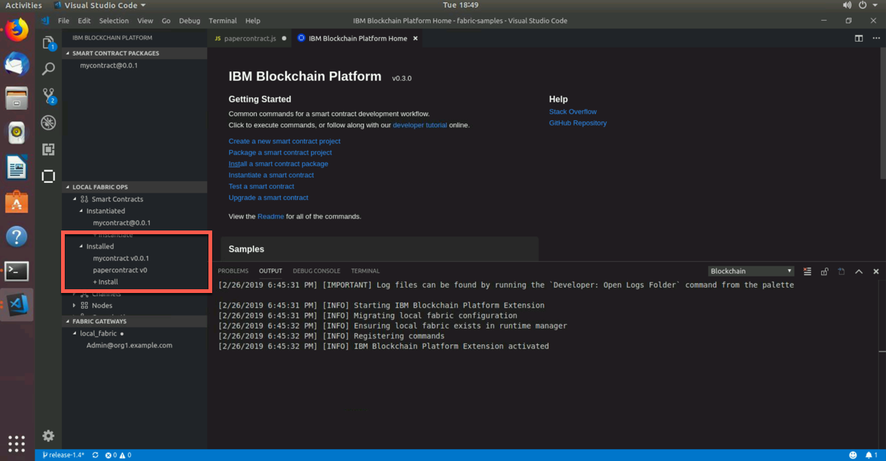
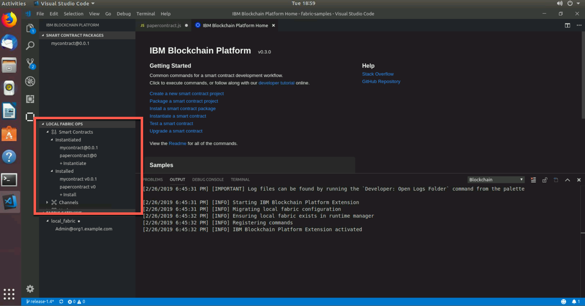
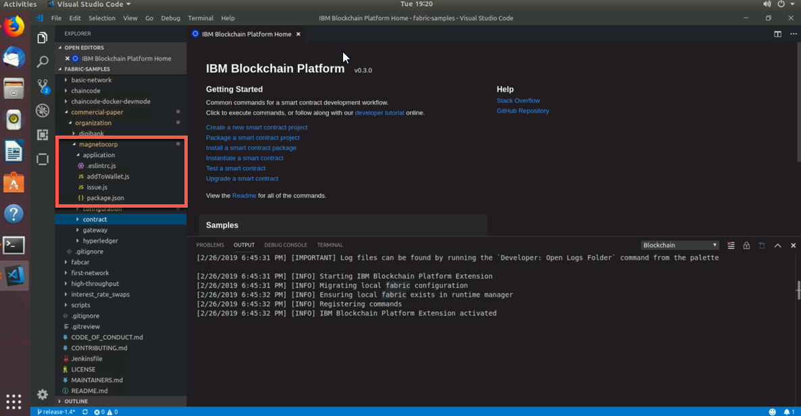
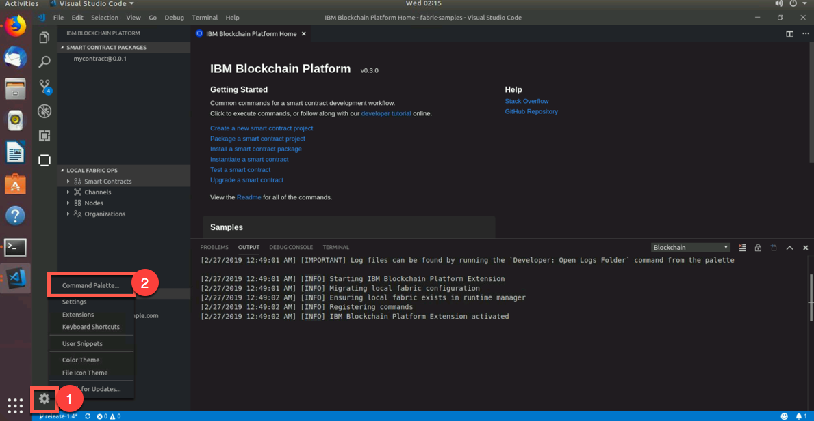
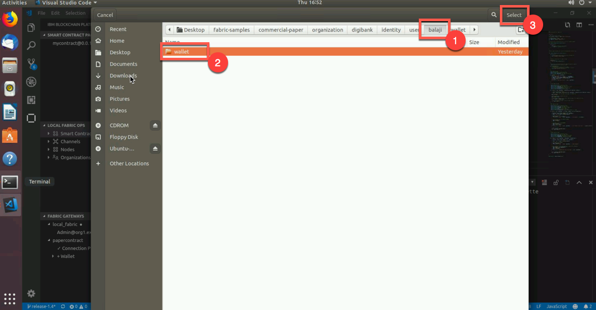
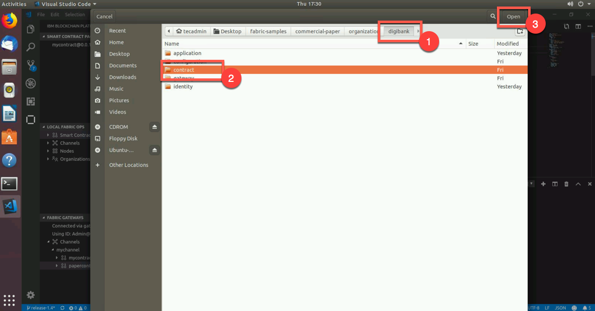
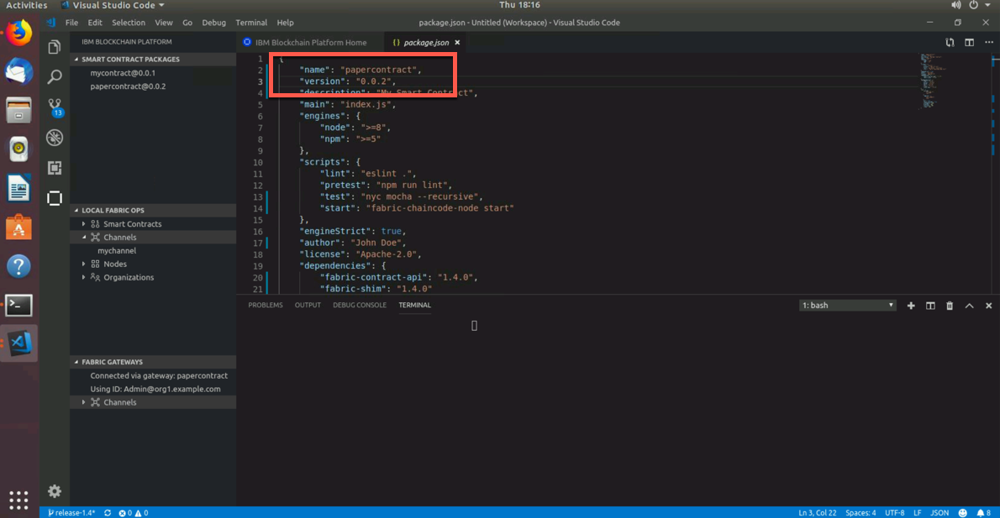
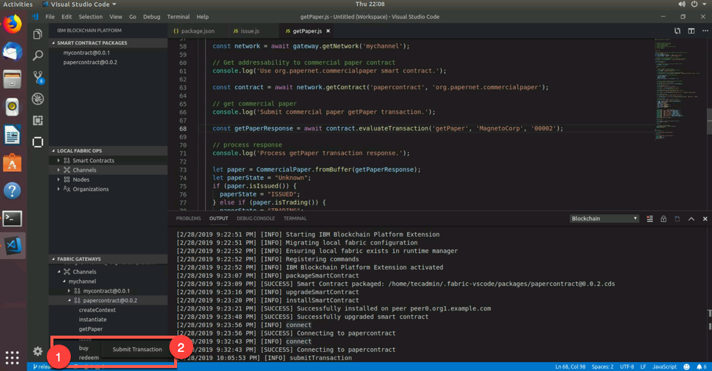

Part 2: Commercial Paper Tutorial
=================================

Section 1: Overview
-------------------

This tutorial works with a sample commercial paper trading
network called `PaperNet`. Commercial paper is a type of unsecured lending in the
form of a "promissory note". The papers are normally issued by large
corporations to raise funds to meet short-term financial obligations at
a fixed rate of interest. Once issued at a fixed price, for a fixed
term, another company or bank will purchase them at a discount to the
face value and when the term is up, they will be redeemed for their face
value.

As an example, if a paper was issued at a face value of 10M USD for a
6-month term at 2% interest then it could be bought for 9.8M USD (10M --
2%) by another company or bank who are happy to bear the risk that the
issuer will not default. Once the term is up, then the paper could be
redeemed or sold back to the issuer for its full face value of 10M
USD. Between buying and redemption, the paper can be bought or sold
between different parties on a commercial paper market.

These three key steps of issue, buy and redeem are the main transactions
in a simplified commercial paper marketplace, which we will mirror in
our lab. We will see a commercial paper issued by a company called
MagnetoCorp and, once issued on the commercial paper blockchain network,
another company called DigiBank will first buy the paper and then redeem
it.

You'll act as a developer, end user, and administrator, within
different organizations, performing various steps designed to help
you understand what it's like to collaborate as two different
organizations working independently, but according to mutually agreed
rules in a Hyperledger Fabric network.

Below is an image of our PaperNet network. For our lab, we will create
Isabella who is with MagnetoCorp. Additionally, we will create Balaji
who is with DigiBank. Isabella will issue a paper for the network. The
paper will have an ID number, when it was issued, the maturity date, and
the face value ($). Balaji, from DigiBank, will then buy the paper and
then eventually redeem it.

Below is the full breakdown of Part 2 of this lab:

-   Setting the Stage:

    -   Based off of Part 1, we have started a blockchain network,
            created a smart contract, created and run tests and then
            submitted transactions. For Part 2, we need to create a
            couple more docker containers that will set us up for
            success for the rest of the lab. One of these containers
            will just monitor the docker network we are operating in. If
            you have no idea what a docker network is, I will explain
            later on. The other container contains Hyperledger Fabric 
	    tools and is named `cliMagnetoCorp`, as MagnetoCorp will
	    use the Hyperledger Fabric command line interface (cli)
	    within this container.

-   Install and Instantiate Smart Contract:

    -   Now that we have those new docker containers up and running,
            we will enter our `cliMagnetoCorp` container and install and
            instantiate our smart contract. Since we are connected to
            the same running local Hyperledger Fabric network, we will
            see the smart contract show up in VSCode.

-   Issue Identities:

    -   In this section, we will issue two identites. One is an
            end-user named `Isabella` with `MagnetoCorp`. She will
            invoke a transaction that will issue a paper. Then we will
            issue an identity for `DigiBank` named `Balaji`. Balaji will
            act as the adminstrator for Digibank and will buy and redeem
            the paper that Isabella issued. Balaji is important in this
            lab, as we will add a `Fabric Gateway` connection to connect
            to his perspective of the network.

-   Upgrade Smart Contract:

    -   This section is the longest of the entire lab, but it really
            exemplifies the power of VSCode and the IBM Blockchain
            Platform extension. We will update our smart contract code
            to include one more transaction called `getPaper`. This
            transaction will allow us to see the current status of the
            paper, like who knows it, what is its status and how much is
            it worth. In addition to modifiying the code, we will update
            our smart contract so that the network is aware of the new
            smart contract.

-   Submit Transactions:

    -   Now that we have added a transaction to our smart contract,
            we will then submit various transactions from many different
            places and perspectives. For example, we will issue a
            transaction from the command line interface as well as the
            VSCode user interface. We will also issue another paper from
            Isabella's perspective and then invoke a series of
            transactions from Balaji's perspective to buy and redeem the paper.

-   Lab Cleanup:

    -   This is the most bittersweet part of the entire lab. It
            means the lab is over and we have to clean up. If you have
            kids (I don't), I'd imagine their faces are sad and full
            of despair when you (the guardian) tell them to clean up
            their mess. I'd also like to imagine your face is making a
            similar expression right now. It's okay, more fun is going
            to be had soon - very soon!

Section 2: Setting the Stage
----------------------------

**NOTE:** There are two terminals we can operate in - the actual
terminal application, available on your Ubuntu desktop, and the terminal window available in VSCode. Unless I
explicitly say, only use the terminal application - meaning do **not**
use the terminal in VSCode. On the chance that we will use the terminal
in VSCode, I will specify that.

**1.** Open your terminal and navigate to your Desktop directory and then clone
the `fabric-samples` github repository

    tecadmin@ubuntubase:~/Desktop/mycontract$ ls -l
    total 0
    drwxr-xr-x  16 tecadmin  tecadmin  512 Feb 22 12:34 mycontract
    tecadmin@ubuntubase:~/Desktop/mycontract$ git clone https://github.com/hyperledger/fabric-samples.git
    Cloning into 'fabric-samples'...
    remote: Enumerating objects: 85, done.
    remote: Counting objects: 100% (85/85), done.
    remote: Compressing objects: 100% (71/71), done.
    remote: Total 2658 (delta 26), reused 71 (delta 13), pack-reused 2573
    Receiving objects: 100% (2658/2658), 927.08 KiB | 0 bytes/s, done.
    Resolving deltas: 100% (1293/1293), done.
    tecadmin@ubuntubase:~/Desktop/mycontract$ ls -l
    total 0
    drwxr-xr-x  22 tecadmin  tecadmin  704 Feb 22 12:41 fabric-samples
    drwxr-xr-x  16 tecadmin  tecadmin  512 Feb 22 12:34 mycontract

**2.** We need to know the Docker network that we are currently in so
that we can modify some scripts that will then create more Docker
containers for us to use. Enter the command below to see all of our
Docker networks

    tecadmin@ubuntubase:~/Desktop/mycontract$ docker network list
    NETWORK ID          NAME                            DRIVER              SCOPE
    ad2e1a3e2fc2        bridge                          bridge              local
    35837170ae5b        fabricvscodelocalfabric_basic   bridge              local
    c5e0411b0d34        host                            host                local
    42ffa501f2f9        none                            null                local

**3.** The network we are in is called `fabricvscodelocalfabric_basic`
and we can verify that by doing the following command below 

    tecadmin@ubuntubase:~/Desktop/mycontract$ docker network inspect fabricvscodelocalfabric_basic

That command will show you all the containers running in this network.
In a nutshell, docker networks are natural ways to isolate containers
from other containers or other networks. Having containers within a
network allows them to communicate with other containers in
the network.

**4.** Within VSCode, go to the `Explorer` perspective and click on `File`
and select `Add Folder to Workplace..` - This will allow us to work from
an `Untitled Workplace`, but have the `fabric-samples` folder in there.

**5.** Within VSCode, navigate to the folder below within MagnetoCorp 

    fabric-samples -> commercial paper -> organizations -> magenetocorp -> configuration -> cli

You should see two files in there. One named `docker-compose.yml` and
another named `monitordocker.sh`

**6.** Within the `docker-compose.yml` file, replace the `net_basic`
with `fabricvscodelocalfabric_basic` on line 11 and save your file by
pressing `control + s`

**7.** Now within the `monitordocker.sh` file, replace
`basicnetwork_basic` with `fabricvscodelocalfabric_basic` on line 9 and
again save by pressing `control + s`

**8.** Now from the terminal navigate to the cli directory within
MagnetoCorp. **NOTE:** scroll over to see the entire command below 

    tecadmin@ubuntubase:~/Desktop/mycontract$ cd fabric-samples/commercial-paper/organization/magnetocorp/configuration/cli/
    tecadmin@ubuntubase:~/Desktop/mycontract/fabric-samples/commercial-paper/organization/magnetocorp/configuration/cli/$ ls -l
    total 16
    -rw-r--r--  1 tecadmin  tecadmin  1168 Feb 22 12:41 docker-compose.yml
    -rwxr-xr-x  1 tecadmin  tecadmin   751 Feb 22 12:44 monitordocker.sh

**9.** Now that we have updated these files to specify the correct
Docker network, go ahead run the monitordocker.sh script with the name of our
Docker network. **NOTE:** scroll over to see the entire command below 

    tecadmin@ubuntubase:~/Desktop/mycontract/fabric-samples/commercial-paper/organization/magnetocorp/configuration/cli/$ ./monitordocker.sh fabricvscodelocalfabric_basic

This command will pull down another container that just monitors all of
the docker log output from the `fabricvscodelocalfabric_basic` network.
I'm going off a hunch, but I think that's why the file is called
`monitordocker.sh`. We will see more messages coming very soon.

**10.** Since this terminal is occupied with log messages, let's open
another terminal tab. We can open a new tab by clicking on `File` and
then selecting `New Tab`

**11.** When you opened a new tab, you should have been taken to the
same file path that you were in on the previous tab. Now that we have a
command line ready, go ahead and enter the command below that will
create a `cliMagnetoCorp` container for our docker network to use.
**NOTE:** scroll over to see the entire command below 

    tecadmin@ubuntubase:~/Desktop/mycontract/fabric-samples/commercial-paper/organization/magnetocorp/configuration/cli/$ docker-compose -f docker-compose.yml up -d cliMagnetoCorp
    .
    . # We'll see docker messages
    .
    Status: Downloaded newer image for hyperledger/fabric-tools:latest
    Creating cliMagnetoCorp ... 
    Creating cliMagnetoCorp ... done

When we first install the smart contract, we will go through the
`cliMagnetoCorp` container, which is our Administrator Console. This
will allow us to use Fabric `peer` commands. Conveniently, the
`cliMagnetoCorp` container is the `hyperledger/fabric-tools` image.

**12.** We can also do a `docker ps -a` command to see all of our docker
containers. We should see two new containers - `cliMagnetoCorp` and
`logspout`

**13.** Equally, we could do
`docker network inspect fabricvscodelocalfabric_basic` to see all of our
containers together in one network - and no, not in a blockchain
network. They are, however, the components that make up our local
blockchain network :)

Section 3: Install and Instantiate Smart Contract
-------------------------------------------------

Before we actually install the commercial paper smart contract, let's
actually open the file to see what the smart contract is trying to do.

**1.** From your explorer perspective, navigate from the fabric-samples
folder to the contract folder of `MagnetoCorp` 

    fabric-samples -> commercial-paper -> organization -> magnetocorp -> contract

Within the `lib` folder, you'll see 3 javascript (.js) files in there.
Click on the **papercontract.js** file, which will open it 
within VSCode

Let's dissect our `papercontract.js` file as it is our smart contract.
We will only go over the `issue` transaction, but the other transactions
follow pretty closely to this one

Below, these 2 lines of code bring into scope two key Hyperledger
Fabric classes that will be used extensively by the smart contract --
Contract and Context 

    // Fabric smart contract classes
    const { Contract, Context } = require('fabric-contract-api');

Below, we define the smart contract class CommercialPaperContract based
on the built-in Fabric Contract class. The methods which implement the
key transactions to issue, buy and redeem commercial paper are defined
within this class 

    /**
    * Define commercial paper smart contract by extending Fabric Contract class
    *
    */
    class CommercialPaperContract extends Contract {

Below, this method defines the commercial paper `issue` transaction for
the commercial paper blockchain network. The parameters that are passed to
this method will be used to create the new commercial paper. Locate and
examine the `buy` and `redeem` transactions within the smart contract 

    /**
    * Issue commercial paper
    *
    * @param {Context} ctx the transaction context
    * @param {String} issuer commercial paper issuer
    * @param {Integer} paperNumber paper number for this issuer
    * @param {String} issueDateTime paper issue date
    * @param {String} maturityDateTime paper maturity date
    * @param {Integer} faceValue face value of paper
    */
    async issue(ctx, issuer, paperNumber, issueDateTime, maturityDateTime, faceValue) {

Within the issue transaction, this statement creates a new commercial
paper in memory using the CommercialPaper class with the supplied
transaction inputs. Examine the buy and redeem transactions to see how
they similarly use this class 

    // create an instance of the paper
    let paper = CommercialPaper.createInstance(issuer, paperNumber, issueDateTime, maturityDateTime, faceValue);

Below, this statement adds the new commercial paper to the ledger using
ctx.paperList, an instance of a PaperList class that was created when
the smart contract context CommercialPaperContext was initialized.
Again, examine the buy and redeem methods to see how they use this class

    // Add the paper to the list of all similar commercial papers in the ledger world state
    await ctx.paperList.addPaper(paper);

Below you will find that this statement returns a binary buffer as
response from the issue transaction for processing by the caller of the
smart contract

    // Must return a serialized paper to caller of smart contract
    return paper.toBuffer();

**2.** Now that we have an understanding of the smart contract, let's
actually install it on our peer through our terminal. **NOTE:** scroll
over to see the entire command below 

    tecadmin@ubuntubase:~/Desktop/mycontract/fabric-samples/commercial-paper/organization/magnetocorp/configuration/cli/$ docker exec cliMagnetoCorp peer chaincode install -n papercontract -v 0 -p /opt/gopath/src/github.com/contract -l node
    2019-02-22 17:48:23.721 UTC [chaincodeCmd] checkChaincodeCmdParams -> INFO 001 Using default escc
    2019-02-22 17:48:23.721 UTC [chaincodeCmd] checkChaincodeCmdParams -> INFO 002 Using default vscc
    2019-02-22 17:48:23.862 UTC [chaincodeCmd] install -> INFO 003 Installed remotely response:<status:200 payload:"OK" >

A message saying `200` is a great sign to see.

If you notice, we are not in the contract folder of our command line
interface. Instead, we are entering the `cliMagnetoCorp` docker
container with `docker exec cliMagnetoCorp` and navigating to the
`/opt/gopath/src/github.com/contract` file path within our container to
grab the files we need to install the smart contract. The
`-n papercontract` flag names our smart contract `papercontract`. The
`-v 0` gives our smart contract a version of 0. Finally, the `-l node`
tells us that the language of our smart contract is nodejs. The picture
below goes into detail, visually, as to how we are actually installing a
copy of the commercial paper smart contract on our peer.

**3.** Since our network is connected to our VSCode instance, you can
refresh the `Local Fabric Ops` panel in VSCode under the IBM Blockchain
extension. The refresh button is revealed when you hover your mouse over
the `Local Fabric Ops` panel

**4.** Since we have installed the smart contract, we should actually
make it active by instantiating it. **NOTE:** scroll over to see the
entire command below 

    tecadmin@ubuntubase:~/Desktop/mycontract/fabric-samples/commercial-paper/organization/magnetocorp/configuration/cli/$ docker exec cliMagnetoCorp peer chaincode instantiate -n papercontract -v 0 -l node -c '{"Args":["org.papernet.commercialpaper:instantiate"]}' -C mychannel -P ""
    2019-02-22 17:50:34.673 UTC [chaincodeCmd] InitCmdFactory -> INFO 001 Retrieved channel (mychannel) orderer endpoint:   orderer.example.com:7050
    2019-02-22 17:50:34.675 UTC [chaincodeCmd] checkChaincodeCmdParams -> INFO 002 Using default escc
    2019-02-22 17:50:34.675 UTC [chaincodeCmd] checkChaincodeCmdParams -> INFO 003 Using default vscc
    tecadmin@ubuntubase:~/Desktop/mycontract/fabric-samples/commercial-paper/organization/magnetocorp/configuration/cli/$

As you can see in the image below, we are instantiating a copy of the
commercial paper smart contract on our MagnetoCorp peer. Similar to the
installation of the smart contract, the instantiation goes into the
`cliMagnetoCorp` container. After successfully instantiating the smart
contract, there will be a commercial paper smart contract docker image
and container.

**5.** You will know our instantiate command worked when we get
our command prompt back without any error messages. You can really verify it worked by going back
to the VSCode and refreshing the `Local Fabric Ops` panel and you should
see it under the `instantiate` section.

Section 4: Issue Identities
---------------------------

Now that we have a ready-to-use smart contract, let's issue some
identities so that those identities can invoke and query transactions.

**1.** You should be within the `cli` folder of the MagnetoCorp folder.
You can confirm this by issuing the command below. **NOTE:** scroll over
to see the entire command below

    tecadmin@ubuntubase:~/Desktop/mycontract/fabric-samples/commercial-paper/organization/magnetocorp/configuration/cli/$ pwd
    /Users/home/Desktop/fabric-samples/commercial-paper/organization/magnetocorp/configuration/cli

This is a good sign. Issue the following command below to get to the
`application` folder within MagnetoCorp. **NOTE:** scroll over to see
the entire command below

    tecadmin@ubuntubase:~/Desktop/mycontract/fabric-samples/commercial-paper/organization/magnetocorp/configuration/cli/$ cd ../../application/
    tecadmin@ubuntubase:~/Desktop/mycontract/fabric-samples/commercial-paper/organization/magnetocorp/application$

**2.** From the `Explorer` perspective within VSCode, navigate to the
same folder. That is, the `application` folder within `MagnetoCorp`. You
should see 4 files in there: `.eslintrc.js, addToWallet.js, issue.js`,
and `package.json`

**3.** Click on `issue.js`, which will open the file within VSCode.
Let's discuss what the file is trying to do.

Below we bring in two key Hyperledger Fabric SDK classes into scope --
`Wallet` and `Gateway`. Because Isabella's X.509 certificate is in the
local file system, the application uses `FileSystemWallet` 
    
    // Bring key classes into scope, most importantly Fabric SDK network class 
    const { FileSystemWallet, Gateway } = require('fabric-network');

Below, this statement identifies that the application will use
Isabella's wallet when it connects to the blockchain network channel.
The application will select a particular identity within Isabella's
wallet. (The wallet must have been loaded with Isabella's X.509
certificate -- that's what `addToWallet.js` does.)
    
    // A wallet stores a collection of identities for use 
    const wallet = new FileSystemWallet('../identity/user/isabella/wallet');

This line of code, below, connects to the network using the gateway
identified by `connectionProfile`, using the identity referred to in
`ConnectionOptions`. See how `../gateway/networkConnection.yaml` and
`User1@org1.example.com` are used for these values respectively
    
    // Connect to gateway using application specified parameters 
    await gateway.connect(connectionProfile, connectionOptions);

Below in the couple lines of code, connects the application to the
network channel `mychannel`, where the papercontract was previously
instantiated. If you had a different channel name, you would have to
modify this line of code 
    
    // Access commercial paper network 
    const network = await gateway.getNetwork('mychannel');

Below, this statement gives the application addressability to the smart
contract defined by the namespace org.papernet.commercialpaper within
papercontract. Once an application has issued getContract, it can submit
any transaction implemented within it 
    
    // Get addressability to commercial paper contract 
    const contract = await network.getContract('papercontract', 'org.papernet.comm...');

Below, these lines of code submits a transaction to the network using
the `issue` transaction defined within the smart contract.
`MagnetoCorp, 00001` are the values to be used by the issue transaction
to create a new commercial paper 
    
    // issue commercial paper 
    const issueResponse = await contract.submitTransaction('issue','MagnetoCorp', '00001', '2020-05-31', '2020-11-30','5000000');

This statement, below, processes the response from the `issue`
transaction. The response needs to be deserialized from a buffer into
paper, a CommercialPaper object which can be interpreted correctly by
the application 
    
    // process response let paper =
    CommercialPaper.fromBuffer(issueResponse);

**4.** Since we know our `issue.js` file is looking at the
`../gateway/networkConnection.yaml`, we need to modify this file to
represent our connection profile. We can do this by opening the
`networkConnection.yaml` file in VSCode and then modifying the ports of
our Orderer (line 91), Peer (line 105) and CA (117). You can find these
ports by doing the following command from your terminal application.
**NOTE:** scroll over to see the entire command below 

    tecadmin@ubuntubase:~/Desktop/mycontract/fabric-samples/commercial-paper/organization/magnetocorp/application$ docker ps -a

Once you have modified the file, please **save it (control + s)**.

**5.** Enter the following command below to install the needed packages
from the `package.json` file. **NOTE:** scroll over to see the entire
command below 

    tecadmin@ubuntubase:~/Desktop/mycontract/fabric-samples/commercial-paper/organization/magnetocorp/application$ npm install
    .
    . # A bunch of output, with some of the output repeating
    .
    node-pre-gyp WARN Using request for node-pre-gyp https download 
    [grpc] Success: "/home/tecadmin/Desktop/fabric-samples/commercial-paper/organization/magnetocorp/application/node_modules/grpc/src/node/extension_binary/node-v57-darwin-x64-unknown/grpc_node.node" is installed via remote
    npm notice created a lockfile as package-lock.json. You should commit this file.
    npm WARN nodejs@1.0.0 No description
    npm WARN nodejs@1.0.0 No repository field.

    added 318 packages in 36.994s

**6.** Since we are in our command line, let's issue the following
command that will create Isabella. **NOTE:** scroll over to see the
entire command below 

    tecadmin@ubuntubase:~/Desktop/mycontract/fabric-samples/commercial-paper/organization/magnetocorp/application$ node addToWallet.js 
    done

**7.** We will know it worked if we can execute the following command
below successfully. **NOTE:** scroll over to see the entire command
below 

    tecadmin@ubuntubase:~/Desktop/mycontract/fabric-samples/commercial-paper/organization/magnetocorp/application$ ls -l ../identity/user/isabella/wallet/
    total 0
    drwxr-xr-x  5 tecadmin  tecadmin  160 Feb 22 12:53 User1@org1.example.com
    tecadmin@ubuntubase:~/Desktop/mycontract/fabric-samples/commercial-paper/organization/magnetocorp/application$ ls -l ../identity/user/isabella/wallet/User1@org1.example.com/
    total 24
    -rw-r--r--  1 tecadmin  tecadmin  1037 Feb 22 12:53 User1@org1.example.com
    -rw-r--r--  1 tecadmin  tecadmin   246 Feb 22 12:53 c75bd6911aca808941c3557ee7c97e90f3952e379497dc55eb903f31b50abc83-priv
    -rw-r--r--  1 tecadmin  tecadmin   182 Feb 22 12:53 c75bd6911aca808941c3557ee7c97e90f3952e379497dc55eb903f31b50abc83-pub

Keys are vital to understanding how transactions and identity work
within a blockchain network. Below is a break down of the keys and
certificate used in this example

-   a **private key** `c75bd6911a...-priv` used to sign transactions on
    Isabella's behalf, but not distributed outside of her immediate
    control
-   a **public key** `c75bd6911a...-pub` which is cryptographically
    linked to Isabella's private key. This is wholly contained within
    Isabella's X.509 certificate
-   a **certificate** `User1@org.example.com` which contains Isabella's
    public key and other X.509 attributes added by the Certificate
    Authority at certificate creation. This certificate is distributed
    to the network so that different actors at different times can
    cryptographically verify information signed by Isabella's private
    key

**8.** Now that we have Isabella from MagnetoCorp, let's pass through
the issue transaction from our terminal. **NOTE:** scroll over to see
the entire command below 

    tecadmin@ubuntubase:~/Desktop/mycontract/fabric-samples/commercial-paper/organization/magnetocorp/application$ node issue.js
    Connect to Fabric gateway.
    Use network channel: mychannel.
    Use org.papernet.commercialpaper smart contract.
    Submit commercial paper issue transaction.
    2019-02-22T17:55:20.631Z - info: [TransactionEventHandler]: _strategySuccess: strategy success for transaction "f8e124886d6cb84434cb6a996f4889145c0541199c88bab7d4d85ae41266e51e"
    Process issue transaction response.
    MagnetoCorp commercial paper : 00001 successfully issued for value 5000000
    Transaction complete.
    Disconnect from Fabric gateway.
    Issue program complete.

This successfully committed a transaction to the ledger. See how it
outputted a transaction hash for us.

As you can see in the image below, we are using the certificate
belonging to Isabella to submit our paper issue transaction. Once we
verify that Isabella can submit a transaction (via her certificate), the
gateway allows the application to focus on transaction generation,
submission and response. It coordinates the transaction proposal,
ordering and notification processing between the different network
components.

**9.** Since we have created an identity for MagnetoCorp, let's also
create Balaji from DigiBank. To do so, we will need a third command line
tab. We can add another command line tab by clicking on
`File -> New Tab`. This will create a new tab in the terminal from the
exact folder directory we were in from our second command line tab. This
third tab will act as DigiBank.

**10.** We now need to switch to a new directory, specifically the
application folder of DigiBank. **NOTE:** scroll over to see the entire
command below 

    tecadmin@ubuntubase:~/Desktop/mycontract/fabric-samples/commercial-paper/organization/magnetocorp/application$ cd ../../digibank/application/
    tecadmin@ubuntubase:~/Desktop/mycontract/fabric-samples/commercial-paper/organization/digibank/application$

**11.** Navigate to the the application folder of DigiBank in the
editior perspective in VSCode 

    fabric-samples -> commercial paper -> organization -> digibank -> application

You should see 5 files here:
`.eslintrc.js, addtowallet.js, buy.js, redeem.js and package.json`

**12.** Go ahead and click on `buy.js` and scroll through the file. You
will notice on `line 40` that it is looking at the
`../gateway/networkConnection.yaml` file.

We need to modify the `networkConnection.yaml` file to represent our
network - very similar to `step 4` of this section.

**13.** We need to modify the ports of our Orderer (line 91), Peer (line
105) and CA (117). We can find these ports by doing the following
command from our terminal. If you are confused as to where to modify
your port numbers, look at the picture on `step 4` to get a sense as to
where we are grabbing our ports from. **NOTE:** scroll over to see the
entire command below 

    tecadmin@ubuntubase:~/Desktop/mycontract/fabric-samples/commercial-paper/organization/digibank/application$ docker ps -a

Once we have modified the file, please **save it (control + s).**
**NOTE:** If you don't do this step, the rest of the lab will not work.

**14.** Back in our terminal and using our `DigiBank` tab, we can run
the next command to install some required packages. **NOTE:** You will
have to scroll over to see the entire command below 

    tecadmin@ubuntubase:~/Desktop/mycontract/fabric-samples/commercial-paper/organization/digibank/application$ npm install
    .
    .
    .
    node-pre-gyp WARN Using request for node-pre-gyp https download 
    [grpc] Success: "/home/tecadmin/Desktop/fabric-samples/commercial-paper/organization/digibank/application/node_modules/grpc/src/node/extension_binary/node-v57-darwin-x64-unknown/grpc_node.node" is installed via remote
    npm notice created a lockfile as package-lock.json. You should commit this file.
    npm WARN nodejs@1.0.0 No description
    npm WARN nodejs@1.0.0 No repository field.

    added 318 packages in 27.138s

**15.** Now, let's add an Balaji from `DigiBank`. **NOTE:** scroll over
to see the entire command below 

    tecadmin@ubuntubase:~/Desktop/mycontract/fabric-samples/commercial-paper/organization/digibank/application$ node addToWallet.js 
    done

**16.** We can confirm that we actually created an identity by viewing
its public/private key below. **NOTE:** scroll over to see the entire
command 

    tecadmin@ubuntubase:~/Desktop/mycontract/fabric-samples/commercial-paper/organization/digibank/application$ ls -l ../identity/user/balaji/wallet/
    total 0
    drwxr-xr-x  5 tecadmin  tecadmin  160 Feb 22 12:57 Admin@org1.example.com
    tecadmin@ubuntubase:~/Desktop/mycontract/fabric-samples/commercial-paper/organization/digibank/application$ ls -l ../identity/user/balaji/wallet/Admin@org1.example.com/
    total 24
    -rw-r--r--  1 tecadmin  tecadmin  1033 Feb 22 12:57 Admin@org1.example.com
    -rw-r--r--  1 tecadmin  tecadmin   246 Feb 22 12:57 cd96d5260ad4757551ed4a5a991e62130f8008a0bf996e4e4b84cd097a747fec-priv
    -rw-r--r--  1 tecadmin  tecadmin   182 Feb 22 12:57 cd96d5260ad4757551ed4a5a991e62130f8008a0bf996e4e4b84cd097a747fec-pub

In the next section, we will actually upgrade our smart contract before
submitting transactions. We are upgrading our smart contract because we
can add in a query to get the status of our paper.

Based on the picture below, we now have 2 participants in this network.
Obviously, this is MagnetoCorp (Isabella) and DigiBank (Balaji). Both
participants are allowed to interact with the commercial paper
blockchain network through their application.

Section 5: Upgrade Smart Contract
---------------------------------

**1.** From our Explorer perspective, navigate to the contract/lib
folder of `DigiBank` 

    fabric-samples -> commercial-paper -> organization -> digibank -> contract -> lib

**2.** Within the `papercontract.js` file, scroll down to line number
`54` and enter the following lines of code below 

    /**
    * Get commercial paper
    * @param {Context} ctx the transaction context
    * @param {String} issuer commercial paper issuer
    * @param {Integer} paperNumber paper number for this issuer
    */
    async getPaper(ctx, issuer, paperNumber) {
      try {
        console.log("getPaper for: " + issuer + " " + paperNumber);
        let paperKey = CommercialPaper.makeKey([issuer, paperNumber]);
        let paper = await ctx.paperList.getPaper(paperKey);
        return paper.toBuffer();
      } catch(e) {
        throw new Error('Paper does not exist' + issuer + paperNumber);
      }
    }

**3.** From the terminal in our `digibank tab`, add a file below that
will execute a query that we just added to our smart contract. **NOTE:**
there are multiple steps in this command and you will have to scroll over to see the entire series of commands below

    tecadmin@ubuntubase:~/Desktop/mycontract/fabric-samples/commercial-paper/organization/digibank/application$ touch getPaper.js
    tecadmin@ubuntubase:~/Desktop/mycontract/fabric-samples/commercial-paper/organization/digibank/application$ vi getPaper.js

    ---

    type the letter "i" to go into insert mode and paste in the following lines of code below

    ---

    /*
    SPDX-License-Identifier: Apache-2.0
    */

    /*
    * This application has 6 basic steps:
    * 1. Select an identity from a wallet
    * 2. Connect to network gateway
    * 3. Access PaperNet network
    * 4. Construct request to issue commercial paper
    * 5. Submit transaction
    * 6. Process response
    */

    'use strict';

    // Bring key classes into scope, most importantly Fabric SDK network class
    const fs = require('fs');
    const yaml = require('js-yaml');
    const { FileSystemWallet, Gateway } = require('fabric-network');
    const CommercialPaper = require('../contract/lib/paper.js');

    // A wallet stores a collection of identities for use 
    //const wallet = new FileSystemWallet('../../../connection-local-fabric');
    const wallet = new FileSystemWallet('../identity/user/balaji/wallet');

    // Main program function
    async function main() {

      // A gateway defines the peers used to access Fabric networks
      const gateway = new Gateway();

      // Main try/catch block
      try {

        // Specify userName for network access
        // const userName = 'isabella.issuer@magnetocorp.com';
        const userName = 'Admin@org1.example.com';

        // Load connection profile; will be used to locate a gateway 
        let connectionProfile = yaml.safeLoad(fs.readFileSync('../gateway/networkConnection.yaml', 'utf8'));

        // Set connection options; identity and wallet
        let connectionOptions = {
          identity: userName,
          wallet: wallet,
          discovery: { enabled: false, asLocalhost: true }
        };

        // Connect to gateway using application specified parameters
        console.log('Connect to Fabric gateway.');

        await gateway.connect(connectionProfile, connectionOptions);

        // Access PaperNet network
        console.log('Use network channel: mychannel.');

        const network = await gateway.getNetwork('mychannel');

        // Get addressability to commercial paper contract
        console.log('Use org.papernet.commercialpaper smart contract.');

        const contract = await network.getContract('papercontract', 'org.papernet.commercialpaper');

        // get commercial paper
        console.log('Submit commercial paper getPaper transaction.');

        const getPaperResponse = await contract.evaluateTransaction('getPaper', 'MagnetoCorp', '00001');

        // process response
        console.log('Process getPaper transaction response.');

        let paper = CommercialPaper.fromBuffer(getPaperResponse);
        let paperState = "Unknown";
        if (paper.isIssued()) {
          paperState = "ISSUED";
        } else if (paper.isTrading()) {
          paperState = "TRADING";
        } else if (paper.isRedeemed()) {
          paperState = "REDEEMED";
        }

        console.log(` +--------- Paper Retrieved ---------+ `);
        console.log(` | Paper number: "${paper.paperNumber}"`);
        console.log(` | Paper is owned by: "${paper.owner}"`);
        console.log(` | Paper is currently: "${paperState}"`);
        console.log(` | Paper face value: "${paper.faceValue}"`);
        console.log(` | Paper is issued by: "${paper.issuer}"`);
        console.log(` | Paper issue on: "${paper.issueDateTime}"`);
        console.log(` | Paper matures on: "${paper.maturityDateTime}"`);
        console.log(` +-----------------------------------+ `);
        console.log('Transaction complete.');

      } catch (error) {

        console.log(`Error processing transaction. ${error}`);
        console.log(error.stack);

      } finally {

        // Disconnect from the gateway
        console.log('Disconnect from Fabric gateway.')
        gateway.disconnect();

      }
    }
    main().then(() => {

      console.log('getPaper program complete.');

    }).catch((e) => {

      console.log('getPaper program exception.');
      console.log(e);
      console.log(e.stack);
      process.exit(-1);

    });

    ---

    To get out of vi, hit the "ESC" button. Then type in ":wq" and then press enter to save the file

Who knew you would learn VSCode and `vi`! Send your hate mail to
<austin@dontsendhatemail.com> :)

**4.** We now have a new file (`getPaper.js`) and then it is in our
`papercontract.js` smart contract. This doesn't mean we can execute a
getPaper query because, if you remember, we have to install and
instantiate this update onto our peer. Then - and only then - can we
actually submit the getPaper query. The next few steps will walk us
through how to do that.

It would be helpful to understand what we just added to our
soon-to-be-updated smart contract. The `getPaper` query is being
submitted by `Balaji` from `DigiBank` and it allows him to get the
current status of the paper within the network. For example, it prints
out the paper's identification number, paper's cost, paper's state
(trading, redeemed, issued), paper's issue date and a few other key
details. Here is a further breakdown of the query

Below, this statement brings two key Hyperledger Fabric SDK classes into
scope -- Wallet and Gateway. Because `Balaji’s` X.509 certificate is in
the local file system, the application uses FileSystemWallet 

    // Bring key classes into scope, most importantly Fabric SDK network class 
    const { FileSystemWallet, Gateway } = require('fabric-network');

Below, this statement identifies that the application will use
`Balaji's` wallet when it connects to the blockchain network channel.
The application will select a particular identity within `Balaji's`
wallet. (The wallet must have been loaded with Balaji's X.509
certificate -- that's what addToWallet.js does.) 

    // A wallet stores a collection of identities for use 
    const wallet = new FileSystemWallet('../identity/user/balaji/wallet');

Below, this line of code connects to the network using the gateway
identified by connectionProfile, using the identity referred to in
connectionOptions. See how ../gateway/networkConnection.yaml and
`Admin@org1.example.com` are used for these values respectively 

    // Connect to gateway using application specified parameters 
    await gateway.connect(connectionProfile, connectionOptions);

Below, this connects the application to the network channel mychannel,
where the papercontract was previously instantiated. If you had a
different channel name, you would have to modify this line of code 

    // Access commercial paper network 
    const network = await gateway.getNetwork('mychannel');

Below, this statement gives the application addressability to smart
contract defined by the namespace org.papernet.commercialpaper within
papercontract. Once an application has issued getContract, it can submit
any transaction/query implemented within it

    // Get addressability to commercial paper contract 
    const contract = await network.getContract('papercontract','org.papernet.commercialpaper');

This series of log output is what the query prints out for us. Based on
the defined variables in the `papercontract.js` we are able to query for
pretty specific bits of data to get an overview of our paper. You can
look above and see how we are grabbing our `paperState`

    console.log(` +--------- Paper Retrieved ---------+ `);
    console.log(` | Paper number: "${paper.paperNumber}"`);
    console.log(` | Paper is owned by: "${paper.owner}"`);
    console.log(` | Paper is currently: "${paperState}"`);
    console.log(` | Paper face value: "${paper.faceValue}"`);
    console.log(` | Paper is issued by: "${paper.issuer}"`);
    console.log(` | Paper issue on: "${paper.issueDateTime}"`);
    console.log(` | Paper matures on: "${paper.maturityDateTime}"`);
    console.log(` +-----------------------------------+ `);
    console.log('Transaction complete.');

Below, this part of the code looks at the
`let paper = CommercialPaper.fromBuffer(getPaperResponse);` message and
then defines what the current status of the paper is. There for 4
options, `UNKNOWN, ISSUED, TRADING, and REDEEMED` 

    let paper = CommercialPaper.fromBuffer(getPaperResponse);
    let paperState = "Unknown";
        if (paper.isIssued()) {
    paperState = "ISSUED";
        } else if (paper.isTrading()) {
    paperState = "TRADING";
        } else if (paper.isRedeemed()) {
    paperState = "REDEEMED";
        }

Below, this chunk of code simply leaves the gateway it is connected to,
thus ending the query. No matter if our query was successful or if there
was an error, we'll be disconnected from the gateway 

    // Disconnect from the gateway
    console.log('Disconnect from Fabric gateway.')
    gateway.disconnect();

**5.** In order to upgrade our smart contract, we need to add a fabric
gateway to our IBM Blockchain extension. To do that, switch back to the
IBM Blockchain extension within VSCode and click on the gear icon in the
bottom left. Then, click on `Command Palette`

**6** To add a Fabric Gateway, type this, below, in the search bar of our list
of commands to execute 

    >IBM Blockchain Platform: Add Gateway 

Fabric gateways are ways for us to connect to a blockchain network from
a perspective. In this case, we are acting as `Balaji` from `DigiBank`
in this commercial paper network. If there were more actors, you could
envision more gateways being incorportated here

**7.** For the name of the gateway, enter `papercontract`

**8.** When it asks for a `file path to a connection profile`, select
`Browse`

**9.** Then navigate to the `networkConnection.yaml` file within
`Digibank` to grab the connection profile

**10.** It will then ask us if we would like to use an existing wallet
or create a new wallet. We want to choose
`Use an existing wallet on my file system`

**11.** When it asks for a `file path to a wallet directory`, select
`Browse`

**12.** Then, we will navigate to our user's, `Balaji`, wallet. Click
on `Select` once you have clicked and highlighted on `wallet`

**13.** We will then see a new Fabric Gateway within the IBM Blockchain
extension as well as `successful` messages from the output

**14.** We can then click on `Admin@org1.example.com` and then it will
show all of our channels. Furthermore, it will show all the smart
contracts available on the channel. You'll see we have
`mycontract@0.0.1` and `papercontract@0`. Even further, we can see all
the available transactions/queries based on the smart contract. All of
these are available if we untoggle the channels and smart contracts.

Even though we have added the new fabric gateway, we still haven't
updated our smart contract to include the `getPaper` query. We will do
that in the next series of commands.

**15.** Switch back to the `Explorer` perspective and toggle the
`fabric-samples` to hide all of the folders and files. Then click on
`File` and select `Add Folder to Workplace` to add a new folder to the
workspace

**16.** Once it gives us a pop-up of the folder directory, navigate to
the `contract` folder of `Digibank`. Click on or highlight the
`contract` folder 

    fabric-samples -> commercial-paper -> organization -> digibank -> contract

**17.** Here we will name the smart contract `papercontract` and give it
version `0.0.2`. First, untoggle the `contract` folder and click on the
`package.json` file to open it. Within that file, change lines 2 and 3
to look like this below 

    "name": "papercontract",
    "version": "0.0.2",

**18.** Switch back to the IBM Blockchain extension. From there click on
the gear in the bottom left and select `Command Palette`. When the
search bar of available commands appears, type in the following below 

    >IBM Blockchain Platform: Package a Smart Contract Project

**22.** When it asks for a `workplace folder to package` choose
`contract`. Then it will pull in the folder and name it
`papercontract@0.0.2` based on our modifications to the `package.json`
file

**23.** Now that we have our packaged smart contract, let's upgrade our
current smart contract. To do so, within the `Local Fabric Ops` pane,
untoggle the `Channels` and right click on `mychannel`. Then select
`Upgrade Smart Contract`

**24.** It will then ask which current smart contract we want to
upgrade. We want to select `papercontract@0` to upgrade. Then it will
ask which `smart contract version to preform an upgrade with`, we want
to select `papercontract@0.0.2`. Since we have to install our upgraded
contract on a peer, select `peer0.org1.example.com` to install the smart
contract on. When it asks for any arguments, do not enter anything here,
but rather - simply - press enter to execute our upgrade. You will know
this was successful if we click on `Admin@org1.example.com` under the
`papercontract` gateway. Further, untoggle the `papercontract@0.0.2`
smart contract to see all the available transactions and queries.

Now, we have successfully upgraded our smart contract to include the
`getPaper` query. Now, lets have some fun and make some transactions and
queries!

Section 6: Submit Transactions
------------------------------

**1.** If you remember, we already did an issue transaction back before
upgrading our smart contract. Since we have added the `getPaper` query
to our smart contract, let's do that from the `digibank` perspective
using `getPaper.js`. As you already know, the `getPaper` query will get
the current status of the paper on top of other bits of information,
like price.

**2.** From the `digibank` perspective in your terminal (your 3rd
terminal) enter this command. **NOTE:** scroll over to see the entire
command below 

    tecadmin@ubuntubase:~/Desktop/mycontract/fabric-samples/commercial-paper/organization/digibank/application$ node getPaper.js
    Connect to Fabric gateway.
    Use network channel: mychannel.
    Use org.papernet.commercialpaper smart contract.
    Submit commercial paper getPaper transaction.
    Process getPaper transaction response.
     +--------- Paper Retrieved ---------+ 
     | Paper number: "00001"
     | Paper is owned by: "MagnetoCorp"
     | Paper is currently: "ISSUED"
     | Paper face value: "5000000"
     | Paper is issued by: "MagnetoCorp"
     | Paper issue on: "2020-05-31"
     | Paper matures on: "2020-11-30"
     +-----------------------------------+ 
    Transaction complete.
    Disconnect from Fabric gateway.
    getPaper program complete.

**3.** Now that we know the status of our paper, let's actually buy the
paper. **NOTE:** scroll over to see the entire command below 

    tecadmin@ubuntubase:~/Desktop/mycontract/fabric-samples/commercial-paper/organization/digibank/application$ node buy.js
    Connect to Fabric gateway.
    Use network channel: mychannel.
    Use org.papernet.commercialpaper smart contract.
    Submit commercial paper buy transaction.
    2019-02-28T19:52:17.372Z - info: [TransactionEventHandler]: _strategySuccess: strategy success for transaction "871e7743c58e406575d4e553330faae3711c0a65a2f677b6e6d398650069d81a"
    Process buy transaction response.
    MagnetoCorp commercial paper : 00001 successfully purchased by DigiBank
    Transaction complete.
    Disconnect from Fabric gateway.
    Buy program complete.

**4.** Let's observe the currect status of the paper. **NOTE:** scroll
over to see the entire command below 

    tecadmin@ubuntubase:~/Desktop/mycontract/fabric-samples/commercial-paper/organization/digibank/application$ node getPaper.js
    Connect to Fabric gateway.
    Use network channel: mychannel.
    Use org.papernet.commercialpaper smart contract.
    Submit commercial paper getPaper transaction.
    Process getPaper transaction response.
    +--------- Paper Retrieved ---------+ 
     | Paper number: "00001"
     | Paper is owned by: "DigiBank"
     | Paper is currently: "TRADING"
     | Paper face value: "5000000"
     | Paper is issued by: "MagnetoCorp"
     | Paper issue on: "2020-05-31"
     | Paper matures on: "2020-11-30"
     +-----------------------------------+ 
    Transaction complete.
    Disconnect from Fabric gateway.
    getPaper program complete.

**5.** Let's pretend the maturity date has been reached, we can now
redeem this paper. Lets do that now. **NOTE:** scroll over to see the
entire command below 

    tecadmin@ubuntubase:~/Desktop/mycontract/fabric-samples/commercial-paper/organization/digibank/application$ node redeem.js 
    Connect to Fabric gateway.
    Use network channel: mychannel.
    Use org.papernet.commercialpaper smart contract.
    Submit commercial paper redeem transaction.
    2019-02-28T19:52:46.452Z - info: [TransactionEventHandler]: _strategySuccess: strategy success for transaction "c26ecbf1077d99a5ea025c339ffabd88eb22cf4e6ac5ff8d9b570cd6c38eb531"
    Process redeem transaction response.
    MagnetoCorp commercial paper : 00001 successfully redeemed with MagnetoCorp
    Transaction complete.
    Disconnect from Fabric gateway.
    Redeem program complete.

**6.** Once again, let's get the status of the paper. **NOTE:** scroll
over to see the entire command below 

    tecadmin@ubuntubase:~/Desktop/mycontract/fabric-samples/commercial-paper/organization/digibank/application$ node getPaper.js
    Connect to Fabric gateway.
    Use network channel: mychannel.
    Use org.papernet.commercialpaper smart contract.
    Submit commercial paper getPaper transaction.
    Process getPaper transaction response.
     +--------- Paper Retrieved ---------+ 
     | Paper number: "00001"
     | Paper is owned by: "MagnetoCorp"
     | Paper is currently: "REDEEMED"
     | Paper face value: "5000000"
     | Paper is issued by: "MagnetoCorp"
     | Paper issue on: "2020-05-31"
     | Paper matures on: "2020-11-30"
     +-----------------------------------+ 
    Transaction complete.
    Disconnect from Fabric gateway.
    getPaper program complete.

**7.** We have successfully run a few transactions and queries with 1
paper and all from our terminal. Now, let's make a 2nd paper and mix up
the method of how we do the transactions and queries. To do this, go
back to VSCode and into the `Explorer` perspective. From there, navigate
to the `issue.js` file within MagnetoCorp 

    fabric-samples -> commercial-paper -> organization -> magnetocorp -> application -> issue.js

**8.** On what should be line `68`, change the issue transaction code to
what is below. **NOTE:** scroll over to see the line of code change
below 

    Take this..

    const issueResponse = await contract.submitTransaction('issue', 'MagnetoCorp', '00001', '2020-05-31', '2020-11-30', '5000000');

    ..and change to 

    const issueResponse = await contract.submitTransaction('issue', 'MagnetoCorp', '00002', '2019-06-31', '2019-12-30', '6000000');

That line of code is creating a new paper. Go ahead and **save this file
(control + s)**.

**9.** Equally, navigate to the `getPaper.js` file within `digibank` and
change the key below to look for a paper with an id of `00002` on line
`68` 

    fabric-samples -> commercial-paper -> organization -> digibank -> application -> getPaper.js

    ---

    Take this..

    const getPaperResponse = await contract.evaluateTransaction('getPaper', 'MagnetoCorp', '00001');

    .. and change to 

    const getPaperResponse = await contract.evaluateTransaction('getPaper', 'MagnetoCorp', '00002');

That line of code is changing the `getPaper.js` file to look for the
paper with an ID of `00002`. Go ahead and **save this file (control +
s)**.

**10.** Now that we have modified our code, let's go ahead and issue a
new paper from our terminal. To do this, we have to be in our
`MagnetoCorp` perspective (our 2nd terminal tab). Within that command
line, enter this. **NOTE:** scroll over to see the entire command below

    tecadmin@ubuntubase:~/Desktop/mycontract/fabric-samples/commercial-paper/organization/magnetocorp/application$ node issue.js 
    Connect to Fabric gateway.
    Use network channel: mychannel.
    Use org.papernet.commercialpaper smart contract.
    Submit commercial paper issue transaction.
    2019-02-28T19:54:09.436Z - info: [TransactionEventHandler]: _strategySuccess: strategy success for transaction "bec2e62e6c440d214cd61336fd3b38a1024e590afa58c5f90421e6db19cc410c"
    Process issue transaction response.
    MagnetoCorp commercial paper : 00002 successfully issued for value 6000000
    Transaction complete.
    Disconnect from Fabric gateway.
    Issue program complete.

**11.** Now, switch to `Digibank's` perspective in our terminal (our 3rd
terminal tab) and do a `getPaper` query using `getPaper.js`. **NOTE:**
scroll over to see the entire command below 

    tecadmin@ubuntubase:~/Desktop/mycontract/fabric-samples/commercial-paper/organization/digibank/application$ node getPaper.js
    Connect to Fabric gateway.
    Use network channel: mychannel.
    Use org.papernet.commercialpaper smart contract.
    Submit commercial paper getPaper transaction.
    Process getPaper transaction response.
     +--------- Paper Retrieved ---------+ 
     | Paper number: "00002"
     | Paper is owned by: "MagnetoCorp"
     | Paper is currently: "ISSUED"
     | Paper face value: "6000000"
     | Paper is issued by: "MagnetoCorp"
     | Paper issue on: "2019-06-31"
     | Paper matures on: "2019-12-30"
     +-----------------------------------+ 
    Transaction complete.
    Disconnect from Fabric gateway.
    getPaper program complete.

**12.** That's enough command line for right now, let's jump to VSCode
and buy our new paper there. Within the IBM Blockchain extension, go to
the `Fabric Gateway` and click on the `papercontect` gateway. From
there, click on `Admin@org1.example.com` and untoggle to the
transactions and query. Then, right click on the `buy` transaction and
select `Submit Transaction`

When it asks for some arguments to pass in with the buy transaction,
enter this below 

    MagnetoCorp,00002,MagnetoCorp,DigiBank,5900000,2019-07-31

**13.** We will see that transaction was successful from the output it
generated in VSCode. We can confirm that by doing a `getPaper.js` query
again in our terminal (3rd terminal tab). **NOTE:** scroll over to see
the entire command below 

    tecadmin@ubuntubase:~/Desktop/mycontract/fabric-samples/commercial-paper/organization/digibank/application$ node getPaper.js
    Connect to Fabric gateway.
    Use network channel: mychannel.
    Use org.papernet.commercialpaper smart contract.
    Submit commercial paper getPaper transaction.
    Process getPaper transaction response.
     +--------- Paper Retrieved ---------+ 
     | Paper number: "00002"
     | Paper is owned by: "DigiBank"
     | Paper is currently: "TRADING"
     | Paper face value: "6000000"
     | Paper is issued by: "MagnetoCorp"
     | Paper issue on: "2019-06-31"
     | Paper matures on: "2019-12-30"
     +-----------------------------------+ 
    Transaction complete.
    Disconnect from Fabric gateway.
    getPaper program complete.

**14.** We are going to repeat the previous 2 steps, but this time we
are going to do a redeem transaction from the IBM Blockchain extension.
To do this, go to the `Fabric Gateway` pane and click on the
`papercontract` gateway. From there, click on `Admin@org1.example.com`
and untoggle to the transactions and query. Then, right click on
`redeem`and select `Submit Transaction`

When it asks for some arguments to pass through, enter this below :

    MagnetoCorp,00002,DigiBank,2019-12-30

**15.** What do you think the next action will be? If you're thinking
the `getPaper` query, you were right. **NOTE:** scroll over to see the
entire command below 

    tecadmin@ubuntubase:~/Desktop/mycontract/fabric-samples/commercial-paper/organization/digibank/application$ node getPaper.js
    Connect to Fabric gateway.
    Use network channel: mychannel.
    Use org.papernet.commercialpaper smart contract.
    Submit commercial paper getPaper transaction.
    Process getPaper transaction response.
     +--------- Paper Retrieved ---------+ 
     | Paper number: "00002"
     | Paper is owned by: "MagnetoCorp"
     | Paper is currently: "REDEEMED"
     | Paper face value: "6000000"
     | Paper is issued by: "MagnetoCorp"
     | Paper issue on: "2019-06-31"
     | Paper matures on: "2019-12-30"
     +-----------------------------------+ 
    Transaction complete.
    Disconnect from Fabric gateway.
    getPaper program complete.

Feel free to continue to make and trade more papers by submitting
various transactions and queries. If you do not want to make more
papers, please continue to last section, which will simply clean up the
lab environment.

Section 7: Lab Cleanup
----------------------

**1.** To clean up the lab environment, please enter this in your
terminal below 

    docker stop $(docker ps -q) # to stop all of your running docker containers
    docker rm $(docker ps -aq) # to remove all of your docker containers
    docker rmi -f $(docker images -q) # to remove all of your docker images

**2.** Finally, go back to your `Explorer` perspective and right click
on all of your folders and select `Remove Folder from Workplace`. This
will get rid of all of your folders.

**END OF LAB!**
