# VSCode Lab Part 3 - Cross Chaincode calls and Debugging Smart Contract

You can use a chaincode to invoke other chaincodes. This allows a chaincode to query and write to data outside of its namespace. A chaincode can both read and update data outside of its namespace by using chaincode that is instantiated on the same channel. However, a chaincode can only query data by using chaincode on different channels.

Chaincode to chaincode interactions can be very useful if you are looking to integrate business logic at the chaincode level or for migration purposes. The goal of this lab is to show you how to code cross chaincode calls in a smart contract. The API that is used for doing this is the invokeChaincode() API from the fabric-shim library’s ChaincodeStub class. The invokeChaincode() API is a lower-level Fabric API that can be invoked through the higher-level Fabric API that you have been using in the previous labs.

Part of the cross chaincode process is to understand how and where you want to code the chaincode to chaincode interaction. In this lab, we add a new smart contract commercial-bond that we want commercial-paper to query. We want to simulate the situation when a commercial-paper is issued, the commercial-paper smart contract queries the commercial-bond contract for current returns on bonds with a similar maturity date, and sets the paper price accordingly. For more details on this particular use case, see the scenario described here: https://hyperledger-fabric.readthedocs.io/en/release-1.4/developapps/chaincodenamespace.html#cross-chaincode-access.

For this lab commercial-bond is already written and packaged up for you. You will clone and add the package to your VSCode IBM Blockchain Platform Extension. Then you will package, install and instantiate the contract to your locally running fabric environment. The instantiate process will also add a few sample bonds to the ledger and to commercial-bond's world state. This way your commercial-paper will have existing bonds to query and extract rates from. You can also experiment with commercial-bond's functions by issuing your own bonds.

The bulk of the lab will be done against the existing commercial-paper. This is where you will add additional functions that interact with the commercial-bond contract. We will also use the VSCode IBM Blockchain Platform Debug Smart Contract function so you get an understanding of how to quickly iterate through changes to a smart contract in development mode and debug a smart contract.

Finally we will deploy the bond-query-enabled commercial-paper to your local fabric, generate some functional tests, and run through them to make sure that the smart contract is functional.

These are the general steps you will take:
1. Clone the commercial-bond smart contract package and add package to VSCode workspace
2. Package commercial-bond, install and instantiate
3. Run a few tests to get familiar with commercial-bond
4. Grab commercial-paper if you don't already have it
5. Setup Debug Smart Contract in Development Mode
6. Go through existing papercontract function in debugger
7. Make smart contract update to include cross chaincode call, test in debug session
8. Package commercial-paper, install and instantiate
9. Generate function tests, and run through function tests
10. The end!


## Section 1: Clone the commercial-bond smart contract package

1. Open up your terminal and run the following command from your home directory:

`
$ git clone https://github.com/jinvanstee/commercial-bond.git
`

Sample output:
```
Cloning into 'commercial-bond'...
remote: Enumerating objects: 32, done.
remote: Counting objects: 100% (32/32), done.
remote: Compressing objects: 100% (28/28), done.
remote: Total 32 (delta 3), reused 31 (delta 2), pack-reused 0
Unpacking objects: 100% (32/32), done.
```

2. Return to your VSCode Explorer and add the commercial-bond smart contract folder to your workspace.

Right click anywhere in your workspace to get the drop down and select Add Folder to Workspace. Then browse to `<path to commercial-bond>/organization/magnetocorp/` and select contract and click Add.


You should see the contents of the contract folder in your workspace, like the following picture:
(Please note that your other folders may look different than the screen shot below, but the contents within the contract folder should be the same)


## Section 2: Package commercial-bond, install and instantiate

1. In VSCode, open up the Command Palette (either by clicking on the gear icon to the lower left and selecting Command Palette or pressing `Command + Shift + P` if you are on a Mac and `Ctl + Shift + P` if you are on Linux). 

Select `IBM Blockchain Platform: Package a Smart Contract Project`:


2. Then select `commercial-bond`.


Upon success, you will see in the lower right corner a message like this:


3. Now you will install this chaincode to your local-fabric. Navigate to the IBM Blockchain Platform view in VSCode (the 6th button down from the left menu):


4. Under the `Local Fabric Ops` panel, click on `+ Install`, then select `commercial-bond@0.0.1` from the list:


Upon success, you will see a message similar to the following in the lower right corner of VSCode:


You will also see the package listed under `Installed` in the `Local Fabric Ops` panel:


5. Now you will instantiate the installed contract. In the `Local Fabric Ops` panel, select `+ Instantiate`. In the pop-up, similar to when you installed the smart contract, select `commercial-bond@0.0.1`.

Next, type `instantiate` when it asks you What function do you want to call. Press `Enter` to continue:


Next, it will ask you what arguments to pass to the function. Just hit `Enter` here because there aren't arguments here.

Finally, it will ask you to provide a private data collection configuration file. Again, just hit `Enter` here because private data collection doesn't apply in this case.

First time initialization of Node.js chaincode can take a while because it will need to pull down all the Node dependencies from the npm registry. After a few minutes, upon success, you will see a success message in the lower right corner of VSCode:


6. For reference for later, these are the bonds that were added to the ledger in the initialization phase:

```
const bonds = [
            {
                issuer: 'MagnetoCorp',
                bondNumber: '00001',
                issueDateTime: '2019-04-17',
                maturityDateTime: '2020-04-17',
                faceValue: '10000',
                interestRate: '0.05',
            },
            {
                issuer: 'Digibank',
                bondNumber: '00001',
                issueDateTime: '2019-05-17',
                maturityDateTime: '2020-05-17',
                faceValue: '50000',
                interestRate: '0.04',
            },
            {
                issuer: 'MagnetoCorp',
                bondNumber: '00002',
                issueDateTime: '2019-06-17',
                maturityDateTime: '2020-06-17',
                faceValue: '10000',
                interestRate: '0.05',
            },
            {
                issuer: 'Digibank',
                bondNumber: '00002',
                issueDateTime: '2019-07-17',
                maturityDateTime: '2020-07-17',
                faceValue: '50000',
                interestRate: '0.04',
            },
        ];
```

Now that you have instantiated commercial-bond on your locally running fabric, you can...

## Section 3: Run a few tests to get familiar with commercial-bond

1. VSCode IBM Blockchain Platform extension makes it easy for you to test out functions of your smart contract directly inside VSCode. Let's run a few tests directly through the functions made visible in the `Fabric Gateways` panel of the IBM Blockchain Platform view. Refresh the Fabric Gateways panel, and click on all the twisties to reveal the functions of commercial-bond:

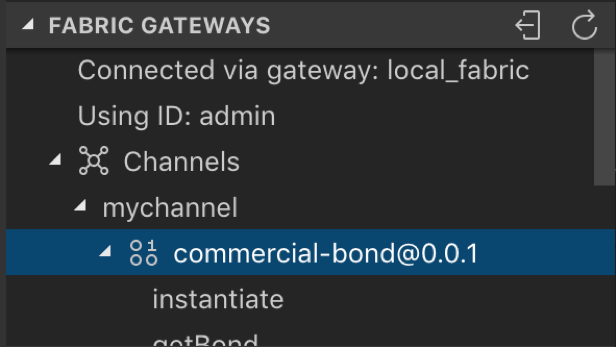

Scroll down to see all the functions of this smart contract:


All of these functions represent transactions in this smart contract. Now, let's evaluate a few transactions.

2. Let's start with `getAllBondsFromIssuer` which will return all the bonds from a specified issuer.

Select the function `getAllBondsFromIssuer`, and either `right-click` or `Ctl+click` and select `Evaluate Transaction`:


3. Next, you will see a familiar pop-up at the top of VSCode that asks you what are the arguments to the transaction. This transaction only takes one argument, and that is the name of the issuer. Let's type in "MagnetoCorp" as follows (important to leave the double quotes):


4. Next, it will ask you what transient data to pass for the transaction. In this case we have none, so just press `Enter` to move forward.


Now, in the `OUTPUT` view, you will see the results of evaluating this transaction. And you will see that there are two bonds issued by MagnetoCorp:


Study the output and you will see other key/value pairs for each bond such as `maturityDateTime`, `issuer`, and `interestRate`.

5. A quick exercise, what is the `interestRate` for bondNumber 00002?

6. Now, let's issue a bond. This time we will submit the transaction so it gets committed to the ledger. 

In the `Fabric Gateways` panel, select the `issue` transaction. Either `right-click` or `Ctl+click` and select `Submit Transaction`.


7. Next, copy and paste the following inside the brackets when the pop-up asks you what are the arguments to the transaction:

`"MagnetoCorp", "00003", "2019-02-28", "2020-02-28", "50000","0.01"`


Hit `Enter` and next you will see the screen that asks you for transient data. Hit `Enter` here because we don't have any transient data in this case.


Then the transaction will get submitted. Upon success, you will see the following `OUTPUT` panel. Notice the `[SUCCESS]` message which means the transaction was successfully submitted.


8. The output to the issue command isn't very helpful as it is just a buffer of numbers that represents the bond. Let's re-evaluate the `getAllBondsFromIssuer` transaction and see if this bond shows up. Use steps 2-4 above to re-run this transaction. Upon success, you will see the following output, and notice that the bond we just added shows up now:


9. Now, the last transaction for you to test, is the `getClosestBondRate` transaction. This is the transaction that we will update `commercial-paper` to call. This transaction takes two arguments: 1) `bondIssuer` and 2) `compareMaturityDate`. This transaction will iterate through all the bonds issued by the specified `bondIssuer` until it finds a bond that has a similar maturity date as the one passed through `compareMaturityDate`, and it will return that bond's interest rate. If it cannot find a bond with a similar maturity date it will return an empty string.

Select `getClosestBondRate` from the `Fabric Gateways` panel, and either `right-click` or `Ctl+click` and select `Evaluate Transaction`.


10. Next you will be asked what arguments to pass. Copy and paste the following inside the brackets:

`"MagnetoCorp","2020-02-15"`


Hit `Enter`. Again, you will be asked for transient data and again you will just hit `Enter` to progress forward to evaluating the transaction.


Upon success, you will see the following output in the `OUTPUT` panel:


11. Notice that the interest rate returned is 0.01, which if you recall is the interest rate associated with MagnetoCorp's bondNumber 00003, which has a maturity date of 2020-02-28 which is the same month as the 2nd argument you passed for `getClosestBondRate`.

12. Now re-evaluate the transaction `getClosestBondRate` (steps 9 - 11) with the following arguments:

`"MagnetoCorp","2020-04-30"`

What do you get returned?  Is it expected?  Which bond does the rate belong to?

13. Lastly, run the same evaluation but with the following arguments:

`"MagnetoCorp","2020-05-31"`

Now what do you get returned?  Is it expected?

# Section 4: Get commercial-paper if you don't already have it

If you already have `commercial-paper` in VSCode from the previous lab, you can skip this section. If not, then follow the steps outlined in the VSCode Part 2 lab, section 2 to clone the `fabric-samples-cp` repo and add the `commercial-paper` package to your VSCode Workspace.

Now you are ready to setup the Hyperledger Fabric runtime in development mode and setup the smart contract debugging session.

# Section 5: Setup Debug Smart Contract in Development Mode (**These instructions have been modified for IBM Blockchain Platform Extension v1.0.3**)

The VSCode IBM Blockchain Platform Extension provides an integrated `Debug Smart Contract` experience with VSCode's build-in debugger. It is a powerful tool in digging deeper into your smart contract code stack, and can be extremely useful in your smart contract development work flow. Using the debug feature will allow you to efficiently test out updates to your smart contract against a local Hyperledger Fabric running in development mode, without having to re-package, re-install and upgrade your smart contract manually with every change. Now, let's get into setting up the debug environment.

1. The first thing you will do is to `Toggle Development Mode` on your peer. Navigate to the IBM Blockchain Platform view in your VSCode:


In the `Local Fabric Ops` panel, scroll down to find `Nodes` and expand that section. `Ctl` + select `peer0.org1.example.com` and select "Toggle Development Mode":


This will take a minute. Upon success you will see the following message in the lower right corner:


You will also see in the `Local Fabric Ops` panel, under `Nodes`, a little infinity symbol next to the peer:


2. Let's return to the VSCode Explorer perspective, and click on `papercontract.js` to open it. 


If you are unfamiliar with commercial-paper, please review what `papercontract.js` does in VSCode Lab 2 section 1 and section 3.

3. Next, navigate to the `Debug` view in VSCode:


In this view you will see the following panels:


An explanation of each of the panels:
1. Variables - this panel will display all the variables in the current function
2. Watch -  you can pick specific variables to watch here, and track them as you step through your code
3. Call Stack - this panel will display the call stack of the current function you are stepping through
4. Breakpoints - this panel will display all the breakpoints in the current program

4. Let's configure a `launch.json` file for `papercontract.js`. According to VSCode's debugging documentation: For most debugging scenarios, creating a launch configuration file is beneficial because it allows you to configure and save debugging setup details. VS Code keeps debugging configuration information in a `launch.json` file located in a `.vscode` folder in your workspace (project root folder) or in your user settings or workspace settings.

To do so, click on the little arrows next to the DEBUG toolbar at the top of the `Debug` view.


Now select the name of your paper-contract project folder from the drop down. In the sample picture below the name of the project folder is `cp-magnetocorp-contract-javascript`:


Next a pop-up window will ask you to select an environment. Because we are dealing with Node.js chaincode, select the option `Fabric Smart Contract (Node.js)`:


This will open a `launch.json`. It should look like the following:


We will not modify the `launch.json` file in this case. Save the file with `Ctl+S` and close it.

5. We are ready to launch a debug session for `papercontract.js`.

Click on the little arrows again next to the DEBUG toolbar at the top of the `Debug` view:


This time select `Launch Smart Contract (cp-magnetocorp-contract-javascript)`. Please note your project folder name may be slightly different. You will see your project folder name appear in parenthesis.


Now, click on the green arrow in the `DEBUG` toolbar to launch a debug session against the smart contract:


You should now see a little debugging toolbar appear at the top of VSCode, like the following picture. You can see the blue IBM Blockchain Platform logo at the right of this toolbar. Click on that button:


6. Clicking on the IBM Blockchain Platform button will bring up another pop-up menu, select Instantiate Smart Contract from this menu as follows:

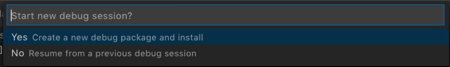

7. Now the IBM Blockchain Platform Extension will package your smart contract and install it to your local peer running in development mode. Next you will be presented with a familiar pop-up asking what function you'd like to call. Type in instantiate as follows:


Then you will see another pop-up asking what arguments to pass to the function. You will just hit `Enter` here:


Lastly, you will be asked if you want to provide a private collection configuration file. Again, just hit `Enter` here:

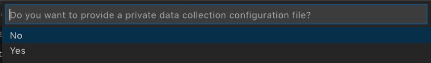

Finally, upon successful instantiation, you will see the following message in the lower right corner:


8. To double check that the debug package was instantiated onto the local Hyperledger Fabric peer, navigate to the IBM Blockchain Platform view in VSCode, and look for the debug smart contract package in the `Local Fabric Ops` panel (Note: you may have to refresh that panel to see the new package):


9. Return to the VSCode `Debug` view. Now you are setup for developing and debugging the commercial-paper smart contract!


# Section 6: Go through existing papercontract function in debugger (**These instructions have been modified for IBM Blockchain Platform Extension v1.0.3**)

It may seem like a lot of steps to setup the smart contract debugging environment in VSCode, but it is worth spending time up front to configure a debugging session. You will be a more effective smart contract developer with this tool in your toolkit.

1. In the VSCode `Debug` view, if you look at the `DEBUG CONSOLE` output, you will see all the `console.log` messages for the functions that have been executed so far. So far we've only instantiated the smart contract, so you will only see the following message in the `DEBUG CONSOLE`:


And if you look at the `papercontract.js` code at line 52 you will see the `console.log` instruction (note that where this code is located in your `papercontract.js` may be slightly different. If you see the `DEBUG CONSOLE` output it tells you which line this is from):

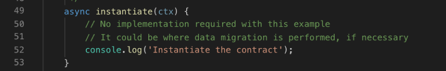

2. Let's put in a breakpoint and walk through one of the functions. Let's place a breakpoint on the first instruction in the issue function. Your screen should look like the following (you can either click on the space to the left of the line number, or put your cursor on that line and hit the `F9` key):


3. Now let's execute the `issue` transaction and walk through the debugging process on the current `papercontract.js`. To submit or evaluate a transaction in the debugging environment we will leverage the integrated IBM Blockchain Platform Extension debug functionality. In the debug toolbar, click on the IBM Blockchain Platform button:


A familiar pop-up window will appear at the top, select `Submit Transaction`:


Then another pop-up window will appear listing all the functions/transactions that are available in `papercontract.js` for you to test. Let's select `issue`:


Then, in the pop-up that asks what arguments to pass to the transaction, enter the following inside the brackets:

`"MagnetoCorp", "00005", "2020-05-31", "2020-11-30", "500000"`


For the next pop-up you will be asked for transient data for this transaction. Just hit `Enter` here:


4. Now the debugger will automatically stop at the breakpoint you set inside the `issue` function. And you should see the various debug panels on the left populated with information related to that line of code:


Here you can choose to `Step Over` that line of code onto the next line, or `Step Into` the function which will dive into that call stack. If you've used debuggers before these should be familiar to you. The debugger toolbar at the top has the most commonly used debugging functions:


Hover over each of the buttons to see what each one does. Let's select the `Step Over` function or you can press F10 to do the same thing.


You will see that you are at the next line of code, and the variables panel has been updated with the results of executing the previous line of code. Notice that the paper variable has now been updated with the arguments input to the transaction:


`Ctl + click` on the `paper` variable in the `Variables` panel and select `Add to watch`:


You can now easily track this variable in the `Watch panel` as you progress with your debugging session:


Continue to `Step Over` or `Step into` the rest of the issue transaction until you are satisfied with this flow. If you just want to get through to the end of the transaction hit the `Continue` button which will complete the transaction.


You will see the output from this transaction below in the `OUTPUT` box.


# Section 7: Make smart contract updates to include cross chaincode call, test in debugging session (**These instructions have been modified for IBM Blockchain Platform Extension v1.0.3**)

1. OK, now that you have played with the debugger, let's add additional code to `papercontract.js`. We will first amend the `issue` function to take in interest rate as another parameter. The new `issue` function will also include code to query the `commercial-bond` contract for the interest rate of a bond that has similar maturity rate as the paper and align the paper rate to the bond rate. Then we will add the following two helper functions: `getPaperRate`, `getBondContractRate`.

2. Before we edit `papercontract.js` we need to update `paper.js` to add these functions `getRate` and `setRate`. In addition, we need to update the `createInstance` function to include the `paperRate` parameter. Keep in mind `papercontract.js` uses `paper.js` to represent a paper.

Go to your VSCode Explorer and open up `paper.js`:


Replace *the entire* `paper.js` with the following code block:

```
/*
SPDX-License-Identifier: Apache-2.0
*/

'use strict';

// Utility class for ledger state
const State = require('./../ledger-api/state.js');

// Enumerate commercial paper state values
const cpState = {
    ISSUED: 1,
    TRADING: 2,
    REDEEMED: 3
};

/**
 * CommercialPaper class extends State class
 * Class will be used by application and smart contract to define a paper
 */
class CommercialPaper extends State {

    constructor(obj) {
        super(CommercialPaper.getClass(), [obj.issuer, obj.paperNumber]);
        Object.assign(this, obj);
    }

    /**
     * Basic getters and setters
    */
    getIssuer() {
        return this.issuer;
    }

    setIssuer(newIssuer) {
        this.issuer = newIssuer;
    }

    getOwner() {
        return this.owner;
    }

    setOwner(newOwner) {
        this.owner = newOwner;
    }

    getRate() {
        return this.paperRate;
    }

    setRate(newRate) {
        this.paperRate = newRate;
    }

    /**
     * Useful methods to encapsulate commercial paper states
     */
    setIssued() {
        this.currentState = cpState.ISSUED;
    }

    setTrading() {
        this.currentState = cpState.TRADING;
    }

    setRedeemed() {
        this.currentState = cpState.REDEEMED;
    }

    isIssued() {
        return this.currentState === cpState.ISSUED;
    }

    isTrading() {
        return this.currentState === cpState.TRADING;
    }

    isRedeemed() {
        return this.currentState === cpState.REDEEMED;
    }

    static fromBuffer(buffer) {
        return CommercialPaper.deserialize(Buffer.from(JSON.parse(buffer)));
    }

    toBuffer() {
        return Buffer.from(JSON.stringify(this));
    }

    /**
     * Deserialize a state data to commercial paper
     * @param {Buffer} data to form back into the object
     */
    static deserialize(data) {
        return State.deserializeClass(data, CommercialPaper);
    }

    /**
     * Factory method to create a commercial paper object
     */
    static createInstance(issuer, paperNumber, issueDateTime, maturityDateTime, faceValue, paperRate) {
        return new CommercialPaper({ issuer, paperNumber, issueDateTime, maturityDateTime, faceValue, paperRate });
    }

    static getClass() {
        return 'org.papernet.commercialpaper';
    }
}

module.exports = CommercialPaper;
```

Save this file before moving on to the next step. Save the file with `Command + S` if you are on Mac, or `Ctl + S` if you are on Linux or Windows.

3. Return to the VSCode `Debug` view, and return to `papercontract.js`:


4. Replace the following `issue` function in existing `papercontract.js`:

```
    /**
     * Issue commercial paper
     *
     * @param {Context} ctx the transaction context
     * @param {String} issuer commercial paper issuer
     * @param {Integer} paperNumber paper number for this issuer
     * @param {String} issueDateTime paper issue date
     * @param {String} maturityDateTime paper maturity date
     * @param {Integer} faceValue face value of paper
    */
    async issue(ctx, issuer, paperNumber, issueDateTime, maturityDateTime, faceValue) {

        // create an instance of the paper
        let paper = CommercialPaper.createInstance(issuer, paperNumber, issueDateTime, maturityDateTime, faceValue);

        // Smart contract, rather than paper, moves paper into ISSUED state
        paper.setIssued();

        // Newly issued paper is owned by the issuer
        paper.setOwner(issuer);

        // Add the paper to the list of all similar commercial papers in the ledger world state
        await ctx.paperList.addPaper(paper);

        // Must return a serialized paper to caller of smart contract
        return paper.toBuffer();
    }
```

With this:

```
    /**
     * Issue commercial paper
     *
     * @param {Context} ctx the transaction context
     * @param {String} issuer commercial paper issuer
     * @param {Integer} paperNumber paper number for this issuer
     * @param {String} issueDateTime paper issue date
     * @param {String} maturityDateTime paper maturity date
     * @param {Integer} faceValue face value of paper
     * @param {Float} paperRate rate to price the paper
    */
    async issue(ctx, issuer, paperNumber, issueDateTime, maturityDateTime, faceValue, paperRate) {

        // query commercial-bond contract for return rate on bond with similar maturity date
        let assignPaperRate = await ctx.stub.invokeChaincode("commercial-bond", ["getClosestBondRate", issuer, maturityDateTime], ctx.stub.getChannelID());
        let newPaperRate = JSON.parse(assignPaperRate.payload.toString('utf8'));
        console.log("bond rate received back is: " + newPaperRate);

        // create an instance of the paper, if there is a bond with similar maturity rate, set paper rate to be same as bond rate, otherwise use paper rate from input.
        var paper;
        if (newPaperRate != "") {
            console.log("set paper with bond rate " + newPaperRate);
            paper = CommercialPaper.createInstance(issuer, paperNumber, issueDateTime, maturityDateTime, faceValue, newPaperRate);
        } else {
            console.log("set paper with original rate " + paperRate);
            paper = CommercialPaper.createInstance(issuer, paperNumber, issueDateTime, maturityDateTime, faceValue, paperRate);
        }

        // Smart contract, rather than paper, moves paper into ISSUED state
        paper.setIssued();

        // Newly issued paper is owned by the issuer
        paper.setOwner(issuer);

        // Add the paper to the list of all similar commercial papers in the ledger world state
        await ctx.paperList.addPaper(paper);

        // Must return a serialized paper to caller of smart contract
        return paper.toBuffer();
    }
```

**Save this file with `Command + S` if you are on Mac, or `Ctl + S` if you are on Linux or Windows.**

Note: During the copy and paste process, the formatting of the code block might look off. You can highlight the code block, then `Ctl + click` and select `Format Selection` which should format the highlighted section nicely.

The above `issue` function first queries the commercial-bond contract for the return rate on a bond with similar maturity date. It uses the `invokeChaincode()` API from the ChaincodeStub class of the fabirc-shim library. The `invokeChaincode()` API takes three arguments: `<async> invokeChaincode(chaincodeName, args, channel)` (see full spec here https://fabric-shim.github.io/master/fabric-shim.ChaincodeStub.html#toc1__anchor). 

In the invokeChaincode() example in the `issue` function above:
    1. The first argument passed is `commercial-bond` which is the name of the chaincode that you want to invoke. 
    2. The 2nd argument in our example is `["getClosestBondRate", issuer, maturityDateTime]` which is an array of strings. The first array element `"getClosestBondRate"` is the function within the `commercial-bond` contract you want to invoke, the 2nd and third elements are the arguments to pass to the `getClosestBondRate` function, in this case they are the name of the organization that issued the bonds you want to query and the maturity date that you want to compare bonds to.
    3. The 3rd argument is `ctx.stub.getChannelID()` which returns the current channel that the calling chaincode is transacting on. In our example, this is because `papercontract` and `commercial-bond` reside in the same channel. If the chaincode you want to invoke resides in a different channel, you will specify the name of that channel directly here. Remember, you can only invoke query transactions for chaincodes that are on a different channel.

The `if-else` code block in the above `issue` function will then test to see if the result of the invokeChaincode() function is an empty string. If the result is not an empty string, you want to create the paper asset with the bond rate (called `newPaperRate`). If the result is an empty string, you want to create the paper asset with the `paperRate` passed through the `issue` function.

Your `issue` function should look like the following:


5. Notice the breakpoint is still there in `papercontract.js` from section 6. Let's remove it by clicking on the red dot or placing your cursor on that line and hitting F9. After this step you should not see any breakpoints.

Note: *If* for whatever reason, you have exited the debug session, you can always bring it back by clicking on the green arrow button in the `DEBUG` toolbar or by clicking on the blue bar at the bottom of VSCode that says `Launch Smart Contract`:


6. Becase we made updates to the smart contract we will need to upgrade the smart contract. With the integrated IBM Blockchain Platform Debugger you can do everything from one screen and without exiting the current debug session. Click the blue IBM Blockchain Platform button in the debug toolbar to reveal the debug command list.


7. Select `Upgrade Smart Contract` from the list of options:


8. You will be asked what function you want to invoke, type in `instantiate`:


9. Then you will see another pop-up asking what arguments to pass to the function. You will just hit `Enter` here:


10. Lastly, you will be asked if you want to provide a private collection configuration file. Again, just hit `Enter` here:


11. Finally, upon successful instantiation, you will see the following message in the lower right corner:


12. Return to `papercontract.js`, and place a new breakpoint in the following line:

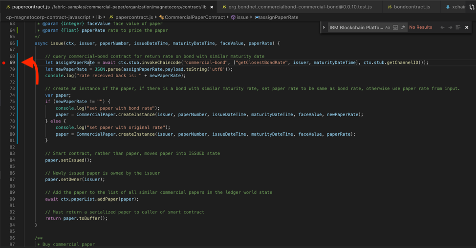

12. Let's click on the IBM Blockchain Platform button in the debug toolbar:


13. Select `Submit Transaction` in the pop-up window:


14. Select the `issue` transaction in the pop-up window:


15. For the arguments pop-up, pass the following arguments inside the brackets:

`"MagnetoCorp", "00004", "2020-01-31", "2020-04-30", "1000000","0.03"`


16. In the transient data pop-up, hit `Enter` to skip this step and move forward:


17. And the debugger should stop at the breakpoint.

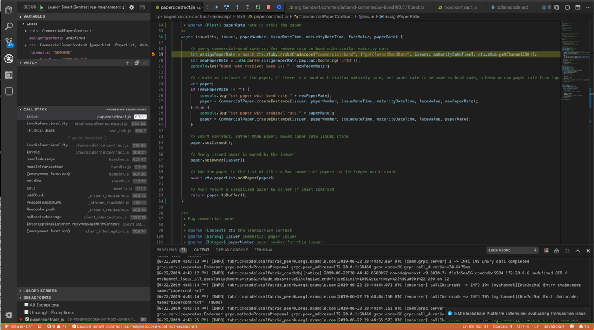

18. Add the variable `newPaperRate` to the `Watch` list. In the `Variables` panel, scroll down until you see the `newPaperRate` variable. `Ctl + Click` on `newPaperRate` and select `Add to Watch`, then press `Enter` for the variable to get added to the `Watch` panel:


19. Now find the variable `paper` in the `Variables` panel, and add that to the `Watch` panel as well:

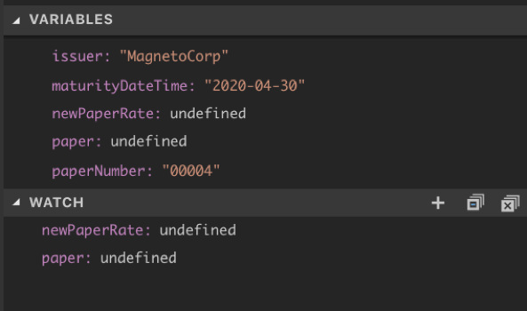

19. Use the debug toolbar to `Step over` (or press F10) each line of code until you reach `paper.setIssued()`. Notice how the `newPaperRate` variable got set to the bond rate of bondNumber 00001 which is 0.03 (see Section 2 step 6). And the paper variable in the `Watch` panel has an `interestRate` of 0.05 (vs the 0.03 that was passed through the `issue` transaction):

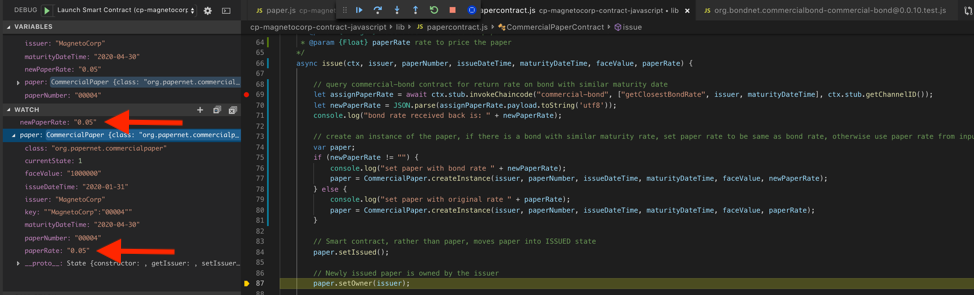

20. Then you can hit `Continue` in the debug toolbar to complete the transaction.


20. You should see the following in the `OUTPUT` below upon a successful submission.

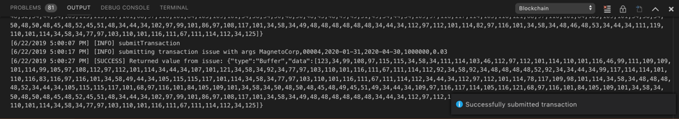

21. Click on the `DEBUG CONSOLE` view at the bottom of VSCode and see the `console.log` messages from submitting the new `issue` transaction.


22. Take a closer look at the `OUTPUT` from step 20, and you will see a line that says `[INFO] submitting transaction issue with args MagnetoCorp,00004,2020-01-31,2020-04-30,1000000,0.03`. To double check that the paper we just submitted, `MagnetoCorp:00004` indeed has been set with a rate of 0.05, instead of the 0.03 passed through the `issue` transaction, let's add a helper function called `getPaperRate` in section 8.

23. Before we do that, stop the current debug session:


# Section 8: Add a helper function to the paper contract, test in debugging session (*These instructions have been modified for IBM Blockchain Platform Extension v1.0.3*)

1. Go back to `papercontract.js`. Add the following code block right after the `instantiate` function:

```
    /**
    * Get paper rate for specified paper
    * @param {Context} ctx the transaction context
    * @param {String} issuer commercial paper issuer
    * @param {Integer} paperNumber paper number for this issuer
    */
    async getPaperRate(ctx, issuer, paperNumber) {
        try {
            console.log("getPaper for: " + issuer + " " + paperNumber);
            let paperKey = CommercialPaper.makeKey([issuer, paperNumber]);
            let paper = await ctx.paperList.getPaper(paperKey);
            console.log("paper rate for: " + issuer + " " + paperNumber + " is " + paper.paperRate);
            return paper.paperRate;
        } catch (e) {
            throw new Error('Paper does not exist: ' + issuer + paperNumber);
        }
    }
```

**Save this file with `Command + S` if you are on Mac, or `Ctl + S` if you are on Linux or Windows.**

Your `papercontract.js` should look like the following:


2. Launch the debug session by either pressing the green play button next to `DEBUG` in the upper left corner. Or clicking on the `Launch Smart Contract` bar at the bottom.


3. Now that you have updated the smart contract again, you will need to deploy this new one to the local running peer. Follow the steps in **section 7: steps 6 - 11.**

4. Let's evaluate a `getPaperRate` transaction. Let's click on the IBM Blockchain Platform button in the debug toolbar:


5. Now select `Evaluate Transaction` from the list:

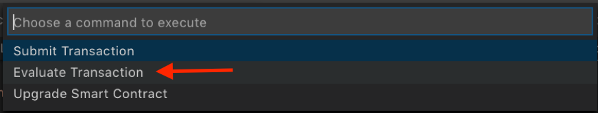

6. In the next pop-up window, you will see the new transaction `getPaperRate` that you just added. Select it:

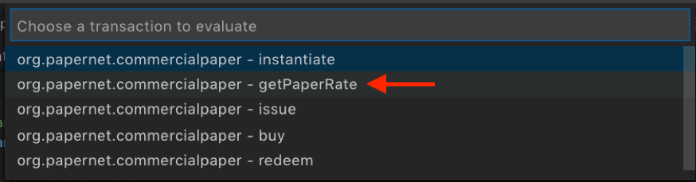

7. In the next pop-up, enter the following as arguments inside the brackets:

`"MagnetoCorp","00004"`

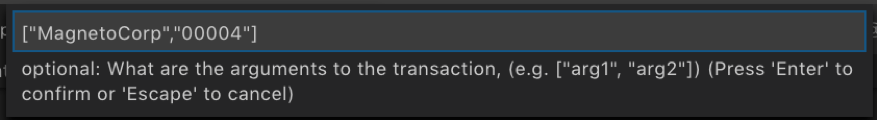

8. For the next pop-up you will be asked for transient data for this transaction. Just hit `Enter` here:


9. Upon success you will see the following output, which confirms that the paper submitted in section 7 did indeed take the bond rate of 0.05:


10. If you have time, evaluate another `issue` transaction. This time passing a maturity date that you know does not have a match in `commercial-bond`. You can always go back to section 2.6 to see which bonds are in the commercial-bond world state, and pick a maturity date for your paper that is not the same month as the bonds. Step through the debugger, and see if the logic behaves the way you expect.

23. At this point you have successfully tweaked the `papercontract.js` to include a cross chaincode call to another contract residing in the same channel.

24. Go to the VSCode IBM Blockchain Platform view, you should see three papercontract@vscode-


# Section 9: Package commercial-paper, install and instantiate

# Section 10: Generate functional tests


